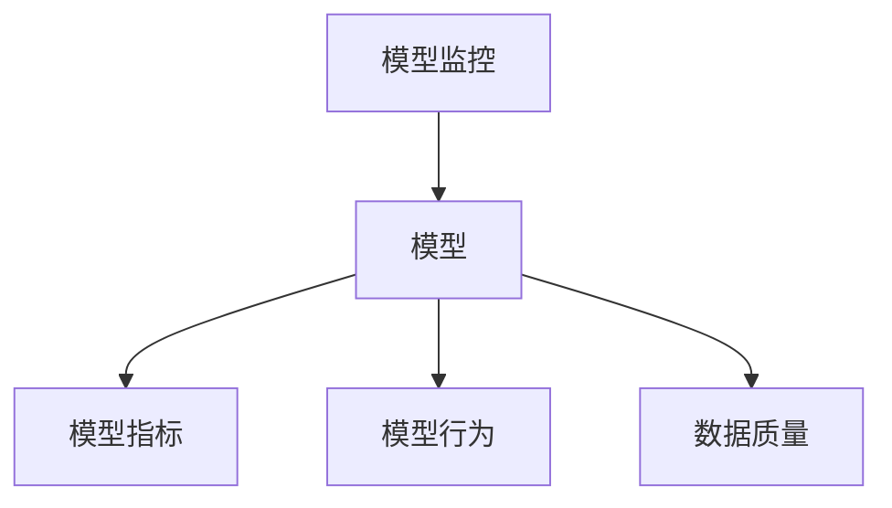
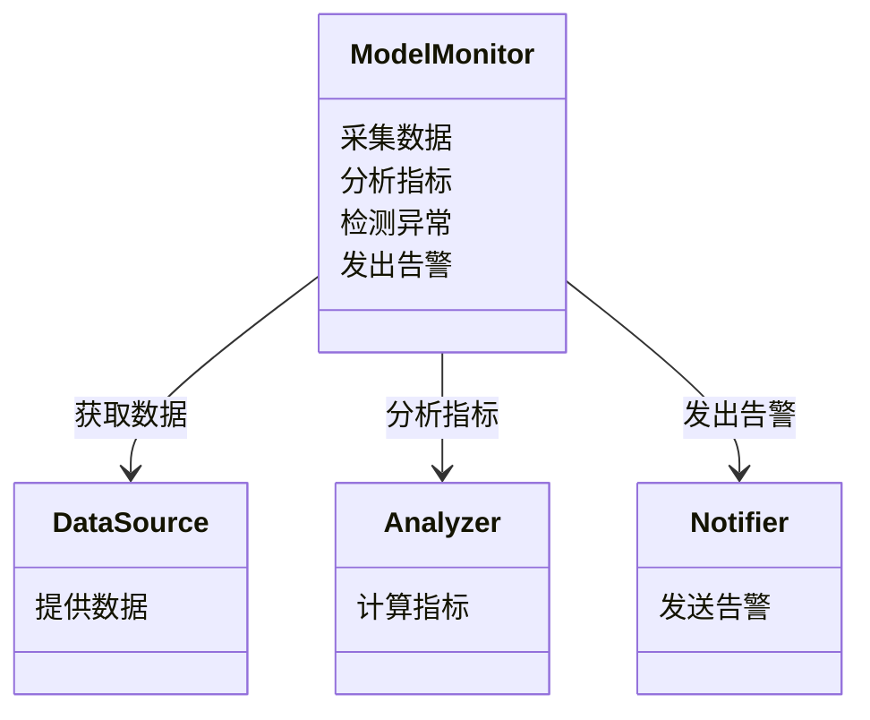
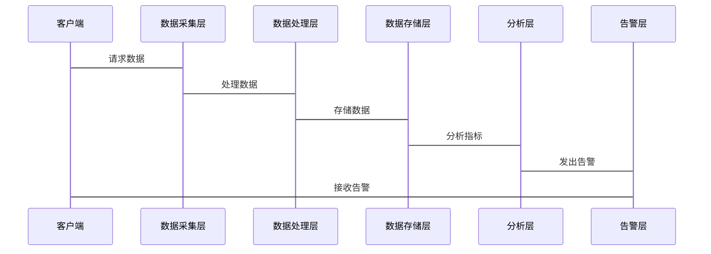

                 


# 模型监控：实时跟踪AI Agent的健康状态

## 关键词：模型监控, AI Agent, 实时跟踪, 健康状态, 异常检测

## 摘要：  
AI Agent的广泛应用带来了模型监控的重要性，本文详细探讨了模型监控的核心概念、算法原理、系统设计及项目实战，通过丰富的图表和数学公式，帮助读者理解如何实时跟踪AI Agent的健康状态，确保模型性能的稳定性和准确性。

---

## 第一部分: 模型监控概述

### 第1章: 模型监控的背景与概念

#### 1.1 模型监控的背景
##### 1.1.1 AI Agent的广泛应用
AI Agent在各个领域的广泛应用，如自动驾驶、智能客服等，使得模型监控成为必要。  
##### 1.1.2 模型失效的潜在风险
模型失效可能导致严重后果，如误诊、错误决策等，因此实时监控至关重要。  
##### 1.1.3 模型监控的重要性
通过实时监控，及时发现并修复模型问题，确保AI系统的稳定性和可靠性。

#### 1.2 模型监控的核心概念
##### 1.2.1 模型健康状态的定义
模型健康状态指模型在运行中的性能和行为状态，包括准确性、响应时间等。  
##### 1.2.2 模型监控的目标与范围
目标是实时检测模型异常和漂移，范围涵盖模型性能、数据质量等方面。  
##### 1.2.3 模型监控的实现方式
通过日志分析、性能指标跟踪等方法，实现模型健康状态的实时监控。

#### 1.3 模型监控的背景介绍
##### 1.3.1 问题背景
AI Agent在运行中可能因数据变化或模型老化导致性能下降，需实时监控。  
##### 1.3.2 问题描述
模型监控需解决的问题包括：性能下降、数据漂移、模型失效等。  
##### 1.3.3 问题解决方法
采用统计方法、机器学习和深度学习算法，实时检测模型异常和漂移。  
##### 1.3.4 概念结构与核心要素
模型监控涉及模型、数据、性能指标等多个要素，形成完整的监控体系。

---

## 第二部分: 模型监控的核心概念与联系

### 第2章: 模型监控的核心概念

#### 2.1 模型监控的指标体系
##### 2.1.1 模型性能指标
- 准确率、召回率、F1分数等，衡量模型预测能力。  
##### 2.1.2 模型行为指标
- 响应时间、错误率，反映模型运行状态。  
##### 2.1.3 数据质量指标
- 数据完整性、一致性，影响模型性能。  

#### 2.2 模型异常检测方法
##### 2.2.1 统计方法
- 使用均值、标准差等统计量，检测异常值。  
##### 2.2.2 基于机器学习的方法
- 引用Isolation Forest算法，通过无监督学习发现异常。  
##### 2.2.3 基于深度学习的方法
- 使用变体自编码器（VAE）重构数据，检测异常。  

#### 2.3 模型漂移与数据漂移
##### 2.3.1 模型漂移的定义与分类
- 模型漂移指模型预测能力随时间下降，分为样本漂移和特征漂移。  
##### 2.3.2 数据漂移的定义与分类
- 数据漂移指数据分布变化，影响模型性能，分为渐进漂移和突然漂移。  
##### 2.3.3 漂移检测的实现方法
- 使用Kullback-Leibler散度或马尔可夫链模型，检测数据分布变化。  

#### 2.4 核心概念原理
##### 2.4.1 模型监控的原理
- 通过实时采集指标，分析模型行为，识别异常。  
##### 2.4.2 异常检测的原理
- 利用统计或机器学习方法，识别偏离预期的行为。  
##### 2.4.3 漂移检测的原理
- 比较当前数据与初始数据的分布差异，判断是否发生漂移。  

#### 2.5 概念属性特征对比表格
| 概念       | 属性       | 特征描述                     |
|------------|------------|------------------------------|
| 模型健康状态 | 定义       | 模型在运行中的性能和行为状态   |
| 异常检测   | 方法       | 统计、机器学习、深度学习方法   |
| 漂移检测   | 类型       | 模型漂移、数据漂移            |

#### 2.6 ER实体关系图（Mermaid）



---

## 第三部分: 模型监控的算法原理

### 第3章: 模型监控算法原理

#### 3.1 异常检测算法
##### 3.1.1 统计方法
- 使用Z-score公式：$$ Z = \frac{x - \mu}{\sigma} $$  
  其中，$\mu$是均值，$\sigma$是标准差。  
##### 3.1.2 基于机器学习的方法
- 使用Isolation Forest算法，通过树状结构隔离异常点。  
##### 3.1.3 基于深度学习的方法
- 使用变体自编码器，重构输入数据，计算重构误差：$$ \text{误差} = ||x - \hat{x}|| $$  

#### 3.2 漂移检测算法
##### 3.2.1 Kullback-Leibler散度
- 计算当前数据与初始数据的KL散度：$$ D_{KL}(P||Q) = \sum P \log\left(\frac{P}{Q}\right) $$  
##### 3.2.2 马尔可夫链模型
- 建立状态转移矩阵，判断数据分布的变化。  

---

## 第四部分: 系统分析与架构设计

### 第4章: 系统分析与架构设计

#### 4.1 问题场景介绍
- 需要实时监控AI Agent的模型性能，及时发现异常和漂移。  

#### 4.2 项目介绍
- 开发一个实时模型监控系统，集成数据采集、异常检测和告警功能。  

#### 4.3 系统功能设计
##### 4.3.1 领域模型（Mermaid类图）



#### 4.4 系统架构设计（Mermaid架构图）


#### 4.5 系统接口设计
- 数据采集接口：`GET /data?model_id=xxx`  
- 分析接口：`POST /analyze`  
- 告警接口：`POST /notify`  

#### 4.6 系统交互（Mermaid序列图）



---

## 第五部分: 项目实战

### 第5章: 项目实战

#### 5.1 环境安装
- 安装Python、TensorFlow、Flask等依赖库。  

#### 5.2 核心代码实现
##### 5.2.1 数据采集
```python
import requests

def get_data(model_id):
    response = requests.get(f"http://data-source/{model_id}")
    return response.json()
```

##### 5.2.2 异常检测
```python
from tensorflow.keras import Model

def detect_anomaly(model: Model, data):
    reconstructed = model.predict(data)
    error = tf.reduce_mean(tf.square(data - reconstructed))
    return error > threshold
```

##### 5.2.3 告警发送
```python
import smtplib

def send_alert(message):
    server = smtplib.SMTP('smtp.example.com', 587)
    server.starttls()
    server.login('user@example.com', 'password')
    server.sendmail('user@example.com', 'alert@example.com', message)
    server.quit()
```

#### 5.3 案例分析
- 实际案例：监控一个图像分类模型的准确率，设置阈值，当准确率低于阈值时触发告警。  
- 分析结果：准确率下降，检测到模型漂移，及时修复模型。  

#### 5.4 项目总结
- 成功实现了实时模型监控系统，确保AI Agent的健康状态。  

---

## 第六部分: 总结与展望

### 第6章: 总结与展望

#### 6.1 本章总结
- 模型监控是确保AI系统稳定运行的关键，本文详细探讨了其实现方法和系统设计。  

#### 6.2 最佳实践Tips
- 定期更新模型，处理数据漂移。  
- 使用多种检测方法，提高准确性。  

#### 6.3 未来展望
- 结合边缘计算，提升监控效率。  
- 研究自适应模型，自动修复问题。  

---

## 作者：AI天才研究院 & 禅与计算机程序设计艺术

---

这篇文章系统地介绍了模型监控的核心概念、算法原理、系统设计和项目实现，帮助读者全面理解如何实时跟踪AI Agent的健康状态。

