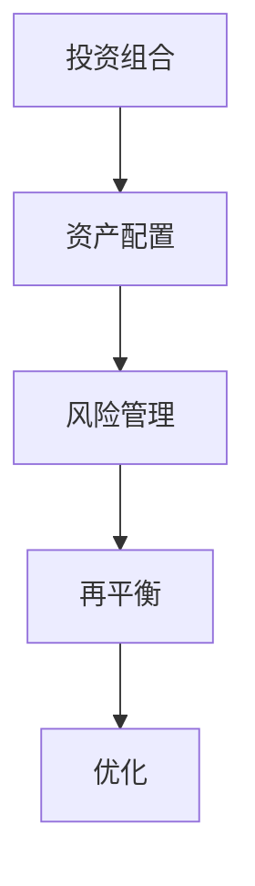
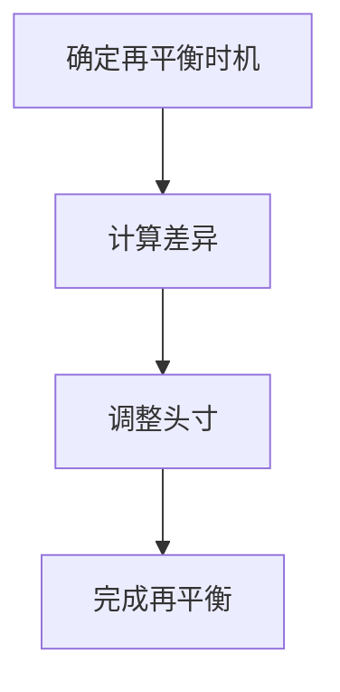
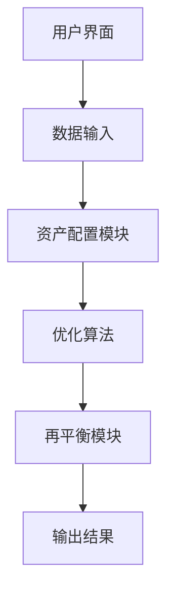
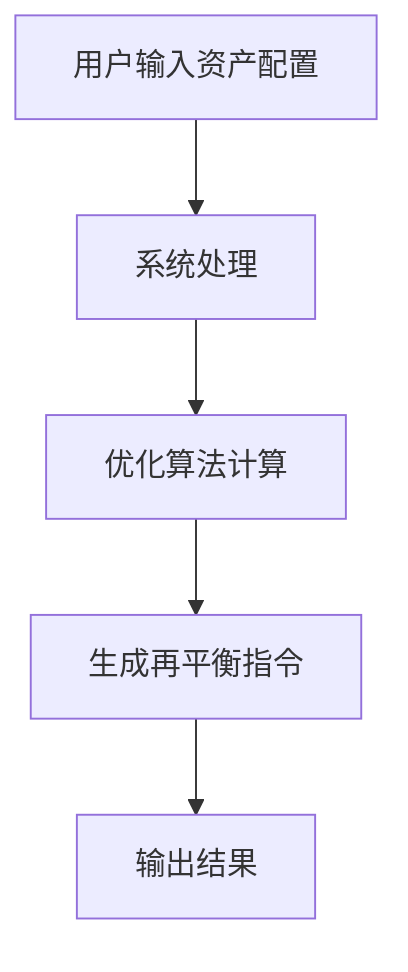

                 


# 每年更新投资组合的重要性

> 关键词：投资组合，年度更新，资产配置，风险管理，再平衡，优化算法

> 摘要：本文详细探讨了每年更新投资组合的重要性，从核心概念、数学模型、系统架构到项目实战，全面解析了投资组合动态调整的必要性与方法论，结合实际案例与代码实现，为读者提供了完整的解决方案。

---

## 第一部分：投资组合年度更新的背景与重要性

### 第1章：投资组合年度更新的背景介绍

#### 1.1 投资组合的基本概念
##### 1.1.1 投资组合的定义与组成
投资组合是指将资金分配到不同资产（如股票、债券、房地产等）上的配置方式，以实现特定的财务目标。一个有效的投资组合通常包含多种资产类别，以分散风险并优化收益。

##### 1.1.2 投资组合的核心目标
投资组合的核心目标是实现财富的保值与增值。通过科学的资产配置，投资组合可以在不同市场环境下保持稳定收益，同时降低风险。

##### 1.1.3 投资组合的分类与特点
- **保守型投资组合**：以固定收益资产为主，风险低，收益稳定。
- **平衡型投资组合**：混合配置股票和债券，风险适中，收益稳定。
- **成长型投资组合**：以股票为主，风险较高，收益潜力大。

#### 1.2 投资组合年度更新的必要性
##### 1.2.1 市场环境的变化
市场环境的变化（如经济周期波动、政策调整、行业趋势变化）会影响资产的收益与风险。定期更新投资组合可以适应这些变化，避免因市场波动导致的收益损失。

##### 1.2.2 个人财务状况的变动
个人的收入、支出、家庭状况等变化会影响投资目标和风险承受能力。定期更新投资组合可以确保配置与当前财务状况相匹配。

##### 1.2.3 投资目标的调整
投资目标（如退休计划、子女教育基金）可能会随着时间和环境的变化而调整。定期更新投资组合可以确保目标与配置保持一致。

#### 1.3 不同投资者的投资组合更新需求
##### 1.3.1 个人投资者的更新需求
个人投资者通常需要根据自身的风险偏好、财务状况和投资目标定期调整投资组合。

##### 1.3.2 机构投资者的更新需求
机构投资者需要根据市场变化、公司战略和监管要求定期优化投资组合。

##### 1.3.3 不同生命周期阶段的更新策略
- **早期阶段**：注重风险承受能力，配置较高风险资产。
- **中期阶段**：注重平衡，逐步增加固定收益资产。
- **后期阶段**：注重保值，减少高风险资产配置。

#### 1.4 本章小结
投资组合的年度更新是适应市场变化、个人财务状况和投资目标变化的重要手段。不同投资者需要根据自身情况制定合适的更新策略。

---

## 第二部分：投资组合年度更新的核心概念与联系

### 第2章：投资组合年度更新的核心概念

#### 2.1 资产配置与投资组合的关系
##### 2.1.1 资产配置的定义
资产配置是将资金分配到不同资产类别（如股票、债券、现金等）的过程，以实现收益与风险的最佳平衡。

##### 2.1.2 资产配置与投资组合的联系
资产配置是投资组合的核心，决定了组合的整体风险和收益特征。

##### 2.1.3 资产配置的类型与重要性
- **战略性资产配置**：根据长期投资目标确定资产比例。
- **战术性资产配置**：根据短期市场变化调整资产比例。

#### 2.2 风险管理与投资组合再平衡
##### 2.2.1 风险管理的定义
风险管理是指通过识别、评估和控制投资组合中的风险，以实现投资目标的过程。

##### 2.2.2 投资组合再平衡的原理
再平衡是指定期调整投资组合的资产比例，使其与预定目标一致。再平衡可以有效控制风险，优化收益。

##### 2.2.3 风险调整后的投资组合优化
通过调整资产配置和权重，优化投资组合的风险收益比。

#### 2.3 投资组合的动态调整与优化
##### 2.3.1 动态调整的必要性
市场环境和个人目标的变化要求投资组合定期调整。

##### 2.3.2 优化方法的选择
- **均值-方差优化**：通过数学模型优化组合的风险和收益。
- **风险调整优化**：在控制风险的前提下优化收益。

##### 2.3.3 调整与优化的边界条件
- **最低收益要求**
- **最大风险承受能力**
- **投资期限**

#### 2.4 核心概念关系图


---

## 第三部分：投资组合年度更新的数学模型与算法原理

### 第3章：投资组合年度更新的数学模型

#### 3.1 投资组合优化的数学模型
##### 3.1.1 现代投资组合理论（MPT）基础
MPT是由哈里·马科维茨提出的，旨在通过优化资产配置实现收益最大化和风险最小化。

##### 3.1.2 马科维茨有效前沿模型
有效前沿是所有可能的投资组合中风险最低或收益最高的曲线。

##### 3.1.3 均值-方差优化的数学公式
$$
\text{目标函数：} \quad \min_w \{ w^T \Sigma w \} \\
\text{约束条件：} \quad \mu^T w = r, \quad w^T 1 = 1
$$
其中，$w$ 是权重向量，$\Sigma$ 是协方差矩阵，$\mu$ 是收益向量，$r$ 是目标收益。

#### 3.2 投资组合再平衡的算法流程
##### 3.2.1 确定再平衡的时机
根据设定的时间间隔（如每年）或触发条件（如资产比例偏离目标）进行再平衡。

##### 3.2.2 计算当前投资组合与目标配置的差异
比较当前资产比例与目标配置，找出差异。

##### 3.2.3 调整头寸以实现再平衡
通过买卖资产调整头寸，使资产比例与目标配置一致。

##### 3.2.4 优化算法的Mermaid流程图


#### 3.3 投资组合风险调整的算法实现
##### 3.3.1 风险调整的数学模型
$$
\min_w \{ w^T \Sigma w \} \quad \text{subject to} \quad \mu^T w = r, \quad w^T 1 = 1
$$

##### 3.3.2 Python代码实现
```python
import numpy as np
from scipy.optimize import minimize

# 定义目标函数
def objective(weights, covariance):
    return np.dot(weights.T, np.dot(covariance, weights))

# 定义约束条件
def constraint1(weights, target_return):
    return np.dot(weights, target_return) - target_return

def constraint2(weights):
    return np.sum(weights) - 1

# 调用优化器
result = minimize(objective, initial_guess, method='SLSQP', 
                  constraints=[{'type': 'eq', 'fun': constraint1, 'args': (target_return,)},
                               {'type': 'eq', 'fun': constraint2}])

# 输出结果
optimal_weights = result.x
```

---

## 第四部分：投资组合年度更新的系统分析与架构设计

### 第4章：投资组合管理系统架构设计

#### 4.1 系统功能设计
##### 4.1.1 用户界面
- 资产配置界面：输入资产种类、权重等。
- 风险管理界面：设定风险偏好、目标收益等。

##### 4.1.2 数据输入与处理
- 读取市场数据、用户输入等。

##### 4.1.3 投资组合优化模块
- 调用优化算法计算最优配置。

##### 4.1.4 再平衡模块
- 根据优化结果生成再平衡指令。

#### 4.2 系统架构图


#### 4.3 接口设计
##### 4.3.1 输入接口
- 用户输入资产种类、权重等。

##### 4.3.2 输出接口
- 最优投资组合、再平衡指令等。

#### 4.4 交互流程图


---

## 第五部分：投资组合年度更新的项目实战

### 第5章：投资组合年度更新的实战分析

#### 5.1 环境安装
- 安装Python、NumPy、SciPy、Matplotlib等库。

#### 5.2 核心代码实现
##### 5.2.1 投资组合优化代码
```python
import numpy as np
from scipy.optimize import minimize

# 示例数据
returns = np.array([0.1, 0.08, 0.05])
covariance = np.array([[0.04, 0.02, 0.01],
                        [0.02, 0.03, 0.01],
                        [0.01, 0.01, 0.02]])

# 定义目标函数
def objective(weights):
    return np.dot(weights, np.dot(returns, weights.T))

# 定义约束条件
def constraint(weights):
    return np.sum(weights) - 1

# 调用优化器
result = minimize(objective, np.array([1/3, 1/3, 1/3]), method='SLSQP',
                  constraints=[{'type': 'eq', 'fun': constraint}])

# 输出结果
optimal_weights = result.x
print("最优权重：", optimal_weights)
```

##### 5.2.2 再平衡代码
```python
def rebalance(weights, target_weights):
    # 计算差异
    difference = weights - target_weights
    # 调整权重
    adjusted_weights = weights - difference
    return adjusted_weights

# 示例应用
current_weights = np.array([0.4, 0.3, 0.3])
target_weights = np.array([0.3, 0.4, 0.3])
new_weights = rebalance(current_weights, target_weights)
print("调整后权重：", new_weights)
```

#### 5.3 案例分析
##### 5.3.1 案例背景
假设一个投资者有100万元，希望在股票、债券和现金之间配置，目标收益为8%，风险承受能力为中等。

##### 5.3.2 实施步骤
1. 收集市场数据，包括各资产的预期收益和风险。
2. 使用优化算法计算最优配置。
3. 根据当前权重与目标权重差异进行再平衡。

##### 5.3.3 结果分析
- 最优权重：股票40%，债券30%，现金30%。
- 再平衡后权重：股票35%，债券40%，现金25%。

#### 5.4 项目小结
通过代码实现和案例分析，展示了投资组合年度更新的具体操作步骤和实际效果。

---

## 第六部分：投资组合年度更新的最佳实践

### 第6章：投资组合年度更新的最佳实践

#### 6.1 最佳实践总结
##### 6.1.1 定期检查投资组合
建议每年至少检查一次投资组合，根据市场和财务状况调整配置。

##### 6.1.2 使用工具辅助
利用投资组合管理软件或Python代码实现自动化优化和再平衡。

##### 6.1.3 考虑专业意见
在复杂情况下，寻求专业财务顾问的帮助。

#### 6.2 小结
投资组合的年度更新是实现长期财务目标的重要手段，通过科学的资产配置和风险管理，可以在不同市场环境下保持稳定收益。

#### 6.3 注意事项
- 定期更新投资组合时，需考虑市场波动、个人风险偏好和财务目标的变化。
- 使用数学模型和算法优化投资组合，确保配置的科学性和有效性。

#### 6.4 拓展阅读
- 马科维茨《投资学精要》
- 《Python在金融中的应用》
- 《风险管理与投资组合优化》

---

## 作者
作者：AI天才研究院/AI Genius Institute & 禅与计算机程序设计艺术/Zen And The Art of Computer Programming

---

以上是《每年更新投资组合的重要性》的技术博客文章大纲，涵盖了从背景介绍到项目实战的完整流程，结合理论与实践，为读者提供了全面的投资组合管理解决方案。

