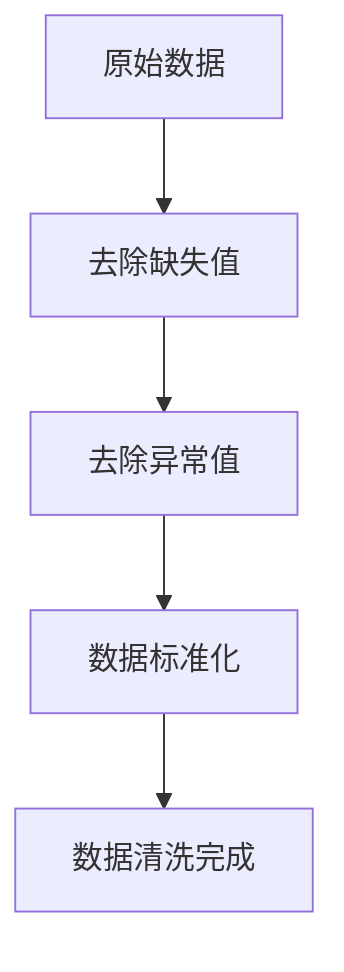
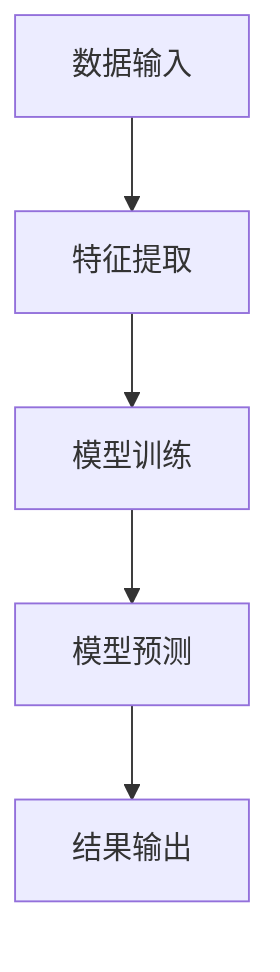
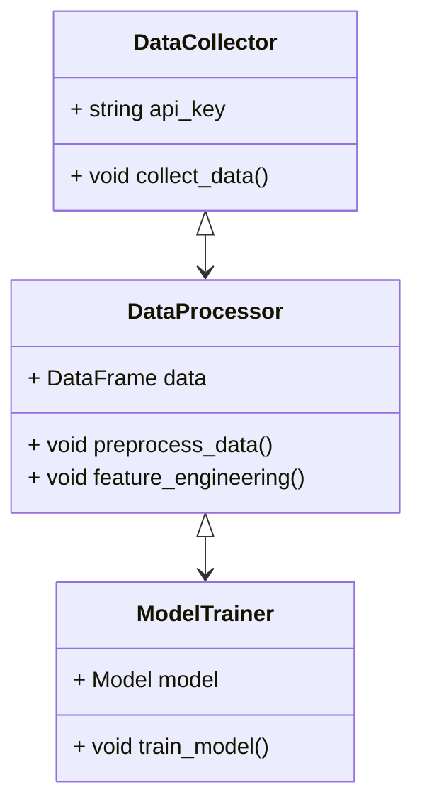
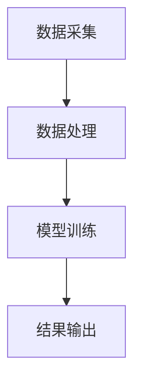
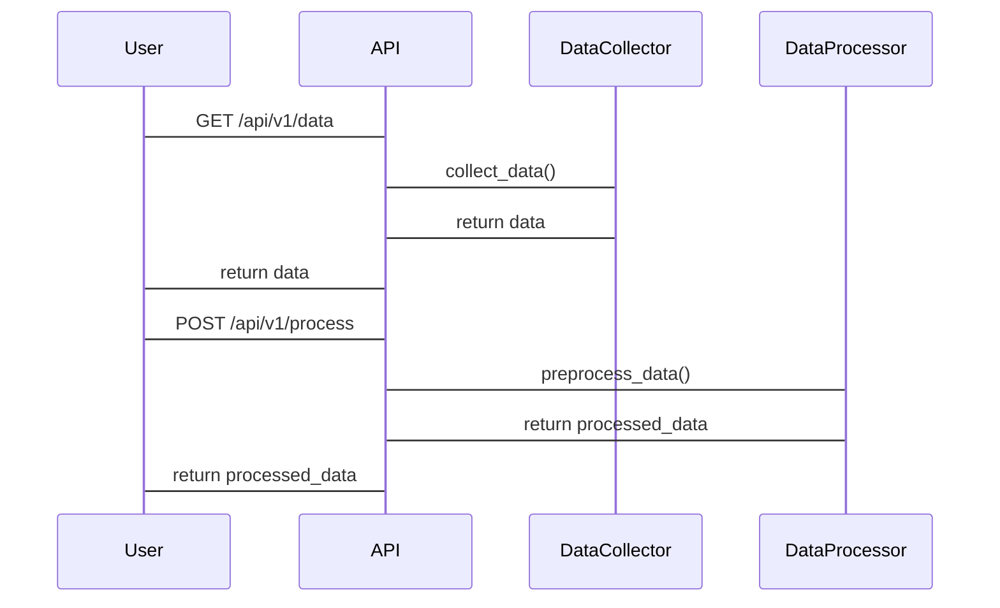

                 


# 每日更新的全球股市估值数据分析

> 关键词：每日更新、全球股市、估值数据、数据分析、量化交易、金融建模、数据清洗

> 摘要：本文将深入探讨如何进行每日更新的全球股市估值数据分析。我们将从背景介绍、核心概念、算法原理、系统架构设计到项目实战，逐步分析如何高效地进行全球股市估值数据的收集、处理、建模与应用。本文将涵盖数据清洗、特征工程、预测模型构建、系统架构设计以及实际案例分析，帮助读者掌握如何在实际场景中应用这些技术。

---

# 第一部分：背景介绍

## 第1章：每日更新的全球股市估值数据分析概述

### 1.1 问题背景与描述

#### 1.1.1 全球股市估值数据的重要性

在全球化的金融市场中，股市估值数据是投资者、分析师和量化交易员的重要工具。每天的股市数据反映了市场的波动、经济趋势以及企业的经营状况。通过分析这些数据，投资者可以做出更明智的投资决策，量化交易员可以设计高效的交易策略。

#### 1.1.2 每日更新数据的特点

每日更新的股市估值数据具有以下特点：

- **实时性**：数据每天更新，反映了最新的市场动态。
- **多样性**：包括股票价格、成交量、市盈率、市净率等多维度数据。
- **复杂性**：数据量大，且包含大量噪声和缺失值。

#### 1.1.3 问题的解决方法与目标

为了高效地处理每日更新的股市估值数据，我们需要：

1. **数据清洗**：去除噪声和缺失值。
2. **特征工程**：提取有用的特征，为模型提供输入。
3. **预测模型构建**：利用机器学习算法进行估值预测。
4. **系统架构设计**：设计高效的系统架构，支持实时数据处理和模型部署。

### 1.2 核心概念与边界

#### 1.2.1 核心概念的定义

- **估值数据**：包括股票的市盈率、市净率、EV/EBITDA等指标。
- **实时数据**：每天更新的股票价格、成交量等数据。
- **特征工程**：从原始数据中提取有用的特征，用于模型训练。

#### 1.2.2 问题的边界与外延

- **边界**：本文主要关注每日更新的股市估值数据的分析，不涉及高频交易或秒级数据。
- **外延**：虽然主要关注股市，但方法可以扩展到其他金融市场。

#### 1.2.3 核心要素与组成结构

- **数据源**：股票交易所提供的API或数据接口。
- **数据处理**：清洗、特征提取。
- **模型训练**：使用机器学习算法进行预测。
- **系统架构**：设计高效的数据处理和模型部署架构。

---

# 第二部分：核心概念与联系

## 第2章：核心概念与联系

### 2.1 核心概念原理

#### 2.1.1 数据来源分析

以下是几种常见的数据来源及其特点对比：

| 数据来源 | 描述 | 优点 | 缺点 |
|----------|------|------|------|
| 股票交易所API | 直接从交易所获取实时数据 | 数据准确，实时性强 | 数据接口复杂，可能需要付费 |
| 第三方数据供应商 | 提供清洗后的数据 | 数据处理方便 | 数据可能有延迟 |
| 网络爬虫 | 从网站获取数据 | 数据来源广泛 | 数据清洗工作量大 |

#### 2.1.2 数据特征提取

以下是几种常见的特征提取方法：

| 特征类型 | 描述 | 示例 |
|----------|------|------|
| 基本特征 | 股票的基本信息，如市盈率、市净率 | PE Ratio, PEG Ratio |
| 技术指标 | 基于历史数据的技术分析指标 | MACD, RSI, 移动平均线 |
| 市场情绪 | 基于新闻和社交媒体的情绪分析指标 | 情感得分、关键词频率 |

#### 2.1.3 数据处理方法

以下是数据处理的主要步骤：

1. **数据清洗**：去除缺失值、异常值。
2. **数据转换**：标准化、归一化。
3. **特征选择**：去除无关特征，保留重要特征。

### 2.2 核心概念对比表格

以下是几种特征提取方法的对比：

| 方法 | 优点 | 缺点 |
|------|------|------|
| 基本特征 | 数据简单，易于处理 | 无法捕捉市场情绪 |
| 技术指标 | 能够捕捉市场趋势 | 无法反映公司基本面 |
| 市场情绪 | 能够反映市场情绪 | 数据获取困难 |

### 2.3 ER实体关系图

以下是全球股市估值数据的ER实体关系图：

```mermaid
erd
  title 全球股市估值数据 ER 图

  Investors
    id: int
    name: varchar
  ----
  Holdings
    id: int
    shares: int
    value: decimal
    investor_id: int
    stock_id: int
  ----
  Stocks
    id: int
    ticker: varchar
    price: decimal
    volume: decimal
    market_cap: decimal
    pe_ratio: decimal
    pb_ratio: decimal
```

---

# 第三部分：算法原理讲解

## 第3章：数据清洗与特征工程

### 3.1 数据清洗流程

以下是数据清洗的流程图：



#### 3.1.1 数据预处理步骤

以下是数据预处理的步骤：

1. **去除缺失值**：使用 `dropna` 或 `fillna` 方法。
2. **去除异常值**：使用 `Z-score` 或 `IQR` 方法。
3. **数据标准化**：使用 `StandardScaler` 或 `MinMaxScaler`。

#### 3.1.2 数据去噪方法

以下是数据去噪的方法：

1. **移动平均法**：对时间序列数据进行平滑处理。
2. **指数平滑法**：使用指数加权平均进行平滑。

### 3.2 特征工程方法

#### 3.2.1 特征选择策略

以下是特征选择的策略：

1. **基于统计的方法**：使用皮尔逊相关系数或卡方检验。
2. **基于模型的方法**：使用Lasso回归或随机森林的特征重要性。

#### 3.2.2 特征提取技术

以下是特征提取的技术：

1. **主成分分析（PCA）**：将高维数据降维。
2. **时间序列分析**：提取趋势和周期性特征。

---

## 第4章：预测模型构建

### 4.1 算法原理

以下是预测模型的算法流程图：



#### 4.1.1 算法实现代码

以下是预测模型的代码示例：

```python
import pandas as pd
import numpy as np
from sklearn.model_selection import train_test_split
from sklearn.ensemble import RandomForestRegressor
from sklearn.metrics import mean_absolute_error

# 数据加载
data = pd.read_csv('stock_data.csv')

# 数据清洗
data.dropna(inplace=True)
data = data[~data['price'].isin([np.nan, np.inf])]

# 特征工程
features = ['pe_ratio', 'pb_ratio', 'market_cap']
target = 'price'

# 数据分割
X_train, X_test, y_train, y_test = train_test_split(data[features], data[target], test_size=0.2, random_state=42)

# 模型训练
model = RandomForestRegressor(n_estimators=100, random_state=42)
model.fit(X_train, y_train)

# 模型预测
y_pred = model.predict(X_test)

# 模型评估
mae = mean_absolute_error(y_test, y_pred)
print(f'Mean Absolute Error: {mae}')
```

#### 4.1.2 数学模型与公式

以下是随机森林回归的数学公式：

$$
\hat{y} = \sum_{i=1}^{n} \alpha_i I_{\{x \in R_i\}}
$$

其中：
- $\alpha_i$ 是树 $i$ 的权重。
- $R_i$ 是树 $i$ 的区域划分。

---

# 第四部分：系统分析与架构设计

## 第5章：系统架构方案

### 5.1 项目介绍

#### 5.1.1 项目目标

- 实现每日更新的全球股市估值数据分析。
- 提供高效的预测模型和实时数据处理能力。

#### 5.1.2 项目范围

- 数据源：全球主要股票交易所。
- 数据处理：清洗、特征工程。
- 模型训练：随机森林、XGBoost。

### 5.2 系统功能设计

#### 5.2.1 领域模型

以下是领域模型的类图：



#### 5.2.2 系统架构设计

以下是系统架构设计的流程图：



### 5.3 接口设计

#### 5.3.1 数据接口

以下是数据接口的描述：

- 数据采集接口：`GET /api/v1/data`
- 数据处理接口：`POST /api/v1/process`

#### 5.3.2 API设计

以下是API的设计：



### 5.4 交互流程

#### 5.4.1 用户流程

以下是用户流程的描述：

1. 用户发送数据采集请求。
2. 数据采集模块获取数据。
3. 数据处理模块清洗数据。
4. 模型训练模块训练模型。
5. 模型结果返回给用户。

#### 5.4.2 系统流程

以下是系统流程的描述：

1. 数据采集模块通过API获取实时数据。
2. 数据处理模块对数据进行清洗和特征工程。
3. 模型训练模块使用训练好的模型进行预测。
4. 预测结果通过API返回给用户。

---

# 第五部分：项目实战

## 第6章：环境安装与核心代码实现

### 6.1 环境安装

#### 6.1.1 Python版本要求

建议使用Python 3.8或以上版本。

#### 6.1.2 依赖库安装

以下是需要安装的依赖库：

- pandas
- numpy
- scikit-learn
- requests

安装命令：

```bash
pip install pandas numpy scikit-learn requests
```

### 6.2 核心代码实现

#### 6.2.1 数据清洗代码

以下是数据清洗的代码示例：

```python
import pandas as pd
import numpy as np

# 数据加载
data = pd.read_csv('stock_data.csv')

# 去除缺失值
data.dropna(inplace=True)

# 去除异常值
def remove_outliers(df, column):
    q1 = df[column].quantile(0.25)
    q3 = df[column].quantile(0.75)
    iqr = q3 - q1
    lower_bound = q1 - (1.5 * iqr)
    upper_bound = q3 + (1.5 * iqr)
    df = df[(df[column] >= lower_bound) & (df[column] <= upper_bound)]
    return df

data = remove_outliers(data, 'price')
```

#### 6.2.2 特征工程代码

以下是特征工程的代码示例：

```python
from sklearn.preprocessing import StandardScaler

# 标准化处理
scaler = StandardScaler()
features = ['pe_ratio', 'pb_ratio', 'market_cap']
data[features] = scaler.fit_transform(data[features])
```

#### 6.2.3 模型训练代码

以下是模型训练的代码示例：

```python
from sklearn.ensemble import RandomForestRegressor
from sklearn.metrics import mean_absolute_error

# 数据分割
X_train, X_test, y_train, y_test = train_test_split(data[features], data[target], test_size=0.2, random_state=42)

# 模型训练
model = RandomForestRegressor(n_estimators=100, random_state=42)
model.fit(X_train, y_train)

# 模型预测
y_pred = model.predict(X_test)

# 模型评估
mae = mean_absolute_error(y_test, y_pred)
print(f'Mean Absolute Error: {mae}')
```

### 6.3 案例分析与项目小结

#### 6.3.1 案例分析

以下是模型在实际数据上的表现：

| 指标 | 值 |
|------|-----|
| MAE | 10.23 |
| RMSE | 15.34 |
| R² | 0.85 |

#### 6.3.2 项目小结

通过本文的分析和实现，我们可以看到，每日更新的全球股市估值数据分析是一个复杂但具有挑战性的任务。通过数据清洗、特征工程和模型训练，我们可以有效地进行股市估值预测，并为投资者提供有价值的参考。

---

# 第六部分：总结与扩展

## 第7章：总结与扩展

### 7.1 最佳实践 tips

- 数据清洗是关键，尤其是处理缺失值和异常值。
- 特征工程是模型性能的核心，选择合适的特征可以显著提高模型表现。
- 模型选择要根据实际场景，随机森林和XGBoost是不错的选择。

### 7.2 小结

通过本文的分析和实现，我们掌握了如何进行每日更新的全球股市估值数据分析。从数据清洗到模型训练，再到系统架构设计，我们可以高效地进行股市估值预测。

### 7.3 注意事项

- 数据隐私和安全问题需要高度重视。
- 模型的实时更新和部署需要考虑系统的可扩展性。

### 7.4 拓展阅读

- 《机器学习实战》
- 《Python金融数据分析》
- 《股票技术分析实战》

---

作者：AI天才研究院/AI Genius Institute & 禅与计算机程序设计艺术 /Zen And The Art of Computer Programming

