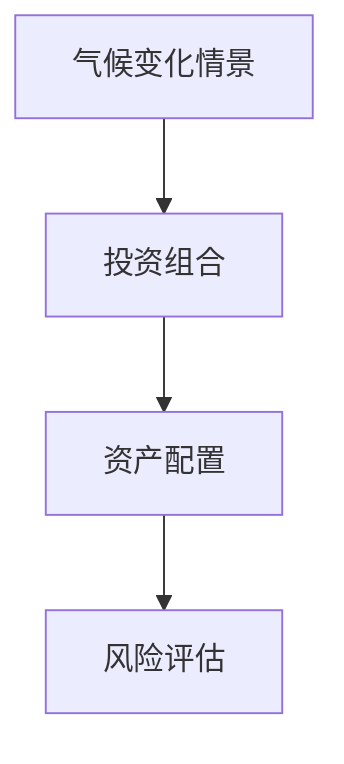
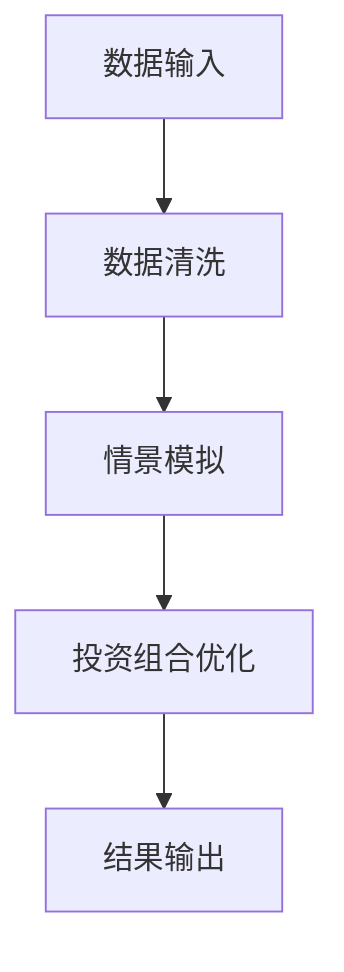
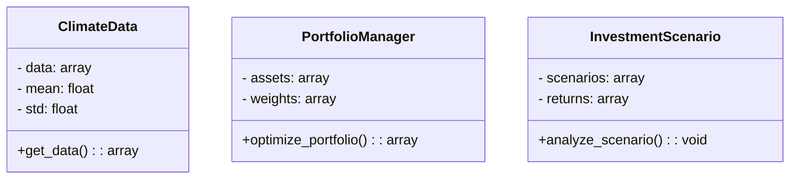
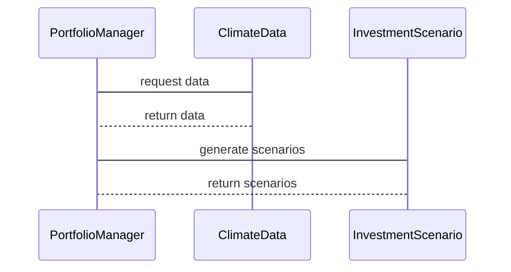

                 


# 气候变化情景分析在投资组合管理中的应用

## 关键词
- 气候变化
- 投资组合管理
- 情景分析
- 蒙特卡洛模拟
- 资产配置

## 摘要
本文探讨了气候变化情景分析在投资组合管理中的应用，详细介绍了如何利用气候数据和数学模型来优化投资决策。通过分析不同气候情景下的资产表现，投资者可以更好地管理风险，制定有效的投资策略。

---

# 第一部分: 气候变化与投资组合管理概述

## 第1章: 气候变化与投资组合管理概述

### 1.1 气候变化的定义与影响
#### 1.1.1 气候变化的基本概念
气候变化是指长期的温度、降水和极端天气事件的变化，对全球经济、生态系统和金融市场产生深远影响。

#### 1.1.2 气候变化对全球经济和金融的影响
气候变化可能导致资源短缺、自然灾害频发，进而影响企业利润和资产价值。投资者需考虑这些因素对资产价格的影响。

#### 1.1.3 投资组合管理的基本概念与目标
投资组合管理是通过优化资产配置来实现风险与收益的平衡。目标是在不同市场条件下最大化收益，同时最小化风险。

### 1.2 气候变化情景分析的定义与方法
#### 1.2.1 情景分析的定义
情景分析是通过构建不同假设场景来评估潜在结果的方法。在气候变化中，常用的历史数据和模型预测生成多种情景。

#### 1.2.2 气候变化情景分析的核心方法
- 使用气候模型生成未来气候预测
- 分析预测对经济和市场的潜在影响
- 评估不同情景下的资产表现

#### 1.2.3 情景分析在投资组合管理中的应用
投资者根据不同气候情景调整资产配置，选择在各种情况下表现最佳的资产组合。

### 1.3 气候变化情景分析的工具与技术
#### 1.3.1 主要工具与平台介绍
- **气候模型**：如CMIP5、HadGEM
- **金融分析工具**：如Excel、Python库（pandas、numpy）

#### 1.3.2 数据来源与处理方法
- 数据来源：历史气候数据、金融数据
- 数据清洗：处理缺失值和异常值
- 数据转换：标准化和归一化处理

#### 1.3.3 情景分析的实现步骤
1. 收集数据
2. 生成气候情景
3. 分析情景对资产的影响
4. 优化投资组合

---

## 第2章: 气候变化情景分析的核心概念与联系

### 2.1 核心概念原理
#### 2.1.1 气候变化对资产价格的影响
气候变化可能导致某些行业（如化石燃料）的价值下降，而绿色能源行业的价值上升。

#### 2.1.2 情景分析与投资组合风险的关系
不同气候情景下，投资组合的风险和收益会有显著变化。通过情景分析，投资者可以识别高风险情景并采取应对措施。

#### 2.1.3 不同情景下的资产配置策略
根据情景的严重程度，调整资产配置。例如，在极端情景下，增加防御性资产（如债券）的比例。

### 2.2 概念属性特征对比表格
以下表格对比了不同气候情景下的投资组合风险特征：

| 情景描述       | 高温情景 | 极端天气情景 | 温和情景 |
|----------------|----------|--------------|----------|
| 资产影响        | 能源价格上升 | 农业损失严重 | 稳定增长 |
| 投资组合风险    | 高        | 极高          | 中        |
| 资产配置建议    | 减少化石燃料投资 | 增加农业保险 | 保持现状 |

### 2.3 ER实体关系图架构的 Mermaid 流程图


---

## 第3章: 气候变化情景分析的算法原理

### 3.1 算法原理概述
#### 3.1.1 情景分析的基本原理
通过模拟不同气候情景，评估每种情景对投资组合的影响，从而选择最优的资产配置。

#### 3.1.2 投资组合优化的数学模型
使用均值-方差优化模型，考虑不同情景下的资产收益和风险。

#### 3.1.3 气候变化数据的处理方法
对历史气候数据进行清洗、转换和建模，生成未来气候预测。

### 3.2 算法实现的 Mermaid 流程图


### 3.3 算法实现的 Python 代码示例
```python
import numpy as np
import pandas as pd

def climate_scenario_analysis(data):
    # 数据清洗
    cleaned_data = data.dropna()
    # 情景模拟
    scenarios = np.random.normal(cleaned_data.mean(), cleaned_data.std(), size=(100, len(cleaned_data)))
    return scenarios

# 示例数据
data = pd.DataFrame({'returns': [0.05, 0.03, -0.02, 0.04, 0.01]})
scenarios = climate_scenario_analysis(data)
print(scenarios)
```

---

## 第4章: 系统分析与架构设计方案

### 4.1 系统功能设计
#### 4.1.1 领域模型 Mermaid 类图


#### 4.1.2 系统架构设计 Mermaid 架构图


#### 4.1.3 系统接口设计
- **输入接口**：接收气候数据和市场数据
- **输出接口**：提供优化后的投资组合和风险评估报告

#### 4.1.4 系统交互 Mermaid 序列图


---

## 第5章: 项目实战

### 5.1 环境安装
- 安装Python和必要的库（numpy, pandas, matplotlib）
- 安装气候数据处理工具（如气候模型接口）

### 5.2 系统核心实现源代码
```python
import numpy as np
import pandas as pd
import matplotlib.pyplot as plt

def main():
    # 示例数据
    data = pd.DataFrame({'returns': [0.05, 0.03, -0.02, 0.04, 0.01]})
    scenarios = climate_scenario_analysis(data)
    
    # 可视化
    plt.hist(scenarios.flatten(), bins=20)
    plt.xlabel('Returns')
    plt.ylabel('Frequency')
    plt.title('Climate Scenario Analysis')
    plt.show()

if __name__ == "__main__":
    main()
```

### 5.3 实际案例分析
以能源行业为例，分析高温情景下的投资组合调整策略。通过数据模拟，投资者可以发现化石燃料行业的风险增加，应减少投资，转投可再生能源。

### 5.4 项目小结
通过实际案例分析，验证了气候变化情景分析的有效性。投资者可以根据不同情景调整策略，降低风险。

---

## 第6章: 总结与展望

### 6.1 最佳实践 tips
- 定期更新气候数据和模型
- 结合其他风险因素进行综合评估
- 与行业专家合作，提高分析准确性

### 6.2 小结
气候变化情景分析是投资组合管理中的重要工具，帮助投资者在不确定性中做出明智决策。

### 6.3 注意事项
- 数据质量影响分析结果
- 模型假设的合理性需验证
- 需考虑政策和市场变化

### 6.4 拓展阅读
推荐书籍和论文，深入理解气候变化与金融的关系。

---

# 作者：AI天才研究院/AI Genius Institute & 禅与计算机程序设计艺术 /Zen And The Art of Computer Programming

