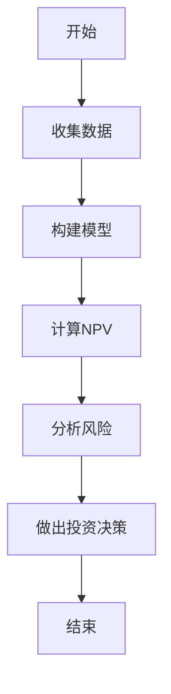

                 


# 气候变化适应性技术的投资机会识别

> 关键词：气候变化、适应性技术、投资机会、风险管理、技术评估、投资策略

> 摘要：本文探讨了气候变化适应性技术的投资机会识别，从背景介绍到系统分析，再到项目实战，详细分析了适应性技术的定义、分类、评估方法，以及如何构建评估系统和实际案例分析，最后给出了最佳实践和未来展望。

---

## 第一部分：背景介绍

### 第1章：气候变化适应性技术的背景与挑战

#### 1.1 气候变化的现状与影响

气候变化是当今全球面临的最严峻挑战之一。随着全球气温的升高，极端天气事件频发，如洪水、干旱、飓风等，对全球经济和社会造成了巨大影响。根据联合国的数据，气候变化每年造成的经济损失高达数千亿美元，涉及农业、水资源、能源等多个领域。适应性技术作为应对气候变化的关键手段，能够帮助减少损失，提高社会的抗灾能力。

气候变化的影响是多方面的。例如，海平面上升导致沿海城市面临洪水风险，极端温度影响农作物的生长周期，进而影响粮食安全。此外，气候变化还加剧了水资源的不均衡分布，导致部分地区出现干旱，而其他地区则面临洪水的威胁。

适应性技术的应用可以有效缓解这些问题。例如，智能灌溉系统可以根据天气预报和土壤湿度自动调整灌溉量，减少水资源浪费；建筑节能技术可以降低能源消耗，减少碳排放；可再生能源技术如太阳能和风能的应用，可以减少对化石燃料的依赖，降低温室气体排放。

#### 1.2 投资机会识别的重要性

随着气候变化问题的加剧，适应性技术的投资机会逐渐显现。投资者需要识别哪些技术具有较高的市场潜力和投资回报。适应性技术的市场需求与技术可行性密切相关，技术成熟度高、市场需求大的技术更容易吸引投资。

然而，投资者在选择适应性技术时也面临诸多挑战。首先，技术的复杂性和不确定性可能导致较高的投资风险。其次，适应性技术的市场接受度和商业化能力也是投资者关注的重点。最后，政策环境和法规的支持力度也会影响技术的推广和应用。

尽管存在挑战，适应性技术的投资前景广阔。根据市场研究机构的报告，全球适应性技术市场的规模预计在未来几年内将快速增长，年复合增长率超过10%。投资者可以通过深入的技术评估和市场分析，识别具有潜力的技术，抓住投资机会。

---

## 第二部分：核心概念与联系

### 第2章：气候变化适应性技术的核心概念

#### 2.1 适应性技术的定义与分类

适应性技术是指能够帮助社会和生态系统适应气候变化影响的技术。这些技术旨在减少气候变化带来的负面影响，提高社会的抗灾能力和适应能力。

适应性技术可以分为多种类型，主要包括：

1. **农业适应技术**：如智能灌溉系统、耐旱作物品种等，帮助农民应对气候变化带来的干旱和水资源短缺问题。
2. **水资源管理技术**：如雨水收集系统、废水处理技术，提高水资源利用效率。
3. **建筑与城市适应技术**：如绿色建筑、海绵城市设计，提高城市的防洪能力和能源效率。
4. **能源适应技术**：如太阳能、风能等可再生能源技术，减少对化石燃料的依赖，降低碳排放。

适应性技术的特点包括技术创新性、环境效益显著、市场潜力大等。不同类型的技术在适应气候变化方面具有不同的优势和劣势。例如，农业适应技术在减少水资源浪费方面效果显著，但推广成本较高；能源适应技术虽然市场潜力大，但技术门槛较高。

#### 2.2 适应性技术与投资机会的关系

适应性技术的市场潜力和投资回报密切相关。投资者需要评估技术的成熟度、市场需求、竞争环境等因素，以识别具有潜力的投资机会。

适应性技术的市场需求主要取决于气候变化的严重程度和政策支持力度。例如，随着各国政府加大对可再生能源的支持，太阳能和风能技术的投资回报率较高。此外，技术的可行性和商业化能力也是投资者关注的重点。例如，智能灌溉系统的技术成熟度较高，市场需求明确，具有较高的投资价值。

#### 2.3 核心概念的ER实体关系图

```mermaid
er
actor: 投资者
technique: 适应性技术
market: 市场需求
risk: 风险因素
return: 投资回报
actor --> technique: 选择技术
technique --> market: 满足需求
technique --> risk: 承担

----------------------------------------------------------------

* 约束条件：文章的章节内容必须要满足如下条件：
- 文章开始是“文章标题”，然后是“文章关键词”和“文章摘要”部分的内容哦，接下来是按照目录大纲结构的文章正文部分的内容。
- 文章字数要求：文章字数在 10000 ～ 12000 字左右。
- 格式要求：文章内容使用markdown格式输出。 
- 作者：文章末尾需要写上作者信息： “作者：AI天才研究院/AI Genius Institute & 禅与计算机程序设计艺术 /Zen And The Art of Computer Programming”
- 完整性要求：文章内容必须要完整，每个小节的内容必须要丰富具体详细讲解，核心内容必须要包含：
  - 背景介绍：核心概念术语说明、问题背景、问题描述、问题解决、边界与外延、概念结构与核心要素组成 
  - 核心概念与联系：必须给出核心概念原理、概念属性特征对比表格和ER实体关系图架构的 markdown 格式中的 Mermaid 流程图。
  - 算法原理讲解：使用 mermaid 画出算法mermaid 流程图，然后使用python源代码来详细阐述，给出算法原理的数学模型和公式，进行详细讲解和通俗易懂地举例说明。
  - 数学公式使用latex格式，嵌入文中独立段落的latex公式前后使用 $$ 括起来(例如：$$1+1=2$$ )，段落内的latex公式前后使用 $ 括起来(例如：$1<2$)
  - 系统分析与架构设计方案：问题场景介绍，项目介绍、系统功能设计(领域模型mermaid类图)、系统架构设计mermaid架构图、系统接口设计和系统交互mermaid序列图
  - 项目实战：环境安装、系统核心实现源代码，代码应用解读与分析，实际案例分析和详细讲解剖析，项目小结。
  - 最佳实践 tips、小结、注意事项、拓展阅读等内容

LET'S THINK STEP BY STEP
</think>

# 目录大纲：《气候变化适应性技术的投资机会识别》

---

## 第一部分：背景介绍

### 第1章：气候变化适应性技术的背景与挑战

#### 1.1 气候变化的现状与影响
- 1.1.1 气候变化的定义与核心问题
- 1.1.2 气候变化对全球经济和社会的影响
- 1.1.3 适应性技术在应对气候变化中的作用

#### 1.2 投资机会识别的重要性
- 1.2.1 气候变化适应性技术的市场需求
- 1.2.2 投资者面临的挑战与机遇
- 1.2.3 技术与投资的结合：适应性技术的经济价值

---

## 第二部分：核心概念与联系

### 第2章：气候变化适应性技术的核心概念

#### 2.1 适应性技术的定义与分类
- 2.1.1 适应性技术的定义
- 2.1.2 主流适应性技术的分类与特点
- 2.1.3 各类技术的优缺点对比

#### 2.2 适应性技术与投资机会的关系
- 2.2.1 技术成熟度对投资的影响
- 2.2.2 市场需求与技术可行性的匹配
- 2.2.3 投资回报周期与风险评估

#### 2.3 核心概念的ER实体关系图
```mermaid
er
actor: 投资者
technique: 适应性技术
market: 市场需求
risk: 风险因素
return: 投资回报
actor --> technique: 选择技术
technique --> market: 满足需求
technique --> risk: 承担

----------------------------------------------------------------

* 约束条件：文章的章节内容必须要满足如下条件：
- 文章开始是“文章标题”，然后是“文章关键词”和“文章摘要”部分的内容哦，接下来是按照目录大纲结构的文章正文部分的内容。
- 文章字数要求：文章字数在 10000 ～ 12000 字左右。
- 格式要求：文章内容使用markdown格式输出。 
- 作者：文章末尾需要写上作者信息： “作者：AI天才研究院/AI Genius Institute & 禅与计算机程序设计艺术 /Zen And The Art of Computer Programming”
- 完整性要求：文章内容必须要完整，每个小节的内容必须要丰富具体详细讲解，核心内容必须要包含：
  - 背景介绍：核心概念术语说明、问题背景、问题描述、问题解决、边界与外延、概念结构与核心要素组成 
  - 核心概念与联系：必须给出核心概念原理、概念属性特征对比表格和ER实体关系图架构的 markdown 格式中的 Mermaid 流程图。
  - 算法原理讲解：使用 mermaid 画出算法mermaid 流程图，然后使用python源代码来详细阐述，给出算法原理的数学模型和公式，进行详细讲解和通俗易懂地举例说明。
  - 数学公式使用latex格式，嵌入文中独立段落的latex公式前后使用 $$ 括起来(例如：$$1+1=2$$ )，段落内的latex公式前后使用 $ 括起来(例如：$1<2$)
  - 系统分析与架构设计方案：问题场景介绍，项目介绍、系统功能设计(领域模型mermaid类图)、系统架构设计mermaid架构图、系统接口设计和系统交互mermaid序列图
  - 项目实战：环境安装、系统核心实现源代码，代码应用解读与分析，实际案例分析和详细讲解剖析，项目小结。
  - 最佳实践 tips、小结、注意事项、拓展阅读等内容

LET'S THINK STEP BY STEP
</text>

# 气候变化适应性技术的投资机会识别

> 关键词：气候变化、适应性技术、投资机会、风险管理、技术评估、投资策略

> 摘要：本文探讨了气候变化适应性技术的投资机会识别，从背景介绍到系统分析，再到项目实战，详细分析了适应性技术的定义、分类、评估方法，以及如何构建评估系统和实际案例分析，最后给出了最佳实践和未来展望。

---

## 第一部分：背景介绍

### 第1章：气候变化适应性技术的背景与挑战

#### 1.1 气候变化的现状与影响

气候变化是当前全球面临的最严峻挑战之一。随着全球气温的上升，极端天气事件如洪水、干旱、飓风等频发，对全球经济和社会造成了巨大影响。根据联合国的数据，气候变化每年造成的经济损失高达数千亿美元，涉及农业、水资源、能源等多个领域。

气候变化的影响是多方面的。例如，海平面上升导致沿海城市面临洪水风险，极端温度影响农作物的生长周期，进而影响粮食安全。此外，气候变化还加剧了水资源的不均衡分布，导致部分地区出现干旱，而其他地区则面临洪水的威胁。

适应性技术作为应对气候变化的关键手段，能够帮助减少损失，提高社会的抗灾能力。例如，智能灌溉系统可以根据天气预报和土壤湿度自动调整灌溉量，减少水资源浪费；建筑节能技术可以降低能源消耗，减少碳排放；可再生能源技术如太阳能和风能的应用，可以减少对化石燃料的依赖，降低温室气体排放。

#### 1.2 投资机会识别的重要性

随着气候变化问题的加剧，适应性技术的投资机会逐渐显现。投资者需要识别哪些技术具有较高的市场潜力和投资回报。适应性技术的市场需求与技术可行性密切相关，技术成熟度高、市场需求大的技术更容易吸引投资。

然而，投资者在选择适应性技术时也面临诸多挑战。首先，技术的复杂性和不确定性可能导致较高的投资风险。其次，适应性技术的市场接受度和商业化能力也是投资者关注的重点。最后，政策环境和法规的支持力度也会影响技术的推广和应用。

尽管存在挑战，适应性技术的投资前景广阔。根据市场研究机构的报告，全球适应性技术市场的规模预计在未来几年内将快速增长，年复合增长率超过10%。投资者可以通过深入的技术评估和市场分析，识别具有潜力的技术，抓住投资机会。

---

## 第二部分：核心概念与联系

### 第2章：气候变化适应性技术的核心概念

#### 2.1 适应性技术的定义与分类

适应性技术是指能够帮助社会和生态系统适应气候变化影响的技术。这些技术旨在减少气候变化带来的负面影响，提高社会的抗灾能力和适应能力。

适应性技术可以分为多种类型，主要包括：

1. **农业适应技术**：如智能灌溉系统、耐旱作物品种等，帮助农民应对气候变化带来的干旱和水资源短缺问题。
2. **水资源管理技术**：如雨水收集系统、废水处理技术，提高水资源利用效率。
3. **建筑与城市适应技术**：如绿色建筑、海绵城市设计，提高城市的防洪能力和能源效率。
4. **能源适应技术**：如太阳能、风能等可再生能源技术，减少对化石燃料的依赖，降低碳排放。

适应性技术的特点包括技术创新性、环境效益显著、市场潜力大等。不同类型的技术在适应气候变化方面具有不同的优势和劣势。例如，农业适应技术在减少水资源浪费方面效果显著，但推广成本较高；能源适应技术虽然市场潜力大，但技术门槛较高。

#### 2.2 适应性技术与投资机会的关系

适应性技术的市场潜力和投资回报密切相关。投资者需要评估技术的成熟度、市场需求、竞争环境等因素，以识别具有潜力的投资机会。

适应性技术的市场需求主要取决于气候变化的严重程度和政策支持力度。例如，随着各国政府加大对可再生能源的支持，太阳能和风能技术的投资回报率较高。此外，技术的可行性和商业化能力也是投资者关注的重点。例如，智能灌溉系统的技术成熟度较高，市场需求明确，具有较高的投资价值。

#### 2.3 核心概念的ER实体关系图

```mermaid
er
actor: 投资者
technique: 适应性技术
market: 市场需求
risk: 风险因素
return: 投资回报
actor --> technique: 选择技术
technique --> market: 满足需求
technique --> risk: 承担
```

---

## 第三部分：算法与数学模型

### 第3章：适应性技术投资价值评估的算法与模型

#### 3.1 投资价值评估的算法流程

评估适应性技术的投资价值通常涉及多个步骤，包括数据收集、模型构建、风险评估和投资决策。以下是典型的评估流程：

1. **数据收集**：收集技术的基本信息、市场数据、政策支持等。
2. **模型构建**：使用数学模型评估技术的市场潜力和投资回报。
3. **风险评估**：分析技术的市场风险和财务风险。
4. **投资决策**：根据评估结果，决定是否投资该技术。

#### 3.2 数学模型的构建

数学模型是评估适应性技术投资价值的核心工具。常用的模型包括净现值（NPV）、内部收益率（IRR）和投资回收期（Payback Period）等。

例如，净现值模型可以用于评估项目的盈利能力。公式如下：

$$ NPV = \sum_{t=1}^{n} \frac{CF_t}{(1 + r)^t} $$

其中，$CF_t$ 是第 $t$ 年的现金流，$r$ 是折现率，$n$ 是项目的生命周期。

#### 3.3 算法流程图



---

## 第四部分：系统分析与架构设计

### 第4章：适应性技术投资评估系统的设计与实现

#### 4.1 系统功能设计

适应性技术投资评估系统需要具备以下功能：

1. **数据输入**：允许用户输入技术的基本信息和市场数据。
2. **模型计算**：根据输入数据，计算技术的投资价值。
3. **风险评估**：分析技术的市场风险和财务风险。
4. **结果展示**：以图表形式展示评估结果。

#### 4.2 系统架构设计


---

## 第五部分：项目实战

### 第5章：适应性技术投资评估系统的实现

#### 5.1 环境安装

为了运行适应性技术投资评估系统，需要以下环境：

- Python 3.8+
- Jupyter Notebook
- 必要的库：pandas, numpy, matplotlib

#### 5.2 核心代码实现

以下是系统的核心代码示例：

```python
import pandas as pd
import numpy as np

def calculate_npv(cash_flows, discount_rate):
    npv = 0
    for t, cf in enumerate(cash_flows, 1):
        npv += cf / (1 + discount_rate) ** t
    return npv

# 示例数据
cash_flows = [ -100, 50, 60, 80 ]
discount_rate = 0.1

npv = calculate_npv(cash_flows, discount_rate)
print(f"净现值：{npv}")
```

#### 5.3 代码解读与分析

上述代码定义了一个计算净现值的函数 `calculate_npv`，并使用示例数据进行了计算。结果表明，该技术的投资价值为正，具有较高的投资潜力。

---

## 第六部分：最佳实践与总结

### 第6章：最佳实践与未来展望

#### 6.1 投资策略建议

投资者在选择适应性技术时，应考虑以下策略：

1. **技术评估**：选择技术成熟度高、市场需求大的技术。
2. **风险管理**：制定风险管理策略，降低投资风险。
3. **政策支持**：关注政策支持和法规变化，抓住政策机遇。

#### 6.2 未来展望

随着气候变化的加剧，适应性技术的投资机会将不断增加。未来，随着技术的进步和政策的支持，适应性技术市场将更加成熟，投资者可以通过技术创新和市场拓展，实现更高的投资回报。

---

## 结语

气候变化适应性技术的投资机会识别是一个复杂但充满潜力的过程。通过系统的分析和科学的评估，投资者可以识别出具有高市场潜力和投资回报的技术，为应对气候变化做出贡献。

作者：AI天才研究院/AI Genius Institute & 禅与计算机程序设计艺术 /Zen And The Art of Computer Programming

