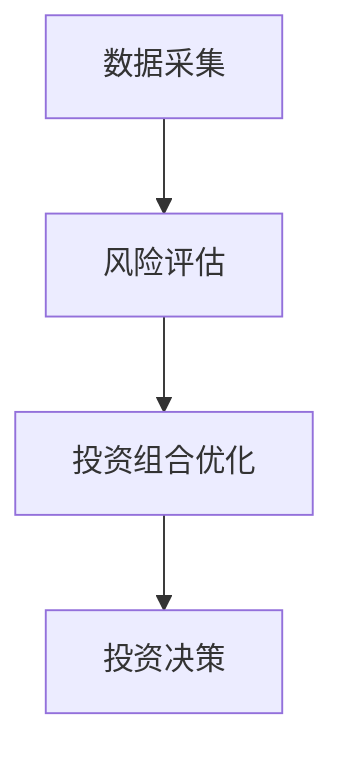

                 


# 气候变化风险在投资组合中的量化与管理

## 关键词：
- 气候变化
- 投资组合管理
- 风险量化
- 蒙特卡洛模拟
- 现代投资组合理论（MPT）
- 环境、社会和公司治理（ESG）

## 摘要：
气候变化作为全球性的挑战，不仅影响环境，也对金融市场和投资组合管理带来了深远的影响。本文将探讨如何量化气候变化风险，并将其整合到投资组合管理中，以优化投资决策和风险管理。通过分析气候变化的类型、量化方法、数学模型以及系统架构设计，本文提供了一种综合的解决方案，帮助投资者在气候变化背景下实现稳健的投资回报。

---

# 第一部分：气候变化风险的背景与基础

## 第1章：气候变化对金融投资的影响

### 1.1 气候变化的定义与特征

#### 1.1.1 气候变化的基本概念
气候变化是指地球气候系统的长期变化，包括温度、降水模式和极端天气事件的变化。这些变化对全球经济、资源分布和人类活动产生了深远影响。

#### 1.1.2 气候变化的长期趋势与周期性
气候变化的趋势是不可逆转的，其周期性变化可能导致极端天气事件的频率和强度增加，进而影响金融市场。

#### 1.1.3 气候变化对全球经济的潜在影响
气候变化可能引发资源短缺、自然灾害频发，进而影响企业盈利能力、资产价值和经济稳定性。

### 1.2 气候变化对金融市场的具体影响

#### 1.2.1 碳排放与金融市场的关联
碳排放是气候变化的主要驱动因素，企业高碳排放可能导致其资产贬值和负债增加，进而影响金融市场。

#### 1.2.2 气候变化对资产价格的影响
气候变化可能导致某些资产（如化石燃料资产）的价值下降，而绿色能源和可持续发展资产的价值可能上升。

#### 1.2.3 气候变化风险的分类与层次
- **物理风险**：由于气候变化引起的极端天气事件导致的资产损失。
- **转移风险**：由于政策变化或市场调整导致的资产价值转移。
- **诉讼风险**：因环境诉讼导致的财务损失。

### 1.3 投资组合管理的基本概念

#### 1.3.1 投资组合管理的定义与目标
投资组合管理是指通过优化资产配置，实现风险与收益的最佳平衡。其目标是最大化收益，同时最小化风险。

#### 1.3.2 投资组合的风险与收益平衡
投资组合管理的核心在于在不同资产之间分配资金，以平衡风险和收益。常用的风险指标包括波动率、VaR（在险价值）和CVaR（条件在险价值）。

#### 1.3.3 现代投资组合理论（MPT）的简介
MPT由Harry Markowitz提出，通过优化资产配置，构建有效投资组合，以最大化收益并最小化风险。

---

## 第2章：气候变化风险的量化方法

### 2.1 气候变化风险的定义与分类

#### 2.1.1 气候变化风险的定义
气候变化风险是由于气候变化导致的资产损失、收益下降或投资组合价值减少的可能性。

#### 2.1.2 气候变化风险的分类
- **物理风险**：资产因极端天气事件受损。
- **转型风险**：政策变化导致资产价值下降。
- **诉讼风险**：因环境责任导致的财务损失。

### 2.2 气候变化风险的量化指标

#### 2.2.1 温室气体排放的量化
温室气体排放量是衡量企业对气候变化影响的重要指标，通常以二氧化碳当量表示。

#### 2.2.2 气候敏感性指数
气候敏感性指数用于衡量资产对气候变化的敏感程度，帮助投资者识别高风险资产。

#### 2.2.3 碳足迹的计算方法
碳足迹是企业在整个生命周期中产生的温室气体排放总量，用于评估其对气候变化的影响。

### 2.3 气候变化风险的评估模型

#### 2.3.1 情景分析法
情景分析法通过构建不同气候变化情景，评估资产在不同情况下的表现。

#### 2.3.2 蒙特卡洛模拟
蒙特卡洛模拟通过随机抽样和概率分布，模拟气候变化对资产价格的影响，评估投资组合的风险。

#### 2.3.3 压力测试法
压力测试法用于评估投资组合在极端气候事件下的表现，帮助投资者制定应对策略。

---

# 第三部分：气候变化风险的系统架构与管理

## 第3章：系统架构与风险管理

### 3.1 系统架构设计

#### 3.1.1 气候变化风险管理系统模块化设计
- 数据采集模块：收集气候变化数据和资产信息。
- 风险评估模块：计算资产的气候变化风险。
- 投资组合优化模块：调整资产配置以降低风险。

#### 3.1.2 气候变化风险管理系统架构图


### 3.2 系统接口设计

#### 3.2.1 数据接口
- 数据接口用于与外部数据源（如气象数据、资产数据）交互。

#### 3.2.2 用户接口
- 用户可以通过界面输入参数，查看风险评估结果和优化建议。

### 3.3 系统交互流程

#### 3.3.1 数据采集与处理
- 从外部数据源获取气候变化数据和资产信息。

#### 3.3.2 风险评估
- 使用蒙特卡洛模拟或情景分析法评估资产风险。

#### 3.3.3 投资组合优化
- 根据风险评估结果，调整资产配置以优化投资组合。

---

## 第4章：项目实战与案例分析

### 4.1 项目环境配置

#### 4.1.1 系统环境
- 操作系统：Linux
- 开发工具：Python、Jupyter Notebook
- 数据库：MySQL

### 4.2 核心代码实现

#### 4.2.1 数据采集与预处理
```python
import pandas as pd
import numpy as np

# 数据预处理
def preprocess_data(data):
    data['日期'] = pd.to_datetime(data['日期'])
    data.set_index('日期', inplace=True)
    return data

data = pd.read_csv('climate_data.csv')
data = preprocess_data(data)
```

#### 4.2.2 气候变化风险评估
```python
import matplotlib.pyplot as plt

def plot_climate_events(data):
    plt.figure(figsize=(10, 6))
    plt.plot(data['温度'], label='实际温度')
    plt.plot(data['预期温度'], label='预期温度')
    plt.xlabel('年份')
    plt.ylabel('温度（°C）')
    plt.legend()
    plt.show()

plot_climate_events(data)
```

### 4.3 案例分析与结果解读

#### 4.3.1 案例分析
假设我们有一个投资组合，包含化石燃料企业和绿色能源企业。我们通过情景分析法评估它们在不同气候变化情景下的表现。

#### 4.3.2 结果解读
- 在极端气候情景下，化石燃料企业的资产价值大幅下降，而绿色能源企业的资产价值相对稳定。

---

## 第5章：总结与展望

### 5.1 最佳实践

#### 5.1.1 定期评估与调整
投资组合应定期评估气候变化风险，并根据最新数据进行调整。

#### 5.1.2 结合ESG因素
在投资决策中，应考虑环境、社会和公司治理（ESG）因素，以降低气候变化风险。

### 5.2 小结

气候变化风险是投资组合管理中不可忽视的重要因素。通过量化和管理气候变化风险，投资者可以优化资产配置，实现稳健的投资回报。

### 5.3 未来研究方向

- 动态风险评估模型的开发
- 气候变化风险管理与传统风险管理的结合

---

作者：AI天才研究院/AI Genius Institute & 禅与计算机程序设计艺术 /Zen And The Art of Computer Programming

