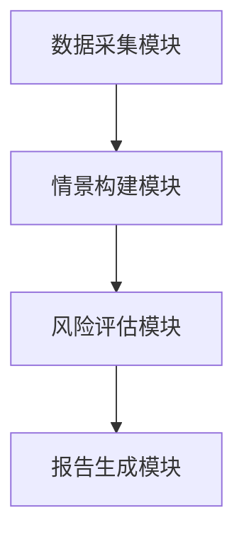

                 


# 《气候相关金融风险的量化与投资组合优化》

## 关键词：
- 气候风险
- 金融风险量化
- 投资组合优化
- 气候情景分析
- 系统架构设计

## 摘要：
本文系统地探讨了气候相关金融风险的量化方法及其在投资组合优化中的应用。首先，我们从气候风险的基本概念入手，分析其对金融系统的影响。接着，详细介绍了气候风险的量化模型，包括基于物理和情景的分析方法。然后，我们探讨了投资组合优化的传统与现代方法，并提出将气候风险因素纳入优化模型的具体策略。通过构建气候风险管理系统的架构设计，我们展示了如何在实际中应用这些方法。最后，结合具体案例，我们验证了这些方法的有效性，并展望了未来的优化方向。

---

# 第1章: 气候相关金融风险的背景与概述

## 1.1 气候相关金融风险的基本概念

### 1.1.1 气候变化对金融系统的影响
气候变化对全球经济和金融系统的影响日益显著。例如，极端天气事件（如洪水、干旱和飓风）可能导致资产损失、企业倒闭和金融市场的波动。投资者需要考虑这些气候相关风险对投资组合的影响。

### 1.1.2 什么是气候相关金融风险
气候相关金融风险是指由于气候变化或极端天气事件引发的金融风险。这些风险可能影响企业的盈利能力、资产价值和金融市场稳定性。气候风险可以分为物理风险（资产因气候变化受损）和转型风险（经济向低碳转型带来的市场变化）。

### 1.1.3 气候风险的分类与特征
气候风险可以分为以下几类：
- **物理风险**：资产因气候变化导致的直接损失。
- **转型风险**：经济向低碳转型带来的市场变化和政策调整。
- **监管风险**：政府政策的变化对企业的影响。

---

## 1.2 气候风险的背景与问题描述

### 1.2.1 气候变化的全球性挑战
气候变化是全球性的挑战，影响着全球的经济和金融体系。例如，2017年的飓风哈维导致美国墨西哥湾沿岸的石油和天然气设施受损，影响了全球能源市场。

### 1.2.2 金融系统中的气候风险问题
金融系统中的气候风险问题主要体现在以下方面：
- 金融机构的投资组合可能包含高碳资产，这些资产在低碳转型中可能面临贬值。
- 气候事件可能导致企业违约率上升，影响金融资产的质量。
- 气候变化可能影响金融市场的流动性和稳定性。

### 1.2.3 气候风险对投资组合的影响
气候风险可能导致投资组合的价值波动。例如，投资组合中包含高碳资产（如煤炭企业）可能因政策变化或市场需求下降而面临贬值风险。

---

## 1.3 气候风险的量化与管理

### 1.3.1 气候风险量化的目标
气候风险量化的目标是评估气候变化对金融资产的影响，并为投资决策提供支持。量化方法可以帮助投资者识别高风险资产，并调整投资组合以降低风险。

### 1.3.2 气候风险的度量方法
气候风险的度量方法包括情景分析和回归分析等。情景分析通过构建不同的气候情景，评估资产在不同情况下的表现。

### 1.3.3 气候风险管理的必要性
气候风险管理是金融机构维护投资组合稳定性的必要措施。通过量化气候风险，金融机构可以提前识别和规避潜在风险。

---

## 1.4 气候风险与投资组合优化的关系

### 1.4.1 投资组合优化的基本概念
投资组合优化是指通过调整资产配置，以实现收益最大化和风险最小化的过程。

### 1.4.2 气候风险对投资组合的影响
气候风险可能影响投资组合的收益和风险。例如，高碳资产可能在低碳转型中面临价值下降的风险。

### 1.4.3 气候相关投资组合优化的必要性
为了应对气候风险，投资者需要将气候因素纳入投资组合优化模型，以确保投资组合的长期稳定性。

---

## 1.5 本章小结
本章介绍了气候相关金融风险的基本概念、分类及其对金融系统的影响。我们还讨论了气候风险量化的重要性以及其与投资组合优化的关系。

---

# 第2章: 气候相关金融风险的量化方法

## 2.1 气候风险量化的核心概念

### 2.1.1 气候风险的度量指标
气候风险的度量指标包括损失概率、损失幅度和风险价值（VaR）等。

### 2.1.2 气候风险的评估模型
气候风险的评估模型包括基于物理的模型和基于情景的模型。

### 2.1.3 气候风险的场景分析
场景分析通过构建不同的气候情景，评估资产在不同情况下的表现。

---

## 2.2 气候风险的量化模型

### 2.2.1 基于物理的气候风险模型
基于物理的模型通过模拟气候变化对资产的物理影响，评估资产的损失风险。例如，通过气象数据和资产位置，评估资产在极端天气事件中的损失概率。

### 2.2.2 基于情景的气候风险模型
基于情景的模型通过构建不同的气候情景（如温升1.5°C、2°C等），评估资产在不同情景下的表现。

### 2.2.3 基于回归分析的气候风险模型
回归分析模型通过将气候变化指标（如温度、降水）与资产收益回归，评估气候因素对资产收益的影响。

---

## 2.3 气候风险的场景分析

### 2.3.1 气候情景的构建方法
气候情景的构建方法包括统计方法和物理模型方法。统计方法基于历史数据构建情景，物理模型方法基于气候变化模型构建情景。

### 2.3.2 气候情景的分类与选择
气候情景可以分为乐观、中性、悲观三种类型。选择情景时需要考虑资产的行业特性和地理位置。

### 2.3.3 气候情景对金融资产的影响
气候情景可能影响资产的收益、流动性和信用风险。

---

## 2.4 气候风险的敏感性分析

### 2.4.1 资产对气候风险的敏感性
资产对气候风险的敏感性取决于其行业特性和地理位置。例如，地理位置靠近飓风多发区的资产可能对气候风险更敏感。

### 2.4.2 气候风险对投资组合的影响
气候风险对投资组合的影响可以通过资产间的相关性进行评估。

### 2.4.3 气候风险的敏感性度量
气候风险的敏感性度量可以通过回归分析或情景分析进行。

---

## 2.5 本章小结
本章介绍了气候风险的量化方法，包括基于物理的模型、基于情景的模型和回归分析模型。我们还讨论了气候情景的构建方法及其对金融资产的影响。

---

## 2.6 问题解决与数学模型

### 2.6.1 气候风险量化模型的数学表达
基于回归分析的气候风险模型可以表示为：
$$
R_i = \beta_0 + \beta_1 C_i + \epsilon_i
$$
其中，$R_i$是资产$i$的收益，$C_i$是气候指标，$\beta_1$是气候因素对收益的影响系数。

### 2.6.2 气候情景分析的数学模型
气候情景分析可以通过蒙特卡洛模拟进行，模拟不同气候情景下的资产收益分布。

---

## 2.7 系统架构设计

### 2.7.1 气候风险管理系统的功能模块
气候风险管理系统的功能模块包括：
- 数据采集模块：收集气候数据和资产数据。
- 情景构建模块：构建不同气候情景。
- 风险评估模块：评估资产在不同情景下的风险。
- 报告生成模块：生成风险评估报告。

### 2.7.2 系统架构图


---

## 2.8 本章小结
本章详细介绍了气候风险的量化方法，并通过系统架构设计展示了如何在实际中应用这些方法。

---

# 第3章: 气候相关金融风险的投资组合优化

## 3.1 投资组合优化的理论基础

### 3.1.1 传统投资组合优化方法
传统方法包括均值-方差优化和风险收益优化。

### 3.1.2 现代投资组合优化方法
现代方法包括因子模型和风险管理模型。

### 3.1.3 气候风险因素的引入
气候风险因素需要在优化模型中进行考虑，以确保投资组合的长期稳定性。

---

## 3.2 气候相关投资组合优化模型

### 3.2.1 模型构建
气候相关投资组合优化模型可以表示为：
$$
\min_w \sum_{i=1}^n w_i^2 \sigma_i^2 + \lambda \sum_{i=1}^n w_i C_i
$$
其中，$w_i$是资产$i$的权重，$\sigma_i$是资产$i$的风险，$C_i$是气候风险指标，$\lambda$是惩罚系数。

### 3.2.2 模型实现
通过Python代码实现模型：
```python
import numpy as np
from scipy.optimize import minimize

def optimization_function(w, returns, climate_risk):
    objective = np.sum(w**2 * np.var(returns)) + lambda * np.sum(w * climate_risk)
    return objective

# 调用优化函数
result = minimize(optimize_function, initial_guess, method='SLSQP')
```

---

## 3.3 案例分析

### 3.3.1 数据准备
数据包括各资产的历史收益和气候风险指标。

### 3.3.2 模型应用
通过优化模型调整各资产的权重，以实现风险最小化。

### 3.3.3 结果分析
分析优化后的投资组合在不同气候情景下的表现。

---

## 3.4 本章小结
本章介绍了气候相关投资组合优化的理论和方法，并通过案例分析展示了如何在实际中应用这些方法。

---

# 第4章: 气候风险管理系统的系统架构设计

## 4.1 系统功能设计

### 4.1.1 数据采集模块
数据采集模块负责收集气候数据和资产数据。

### 4.1.2 情景构建模块
情景构建模块通过物理模型和统计方法构建不同气候情景。

### 4.1.3 风险评估模块
风险评估模块评估资产在不同情景下的风险。

### 4.1.4 报告生成模块
报告生成模块生成风险评估报告。

---

## 4.2 系统架构设计

### 4.2.1 系统架构图


### 4.2.2 数据接口设计
数据接口包括气候数据接口和资产数据接口。

### 4.2.3 系统交互设计
系统交互通过API进行，支持用户输入和输出。

---

## 4.3 系统实现

### 4.3.1 数据接口实现
通过Python的API实现数据接口。

### 4.3.2 系统交互实现
通过Flask框架实现系统交互。

---

## 4.4 本章小结
本章详细介绍了气候风险管理系统的系统架构设计，并展示了如何在实际中实现这些设计。

---

# 第5章: 气候相关金融风险量化与投资组合优化的算法实现

## 5.1 算法原理

### 5.1.1 气候风险量化算法
气候风险量化算法包括数据预处理、情景分析和风险评估。

### 5.1.2 投资组合优化算法
投资组合优化算法包括均值-方差优化和气候风险约束优化。

---

## 5.2 算法实现

### 5.2.1 数据预处理
数据预处理包括清洗和标准化。

### 5.2.2 情景分析
情景分析通过蒙特卡洛模拟进行。

### 5.2.3 投资组合优化
通过Python代码实现投资组合优化：
```python
import numpy as np
from scipy.optimize import minimize

def optimization_function(w, returns, climate_risk, lambda_val):
    objective = np.sum(w**2 * np.var(returns)) + lambda_val * np.sum(w * climate_risk)
    return objective

# 调用优化函数
result = minimize(optimize_function, initial_guess, method='SLSQP')
```

---

## 5.3 算法优化

### 5.3.1 参数优化
参数优化包括调整惩罚系数和情景选择。

### 5.3.2 算法优化
算法优化包括使用更高效的优化方法，如遗传算法。

---

## 5.4 本章小结
本章详细介绍了气候相关金融风险量化与投资组合优化的算法实现，并展示了如何在实际中优化这些算法。

---

# 第6章: 气候相关金融风险量化与投资组合优化的实战案例

## 6.1 案例背景

### 6.1.1 案例目标
案例目标是通过优化模型调整投资组合，以降低气候风险。

### 6.1.2 数据来源
数据来源包括历史气候数据和资产收益数据。

---

## 6.2 案例分析

### 6.2.1 数据准备
数据准备包括清洗和标准化。

### 6.2.2 模型应用
通过优化模型调整各资产的权重。

### 6.2.3 结果分析
分析优化后的投资组合在不同气候情景下的表现。

---

## 6.3 案例总结

### 6.3.1 案例成果
案例成果展示了优化模型的有效性。

### 6.3.2 案例启示
案例启示指出气候风险管理的重要性。

---

## 6.4 本章小结
本章通过实战案例展示了气候相关金融风险量化与投资组合优化的应用。

---

# 第7章: 总结与展望

## 7.1 全文总结

### 7.1.1 气候风险量化的重要性
气候风险量化是应对气候变化挑战的关键。

### 7.1.2 投资组合优化的必要性
投资组合优化是降低气候风险的重要手段。

---

## 7.2 未来展望

### 7.2.1 气候风险量化方法的改进
未来需要进一步改进气候风险量化方法，如引入更多气候指标。

### 7.2.2 投资组合优化的创新
投资组合优化需要引入更多创新方法，如机器学习。

### 7.2.3 气候风险管理系统的完善
气候风险管理系统需要进一步完善，如增加实时监控功能。

---

## 7.3 作者建议

### 7.3.1 对投资者的建议
投资者应积极关注气候风险，并将其纳入投资决策。

### 7.3.2 对金融机构的建议
金融机构应加强气候风险管理能力，如引入气候风险量化工具。

---

## 7.4 本章小结
本章总结了全文内容，并展望了未来的研究方向。

---

# 作者：AI天才研究院/AI Genius Institute & 禅与计算机程序设计艺术 /Zen And The Art of Computer Programming

