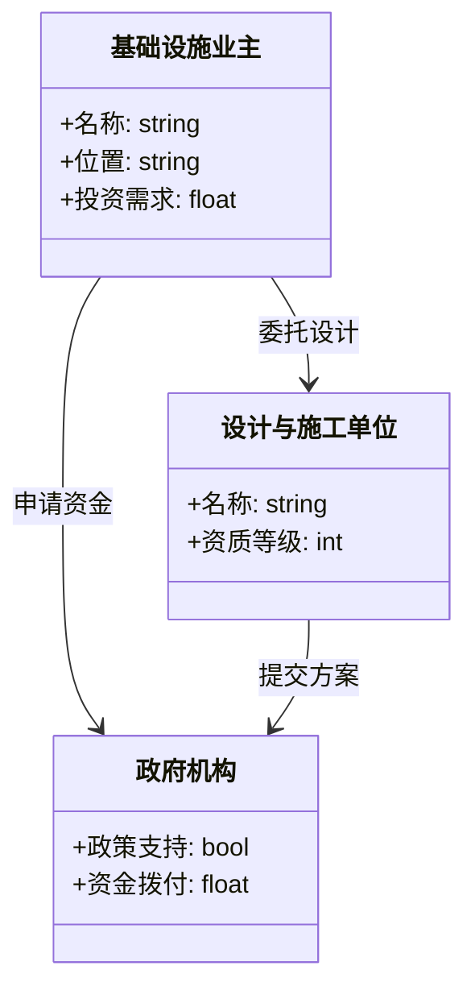

                 


# 气候适应性基础设施的投资需求与机遇

## 关键词：气候适应性基础设施, 投资需求, 可持续发展, 气候变化, 基础设施优化, 绿色投资

## 摘要：  
本文探讨了在气候变化加剧的背景下，气候适应性基础设施的投资需求与机遇。文章首先介绍了气候适应性基础设施的定义、核心概念及其在应对气候变化中的重要性。接着，分析了气候适应性基础设施的投资需求，包括气候变化的影响、政策推动、技术进步和市场趋势。随后，详细探讨了气候适应性基础设施的系统分析与架构设计，包括项目可行性分析、投资策略制定和风险管理。最后，通过实际案例分析，展示了气候适应性基础设施在不同地区的投资实践与成功经验，为投资者提供了有益的参考与启示。

---

## 第一部分: 气候适应性基础设施的背景与核心概念

### 第1章: 气候适应性基础设施的定义与背景

#### 1.1 气候适应性基础设施的定义  
- 1.1.1 基础设施的定义与分类  
- 1.1.2 气候适应性基础设施的核心特征  
- 1.1.3 气候适应性基础设施的背景与重要性  

#### 1.2 气候变化对基础设施的影响  
- 1.2.1 气候变化的全球趋势  
- 1.2.2 气候变化对基础设施的具体影响  
- 1.2.3 基础设施在应对气候变化中的作用  

#### 1.3 气候适应性基础设施的全球发展现状  
- 1.3.1 发达国家的气候适应性基础设施建设  
- 1.3.2 发展中国家的气候适应性基础设施挑战  
- 1.3.3 全球气候适应性基础设施投资趋势  

### 第2章: 气候适应性基础设施的核心概念与联系

#### 2.1 气候适应性基础设施的核心要素  
- 2.1.1 基础设施的功能属性  
- 2.1.2 气候适应性基础设施的系统性特征  
- 2.1.3 基础设施与气候变化的相互作用  

#### 2.2 气候适应性基础设施与可持续发展的关系  
- 2.2.1 可持续发展与基础设施的关系  
- 2.2.2 气候适应性基础设施在可持续发展中的地位  
- 2.2.3 气候适应性基础设施对经济、社会和环境的综合影响  

#### 2.3 气候适应性基础设施的ER实体关系图  
```mermaid
er
actor: 投资者
actor: 政府机构
actor: 基础设施业主
actor: 设计与施工单位
actor: 运营与维护单位
```

---

## 第二部分: 气候适应性基础设施的投资需求与分析

### 第3章: 气候适应性基础设施的投资需求分析

#### 3.1 气候适应性基础设施的投资需求驱动因素  
- 3.1.1 气候变化的加剧对基础设施的需求  
- 3.1.2 政策推动与资金支持  
- 3.1.3 技术进步与创新  

#### 3.2 气候适应性基础设施的投资模式与回报分析  
- 3.2.1 公私合作（PPP）模式的应用  
- 3.2.2 投资者的回报机制与风险分担  

#### 3.3 气候适应性基础设施的区域投资机会  
- 3.3.1 发达国家的气候适应性基础设施投资现状  
- 3.3.2 发展中国家的投资潜力与挑战  
- 3.3.3 城市 vs 乡村：投资机会的差异  

### 第4章: 气候适应性基础设施的投资风险与管理

#### 4.1 气候适应性基础设施的主要风险  
- 4.1.1 气候风险的不确定性  
- 4.1.2 项目实施中的技术风险  
- 4.1.3 财务风险与资金链断裂  

#### 4.2 气候适应性基础设施的风险管理策略  
- 4.2.1 风险评估与预警机制  
- 4.2.2 投资组合的多样化与分散化  
- 4.2.3 政策与法规的应对策略  

---

## 第三部分: 气候适应性基础设施的系统分析与架构设计

### 第5章: 气候适应性基础设施的系统分析

#### 5.1 气候适应性基础设施的系统架构设计  
- 5.1.1 系统功能模块划分  
- 5.1.2 系统架构的层级与交互  

#### 5.2 气候适应性基础设施的领域模型设计  


#### 5.3 气候适应性基础设施的系统接口设计  
- 5.3.1 系统接口的标准化与统一性  
- 5.3.2 接口的可扩展性与灵活性  

---

## 第四部分: 气候适应性基础设施的项目实战与案例分析

### 第6章: 气候适应性基础设施的项目实战

#### 6.1 气候适应性基础设施的案例分析  
- 6.1.1 海绵城市建设项目：德国汉堡案例  
- 6.1.2 绿色交通网络：新加坡经验  
- 6.1.3 智慧能源系统：中国试点城市  

#### 6.2 气候适应性基础设施的项目实施过程  
- 6.2.1 项目需求分析与规划  
- 6.2.2 项目设计与施工管理  
- 6.2.3 项目运营与维护  

#### 6.3 气候适应性基础设施的项目小结  
- 6.3.1 项目成功的关键因素  
- 6.3.2 项目失败的教训与反思  

---

## 第五部分: 气候适应性基础设施的未来展望与投资建议

### 第7章: 气候适应性基础设施的未来展望

#### 7.1 气候适应性基础设施的技术发展趋势  
- 7.1.1 数字化与智能化技术的应用  
- 7.1.2 可再生能源与低碳技术的融合  

#### 7.2 气候适应性基础设施的全球投资趋势  
- 7.2.1 绿色金融的兴起与发展趋势  
- 7.2.2 全球气候适应性基础设施投资预测  

### 第8章: 投资者与政策制定者的最佳实践

#### 8.1 投资者的最佳实践  
- 8.1.1 理性评估与长期视角  
- 8.1.2 多元化投资与风险管理  

#### 8.2 政策制定者的最佳实践  
- 8.2.1 政策支持与激励机制  
- 8.2.2 公私合作模式的优化  

---

## 作者：AI天才研究院/AI Genius Institute & 禅与计算机程序设计艺术 /Zen And The Art of Computer Programming

