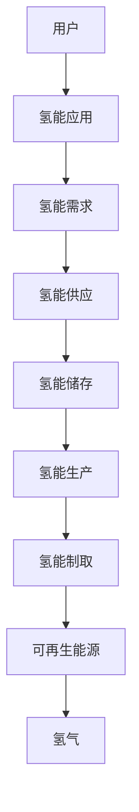

                 

---

# 氢能源经济的发展前景与投资策略

> 关键词：氢能源经济，氢能产业链，可再生能源，能源转型，投资策略

> 摘要：本文系统分析了氢能源经济的核心概念、技术路线与发展前景，并结合全球能源转型的背景，深入探讨了氢能源的投资策略与风险评估。通过分析氢能的制备、储存、运输和应用等关键环节，本文为投资者提供了科学的投资建议和决策支持。

---

## 第1章: 氢能源经济的定义与背景

### 1.1 氢能源的基本概念

#### 1.1.1 什么是氢能源
氢能是一种通过氢气（H₂）燃烧或反应释放的能量。它是自然界中存在的一种清洁能源，可以通过多种方式制取，并广泛应用于能源、交通和工业领域。

氢能的优势包括：
1. 高能量密度：氢气的热值高达142 MJ/kg，是汽油的3倍。
2. 零碳排放：氢气燃烧只生成水和热，无碳排放。
3. 可再生性：氢气可以通过可再生能源制取，实现清洁能源的循环利用。

氢能的局限性包括：
1. 制取成本高：目前制氢过程能耗较高，成本居高不下。
2. 储存难度大：氢气需要高压或低温储存，技术门槛高。
3. 运输成本高：氢气的运输需要特殊的设备和管道。

#### 1.1.2 氢能的优势与局限性

氢能在能源转型中的角色：
1. 替代化石能源：氢气可以替代煤炭、石油等化石燃料，减少碳排放。
2. 支持可再生能源：氢气可以作为储能媒介，帮助可再生能源的储存和调配。

氢能的局限性：
1. 制取成本高：目前主要的制氢方法（如化石燃料制氢）依赖化石能源，成本较高且碳排放大。
2. 储存和运输技术不成熟：氢气的储存和运输需要高温高压或低温高压，技术难度大且成本高。

#### 1.1.3 氢能与可再生能源的关系

氢能是可再生能源的重要补充。由于可再生能源（如风能、太阳能）具有间歇性，氢气可以作为储能媒介，将多余的可再生能源转化为氢气储存起来，从而实现能源的稳定供应。

### 1.2 氢能源经济的发展背景

#### 1.2.1 全球能源转型的背景

全球能源转型的背景：
1. 环境问题日益严重：气候变化、空气污染等问题促使全球向清洁能源转型。
2. 可再生能源快速发展：风能、太阳能等可再生能源的快速发展，需要新的储能和调配技术。
3. 能源需求增长：随着经济的发展，全球能源需求持续增长，需要寻找新的能源供给方式。

#### 1.2.2 气候变化与能源可持续发展的需求

气候变化是全球关注的焦点。氢能在减少碳排放方面具有重要作用，特别是在交通、工业等领域。通过推广氢能，可以减少化石燃料的使用，从而降低碳排放，缓解气候变化。

#### 1.2.3 国家政策与产业支持

全球各国纷纷制定政策支持氢能源的发展。例如，欧盟提出了“氢计划”，计划到2030年建设40座氢能工厂；中国也将氢能源列为“十四五”规划的重点发展方向。

### 1.3 氢能经济的核心概念

#### 1.3.1 氢能产业链的构成

氢能产业链包括制氢、储氢、运氢、用氢四个环节。

制氢环节：通过电解水、化石燃料制氢等方式制取氢气。
储氢环节：通过高压气瓶、低温液化等方式储存氢气。
运氢环节：通过管道、罐装等方式运输氢气。
用氢环节：将氢气用于交通、工业、建筑等领域。

#### 1.3.2 氢能经济的驱动因素

氢能经济的驱动因素包括：
1. 政策支持：各国政府通过政策支持氢能源的发展。
2. 技术进步：制氢、储氢、运氢技术的不断进步降低了成本。
3. 市场需求：氢能在交通、工业等领域的广泛应用推动了市场需求。

#### 1.3.3 氢能经济的边界与外延

氢能经济的边界是氢气的制取、储存、运输和应用。其外延包括与可再生能源的结合、与其他清洁能源的互补等。

---

## 第2章: 氢能经济的核心概念与联系

### 2.1 氢能经济的核心原理

#### 2.1.1 氢能的生产与储存

氢能的生产可以通过电解水、化石燃料制氢等方式实现。其中，电解水制氢是一种绿色制氢方式，但成本较高；化石燃料制氢成本较低，但碳排放大。

氢能的储存可以通过高压气瓶、低温液化等方式实现。其中，高压气瓶储存成本低，但储存容量有限；低温液化储存容量大，但成本高且技术难度大。

#### 2.1.2 氢能的运输与分配

氢气的运输可以通过管道、罐装等方式实现。管道运输成本低，但需要大量初期投资；罐装运输灵活，但成本高。

#### 2.1.3 氢能的消费与应用

氢能在交通领域主要用于燃料电池汽车；在工业领域用于炼钢、化工生产；在建筑领域用于热电联产。

### 2.2 氢能经济的关键属性对比

#### 2.2.1 不同能源形式的对比分析

| 能源形式 | 优点 | 缺点 |
|--------|------|------|
| 油气 | 能量密度高，技术成熟 | 碳排放高，不可再生 |
| 太阳能 | 清洁能源，储量丰富 | 间歇性，储存困难 |
| 风能 | 清洁能源，储量丰富 | 间歇性，储存困难 |
| 氢能 | 零碳排放，能量密度高 | 制取成本高，储存困难 |

#### 2.2.2 氢能与其他可再生能源的对比

| 比较维度 | 氢能 | 风能 | 太阳能 |
|--------|------|------|--------|
| 能量密度 | 高 | 低 | 中 |
| 储存方式 | 气态/液态 | 电池 | 电池 |
| 可持续性 | 高 | 中 | 中 |

#### 2.2.3 氢能经济的成本结构分析

氢能经济的成本结构包括制氢成本、储存成本、运输成本和应用成本。其中，制氢成本占比较大，而储存和运输成本也较高。

### 2.3 氢能经济的实体关系图

---

## 第3章: 氢能经济的技术路线分析

### 3.1 氢能的制备技术

#### 3.1.1 电解水制氢技术

电解水制氢是一种绿色制氢方式，通过电解水生成氢气和氧气。其优点是零碳排放，缺点是成本高。

数学模型：
$$ I = \frac{2nF}{A} $$
其中，I为电流，n为电子数，F为法拉第常数，A为电极面积。

#### 3.1.2 石油化工制氢技术

石油化工制氢通过高温高压下的化学反应制取氢气。其优点是成本低，缺点是碳排放高。

数学模型：
$$ \text{反应式：} CH_4 + H_2O \rightarrow CO + 3H_2 $$

#### 3.1.3 其他制氢技术对比

| 技术 | 优点 | 缺点 |
|------|------|------|
| 电解水制氢 | 零碳排放 | 成本高 |
| 石油化工制氢 | 成本低 | 碳排放高 |
| 焦炭气化制氢 | 成本中等 | 碳排放较高 |

### 3.2 氢能的储存与运输技术

#### 3.2.1 气态储氢技术

气态储氢是通过高压气瓶储存氢气。其优点是成本低，缺点是储存容量有限。

数学模型：
$$ P = \frac{nRT}{V} $$
其中，P为压力，n为气体物质的量，R为气体常数，T为温度，V为体积。

#### 3.2.2 液态储氢技术

液态储氢是通过低温液化储存氢气。其优点是储存容量大，缺点是成本高且技术难度大。

数学模型：
$$ V = \frac{nRT}{P} $$
其中，V为体积，n为气体物质的量，R为气体常数，T为温度，P为压力。

#### 3.2.3 固态储氢技术

固态储氢是通过金属氢化物等材料储存氢气。其优点是储存安全，缺点是成本较高。

数学模型：
$$ M = \frac{m}{M} $$
其中，M为摩尔质量，m为质量。

### 3.3 氢能的应用场景

#### 3.3.1 氢能在交通领域的应用

氢能在交通领域的应用主要是燃料电池汽车。其优点是零排放，缺点是加氢站数量少，成本高。

#### 3.3.2 氢能在工业领域的应用

氢能在工业领域的应用主要是炼钢、化工生产等。其优点是能减少碳排放，缺点是制氢成本高。

#### 3.3.3 氢能在建筑领域的应用

氢能在建筑领域的应用主要是热电联产。其优点是能提高能源利用效率，缺点是技术难度大。

---

## 第4章: 氢能经济的投资策略

### 4.1 氢能市场的现状与趋势

#### 4.1.1 全球氢能市场的现状

全球氢能市场目前处于快速发展阶段。根据统计，2022年全球氢能市场规模约为1,000亿美元，其中工业用氢占60%，交通用氢占20%，建筑用氢占20%。

#### 4.1.2 中国氢能市场的潜力

中国是全球最大的氢能市场，预计到2030年，中国氢能市场规模将达到5,000亿美元。中国政府提出了“氢进万家”计划，计划在2025年建设100座加氢站。

#### 4.1.3 区域性氢能市场的差异

欧洲、亚洲和美洲的氢能市场差异较大。欧洲注重绿色制氢，亚洲注重工业用氢，美洲注重交通用氢。

### 4.2 氢能经济的投资机会

#### 4.2.1 氢能产业链的投资热点

氢能产业链的投资热点包括制氢技术、储氢技术、加氢站建设和燃料电池研发。

#### 4.2.2 氢能技术的研发投资

氢能技术的研发投资包括电解水技术、储氢材料、燃料电池技术等。

#### 4.2.3 氢能基础设施的投资价值

氢能基础设施的投资价值包括加氢站、输氢管网等。

### 4.3 氢能经济的投资风险与应对

#### 4.3.1 技术风险与应对策略

技术风险包括制氢技术不成熟、储氢技术不稳定等。应对策略包括加强技术研发、引进国际先进技术等。

#### 4.3.2 市场风险与应对策略

市场风险包括市场需求不足、价格波动大等。应对策略包括加强市场调研、制定合理的市场进入策略等。

#### 4.3.3 政策风险与应对策略

政策风险包括政策变化、补贴减少等。应对策略包括密切关注政策变化、积极参与政策制定等。

---

## 第5章: 氢能经济的系统分析与架构设计

### 5.1 氢能经济的系统架构

#### 5.1.1 氢能经济的系统组成

氢能经济的系统组成包括制氢系统、储氢系统、运氢系统和用氢系统。

#### 5.1.2 系统功能模块设计

系统功能模块设计包括制氢模块、储氢模块、运氢模块和用氢模块。

#### 5.1.3 系统架构的优缺点分析

系统架构的优点是模块化、可扩展；缺点是系统复杂、成本较高。

### 5.2 氢能经济的系统功能设计

#### 5.2.1 氢能生产模块的功能设计

氢能生产模块的功能包括制氢、检测和控制。

#### 5.2.2 氢能储存模块的功能设计

氢能储存模块的功能包括储氢、检测和控制。

#### 5.2.3 氢能应用模块的功能设计

氢能应用模块的功能包括供能、检测和控制。

### 5.3 氢能经济的系统接口设计

#### 5.3.1 系统接口设计

系统接口设计包括制氢模块与储氢模块的接口、储氢模块与运氢模块的接口、运氢模块与用氢模块的接口。

#### 5.3.2 系统交互设计

系统交互设计包括用户与系统的交互、系统各模块之间的交互。

---

## 第6章: 氢能经济的项目实战

### 6.1 项目背景与目标

#### 6.1.1 项目背景

本项目旨在通过氢能在交通领域的应用，减少碳排放，推动能源转型。

#### 6.1.2 项目目标

项目目标包括建设加氢站、推广燃料电池汽车、建立氢能产业链。

### 6.2 项目实施与优化

#### 6.2.1 项目实施步骤

项目实施步骤包括：
1. 确定项目目标
2. 制定项目计划
3. 实施项目
4. 监控项目
5. 项目总结

#### 6.2.2 项目优化

项目优化包括技术优化、成本优化、管理优化。

### 6.3 项目总结与展望

#### 6.3.1 项目总结

本项目成功实现了氢能在交通领域的应用，减少了碳排放，推动了能源转型。

#### 6.3.2 项目展望

未来，氢能经济将在交通、工业、建筑等领域得到广泛应用，成为清洁能源的重要组成部分。

---

## 作者

作者：AI天才研究院/AI Genius Institute & 禅与计算机程序设计艺术 /Zen And The Art of Computer Programming

