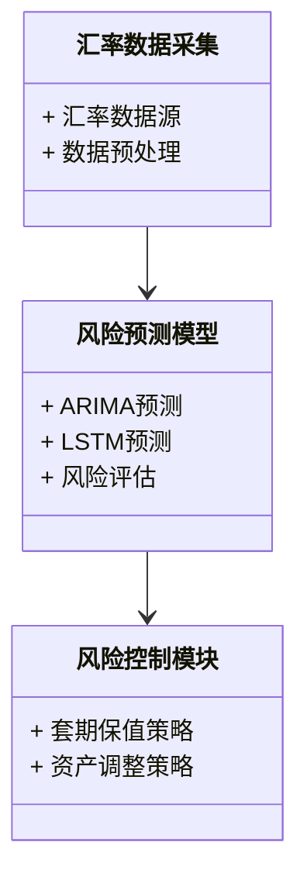

                 


```markdown
# 汇率波动风险管理策略

> 关键词：汇率波动、风险管理、预测模型、VaR、机器学习

> 摘要：本文系统地探讨了汇率波动风险管理的核心策略，从基础概念到高级算法，从系统设计到实际案例，全面分析了如何有效管理和控制汇率波动带来的风险。文章结合理论与实践，提供了详细的数学模型和系统架构设计，帮助读者深入了解汇率波动风险管理的精髓。

---

## 第1章: 汇率波动与风险管理基础

### 1.1 汇率波动的定义与特征

#### 1.1.1 汇率的基本概念
汇率是两种货币之间的兑换比率，通常以本币换外币的价格表示。例如，USD/CNY 表示1美元可以兑换多少人民币。

#### 1.1.2 汇率波动的特征
- **波动性**：汇率受多种因素影响，如经济数据、政治事件、市场情绪等，导致汇率上下波动。
- **非线性**：汇率波动往往呈现非线性特征，尤其是在市场剧烈波动时。
- **周期性**：汇率波动具有一定的周期性，周期长度和幅度因市场环境而异。

#### 1.1.3 汇率波动的分类
汇率波动可以分为短期波动和长期趋势。短期波动通常由市场情绪和突发事件引起，而长期趋势则由经济基本面决定。

### 1.2 汇率波动对经济的影响

#### 1.2.1 对国际贸易的影响
汇率波动直接影响出口商品的竞争力。当本币贬值时，出口商品价格下降，竞争力增强；反之，本币升值会削弱出口竞争力。

#### 1.2.2 对投资的影响
汇率波动影响外商直接投资和跨境资本流动。汇率的不确定性可能导致投资者延迟或减少投资。

#### 1.2.3 对企业财务的影响
汇率波动直接影响企业的财务报表。以外币计价的资产和负债会因汇率波动而产生汇兑损益，影响企业利润。

### 1.3 汇率风险管理的重要性

#### 1.3.1 企业汇率风险管理的需求
企业在跨国经营中面临汇率波动风险，尤其是涉及大量外币交易的企业，需要采取措施对冲风险。

#### 1.3.2 汇率风险管理的目标
- **降低风险敞口**：通过套期保值等手段，减少汇率波动对企业财务的负面影响。
- **锁定成本**：确保未来交易的汇率稳定，避免成本波动。
- **优化资本结构**：通过合理管理汇率风险，优化企业的资本结构和财务健康。

#### 1.3.3 汇率风险管理的边界与外延
汇率风险管理的边界在于企业自身的风险承受能力和管理目标。外延则包括与汇率相关的金融工具、市场环境和政策变化。

### 1.4 汇率波动风险管理的核心要素

#### 1.4.1 汇率波动预测
准确的汇率预测是风险管理的前提。常用方法包括时间序列分析和机器学习模型。

#### 1.4.2 风险评估
通过量化分析评估潜在损失，常用的指标包括VaR（Value at Risk）和CVaR（Conditional Value at Risk）。

#### 1.4.3 风险控制策略
包括套期保值、调整资产负债结构和选择合适的金融工具等策略。

---

## 第2章: 汇率波动风险管理的核心概念与联系

### 2.1 汇率波动预测模型

#### 2.1.1 时间序列分析模型
时间序列模型是汇率预测的传统方法，主要包括ARIMA（自回归积分滑动平均模型）和GARCH（广义自回归条件异方差模型）。

##### ARIMA模型
ARIMA模型适用于具有趋势和季节性的数据。其基本结构如下：
$$ ARIMA(p, d, q) $$
其中，p为自回归阶数，d为差分阶数，q为移动平均阶数。

##### GARCH模型
GARCH模型用于捕捉金融时间序列的波动性特征，常用于预测汇率波动的异方差性：
$$ GARCH(p, q) $$
其中，p为自回归阶数，q为移动平均阶数。

#### 2.1.2 机器学习模型
机器学习在汇率预测中表现出色，常用算法包括随机森林、支持向量机和神经网络。

##### 随机森林
随机森林通过构建多个决策树并进行投票或平均，提高预测的准确性和稳定性。

##### 神经网络
神经网络模型（如LSTM）能够捕捉时间序列中的非线性特征，适合处理复杂的汇率波动。

#### 2.1.3 统计套利模型
统计套利模型基于价格均值回归的假设，寻找短期价格偏离均值的交易机会。

### 2.2 风险评估与控制策略

#### 2.2.1 VaR模型
VaR（Value at Risk）是衡量金融风险的常用指标，表示在一定置信水平下可能的最大损失。

#### 2.2.2 CVaR模型
CVaR（Conditional Value at Risk）是VaR的扩展，衡量在VaR水平下的平均损失。

#### 2.2.3 波动率模型
波动率模型用于量化资产价格的波动程度，常用GARCH类模型估计。

### 2.3 汇率风险管理的核心要素对比

#### 2.3.1 汇率预测模型的对比
| 模型类型 | 优点 | 缺点 |
|---------|------|------|
| ARIMA   | 简单易用 | 无法捕捉非线性特征 |
| LSTM    | 捕捉复杂模式 | 训练时间较长 |
| 随机森林 | 鲁棒性强 | 解释性差 |

#### 2.3.2 风险评估方法的对比
| 方法 | 优点 | 缺点 |
|------|------|------|
| VaR   | 易于理解 | 忽略尾部风险 |
| CVaR  | 考虑尾部风险 | 计算复杂 |

#### 2.3.3 风险控制策略的对比
| 策略 | 优点 | 缺点 |
|------|------|------|
| 套期保值 | 确保汇率稳定 | 成本较高 |
| 调整资产负债 | 优化资本结构 | 需要时间和资源 |
| 选择金融工具 | 灵活性高 | 需要专业知识 |

### 2.4 汇率风险管理的ER实体关系图

```mermaid
er
    actor 汇率风险管理系统
    actor 汇率数据源
    actor 风险评估

    汇率风险管理系统 --> 汇率数据源: 获取数据
    汇率风险管理系统 --> 风险评估: 评估风险
    风险评估 --> 汇率数据源: 分析数据
```

---

## 第3章: 汇率波动预测的算法原理

### 3.1 时间序列分析模型

#### 3.1.1 ARIMA模型的数学公式
$$ ARIMA(p, d, q) $$
其中，p为自回归阶数，d为差分阶数，q为移动平均阶数。

#### 3.1.2 GARCH模型的数学公式
$$ GARCH(p, q) $$
其中，p为自回归阶数，q为移动平均阶数。

### 3.2 机器学习模型

#### 3.2.1 随机森林的实现
```python
from sklearn.ensemble import RandomForestRegressor
model = RandomForestRegressor(n_estimators=100, random_state=42)
model.fit(X_train, y_train)
```

#### 3.2.2 神经网络模型的实现
```python
from keras.models import Sequential
from keras.layers import LSTM, Dense
model = Sequential()
model.add(LSTM(64, input_shape=(timesteps, features)))
model.add(Dense(1))
model.compile(optimizer='adam', loss='mean_squared_error')
```

### 3.3 统计套利模型

#### 3.3.1 均值回归策略
通过计算汇率与历史均值的偏离程度，寻找回归机会。

#### 3.3.2 马科维茨均值-方差模型
用于优化投资组合的风险和收益。

---

## 第4章: 系统分析与架构设计

### 4.1 项目介绍
本项目旨在构建一个基于机器学习的汇率波动风险管理系统，帮助企业在复杂的汇率环境中有效管理风险。

### 4.2 系统功能设计


### 4.3 系统架构设计


### 4.4 系统接口设计
API接口用于数据采集、模型调用和风险控制。

---

## 第5章: 项目实战

### 5.1 环境安装
需要安装Python、TensorFlow、Keras和Scikit-learn等库。

### 5.2 核心实现

#### 5.2.1 数据预处理
```python
import pandas as pd
data = pd.read_csv('exchange_rate.csv')
data = data[['USD/CNY', 'EUR/USD']]
```

#### 5.2.2 模型实现
```python
from keras.models import Sequential
from keras.layers import LSTM, Dense
model = Sequential()
model.add(LSTM(64, input_shape=(timesteps, features)))
model.add(Dense(1))
model.compile(optimizer='adam', loss='mean_squared_error')
```

#### 5.2.3 结果分析
通过回测和分析模型预测结果，评估模型的有效性。

---

## 第6章: 最佳实践与小结

### 6.1 小结
本文系统地介绍了汇率波动风险管理的核心策略，从理论到实践，全面分析了如何有效管理汇率风险。

### 6.2 注意事项
在实际应用中，需注意模型的实时性和可解释性，避免过度依赖单一模型。

### 6.3 拓展阅读
建议读者进一步学习时间序列分析和机器学习在金融中的应用。

---

## 作者：AI天才研究院/AI Genius Institute & 禅与计算机程序设计艺术 /Zen And The Art of Computer Programming
```

