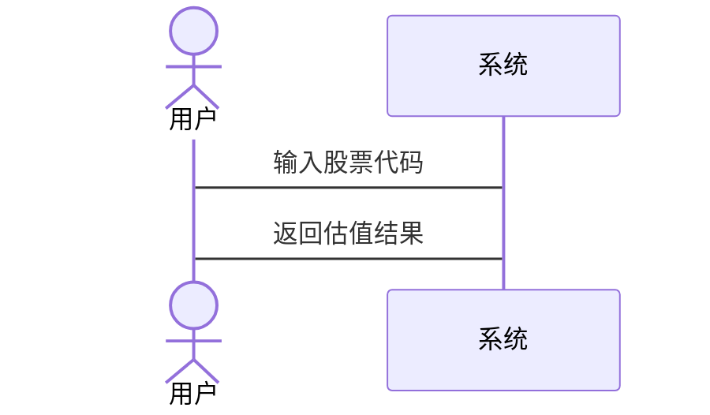

                 


# 沃伦·巴菲特对市场估值指标的看法

## 关键词：沃伦·巴菲特，市场估值，投资指标，ROE，ROA，EPS

## 摘要：本文深入探讨了沃伦·巴菲特对市场估值指标的看法，分析了他偏好的关键指标及其背后的逻辑，结合实际案例和数学模型，揭示了如何利用这些指标进行有效的投资决策。

---

## 第1章：巴菲特投资理念概述

### 1.1 巴菲特投资理念的核心思想

#### 1.1.1 价值投资的定义与特点

价值投资是一种投资策略，强调以低于内在价值的价格购买优质资产。巴菲特是这一理念的代表人物，他相信市场波动为投资者提供了以合理价格买入的机会。

#### 1.1.2 巴菲特的价值投资体系

巴菲特的价值投资体系包括以下几个关键要素：
1. **安全边际**：买入价格低于内在价值，以减少风险。
2. **长期视角**：关注企业的长期盈利能力，而非短期市场波动。
3. **竞争优势**：投资于具有持续竞争优势的企业。

#### 1.1.3 巴菲特投资理念的演变

从早期的烟丝理论到后来的软饮料理论，巴菲特的投资理念逐步从寻找便宜的资产转向投资于具有强大竞争优势的企业。

---

### 1.2 市场估值的重要性

#### 1.2.1 市场估值的基本概念

市场估值是通过对公司财务指标的分析，评估其股票的合理价格范围。常用的指标包括市盈率（P/E）、市净率（P/B）等。

#### 1.2.2 市场估值与投资决策的关系

准确的市场估值帮助投资者识别被低估或高估的股票，从而做出明智的投资决策。

#### 1.2.3 巴菲特对市场估值的独特见解

巴菲特强调内在价值的重要性，认为市场价格波动不影响企业的实际价值。

---

### 1.3 巴菲特投资理念的实践案例

#### 1.3.1 巴菲特的经典投资案例分析

以可口可乐为例，巴菲特长期持有该股票，因为其具备强大的竞争优势和稳定的盈利能力。

#### 1.3.2 巴菲特投资决策中的估值指标

巴菲特偏好使用ROE、ROA等指标来评估企业的盈利能力。

#### 1.3.3 巴菲特对市场的长期看法

巴菲特认为市场在长期内是理性的，但短期内可能被情绪左右。

---

## 第2章：巴菲特市场估值的核心指标

### 2.1 常见市场估值指标

#### 2.1.1 市盈率（P/E）

市盈率 = 股价 / 每股收益（EPS）

#### 2.1.2 市净率（P/B）

市净率 = 股价 / 每股净资产

#### 2.1.3 股息率

股息率 = 每股股息 / 股价

#### 2.1.4 市销率（P/S）

市销率 = 股价 / 每股销售额

### 2.2 巴菲特偏好的估值指标

#### 2.2.1 净值收益率（ROE）

ROE = 净利润 / 股东权益

#### 2.2.2 资产收益率（ROA）

ROA = 净利润 / 总资产

#### 2.2.3 每股收益（EPS）

EPS = 净利润 / 总股本

### 2.3 巴菲特估值指标的对比分析

#### 2.3.1 不同估值指标的优缺点

| 指标 | 优点 | 缺点 |
|------|------|------|
| ROE | 衡量股东权益的效率 | 受杠杆影响较大 |
| ROA | 衡量资产使用效率 | 忽略了负债成本 |
| EPS | 反映公司盈利能力 | 受会计政策影响 |

#### 2.3.2 巴菲特对估值指标的权重分配

巴菲特更重视ROE和ROA，因为它们更能反映企业的盈利能力。

#### 2.3.3 估值指标的动态变化

市场波动会影响估值指标的表现，投资者需要动态调整。

---

## 第3章：巴菲特估值体系的数学模型与公式

### 3.1 巴菲特估值体系的核心公式

#### 3.1.1 内在价值公式

$$ \text{内在价值} = \frac{\text{每股收益} \times (1 + g)}{r - g} $$

其中，g为增长率，r为折现率。

#### 3.1.2 股票安全边际公式

$$ \text{安全边际} = \text{内在价值} - \text{市场价格} $$

### 3.2 巴菲特估值模型的数学推导

#### 3.2.1 净值收益率（ROE）模型

$$ \text{ROE} = \frac{\text{净利润}}{\text{股东权益}} $$

#### 3.2.2 资产收益率（ROA）模型

$$ \text{ROA} = \frac{\text{净利润}}{\text{总资产}} $$

### 3.3 巴菲特估值模型的实例分析

#### 3.3.1 使用ROE模型评估企业价值

以苹果公司为例，计算其ROE，并与行业平均水平对比。

#### 3.3.2 使用内在价值公式计算股票价格

假设某公司每股收益为5元，增长率2%，折现率10%，则内在价值为：

$$ \text{内在价值} = \frac{5 \times (1 + 0.02)}{0.10 - 0.02} = \frac{5.1}{0.08} = 63.75 \text{元} $$

#### 3.3.3 安全边际的实际应用

如果股票当前价格为50元，内在价值为60元，则安全边际为10元。

---

## 第4章：系统分析与架构设计

### 4.1 项目介绍

本章将构建一个基于巴菲特估值指标的股票分析系统。

### 4.2 系统功能设计

- **数据输入**：收集股票的基本财务数据。
- **指标计算**：计算ROE、ROA等指标。
- **模型应用**：评估股票的内在价值和安全边际。

### 4.3 系统架构设计


### 4.4 系统交互设计



---

## 第5章：项目实战

### 5.1 环境安装

安装Python和相关库，如pandas、numpy。

### 5.2 核心实现代码

```python
import pandas as pd

def calculate_roe(df):
    return df['净利润'] / df['股东权益']

def calculate_intrinsic_value(df, growth, discount):
    eps = df['每股收益']
    return (eps * (1 + growth)) / (discount - growth)
```

### 5.3 案例分析

以苹果公司为例，计算其ROE和内在价值。

---

## 第6章：最佳实践与总结

### 6.1 小结

巴菲特的投资理念强调长期价值和安全边际，投资者应结合市场估值指标进行决策。

### 6.2 注意事项

避免过度依赖单一指标，结合多指标进行综合分析。

### 6.3 拓展阅读

建议阅读巴菲特的《聪明的投资者》和《巴菲特致股东的信》。

---

## 作者：AI天才研究院/AI Genius Institute & 禅与计算机程序设计艺术 /Zen And The Art of Computer Programming

