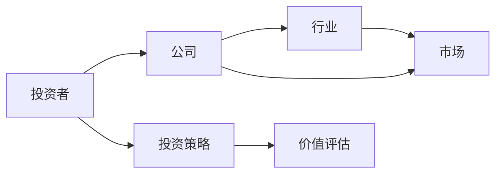
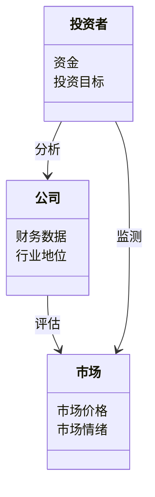

                 


# 沃伦·巴菲特：奥马哈预言家的价值投资策略

> 关键词：价值投资、内在价值、巴菲特、投资策略、长期回报

> 摘要：本文深入探讨了沃伦·巴菲特的价值投资策略，分析了其核心概念、算法原理和系统架构，结合实际案例，展示了如何将价值投资应用于投资组合管理。文章从背景介绍到项目实战，全面解析了巴菲特的投资哲学及其对现代投资理论的贡献。

---

## 第一部分: 背景介绍

### 第1章: 沃伦·巴菲特与价值投资的背景

#### 1.1 沃伦·巴菲特的生平与投资哲学
- **1.1.1 巴菲特的成长经历**  
  巴菲特出生于1934年，从小就展现出对投资的兴趣。他在十几岁时就开始投资股票，并在哥伦比亚大学获得经济学学士学位。毕业后，他开始了自己的投资生涯，逐渐积累了丰富的投资经验。

- **1.1.2 巴菲特的投资理念与哲学**  
  巴菲特强调长期投资和价值投资，认为市场的短期波动不应影响长期投资决策。他倡导寻找具有持续竞争优势和良好管理团队的公司，并长期持有这些股票。

- **1.1.3 巴菲特与“奥马哈预言家”的称号**  
  巴菲特因其在投资领域的卓越表现，被誉为“奥马哈预言家”。他的投资策略和哲学对全球投资者产生了深远影响。

#### 1.2 价值投资的背景与定义
- **1.2.1 价值投资的起源与发展**  
  价值投资起源于20世纪初，由本杰明·格雷厄姆和戴维·多德提出。它强调通过分析公司的基本面，寻找被市场低估的投资标的。

- **1.2.2 价值投资的核心概念与特征**  
  价值投资的核心在于寻找市场价格低于内在价值的公司。其特征包括注重长期回报、关注公司基本面、避免短期市场波动的干扰。

- **1.2.3 价值投资与其它投资策略的对比**  
  与趋势投资、技术分析等策略不同，价值投资更注重公司内在价值的分析和长期持有。

#### 1.3 价值投资的基本原理
- **1.3.1 价值投资的核心假设**  
  市场价格有时会偏离内在价值，长期来看，价格会回归价值。

- **1.3.2 市场的有效性与非有效性**  
  巴菲特认为市场在短期可能是有效的，但长期来看，市场并不能准确反映所有公司的价值。

- **1.3.3 投资者情绪与市场周期**  
  投资者情绪往往会导致市场的过度波动，价值投资者应避免被情绪左右，专注于长期价值。

### 第2章: 价值投资的核心要素

#### 2.1 价值投资的核心要素
- **2.1.1 公司基本面分析**  
  价值投资者注重公司的财务状况、盈利能力、行业地位等因素。

- **2.1.2 财务健康状况**  
  财务健康包括低负债、高现金流、稳定的盈利能力等。

- **2.1.3 行业地位与竞争优势**  
  公司在行业中的地位和竞争优势是决定其长期盈利能力的关键因素。

#### 2.2 巴菲特的选股标准
- **2.2.1 财务稳定性**  
  巴菲特偏好财务稳定的公司，避免高负债和不稳定的现金流。

- **2.2.2 高ROE（净资产收益率）**  
  高ROE表明公司利用股东权益创造了较高的利润。

- **2.2.3 管理团队的诚信与能力**  
  巴菲特认为优秀的管理团队是公司长期成功的关键。

#### 2.3 价值投资的内在价值计算
- **2.3.1 内在价值的定义**  
  内在价值是公司未来现金流的现值，反映了公司的真实价值。

- **2.3.2 现金流折现法（DCF模型）**  
  使用DCF模型计算公司未来现金流的现值，确定其内在价值。

- **2.3.3 市盈率与市净率的分析**  
  市盈率和市净率是常用的估值指标，但需结合公司基本面进行分析。

---

## 第二部分: 核心概念与联系

### 第3章: 价值投资的核心原理

#### 3.1 价值投资的理论基础
- **3.1.1 资本资产定价模型（CAPM）**  
  CAPM用于确定资产的预期收益，为价值投资提供了理论支持。

- **3.1.2 投资组合理论**  
  投资组合理论强调分散投资以降低风险，与价值投资的长期持有策略相辅相成。

- **3.1.3 价值投资与行为金融学的联系**  
  行为金融学揭示了市场非理性行为，为价值投资提供了心理层面的解释。

#### 3.2 价值投资的核心属性特征对比
- **3.2.1 长期 vs 短期**  
  价值投资注重长期回报，而短期交易关注市场波动。

- **3.2.2 低风险 vs 高风险**  
  价值投资通过选择优质公司降低投资风险。

- **3.2.3 高收益 vs 中等收益**  
  价值投资通过长期持有优质资产实现高收益。

#### 3.3 实体关系图（ER图）



---

## 第三部分: 算法原理

### 第4章: 价值投资的算法原理

#### 4.1 算法原理概述
- **4.1.1 基于基本面分析的算法**  
  通过分析公司的财务数据和行业地位，确定其内在价值。

- **4.1.2 市场情绪分析的算法**  
  利用市场情绪指标预测市场波动，辅助投资决策。

#### 4.2 价值投资的数学模型

```latex
$$\text{内在价值} = \sum_{t=1}^{n} \frac{\text{现金流}_t}{(1 + r)^t}$$
```

其中，$r$是折现率，$\text{现金流}_t$是第$t$年的现金流。

---

## 第四部分: 系统分析与架构设计

### 第5章: 系统分析与架构设计

#### 5.1 问题场景介绍
- 投资者希望通过价值投资策略构建投资组合，实现长期稳定收益。

#### 5.2 系统功能设计



#### 5.3 系统架构设计

```mermaid
context diagram
    actor 投资者
    system 价值投资系统 {
        component 数据采集 {
            数据来源: 公司数据、市场数据
        }
        component 数据分析 {
            分析模块: 基于DCF的内在价值计算
        }
        component 决策模块 {
            投资决策: 买入、持有或卖出
        }
    }
    投资者 --> 价值投资系统: 输入需求
    价值投资系统 --> 投资者: 输出投资建议
```

---

## 第五部分: 项目实战

### 第6章: 项目实战

#### 6.1 环境安装
- 安装Python和相关数据分析库（如Pandas、NumPy）。

#### 6.2 核心实现源代码

```python
import pandas as pd
import numpy as np

def calculate_intrinsic_value(cash_flows, discount_rate):
    return np.sum(cash_flows / (1 + discount_rate)**np.arange(len(cash_flows)))

# 示例数据
cash_flows = [100, 150, 200, 250]
discount_rate = 0.1

intrinsic_value = calculate_intrinsic_value(cash_flows, discount_rate)
print(f"内在价值: {intrinsic_value}")
```

#### 6.3 案例分析
- **案例：伯克希尔 Hathaway**
  - 财务数据：稳定的现金流，高ROE。
  - 行业地位：保险行业的领导者。
  - 投资决策：长期持有，定期评估内在价值。

---

## 第六部分: 最佳实践与小结

### 第7章: 最佳实践

#### 7.1 小结
- 价值投资是一种长期、系统的投资策略，通过分析公司基本面和市场估值，寻找被低估的投资标的。

#### 7.2 注意事项
- 投资者需持续学习和更新知识，避免情绪化决策。

#### 7.3 拓展阅读
- 格雷厄姆的《证券分析》
- 巴菲特的股东信和演讲

---

## 作者

作者：AI天才研究院/AI Genius Institute & 禅与计算机程序设计艺术 /Zen And The Art of Computer Programming

---

通过以上结构和内容，我们可以系统地理解和应用沃伦·巴菲特的价值投资策略，结合技术化的分析方法，为投资者提供实用的投资指导。

