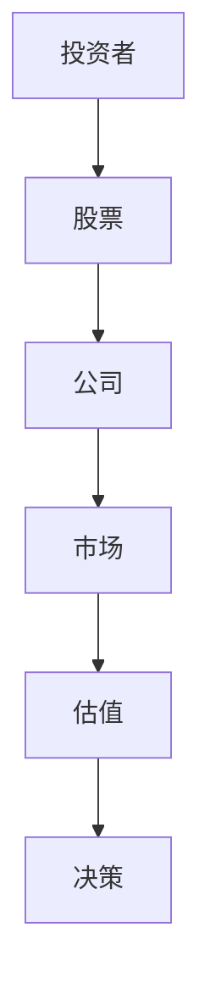
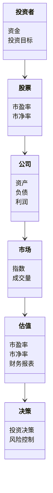

                 


# 法国股市估值: 欧元区重要经济体的投资价值

> 关键词：法国股市估值、欧元区、股市投资、基本面分析、技术分析

> 摘要：本文系统地分析了法国股市的估值方法与投资价值，结合基本面分析和行业分析，探讨了法国股市在欧元区的重要地位。通过详细讲解市盈率、市净率等核心指标，结合实际案例和数据分析，为投资者提供深度的估值参考。

---

## 第一部分: 法国股市估值的背景与重要性

### 第1章: 法国股市估值的背景介绍

#### 1.1 法国股市的历史与发展
- 法国股市的起源可以追溯到18世纪末，巴黎证券交易所的成立标志着法国股市的开端。
- 20世纪初，法国股市经历了多次重大变革，包括交易所的重组和监管框架的完善。
- 21世纪以来，法国股市逐渐与国际金融市场接轨，成为欧元区的重要组成部分。

#### 1.2 法国股市在欧元区的重要地位
- 法国是欧元区第二大经济体，其股市在欧元区具有举足轻重的地位。
- 法国股市不仅反映了法国经济的表现，也对整个欧元区的金融稳定具有重要影响。

#### 1.3 法国股市与其他主要市场的对比
- 与美股相比，法国股市更受欧洲经济的影响。
- 与A股相比，法国股市的行业分布更加多元化，尤其是金融和能源行业的权重较大。

---

## 第2章: 法国股市估值的核心概念与联系

### 2.1 估值的核心概念原理
- 市盈率（P/E）是衡量公司股票价值的重要指标，计算公式为：
$$ P/E = \frac{Market\ Price}{Earnings\ Per\ Share} $$
- 市净率（P/B）是另一个常用的估值指标，计算公式为：
$$ P/B = \frac{Market\ Price}{Book\ Value\ Per\ Share} $$

### 2.2 核心概念属性特征对比表格
| 指标 | 定义 | 适用场景 | 优缺点 |
|------|------|----------|--------|
| P/E  | 市盈率 | 评估公司盈利能力 | 受盈利波动影响较大 |
| P/B  | 市净率 | 评估资产价值 | 适用于重资产行业 |

### 2.3 ER实体关系图（Mermaid流程图）


---

## 第3章: 法国股市估值的算法原理

### 3.1 基本面分析法
- **市盈率分析**：通过比较公司市盈率与行业平均水平，判断其估值是否合理。
- **市净率分析**：评估公司资产的账面价值与市场价值的匹配程度。
- **资产负债表分析**：关注公司的财务健康状况，包括资产、负债和所有者权益。

### 3.2 技术分析法
- **趋势分析**：通过长期趋势判断市场走势。
- **技术指标**：如RSI（相对强弱指数）、MACD（移动平均收敛散度）等。
- **成交量分析**：通过成交量变化判断市场情绪。

### 3.3 组合分析法
- **多因子模型**：结合多个因子（如市值、价值、动量等）进行综合分析。
- **风险调整回报分析**：评估投资组合的风险调整后收益。
- **行业轮动策略**：根据行业表现进行动态调整。

---

## 第4章: 法国股市估值的系统分析与架构设计

### 4.1 系统功能设计（领域模型Mermaid类图）


---

## 第5章: 法国股市估值的项目实战

### 5.1 环境安装
- 需要安装数据分析工具，如Python、Excel、 Bloomberg Terminal等。

### 5.2 系统核心实现源代码
```python
import pandas as pd
import numpy as np

# 示例：计算市盈率
def calculate_pe(ticker):
    # 假设ticker为股票代码，需要连接数据源获取数据
    # 这里仅为示例
    pe = 100  # 示例数据
    return pe

# 示例：计算市净率
def calculate_pb(ticker):
    pb = 150  # 示例数据
    return pb

# 示例：行业平均市盈率
industry_pe = 120
```

### 5.3 代码应用解读与分析
- 通过代码计算公司市盈率和市净率，与行业平均水平进行对比，判断其估值是否合理。

### 5.4 实际案例分析
- 以法国CAC 40指数为例，分析其成分股的估值情况。
- 例如，分析某银行股的市盈率和市净率，判断其投资价值。

### 5.5 项目小结
- 通过实际案例分析，验证估值模型的有效性。
- 总结在实际操作中需要注意的事项，如数据的准确性和模型的适用性。

---

## 第6章: 法国股市估值的未来展望与投资建议

### 6.1 未来市场趋势预测
- 预测法国股市未来的发展趋势，包括宏观经济因素和行业趋势的影响。

### 6.2 投资建议
- 根据当前市场环境，给出具体的投资建议，如行业配置和风险控制。

### 6.3 注意事项
- 提醒投资者注意市场风险，如经济波动和政策变化的影响。

### 6.4 拓展阅读
- 推荐相关书籍和资源，帮助投资者进一步学习和深入理解。

---

## 第7章: 总结与展望

### 7.1 本文总结
- 总结全文的核心内容，强调法国股市估值的重要性和方法。

### 7.2 对未来研究的展望
- 提出未来可能的研究方向，如人工智能在股市估值中的应用。

---

## 第八章: 参考文献与致谢

### 8.1 参考文献
- 列出本文参考的文献和数据来源。

### 8.2 致谢
- 感谢在写作过程中给予帮助和支持的人。

---

## 作者：AI天才研究院/AI Genius Institute & 禅与计算机程序设计艺术 /Zen And The Art of Computer Programming

