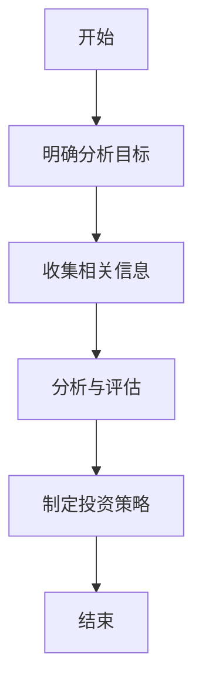
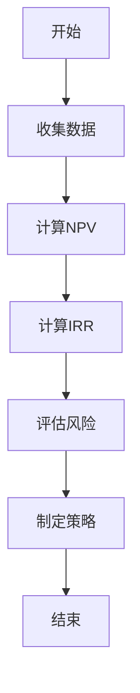
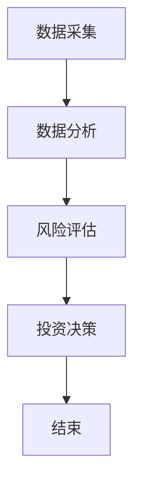
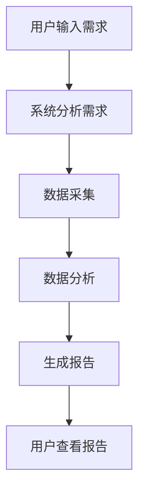

                 


# 海洋经济开发中的投资机会分析

## 关键词：海洋经济、投资机会、风险评估、可行性分析、系统架构

## 摘要：海洋经济开发是当前经济发展的重要方向，本文通过分析海洋经济的核心概念、投资机会的特征、风险评估方法以及项目可行性分析，为投资者提供科学的投资决策支持。结合实际案例，探讨海洋经济开发中的投资机会，分析其潜在价值和风险，帮助投资者抓住机遇，规避风险，实现可持续发展。

---

# 第1章: 海洋经济开发的背景与现状

## 1.1 海洋经济的定义与内涵

### 1.1.1 海洋经济的定义  
海洋经济是指利用海洋资源进行生产、分配和消费的经济活动的总和，涵盖海洋渔业、海洋能源、海洋交通、海洋旅游等多个领域。  

### 1.1.2 海洋经济的构成要素  
海洋经济的构成要素包括：  
- **资源要素**：海洋资源（如渔业资源、矿产资源等）。  
- **技术要素**：海洋开发技术（如深海探测技术、海洋养殖技术等）。  
- **市场要素**：市场需求和市场容量。  
- **政策要素**：政府政策和法规支持。  

### 1.1.3 海洋经济与可持续发展的关系  
海洋经济的开发必须遵循可持续发展的原则，注重生态保护和资源的合理利用，避免过度开发导致的环境破坏。

## 1.2 海洋经济开发的现状

### 1.2.1 全球海洋经济发展的趋势  
近年来，全球海洋经济规模持续增长，海洋能源、海洋旅游等领域发展迅速。  

### 1.2.2 中国海洋经济的发展历程  
中国海洋经济从20世纪80年代起步，经过 decades 的发展，已成为全球海洋经济的重要力量。  

### 1.2.3 当前海洋经济开发的主要领域  
- **海洋能源**：风能、潮汐能等可再生能源。  
- **海洋旅游**：邮轮旅游、海岛旅游等。  
- **海洋渔业**：深远海养殖、海洋牧场等。  

## 1.3 海洋经济开发中的投资机会背景

### 1.3.1 海洋经济开发的市场需求  
随着人们对海洋资源的需求增加，海洋经济的市场需求呈现多样化趋势。  

### 1.3.2 政策支持与行业利好  
中国政府出台了一系列政策支持海洋经济发展，如《海洋强国战略》等。  

### 1.3.3 技术进步对投资机会的影响  
海洋技术的进步（如深海探测技术）为海洋经济开发提供了新的投资机会。  

## 1.4 投资机会分析的重要性

### 1.4.1 投资机会分析的基本概念  
投资机会分析是通过对市场、技术和政策等因素的综合分析，识别潜在的投资机会。  

### 1.4.2 投资机会分析在海洋经济中的作用  
- 帮助投资者识别高潜力的海洋经济领域。  
- 为投资决策提供科学依据。  

### 1.4.3 分析框架与方法  
投资机会分析的框架包括：背景研究、数据收集、风险评估、投资策略制定等。

---

# 第2章: 海洋经济开发中的核心概念与联系

## 2.1 海洋经济开发的核心概念

### 2.1.1 海洋资源的分类与特征  
海洋资源可以分为可再生资源（如渔业资源）和不可再生资源（如矿产资源）。  

### 2.1.2 海洋产业的产业链分析  
海洋产业的产业链包括上游（资源开发）、中游（加工制造）和下游（市场销售）三个环节。  

### 2.1.3 海洋经济与区域经济的关系  
海洋经济是区域经济发展的重要组成部分，尤其在沿海地区表现明显。

## 2.2 投资机会分析的核心要素

### 2.2.1 投资项目的可行性分析  
可行性分析包括技术可行性、经济可行性和市场可行性。  

### 2.2.2 投资风险的分类与评估  
投资风险可以分为市场风险、技术风险和政策风险。  

### 2.2.3 投资回报的计算与预测  
投资回报可以通过净现值（NPV）、内部收益率（IRR）等指标进行评估。

## 2.3 核心概念的联系与对比

### 2.3.1 海洋经济与投资机会的关联性分析  
海洋经济的开发为投资者提供了多样化的投资机会，如海洋能源、海洋旅游等领域。  

### 2.3.2 不同投资领域的核心要素对比  
| 投资领域 | 核心要素 |  
|----------|----------|  
| 海洋能源 | 技术、政策 |  
| 海洋旅游 | 市场、资源 |  
| 海洋渔业 | 生态、技术 |  

### 2.3.3 投资机会分析的流程图（Mermaid）



---

# 第3章: 海洋经济开发中的投资机会分析框架

## 3.1 投资机会分析的基本步骤

### 3.1.1 明确分析目标  
确定投资领域和目标市场。  

### 3.1.2 收集相关信息  
包括市场需求、竞争对手、政策法规等。  

### 3.1.3 分析与评估  
通过数据分析和模型计算，评估投资机会的可行性。  

### 3.1.4 制定投资策略  
根据分析结果制定投资计划和风险应对策略。

## 3.2 投资机会分析的数学模型

### 3.2.1 投资回报率（ROI）的计算公式  
$$ ROI = \frac{\text{净利润}}{\text{投资成本}} \times 100\% $$  

### 3.2.2 净现值（NPV）的计算公式  
$$ NPV = \sum_{t=1}^{n} \frac{\text{现金流}}{(1 + r)^t} $$  
其中，r为折现率，n为项目周期。

## 3.3 投资机会分析的算法流程图（Mermaid）



---

# 第4章: 海洋经济开发中的风险评估与应对

## 4.1 风险评估的核心方法

### 4.1.1 风险识别  
通过问卷调查、专家访谈等方式识别潜在风险。  

### 4.1.2 风险量化  
使用概率-影响矩阵对风险进行量化评估。  

### 4.1.3 风险排序  
根据风险的严重性和发生概率对风险进行排序。

## 4.2 投资风险的分类与应对策略

### 4.2.1 市场风险  
- 应对策略：多元化投资、签订长期合同。  

### 4.2.2 技术风险  
- 应对策略：加强技术研发、引入技术合作伙伴。  

### 4.2.3 政策风险  
- 应对策略：密切关注政策变化、与政府保持沟通。  

## 4.3 风险评估的数学模型

### 4.3.1 风险概率-影响矩阵  
| 风险 | 高概率 | 中概率 | 低概率 |  
|------|---------|---------|---------|  
| 高影响 | A | B | C |  
| 中影响 | D | E | F |  
| 低影响 | G | H | I |  

---

# 第5章: 海洋经济开发中的项目可行性分析

## 5.1 项目可行性分析的标准

### 5.1.1 市场可行性  
项目是否符合市场需求。  

### 5.1.2 技术可行性  
项目是否具备可行的技术方案。  

### 5.1.3 经济可行性  
项目的投资回报是否可行。  

## 5.2 项目可行性分析的步骤

### 5.2.1 确定项目目标  
明确项目的开发目标和范围。  

### 5.2.2 收集相关信息  
包括市场数据、技术资料、政策法规等。  

### 5.2.3 分析与评估  
通过数据分析和模型计算，评估项目的可行性。  

### 5.2.4 制定实施方案  
包括项目计划、资源分配、风险应对等。  

## 5.3 项目可行性分析的案例

### 5.3.1 案例：海洋牧场项目  
- **市场分析**：市场需求旺盛，投资回报率高。  
- **技术分析**：具备成熟的技术支持。  
- **经济分析**：投资回报周期短，收益稳定。  

---

# 第6章: 海洋经济开发中的系统架构设计

## 6.1 系统架构的核心要素

### 6.1.1 系统功能模块  
包括数据采集、数据分析、风险评估、投资决策等功能模块。  

### 6.1.2 系统架构图  


### 6.1.3 系统接口设计  
系统接口包括数据接口、用户界面、第三方服务接口等。  

## 6.2 系统功能设计

### 6.2.1 数据采集模块  
负责采集海洋经济相关的数据，如市场数据、政策数据等。  

### 6.2.2 数据分析模块  
使用大数据技术对数据进行分析，生成分析报告。  

### 6.2.3 风险评估模块  
根据数据分析结果，评估投资风险。  

## 6.3 系统交互流程图（Mermaid）



---

# 第7章: 海洋经济开发中的项目实战

## 7.1 环境安装

### 7.1.1 开发环境  
- 操作系统：Windows/Mac/Linux  
- 开发工具：Python、Jupyter Notebook  
- 数据库：MySQL/PostgreSQL  

## 7.2 核心代码实现

### 7.2.1 数据分析代码  
```python
import pandas as pd

data = pd.read_csv('marine_economy.csv')
print(data.head())
```

### 7.2.2 风险评估代码  
```python
def calculate_risk(data):
    # 计算风险评分
    return data['风险评分'].mean()

risk_score = calculate_risk(data)
print(f"风险评分：{risk_score}")
```

## 7.3 案例分析

### 7.3.1 案例：海洋能源项目  
- **背景**：市场需求增长迅速，政策支持力度大。  
- **分析**：投资回报周期短，技术风险较低。  

## 7.4 项目总结

### 7.4.1 成功经验  
- 选择市场需求大的领域。  
- 注重政策和技术创新。  

### 7.4.2 改进建议  
- 加强风险评估能力。  
- 提高数据分析能力。  

---

# 第8章: 总结与展望

## 8.1 总结

### 8.1.1 核心观点回顾  
海洋经济开发的投资机会丰富，但需要科学的分析和合理的风险控制。  

### 8.1.2 成果与不足  
本文提出了海洋经济开发中的投资机会分析框架，但仍需进一步完善。

## 8.2 展望

### 8.2.1 未来研究方向  
- 技术与经济的深度融合。  
- 海洋经济的国际合作。  

### 8.2.2 结语  
海洋经济开发是未来经济发展的重要方向，投资者需要抓住机遇，规避风险，实现可持续发展。

---

# 作者：AI天才研究院 & 禅与计算机程序设计艺术

---

以上是《海洋经济开发中的投资机会分析》的技术博客文章，涵盖了从背景分析、核心概念、分析框架到项目实战的全过程，结合实际案例和系统设计，为投资者提供了科学的决策支持。

