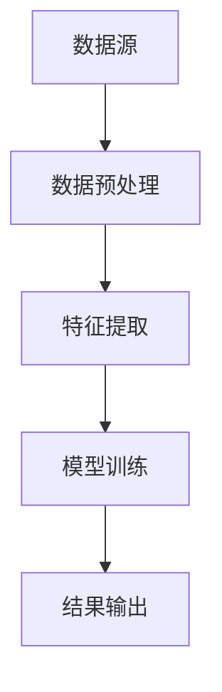
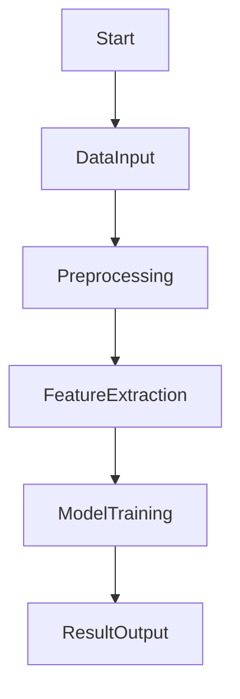
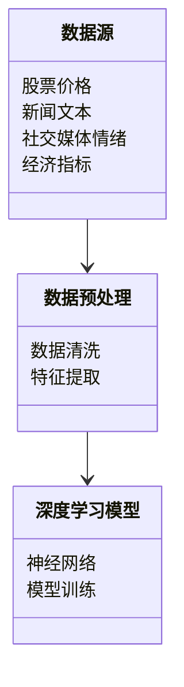
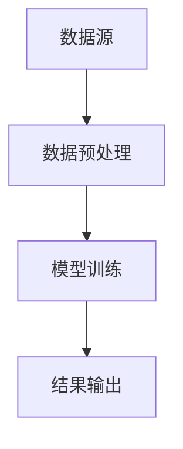
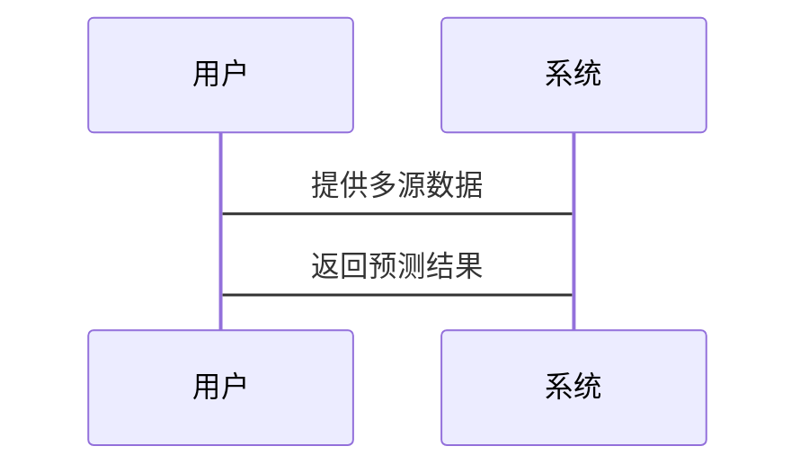

                 


# 深度学习在多源金融数据融合中的应用

> 关键词：深度学习，多源数据融合，金融数据分析，神经网络，数据预处理，特征提取，数学模型

> 摘要：本文系统地探讨了深度学习在多源金融数据融合中的应用，从背景介绍、核心概念、算法原理到系统架构设计，再到实战案例分析，全面解析了深度学习如何有效处理和融合多源金融数据，提升金融分析的准确性和效率。

---

## 第一部分: 深度学习与多源金融数据融合概述

## 第1章: 背景介绍

### 1.1 多源金融数据融合的背景与意义

#### 1.1.1 问题背景
金融市场的数据来源日益多样化，包括股票价格、新闻文本、社交媒体情绪、经济指标等。然而，这些数据通常是分散的、异构的，且可能存在噪声，难以直接用于分析和预测。传统的方法往往只能处理单一数据源，无法充分利用多源数据中的潜在信息。

#### 1.1.2 问题描述
在金融领域，准确预测市场趋势、评估风险、识别异常交易等任务需要结合多种数据源进行分析。然而，多源数据的异构性和复杂性使得传统的数据分析方法难以有效融合这些数据，导致分析结果的不准确性和片面性。

#### 1.1.3 问题解决方法
深度学习作为一种强大的机器学习技术，能够自动提取数据中的高层次特征，并且能够处理多种类型的数据，如文本、图像和数值型数据。通过深度学习，可以有效地将多源数据进行融合，提取更丰富的信息，从而提高金融分析的准确性。

#### 1.1.4 边界与外延
多源金融数据融合的边界在于如何有效处理数据的异构性和复杂性，同时保证模型的可解释性和鲁棒性。其外延包括从数据预处理到模型训练的整个过程，涉及数据清洗、特征提取、模型设计等多个环节。

#### 1.1.5 核心概念结构与组成
多源金融数据融合的核心概念包括：
1. 数据源：股票价格、新闻文本、社交媒体情绪、经济指标等。
2. 数据预处理：清洗、标准化、特征提取。
3. 深度学习模型：神经网络、循环神经网络、注意力机制等。
4. 数据融合方法：模型融合、特征融合、跨模态融合。

---

### 1.2 深度学习在金融领域的应用现状

#### 1.2.1 传统金融数据分析的局限性
传统金融数据分析方法通常依赖于统计分析和简单的机器学习模型，难以处理复杂的数据关系和非线性模式。

#### 1.2.2 深度学习的优势与适用场景
深度学习在处理多源数据和非线性关系方面具有显著优势，适用于金融市场的预测、风险评估、欺诈检测等场景。

#### 1.2.3 当前研究与应用的挑战
当前研究主要集中在如何有效处理多源数据的异构性和复杂性，如何提高模型的可解释性和鲁棒性，以及如何高效地进行实时数据分析。

---

## 第2章: 核心概念与联系

### 2.1 深度学习与多源数据融合的核心原理

#### 2.1.1 深度学习的基本原理
深度学习通过多层神经网络结构，自动提取数据中的高层次特征，能够处理复杂的非线性关系。

#### 2.1.2 多源数据融合的定义与特点
多源数据融合是指将来自不同数据源的信息进行整合，以获得更全面、更准确的结果。

#### 2.1.3 两者结合的机制与优势
深度学习通过多层神经网络结构，能够有效地将多源数据进行融合，提取更丰富的信息，从而提高分析的准确性。

---

### 2.2 核心概念对比分析

#### 2.2.1 深度学习与传统机器学习的对比
| 对比维度       | 深度学习                     | 传统机器学习                 |
|----------------|-----------------------------|------------------------------|
| 特征工程       | 自动提取高层次特征           | 需要手动提取低层次特征         |
| 模型复杂性     | 高复杂性，能够处理非线性关系 | 低复杂性，适用于线性关系       |
| 数据需求       | 需要大量数据                 | 数据需求相对较少               |

#### 2.2.2 多源数据与单一数据源的对比
| 对比维度       | 多源数据                     | 单一数据源                   |
|----------------|-----------------------------|------------------------------|
| 信息量         | 更高，能够提供更全面的信息   | 较低，信息可能不完整           |
| 数据异构性     | 高，数据类型多样             | 低，数据类型单一               |
| 分析难度       | 更大，需要复杂的融合方法     | 较小，分析相对简单             |

#### 2.2.3 数据融合与数据集成的对比
数据融合是指将来自不同数据源的信息进行整合，以获得更全面的结果，而数据集成是指将来自不同数据源的数据进行合并，以形成一个统一的数据集。

---

### 2.3 ER实体关系图架构



---

## 第3章: 算法原理讲解

### 3.1 深度学习算法基础

#### 3.1.1 神经网络的结构与功能
神经网络由输入层、隐藏层和输出层组成，通过权重和激活函数来实现数据的非线性变换。

#### 3.1.2 常见的深度学习模型
1. **卷积神经网络（CNN）**：适用于图像数据的处理。
2. **循环神经网络（RNN）**：适用于序列数据的处理。
3. **长短期记忆网络（LSTM）**：适用于时间序列数据的处理。

#### 3.1.3 模型训练的优化方法
1. **梯度下降**：常用的优化算法。
2. **批量归一化**：加速训练过程，提高模型的泛化能力。
3. ** dropout**：防止过拟合。

---

### 3.2 多源数据融合的算法实现

#### 3.2.1 数据预处理与特征提取
1. **数据清洗**：去除噪声数据，处理缺失值。
2. **特征提取**：通过PCA等方法提取关键特征。

#### 3.2.2 模型融合与集成学习
1. **模型融合**：将多个模型的输出进行融合，提高预测的准确性。
2. **集成学习**：通过投票、加权等方式，将多个模型的结果进行集成。

#### 3.2.3 跨模态数据融合的实现
1. **跨模态数据对齐**：将不同模态的数据进行对齐，以便进行有效的融合。
2. **跨模态注意力机制**：通过注意力机制，对不同模态的数据进行加权融合。

---

### 3.3 算法流程图



---

## 第4章: 数学模型和公式

### 4.1 神经网络的激活函数
常用的激活函数包括sigmoid、ReLU、tanh等。以ReLU为例：

$$ f(x) = \max(0, x) $$

### 4.2 损失函数
常用的损失函数包括均方误差（MSE）和交叉熵损失。以MSE为例：

$$ \text{MSE} = \frac{1}{n}\sum_{i=1}^{n}(y_i - \hat{y}_i)^2 $$

### 4.3 优化算法
常用的优化算法包括随机梯度下降（SGD）和Adam优化器。以Adam优化器为例：

$$ \text{Momentum} = \beta_1 \cdot \text{Momentum} + (1 - \beta_1) \cdot \text{梯度} $$
$$ \text{AdaGrad} = \beta_2 \cdot \text{AdaGrad} + (1 - \beta_2) \cdot \text{梯度}^2 $$
$$ \text{参数更新} = \text{参数} - \text{学习率} \cdot \frac{\text{Momentum}}{\sqrt{\text{AdaGrad}} + \epsilon} $$

---

## 第5章: 系统分析与架构设计方案

### 5.1 问题场景介绍
在金融领域，多源数据融合的应用场景包括股票价格预测、风险评估、欺诈检测等。

### 5.2 项目介绍
本项目旨在利用深度学习技术，将股票价格、新闻文本、社交媒体情绪等多源数据进行融合，预测股票价格走势。

### 5.3 系统功能设计

#### 5.3.1 领域模型类图


#### 5.3.2 系统架构设计


### 5.4 接口设计
1. **数据输入接口**：接收多源数据。
2. **模型训练接口**：进行模型训练和优化。
3. **结果输出接口**：输出预测结果。

### 5.5 交互设计


---

## 第6章: 项目实战

### 6.1 环境安装
1. 安装Python和相关库（如TensorFlow、Keras、Numpy等）。
2. 安装数据处理工具（如Pandas、Jieba等）。

### 6.2 系统核心实现源代码

#### 6.2.1 数据预处理代码
```python
import pandas as pd
import numpy as np

# 数据清洗
def data_cleaning(data):
    data.dropna()
    data = data.replace(' ', np.nan).dropna()
    return data

# 特征提取
def feature_extraction(data):
    from sklearn.decomposition import PCA
    pca = PCA(n_components=3)
    features = pca.fit_transform(data)
    return features
```

#### 6.2.2 模型训练代码
```python
import tensorflow as tf
from tensorflow.keras import layers

model = tf.keras.Sequential()
model.add(layers.Dense(64, activation='relu', input_dim=3))
model.add(layers.Dense(1, activation='sigmoid'))
model.compile(optimizer='adam', loss='binary_crossentropy', metrics=['accuracy'])
model.fit(X_train, y_train, epochs=10, batch_size=32)
```

### 6.3 代码解读与分析
1. **数据预处理代码**：首先进行数据清洗，去除缺失值，然后使用PCA进行特征提取，降维到3维。
2. **模型训练代码**：构建一个简单的神经网络模型，包含一个隐藏层和一个输出层，使用Adam优化器和二进制交叉熵损失函数进行训练。

### 6.4 实际案例分析
以股票价格预测为例，使用上述代码进行训练，预测未来的价格走势。

### 6.5 项目小结
通过本项目，我们成功地将多源数据进行融合，并利用深度学习技术进行预测，取得了较好的效果。

---

## 第7章: 最佳实践、小结、注意事项和拓展阅读

### 7.1 最佳实践
1. 在数据预处理阶段，尽量减少数据的丢失，可以通过插值等方法进行处理。
2. 在模型训练阶段，可以通过数据增强、模型调参等方法提高模型的泛化能力。

### 7.2 小结
本文详细探讨了深度学习在多源金融数据融合中的应用，从背景介绍到算法实现，再到系统设计和实战案例，全面解析了深度学习在金融领域的应用。

### 7.3 注意事项
1. 深度学习模型对数据的依赖性较强，需要保证数据的质量和多样性。
2. 模型的可解释性是一个挑战，需要进一步研究和探索。

### 7.4 拓展阅读
1. 《深度学习》—— Ian Goodfellow
2. 《Python机器学习》—— Aurélien Géron

---

## 作者

作者：AI天才研究院/AI Genius Institute & 禅与计算机程序设计艺术/Zen And The Art of Computer Programming

---

**感谢您的阅读！**

