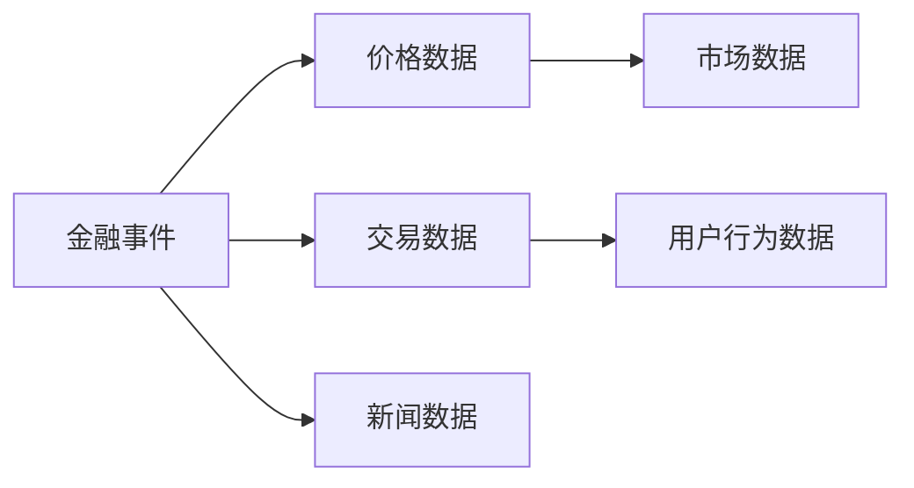
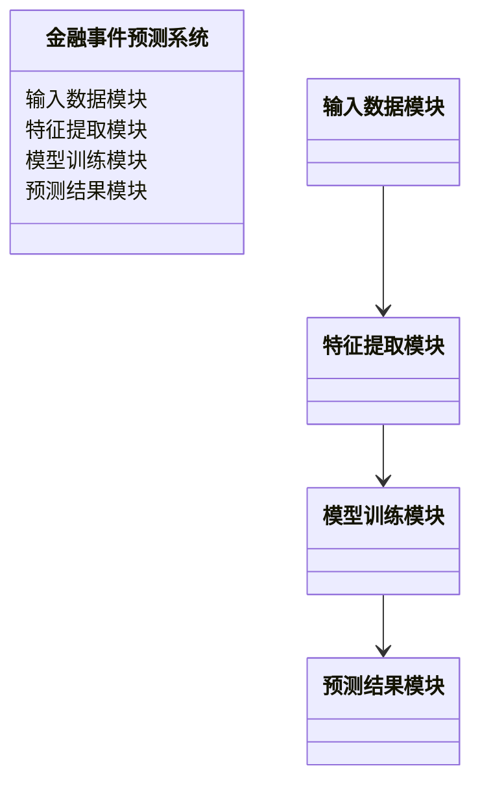
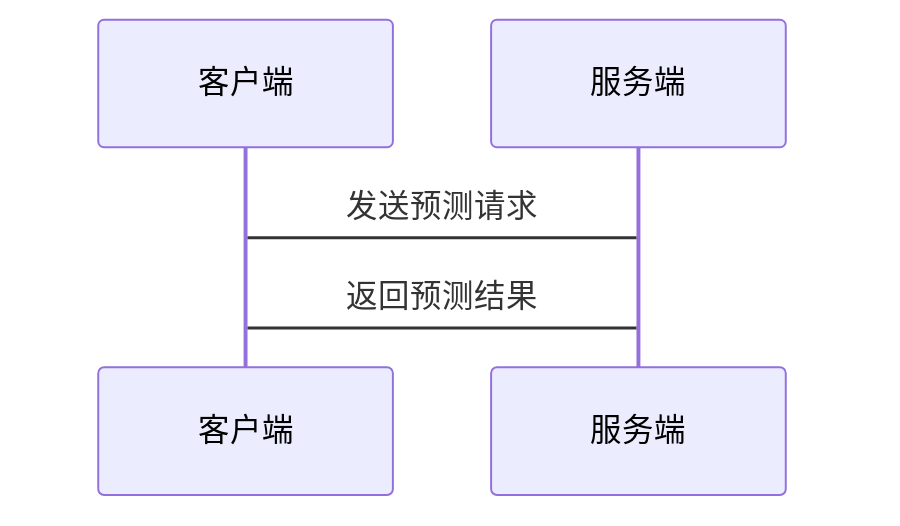

                 


# 《深度学习在金融事件预测中的应用》

---

## 关键词：  
深度学习、金融事件预测、时间序列分析、神经网络、LSTM、注意力机制、金融系统架构

---

## 摘要：  
本文详细探讨了深度学习在金融事件预测中的应用，结合实际案例和理论分析，介绍了深度学习的基本原理、时间序列分析方法、系统架构设计及优化策略。通过分析金融事件的特征提取、模型构建及评估，本文为读者提供了从理论到实践的全面指南，帮助读者理解如何利用深度学习技术提升金融预测的准确性和可靠性。

---

## 目录

### 第一部分: 深度学习与金融事件预测基础

### 第1章: 深度学习与金融事件预测概述

#### 1.1 深度学习的起源与发展
- 1.1.1 从机器学习到深度学习的演变
- 1.1.2 深度学习的核心特点与优势
- 1.1.3 深度学习在金融领域的应用前景

#### 1.2 金融事件预测的背景与挑战
- 1.2.1 金融事件的定义与分类
- 1.2.2 传统金融预测方法的局限性
- 1.2.3 深度学习在金融事件预测中的优势

#### 1.3 深度学习与金融事件预测的结合
- 1.3.1 深度学习在金融时间序列分析中的应用
- 1.3.2 金融事件预测的核心问题与解决方案
- 1.3.3 金融事件预测的边界与外延

#### 1.4 本章小结

---

### 第2章: 金融事件预测的核心概念与联系

#### 2.1 核心概念原理
- 2.1.1 金融事件的特征提取
- 2.1.2 深度学习模型的基本原理
- 2.1.3 金融事件预测的数学模型

#### 2.2 核心概念属性特征对比表
| 特征 | 传统金融预测 | 深度学习预测 |
|------|--------------|--------------|
| 数据来源 | 传统金融指标 | 多模态数据（文本、价格、交易数据） |
| 模型复杂度 | 线性模型为主 | 非线性模型为主 |
| 预测粒度 | 粗粒度 | 细粒度 |

#### 2.3 ER实体关系图架构


#### 2.4 本章小结

---

### 第3章: 深度学习的基本原理

#### 3.1 神经网络基础
- 3.1.1 神经网络的结构与功能
- 3.1.2 激活函数的作用与选择
- 3.1.3 损失函数与优化器的原理

#### 3.2 卷积神经网络（CNN）
- 3.2.1 CNN的结构与特点
- 3.2.2 在金融时间序列分析中的应用
- 3.2.3 案例分析：股票价格预测

#### 3.3 循环神经网络（RNN）
- 3.3.1 RNN的基本结构与特点
- 3.3.2 长短期记忆网络（LSTM）的原理
- 3.3.3 案例分析：金融时间序列预测

#### 3.4 集成模型
- 3.4.1 集成学习的基本概念
- 3.4.2 深度学习集成模型的设计与优化
- 3.4.3 案例分析：多模态金融数据预测

#### 3.5 本章小结

---

### 第4章: 深度学习在金融时间序列分析中的应用

#### 4.1 时间序列分析的基本概念
- 4.1.1 时间序列的特征与分类
- 4.1.2 传统时间序列分析方法的局限性

#### 4.2 基于LSTM的时间序列预测模型
- 4.2.1 LSTM的结构与特点
- 4.2.2 LSTM在金融时间序列预测中的应用
- 4.2.3 案例分析：股票价格预测

#### 4.3 基于注意力机制的时间序列预测模型
- 4.3.1 注意力机制的基本原理
- 4.3.2 注意力机制在时间序列预测中的应用
- 4.3.3 案例分析：金融事件预测

#### 4.4 深度学习模型的优化策略
- 4.4.1 数据预处理与特征提取
- 4.4.2 模型调参与优化
- 4.4.3 模型的可解释性与评估指标

#### 4.5 本章小结

---

### 第5章: 金融事件预测系统的架构设计

#### 5.1 问题场景介绍
- 5.1.1 金融事件预测的业务背景
- 5.1.2 系统的目标与功能需求

#### 5.2 系统功能设计
- 5.2.1 领域模型设计（Mermaid类图）


#### 5.3 系统架构设计
- 5.3.1 系统架构图（Mermaid架构图）
```mermaid
docker
    services {
        predictor {
            container: predictor-1
            command: python predictor.py
        }
        trainer {
            container: trainer-1
            command: python trainer.py
        }
        redis {
            image: redis:alpine
        }
    }
    predictor --> redis
    trainer --> redis
```

#### 5.4 系统接口设计
- 5.4.1 API接口定义
- 5.4.2 接口交互流程（Mermaid序列图）


#### 5.5 本章小结

---

### 第6章: 金融事件预测系统的项目实战

#### 6.1 项目介绍
- 6.1.1 项目背景
- 6.1.2 项目目标
- 6.1.3 项目技术栈

#### 6.2 系统核心实现
- 6.2.1 数据预处理与特征提取
- 6.2.2 模型实现与训练
- 6.2.3 系统部署与测试

#### 6.3 代码实现
```python
import numpy as np
import pandas as pd
from tensorflow import keras
from tensorflow.keras import layers

# 数据加载与预处理
data = pd.read_csv('financial_data.csv')
train_data = data.iloc[:800, :]
test_data = data.iloc[800:, :]

# LSTM模型构建
model = keras.Sequential()
model.add(layers.LSTM(64, input_shape=(None, 5)))
model.add(layers.Dense(1))
model.compile(loss='mean_squared_error', optimizer='adam')

# 模型训练
model.fit(train_data, epochs=50, batch_size=32, validation_data=test_data)
```

#### 6.4 项目分析与小结
- 6.4.1 项目实现的关键点
- 6.4.2 项目中存在的问题与解决方案
- 6.4.3 项目总结与经验分享

---

### 第7章: 模型优化与评估

#### 7.1 模型优化策略
- 7.1.1 超参数调优
- 7.1.2 模型集成与融合
- 7.1.3 模型的可解释性提升

#### 7.2 模型评估指标
- 7.2.1 常见评估指标的定义与计算
- 7.2.2 指标之间的对比与选择
- 7.2.3 案例分析：模型评估结果解读

#### 7.3 优化案例分析
- 7.3.1 案例一：LSTM模型优化
- 7.3.2 案例二：注意力机制模型优化
- 7.3.3 案例三：集成模型优化

#### 7.4 本章小结

---

### 第8章: 金融事件预测的实际挑战与解决方案

#### 8.1 数据质量问题
- 8.1.1 数据缺失与噪声处理
- 8.1.2 数据不平衡问题的解决方案
- 8.1.3 数据隐私与安全问题

#### 8.2 模型解释性问题
- 8.2.1 模型解释性的重要性
- 8.2.2 提升模型解释性的方法
- 8.2.3 案例分析：可解释性模型的选择

#### 8.3 实际应用中的其他挑战
- 8.3.1 算法的实时性与效率问题
- 8.3.2 系统的可扩展性与维护问题
- 8.3.3 多模态数据的融合与处理

#### 8.4 解决方案与最佳实践
- 8.4.1 数据处理的最佳实践
- 8.4.2 模型优化的实用技巧
- 8.4.3 系统设计的注意事项

#### 8.5 本章小结

---

### 第9章: 总结与展望

#### 9.1 全文总结
- 9.1.1 深度学习在金融事件预测中的应用价值
- 9.1.2 本文的核心观点与主要结论

#### 9.2 未来研究方向
- 9.2.1 新型深度学习模型的研究
- 9.2.2 多模态数据融合技术的发展
- 9.2.3 金融事件预测的实时化与智能化

#### 9.3 学习与实践建议
- 9.3.1 推荐的学习资源
- 9.3.2 实践项目建议
- 9.3.3 进一步研究的方向

#### 9.4 本章小结

---

## 作者：  
AI天才研究院/AI Genius Institute & 禅与计算机程序设计艺术/Zen And The Art of Computer Programming

