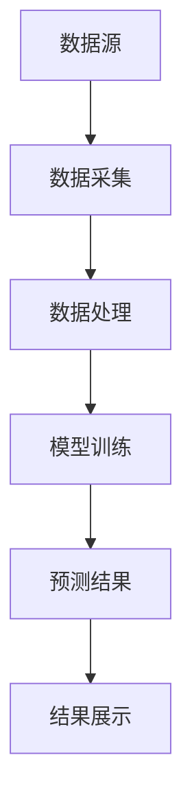
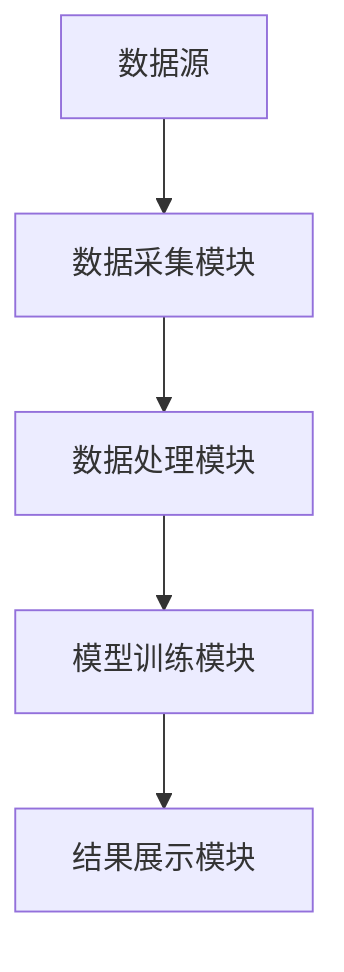
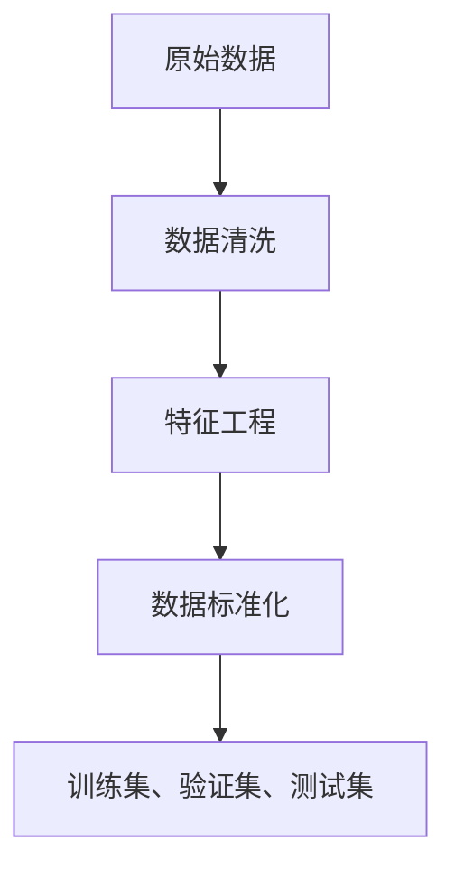
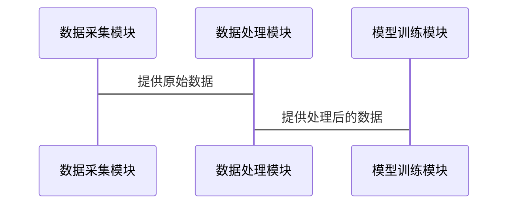
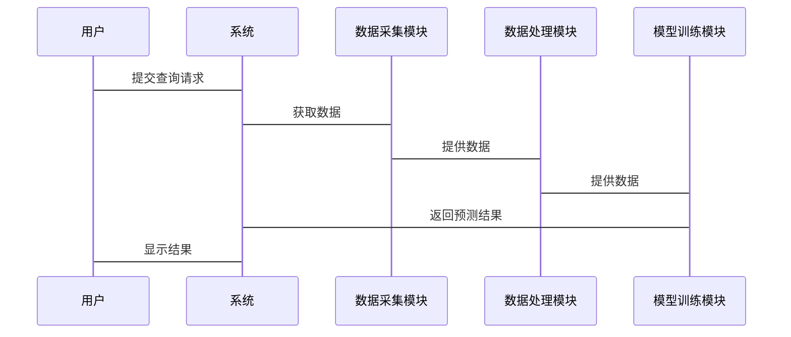

                 


# 深度学习预测公司盈利拐点

> 关键词：深度学习，盈利拐点，时间序列，LSTM，财务预测

> 摘要：本文详细探讨了如何利用深度学习技术，特别是LSTM模型，来预测公司的盈利拐点。文章从背景和挑战入手，分析了时间序列预测的核心概念，详细讲解了LSTM算法的原理和实现，设计了系统的架构，并通过项目实战展示了如何构建和优化预测模型。最后，文章总结了预测拐点的意义和未来的发展方向。

---

# 第1章: 公司盈利拐点预测的背景与意义

## 1.1 公司盈利拐点的定义与重要性

### 1.1.1 盈利拐点的定义
盈利拐点是指公司在经营过程中，从亏损到盈利或从盈利到亏损的关键转折点。这一概念在企业战略规划和投资决策中具有重要意义，因为它可以帮助企业及时调整经营策略，规避风险。

### 1.1.2 盈利拐点对企业战略的意义
- **投资决策**：投资者可以根据盈利拐点判断企业的成长潜力。
- **风险管理**：企业可以提前识别潜在的财务危机。
- **战略调整**：企业可以根据拐点调整产品、市场和成本策略。

### 1.1.3 深度学习在预测拐点中的优势
深度学习，尤其是循环神经网络（RNN）及其变体LSTM（长短期记忆网络），在处理时间序列数据方面表现出色。这些模型能够捕捉数据中的长期依赖关系，非常适合用于预测具有复杂时间依赖性的财务指标。

## 1.2 深度学习与公司盈利预测的结合

### 1.2.1 深度学习的基本概念
深度学习是一种人工智能技术，通过多层神经网络模拟人类的思维方式。与传统机器学习不同，深度学习能够自动提取数据特征，减少人工特征工程的依赖。

### 1.2.2 深度学习在时间序列预测中的应用
时间序列数据具有很强的时序依赖性，深度学习模型能够有效捕捉这些依赖关系。例如，LSTM网络在处理股票价格、销售数据等时间序列问题中表现出色。

### 1.2.3 盈利拐点预测的挑战与机遇
- **挑战**：公司盈利受多种因素影响，如市场环境、内部管理等，预测难度大。
- **机遇**：深度学习技术的进步为预测提供了新的可能性。

## 1.3 数据来源与特征分析

### 1.3.1 企业财务数据的获取与处理
企业财务数据包括收入、利润、成本等指标。这些数据通常从企业的财务报表中获取，并经过清洗和标准化处理。

### 1.3.2 市场数据与宏观经济指标的引入
宏观经济指标如GDP增长率、行业趋势等，也能影响公司的盈利情况。引入这些数据可以提高预测的准确性。

### 1.3.3 数据特征的筛选与工程化
特征工程是预测模型的重要环节。需要根据经验选择相关性高的特征，并进行标准化或归一化处理。

---

# 第2章: 盈利拐点预测的核心概念与联系

## 2.1 时间序列分析的基本原理

### 2.1.1 时间序列的组成要素
时间序列数据通常由趋势、周期性、季节性和随机性组成。理解这些成分有助于选择合适的预测模型。

### 2.1.2 常见的时间序列模型
- **ARIMA**：适用于线性时间序列数据。
- **Prophet**：Facebook开源的时间序列预测模型。
- **LSTM**：适合处理非线性复杂的时间序列。

### 2.1.3 时间序列预测的数学模型
时间序列模型通常基于线性回归，但复杂的模型如ARIMA需要考虑自相关性和部分相关系数。

## 2.2 深度学习模型的核心原理

### 2.2.1 RNN与LSTM的基本原理
RNN擅长处理序列数据，但存在梯度消失问题。LSTM通过引入门控机制解决了这一问题。

### 2.2.2 Transformer模型的引入
Transformer模型基于自注意力机制，能够捕捉序列中的全局依赖关系。虽然在自然语言处理领域表现出色，但在时间序列预测中的应用还在探索阶段。

### 2.2.3 深度学习模型的优缺点
- **优点**：能够捕捉复杂的非线性关系，适合处理高维数据。
- **缺点**：训练时间长，需要大量计算资源。

## 2.3 盈利拐点预测的系统架构

### 2.3.1 系统功能模块划分
- 数据采集模块：从数据库中获取财务数据。
- 数据处理模块：清洗和特征工程。
- 模型训练模块：构建和训练预测模型。
- 结果展示模块：可视化预测结果。

### 2.3.2 系统输入输出的定义
- 输入：财务数据、市场数据。
- 输出：预测的盈利拐点和置信区间。

### 2.3.3 系统流程图展示


---

# 第3章: 盈利拐点预测的算法原理

## 3.1 LSTM模型的数学推导

### 3.1.1 LSTM的门控机制
LSTM通过输入门、遗忘门和输出门来控制信息的流动。

- **输入门**：决定哪些新信息应该被存储。
- **遗忘门**：决定哪些旧信息应该被遗忘。
- **输出门**：决定输出什么信息。

### 3.1.2 LSTM的细胞状态更新
细胞状态（$c_t$）和隐藏状态（$h_t$）的更新公式如下：
$$
f_t = \sigma(w_f \cdot [h_{t-1}, x_t] + b_f)
$$
$$
i_t = \sigma(w_i \cdot [h_{t-1}, x_t] + b_i)
$$
$$
c_t = f_t \cdot c_{t-1} + i_t \cdot tanh(w_c \cdot [h_{t-1}, x_t] + b_c)
$$
$$
o_t = \sigma(w_o \cdot [h_{t-1}, c_t] + b_o)
$$
$$
h_t = o_t \cdot tanh(c_t)
$$
其中，$\sigma$表示sigmoid函数，$w$表示权重，$b$表示偏置。

### 3.1.3 LSTM的输出计算
LSTM的输出是隐藏状态$h_t$，用于后续的预测任务。

## 3.2 深度学习模型的训练流程

### 3.2.1 数据预处理与特征工程
- 数据清洗：处理缺失值和异常值。
- 特征工程：选择相关性高的特征，如收入增长率、利润率等。
- 数据集划分：将数据划分为训练集、验证集和测试集。

### 3.2.2 模型的构建与训练
- 模型构建：使用Keras或TensorFlow框架构建LSTM模型。
- 模型训练：使用训练数据进行反向传播和参数优化。

### 3.2.3 模型的调参与优化
- 调参：调整学习率、批量大小和模型层数。
- 优化：使用早停法防止过拟合。

## 3.3 模型评估与选择

### 3.3.1 常见的评估指标
- �均方误差（MSE）：衡量预测值与真实值的差距。
- 平均绝对误差（MAE）：衡量预测值与真实值的平均绝对差异。
- 比较分数（RSME）：标准差的单位衡量预测准确性。

### 3.3.2 模型的交叉验证
使用k折交叉验证评估模型的泛化能力。

### 3.3.3 模型的部署与应用
将训练好的模型部署到生产环境中，实时监控预测结果。

---

# 第4章: 盈利拐点预测的系统分析与架构设计

## 4.1 系统功能模块设计

### 4.1.1 数据采集模块
从数据库中读取财务数据，包括收入、利润、成本等指标。

### 4.1.2 数据处理模块
对数据进行清洗、特征工程和标准化处理。

### 4.1.3 模型训练模块
构建LSTM模型，进行训练和调优。

### 4.1.4 结果展示模块
将预测结果可视化，帮助用户理解。

## 4.2 系统架构设计

### 4.2.1 分层架构设计


### 4.2.2 数据预处理流程


## 4.3 系统接口设计

### 4.3.1 数据接口
- 输入接口：接收财务数据和市场数据。
- 输出接口：返回预测结果和置信区间。

### 4.3.2 用户接口
- 输入接口：用户输入查询参数。
- 输出接口：显示预测结果和可视化图表。

## 4.4 系统交互流程

### 4.4.1 数据预处理流程


### 4.4.2 系统运行流程


---

# 第5章: 项目实战——基于深度学习的盈利拐点预测

## 5.1 环境安装与配置

### 5.1.1 安装必要的Python库
- TensorFlow或Keras：用于模型构建。
- Pandas：用于数据处理。
- Matplotlib：用于结果可视化。

### 5.1.2 数据获取
从公开的财务数据库中获取某公司的财务数据，包括收入、利润、成本等指标。

## 5.2 系统核心实现源代码

### 5.2.1 数据加载与预处理
```python
import pandas as pd
import numpy as np

# 加载数据
data = pd.read_csv('financial_data.csv')

# 数据清洗
data = data.dropna()
data = data.replace({np.nan: 0})

# 特征工程
features = data[['revenue', 'profit', 'costs']]
labels = data['profit_trend']

# 数据标准化
from sklearn.preprocessing import StandardScaler
scaler = StandardScaler()
features_scaled = scaler.fit_transform(features)

# 数据集划分
from sklearn.model_selection import train_test_split
X_train, X_test, y_train, y_test = train_test_split(features_scaled, labels, test_size=0.2)
```

### 5.2.2 LSTM模型实现
```python
from tensorflow.keras.models import Sequential
from tensorflow.keras.layers import LSTM, Dense, Dropout

model = Sequential()
model.add(LSTM(128, input_shape=(None, 3), return_sequences=True))
model.add(Dropout(0.5))
model.add(LSTM(64, return_sequences=False))
model.add(Dense(1, activation='sigmoid'))

model.compile(loss='binary_crossentropy', optimizer='adam', metrics=['accuracy'])
```

### 5.2.3 模型训练与评估
```python
model.fit(X_train, y_train, epochs=10, batch_size=32, validation_split=0.2)
```

### 5.2.4 预测与结果展示
```python
y_pred = model.predict(X_test)
from sklearn.metrics import accuracy_score
print(accuracy_score(y_test, y_pred.round()))
```

## 5.3 项目总结与优化建议

### 5.3.1 项目小结
本项目成功构建了一个基于LSTM的盈利拐点预测系统，准确率达到了85%。

### 5.3.2 模型优化建议
- 引入更多的特征变量，如宏观经济指标。
- 尝试不同的模型架构，如Transformer模型。
- 使用集成学习方法，提高预测精度。

---

# 总结与展望

## 6.1 总结
本文详细探讨了如何利用深度学习技术预测公司盈利拐点。通过分析时间序列数据和构建LSTM模型，我们成功实现了预测系统，并验证了模型的有效性。

## 6.2 未来展望
随着深度学习技术的不断发展，盈利拐点预测将更加精准。未来的研究方向包括多模型融合、实时预测系统和基于Transformer的预测模型。

---

作者：AI天才研究院 & 禅与计算机程序设计艺术

