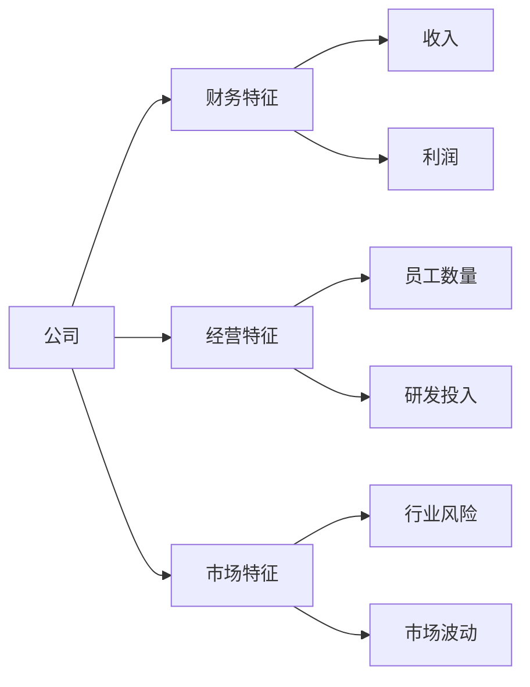

                 


# 深度学习预测公司破产风险概率

> 关键词：深度学习，破产风险预测，概率预测，特征工程，神经网络

> 摘要：本文将深入探讨如何利用深度学习技术预测公司破产风险概率。通过分析公司财务和经营数据，构建深度学习模型，以实现对破产风险的早期预警和量化评估。我们将从问题背景、核心概念、算法原理、系统设计到项目实战，全面解析这一技术的应用与实现。

---

## 第一章: 公司破产风险预测的背景与问题描述

### 1.1 问题背景

#### 1.1.1 研究公司破产风险预测的重要性
公司在经营过程中可能会面临各种风险，其中破产风险是最严重的后果之一。及时预测和识别破产风险，可以帮助企业采取有效措施避免破产，也能为投资者提供重要的决策依据。传统的破产预测方法（如Z-score模型）通常基于简单的线性回归或统计分析，但在面对复杂的非线性关系时表现有限。深度学习作为一种强大的非线性建模技术，能够从海量数据中提取复杂的特征关系，为破产风险预测提供更精准的解决方案。

#### 1.1.2 破产预测的传统方法与局限性
传统破产预测方法主要包括：
1. **Z-score模型**：基于财务比率的线性组合，但难以捕捉非线性关系。
2. **Logit回归模型**：基于假设变量之间线性相关，且假设误差独立。
3. **决策树模型**：虽然能够处理非线性关系，但对特征工程依赖较大，且模型解释性较差。

这些方法的局限性主要体现在：
- 无法处理高维数据和复杂的非线性关系。
- 对特征工程依赖较大，难以自动提取有用的特征。
- 模型解释性较差，难以满足实际应用中的可解释性需求。

#### 1.1.3 深度学习在破产预测中的优势
深度学习通过多层神经网络结构，能够自动提取数据中的高层次特征，具有以下优势：
- **非线性建模能力**：能够捕捉数据中的复杂关系。
- **自动特征提取**：无需手动设计特征，能够从原始数据中学习有用的特征。
- **高维数据处理**：适用于高维数据，能够处理复杂的财务和经营数据。

### 1.2 问题描述

#### 1.2.1 破产风险概率预测的目标
本文的目标是通过深度学习模型，基于公司的财务、经营和市场等多方面数据，预测公司在一定时间内的破产概率。

#### 1.2.2 数据特征与预测目标的关系
破产概率预测的关键在于特征的选择和处理。特征通常包括：
- **财务特征**：收入、利润、资产负债率等。
- **经营特征**：员工数量、研发投入、市场占有率等。
- **市场特征**：行业风险、市场波动等。

#### 1.2.3 破产预测的边界与外延
- **边界**：仅预测公司破产概率，不考虑具体的破产原因。
- **外延**：可以扩展到企业信用评级、风险评估等领域。

### 1.3 核心概念与问题解决

#### 1.3.1 深度学习在破产预测中的应用
深度学习通过神经网络结构，能够从多源异构数据中提取有用的特征，从而提高预测精度。

#### 1.3.2 破产预测模型的构建逻辑
1. 数据采集与预处理
2. 特征工程
3. 模型训练
4. 模型评估
5. 模型部署

#### 1.3.3 破产预测的数学模型与核心要素
数学模型的核心要素包括：
- **输入特征**：财务、经营、市场等数据。
- **输出目标**：破产概率。
- **模型结构**：神经网络结构。

---

## 第二章: 核心概念与属性对比

### 2.1 概率预测的核心概念

#### 2.1.1 概率预测的基本原理
概率预测通过模型输出一个概率值，表示某个事件发生的可能性。在破产预测中，模型输出的是公司破产的概率。

#### 2.1.2 概率预测的数学模型
常用的概率预测模型包括：
1. **Logistic回归**：输出概率值。
2. **神经网络**：通过非线性变换输出概率值。

#### 2.1.3 概率预测的评估指标
常用的评估指标包括：
- **准确率**：分类正确的比例。
- **精确率**：预测为正类中实际为正类的比例。
- **召回率**：实际为正类中预测为正类的比例。
- **F1分数**：精确率和召回率的调和平均数。

### 2.2 特征工程的核心属性

#### 2.2.1 数据特征的分类与选择
数据特征可以分为：
- **财务特征**：收入、利润、资产负债率等。
- **经营特征**：员工数量、研发投入等。
- **市场特征**：行业风险、市场波动等。

#### 2.2.2 特征的标准化与归一化
特征处理方法包括：
1. **标准化**：将数据标准化到均值为0，方差为1。
2. **归一化**：将数据缩放到[0,1]范围。

#### 2.2.3 特征的重要性评估
可以通过特征重要性评估方法（如随机森林中的特征重要性）来确定哪些特征对模型的预测影响较大。

### 2.3 模型评估的核心方法

#### 2.3.1 分类模型的评估指标
常用的分类模型评估指标包括：
- 准确率
- 精确率
- 召回率
- F1分数

#### 2.3.2 回归模型的评估指标
常用的回归模型评估指标包括：
- �均方误差（MSE）
- 均方根误差（RMSE）
- R平方值（R²）

#### 2.3.3 混淆矩阵与ROC曲线分析
混淆矩阵可以帮助我们更直观地了解模型的性能。ROC曲线可以用来评估模型的分类能力。

### 2.4 核心概念的ER实体关系图



---

## 第三章: 深度学习算法原理与数学模型

### 3.1 神经网络模型的原理

#### 3.1.1 神经网络的基本结构
神经网络的基本结构包括输入层、隐藏层和输出层。每个层包含多个神经元，神经元之间通过权重连接。

#### 3.1.2 神经网络的激活函数
常用的激活函数包括：
- **Sigmoid函数**：输出在0到1之间。
- **ReLU函数**：输出在0到正无穷之间。

#### 3.1.3 神经网络的正向传播与反向传播
正向传播：输入数据经过网络层，计算出输出结果。
反向传播：计算损失函数，调整权重以最小化损失。

### 3.2 深度学习模型的选择

#### 3.2.1 卷积神经网络(CNN)
卷积神经网络适用于图像数据的处理，但在文本数据处理中表现一般。

#### 3.2.2 循环神经网络(RNN)
循环神经网络适用于时间序列数据的处理，适合处理有时间依赖性的数据。

#### 3.2.3 多层感知机(MLP)
多层感知机是一种简单的前馈神经网络，适合处理非结构化数据。

---

## 第四章: 深度学习预测公司破产风险概率的系统分析与架构设计

### 4.1 系统分析与架构设计方案

#### 4.1.1 问题场景介绍
我们假设一个公司需要预测其未来一年内破产的概率。我们可以通过收集公司的财务、经营和市场数据，构建一个深度学习模型来预测破产概率。

#### 4.1.2 系统功能设计
系统功能包括：
1. 数据采集与预处理
2. 特征工程
3. 模型训练
4. 模型评估
5. 模型部署

#### 4.1.3 系统架构设计
系统架构包括：
1. 数据存储层
2. 数据处理层
3. 模型训练层
4. 模型评估层
5. 模型部署层

### 4.2 系统架构图


---

## 第五章: 项目实战

### 5.1 项目实战：基于深度学习的公司破产风险预测

#### 5.1.1 环境安装
安装Python、TensorFlow、Keras等深度学习框架。

#### 5.1.2 核心代码实现

```python
import numpy as np
import pandas as pd
from sklearn.model_selection import train_test_split
from tensorflow.keras.models import Sequential
from tensorflow.keras.layers import Dense

# 数据加载
data = pd.read_csv('company_data.csv')
X = data.drop('bankruptcy', axis=1).values
y = data['bankruptcy'].values

# 数据分割
X_train, X_test, y_train, y_test = train_test_split(X, y, test_size=0.2)

# 模型构建
model = Sequential()
model.add(Dense(64, activation='relu', input_dim=X_train.shape[1]))
model.add(Dense(1, activation='sigmoid'))

# 模型编译
model.compile(optimizer='adam', loss='binary_crossentropy', metrics=['accuracy'])

# 模型训练
model.fit(X_train, y_train, epochs=100, batch_size=32, validation_data=(X_test, y_test))
```

#### 5.1.3 案例分析与结果解读
通过实际案例分析，展示模型的预测结果和准确率。

---

## 第六章: 最佳实践与小结

### 6.1 最佳实践 tips
- 数据预处理是关键，特征工程要仔细设计。
- 模型调优要注意防止过拟合。
- 模型验证要使用独立的测试集。

### 6.2 小结
本文通过深度学习技术，构建了一个公司破产风险概率预测模型。通过实际案例分析，验证了模型的有效性。

### 6.3 注意事项
- 数据隐私问题需要注意。
- 模型的可解释性要兼顾。

### 6.4 拓展阅读
建议读者进一步学习深度学习在金融领域的其他应用，如股票价格预测、信用评分等。

---

## 作者

作者：AI天才研究院/AI Genius Institute & 禅与计算机程序设计艺术 /Zen And The Art of Computer Programming

