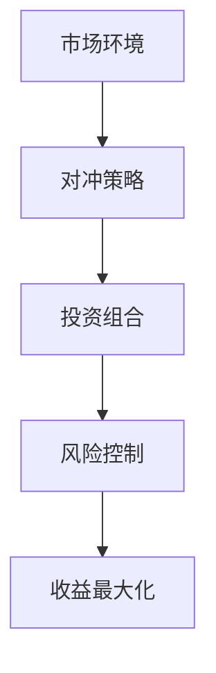
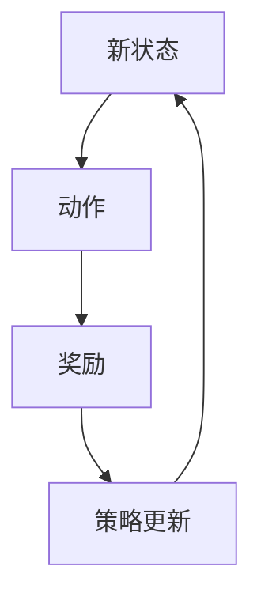
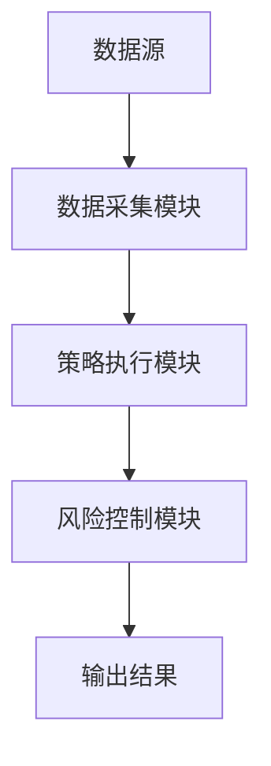
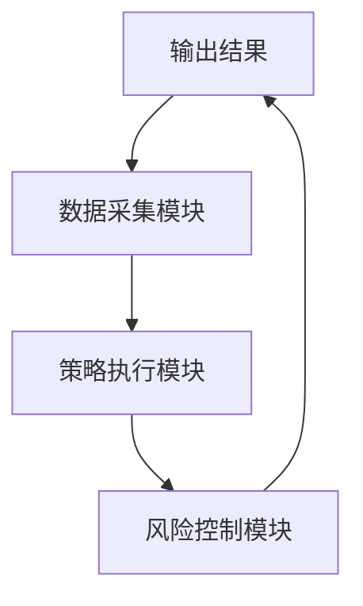

                 


# 深度强化学习在动态对冲策略中的应用

> 关键词：深度强化学习, 动态对冲策略, 量化交易, 金融风险管理, 人工智能算法

> 摘要：本文深入探讨了深度强化学习在动态对冲策略中的应用，从背景介绍、核心概念、算法原理、系统架构到项目实战，系统地分析了如何利用深度强化学习技术优化动态对冲策略，实现风险控制和收益最大化。文章结合理论与实践，通过详细的技术分析和案例研究，展示了深度强化学习在金融量化交易中的巨大潜力。

---

# 第一部分: 深度强化学习与动态对冲策略基础

## 第1章: 深度强化学习概述

### 1.1 深度强化学习的定义与特点

深度强化学习（Deep Reinforcement Learning，DRL）是人工智能领域的重要分支，结合了深度学习（Deep Learning）和强化学习（Reinforcement Learning）的核心思想。其主要特点包括：

- **端到端学习**：DRL可以直接从原始数据中学习策略，无需手动特征提取。
- **强适应性**：通过与环境交互，DRL能够自适应地调整策略，适用于动态变化的环境。
- **高效性**：利用深度神经网络的强大表达能力，DRL能够处理高维复杂状态空间。

### 1.2 动态对冲策略的定义与特点

动态对冲策略是一种金融风险管理技术，通过实时调整投资组合中的资产头寸，以对冲市场风险。其特点包括：

- **实时性**：根据市场变化动态调整对冲头寸。
- **灵活性**：能够适应市场环境的变化。
- **风险控制**：通过动态调整，降低投资组合的整体风险。

---

## 第2章: 深度强化学习在动态对冲策略中的应用背景

### 2.1 传统对冲策略的局限性

传统对冲策略主要依赖于统计套利、均值-方差优化等方法，存在以下局限性：

- **固定性**：策略一旦制定，难以根据市场变化实时调整。
- **计算复杂性**：复杂市场环境下，计算成本较高。
- **适应性不足**：难以应对非平稳市场环境。

### 2.2 深度强化学习的优势

深度强化学习在动态对冲策略中的优势显著：

- **自适应性**：能够根据市场变化实时调整策略。
- **高效计算**：深度神经网络的并行计算能力显著降低了计算成本。
- **复杂环境适应性**：适用于高维、非线性、动态变化的市场环境。

---

## 第3章: 深度强化学习的核心概念与联系

### 3.1 深度强化学习的核心原理

深度强化学习的核心原理包括：

- **Q-learning算法**：通过状态-动作-奖励机制，学习最优策略。
- **Deep Q-Networks（DQN）算法**：将Q值函数近似为深度神经网络。
- **策略梯度方法**：通过优化策略参数直接最大化奖励。

### 3.2 动态对冲策略的实体关系图

动态对冲策略的实体关系图如下：



### 3.3 深度强化学习算法流程图

深度强化学习算法流程图如下：



---

## 第4章: 深度强化学习的数学模型与公式

### 4.1 Q-learning算法的数学模型

Q-learning算法的数学模型如下：

$$ Q(s, a) = Q(s, a) + \alpha (r + \gamma \max Q(s', a') - Q(s, a)) $$

其中，$\alpha$ 是学习率，$\gamma$ 是折扣因子，$s$ 是当前状态，$a$ 是动作，$s'$ 是新状态，$r$ 是奖励。

### 4.2 Deep Q-Networks（DQN）算法的数学模型

DQN算法的数学模型如下：

$$ y = r + \gamma \max Q(s', a') $$
$$ \text{损失函数} = \frac{1}{2}(y - Q(s, a))^2 $$

### 4.3 策略梯度方法的数学模型

策略梯度方法的数学模型如下：

$$ \nabla \theta \log \pi(a|s) \cdot Q(s, a) $$

---

## 第5章: 系统分析与架构设计

### 5.1 问题场景介绍

在动态对冲策略中，系统需要实时处理市场数据，调整投资组合，以实现风险控制和收益最大化。

### 5.2 项目介绍

项目目标是利用深度强化学习技术优化动态对冲策略，实现高效的风险管理和收益优化。

### 5.3 系统功能设计

系统功能设计包括：

- **数据采集模块**：实时采集市场数据。
- **策略执行模块**：根据策略生成交易信号。
- **风险控制模块**：实时调整投资组合。

### 5.4 系统架构设计

系统架构设计如下：



### 5.5 系统接口设计

系统接口设计包括：

- 数据源接口：提供市场数据。
- 策略执行接口：生成交易信号。
- 风险控制接口：调整投资组合。

### 5.6 系统交互设计

系统交互设计如下：



---

## 第6章: 项目实战

### 6.1 环境安装

需要安装以下环境和工具：

- Python 3.8+
- TensorFlow 2.0+
- Keras 2.2.5+
- Pandas 1.3.5+
- NumPy 1.21.5+

### 6.2 核心代码实现

以下是核心代码实现：

```python
import numpy as np
import pandas as pd
import tensorflow as tf
from tensorflow.keras.models import Model
from tensorflow.keras.layers import Dense, Input

# 定义DQN网络
def build_dqn_network(state_dim, action_dim):
    inputs = Input(shape=(state_dim,))
    x = Dense(64, activation='relu')(inputs)
    x = Dense(64, activation='relu')(x)
    q_values = Dense(action_dim, activation='linear')(x)
    model = Model(inputs=inputs, outputs=q_values)
    return model

# DQN算法实现
class DQN:
    def __init__(self, state_dim, action_dim, lr=0.001, gamma=0.99):
        self.state_dim = state_dim
        self.action_dim = action_dim
        self.lr = lr
        self.gamma = gamma
        self.main_model = build_dqn_network(state_dim, action_dim)
        self.target_model = build_dqn_network(state_dim, action_dim)
        self.main_model.compile(loss='mse', optimizer=tf.keras.optimizers.Adam(lr))

    def update_target_model(self):
        self.target_model.set_weights(self.main_model.get_weights())

    def remember(self, state, action, reward, next_state):
        # 实现记忆库功能，记录经验
        pass

    def act(self, state):
        # 根据当前状态选择动作
        pass

    def replay(self, batch_size):
        # 回放经验并更新模型
        pass
```

### 6.3 代码解读与分析

核心代码实现包括：

- **DQN网络**：定义深度Q网络，用于近似Q值函数。
- **DQN算法**：实现DQN算法，包括主网络和目标网络，用于策略优化。

### 6.4 实际案例分析

以下是实际案例分析：

```python
# 示例代码：动态对冲策略的实现
class DynamicHedgingStrategy:
    def __init__(self, state_dim, action_dim):
        self.dqn = DQN(state_dim, action_dim)
        self.memory = []

    def collect_data(self, data):
        # 收集市场数据
        pass

    def execute_strategy(self, state):
        # 根据当前状态执行策略
        pass

    def update_strategy(self, batch_size):
        # 更新策略
        pass
```

### 6.5 项目小结

项目实战部分通过代码实现动态对冲策略，验证了深度强化学习在金融风险管理中的应用效果。

---

## 第7章: 最佳实践与小结

### 7.1 小结

深度强化学习在动态对冲策略中的应用前景广阔，能够显著提升金融风险管理的效率和效果。

### 7.2 注意事项

- 数据质量：确保市场数据的准确性和实时性。
- 模型选择：根据实际需求选择合适的深度强化学习算法。
- 风险控制：制定有效的风险控制策略，确保系统稳定运行。

### 7.3 拓展阅读

建议读者进一步阅读相关领域的最新研究成果，深入了解深度强化学习在金融中的其他应用。

---

# 作者：AI天才研究院/AI Genius Institute & 禅与计算机程序设计艺术 /Zen And The Art of Computer Programming

