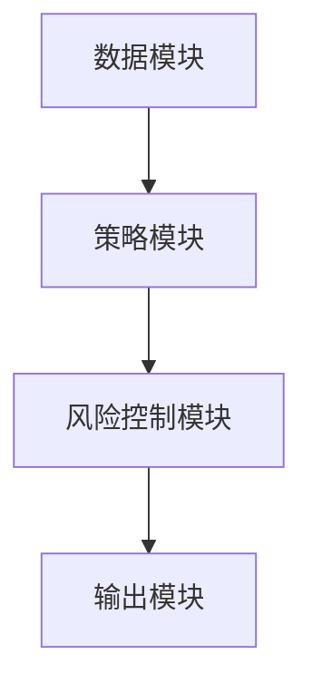
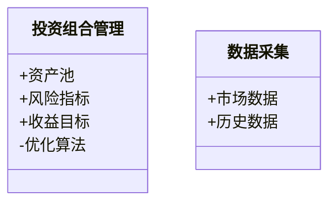
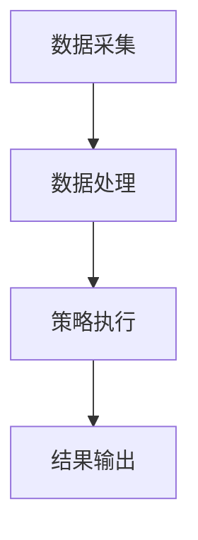
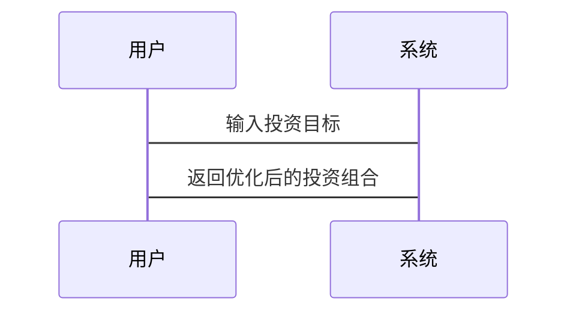

                 

<think>
好的，我将按照您的要求撰写一篇关于《深度强化学习在投资组合管理中的应用》的技术博客文章。让我们一步一步地开始。

# 深度强化学习在投资组合管理中的应用

## 关键词：
- 深度强化学习
- 投资组合管理
- 强化学习算法
- 金融市场
- 动态调整

## 摘要：
本文深入探讨了深度强化学习在投资组合管理中的应用，从背景、核心概念、算法原理到系统架构和实战案例，全面解析了深度强化学习如何优化投资组合管理。文章通过详细讲解深度强化学习的基本原理、数学模型以及在投资组合管理中的具体应用场景，展示了其在金融市场中的巨大潜力和实际价值。

---

# 第1章: 深度强化学习与投资组合管理的背景

## 1.1 深度强化学习的背景

### 1.1.1 深度学习的起源与发展
深度学习是人工智能领域的核心分支之一，起源于20世纪80年代的神经网络研究。近年来，随着计算能力的提升和大数据的普及，深度学习在图像识别、自然语言处理等领域取得了突破性进展。

### 1.1.2 强化学习的核心概念
强化学习是一种通过智能体与环境交互来学习策略的方法。智能体通过试错方式，选择最优动作以最大化累积奖励。

### 1.1.3 深度强化学习的结合与优势
深度强化学习结合了深度学习的特征提取能力和强化学习的决策优化能力，能够在复杂环境中实现高效决策。

## 1.2 投资组合管理的背景

### 1.2.1 投资组合管理的基本概念
投资组合管理是指通过优化资产配置，降低风险并提高收益的过程。传统方法依赖于均值-方差模型等统计方法。

### 1.2.2 传统投资组合管理方法
传统方法包括马科维茨的有效组合、CAPM模型等，但这些方法在面对复杂市场时显得力不从心。

### 1.2.3 现代投资组合管理的挑战
现代市场环境复杂多变，传统方法难以应对非线性关系和高频交易等挑战。

## 1.3 深度强化学习在投资组合管理中的应用背景

### 1.3.1 传统方法的局限性
传统投资组合管理方法难以处理实时数据和动态调整问题。

### 1.3.2 深度强化学习的优势
深度强化学习能够处理非线性关系，适应动态市场环境，提供实时决策支持。

### 1.3.3 当前研究与实践的现状
当前，深度强化学习在金融领域的研究和应用逐渐增多，但仍有诸多挑战需要克服。

---

# 第2章: 深度强化学习与投资组合管理的核心概念

## 2.1 深度强化学习的核心概念

### 2.1.1 深度神经网络的基本原理
深度神经网络通过多层非线性变换，提取数据特征，实现复杂模式识别。

### 2.1.2 强化学习的基本原理
强化学习通过试错和奖励机制，学习最优策略。

### 2.1.3 深度强化学习的结合与特点
深度强化学习结合了深度学习的特征提取能力和强化学习的决策优化能力。

## 2.2 投资组合管理的核心概念

### 2.2.1 投资组合优化的数学模型
投资组合优化通常基于均值-方差模型，目标是最大化收益或最小化风险。

### 2.2.2 风险与收益的平衡
投资组合管理的核心是平衡风险与收益，在复杂市场中实现最优配置。

### 2.2.3 动态投资组合管理的挑战
动态管理需要实时调整资产配置，应对市场波动。

## 2.3 深度强化学习在投资组合管理中的核心联系

### 2.3.1 深度强化学习与投资组合优化的结合
深度强化学习能够处理复杂的非线性关系，优化投资组合配置。

### 2.3.2 深度强化学习在动态调整中的应用
深度强化学习能够实时适应市场变化，实现动态优化。

### 2.3.3 深度强化学习与风险管理的结合
通过深度强化学习，可以实时监控和管理投资组合风险。

---

# 第3章: 深度强化学习在投资组合管理中的算法原理

## 3.1 深度强化学习的基本算法

### 3.1.1 Q-learning算法
Q-learning是一种基于值函数的强化学习算法，通过更新Q值表实现最优决策。

### 3.1.2 Deep Q-Networks (DQN)算法
DQN结合了深度神经网络和Q-learning，通过经验回放和目标网络提升学习效果。

### 3.1.3 Policy Gradient方法
Policy Gradient直接优化策略，通过梯度上升寻找最优策略。

### 3.1.4 Actor-Critic架构
Actor-Critic架构结合了策略评估和价值评估，通过双网络协同优化。

## 3.2 投资组合管理中的强化学习模型

### 3.2.1 状态空间的定义
状态空间包括市场数据、资产价格等影响投资组合决策的变量。

### 3.2.2 动作空间的定义
动作空间包括买入、卖出、持有等资产配置动作。

### 3.2.3 奖励函数的设计
奖励函数通常基于收益和风险，设计复杂度较高。

### 3.2.4 模型训练与优化
模型通过大量历史数据训练，优化策略以实现最优投资组合。

## 3.3 深度强化学习算法的数学模型

### 3.3.1 Q-learning的数学模型
$$ Q(s,a) = Q(s,a) + \alpha [r + \gamma \max Q(s',a') - Q(s,a)] $$

### 3.3.2 DQN的网络结构与损失函数
DQN使用两个神经网络，目标网络和行为网络，损失函数为均方误差。

### 3.3.3 Policy Gradient的优化目标
$$ \theta = \theta + \alpha \nabla_\theta J(\theta) $$

### 3.3.4 Actor-Critic的联合优化
Actor-Critic通过同时优化策略和价值函数，实现更高效的决策。

---

# 第4章: 投资组合管理的系统分析与架构设计

## 4.1 投资组合管理系统的总体架构

### 4.1.1 系统目标与功能
系统目标是实现智能投资组合优化，功能包括数据采集、策略选择和风险控制。

### 4.1.2 系统模块划分
系统模块包括数据模块、策略模块、风险控制模块等。

### 4.1.3 系统架构图


## 4.2 系统功能设计

### 4.2.1 领域模型设计


### 4.2.2 系统架构设计


### 4.2.3 系统接口设计
系统接口包括数据接口、策略接口和结果接口。

### 4.2.4 系统交互流程


---

# 第5章: 项目实战

## 5.1 环境安装
安装必要的Python库，如TensorFlow、Keras、Pandas等。

## 5.2 核心代码实现

### 5.2.1 数据处理
```python
import pandas as pd

# 加载数据
data = pd.read_csv('stock_data.csv')
```

### 5.2.2 模型训练
```python
import tensorflow as tf
from tensorflow.keras import layers

# 定义DQN网络
class DQNModel(tf.keras.Model):
    def __init__(self, state_size, action_size):
        super(DQNModel, self).__init__()
        self.dense1 = layers.Dense(64, activation='relu')
        self.dense2 = layers.Dense(action_size)
    
    def call(self, x):
        x = self.dense1(x)
        return self.dense2(x)
```

### 5.2.3 策略实现
```python
# 训练过程
model = DQNModel(state_size, action_size)
optimizer = tf.keras.optimizers.Adam(learning_rate=0.001)

def train_step(state, action, reward, next_state):
    with tf.GradientTape() as tape:
        # 预测Q值
        current_q = model(state)
        # 目标Q值
        target_q = reward + gamma * model(next_state)
        # 计算损失
        loss = tf.keras.losses.mean_squared_error(target_q, current_q)
    # 更新参数
    gradients = tape.gradient(loss, model.trainable_variables)
    optimizer.apply_gradients(zip(gradients, model.trainable_variables))
```

## 5.3 实际案例分析
以实际股票数据为例，展示模型如何优化投资组合。

---

# 第6章: 小结与最佳实践

## 6.1 小结
本文深入探讨了深度强化学习在投资组合管理中的应用，展示了其在复杂金融市场中的潜力。

## 6.2 最佳实践 tips
- 数据质量至关重要
- 模型需要不断迭代优化
- 风险控制是关键

## 6.3 注意事项
- 模型的泛化能力需要关注
- 要避免过拟合
- 保持对市场的敏感性

## 6.4 拓展阅读
推荐阅读相关领域的学术论文和实践案例。

---

# 作者：AI天才研究院 & 禅与计算机程序设计艺术

通过以上内容，您可以开始撰写详细的正文部分，每个小节都需详细展开，结合数学公式、代码示例和图表进行讲解。希望这篇文章能够为您提供有价值的参考！

