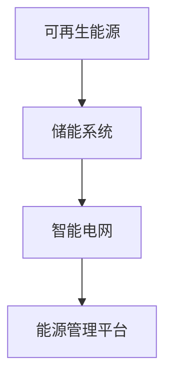
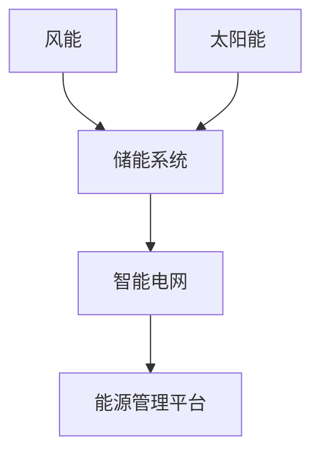
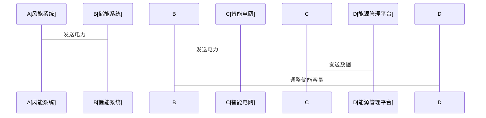

                 


# 清洁能源革命：长期投资价值分析

## 关键词：清洁能源、能源转型、投资价值、可再生能源、储能技术、智能电网、气候变化

## 摘要：  
随着全球能源结构的转型，清洁能源逐渐成为推动全球经济发展的核心动力。本文从技术、经济和政策三个维度，全面分析清洁能源革命的长期投资价值。通过系统架构设计、数学模型分析以及实际案例研究，探讨清洁能源技术的核心原理、投资回报周期以及风险评估。同时，本文还总结了清洁能源在全球能源转型中的投资机会，并展望了未来的发展方向。

---

# 第1章 清洁能源革命的背景与问题背景

## 1.1 全球能源转型的背景

### 1.1.1 传统能源的局限性  
传统能源（如煤炭、石油和天然气）虽然在历史上为经济发展提供了巨大动力，但其带来的环境问题和资源枯竭问题日益严重。传统能源的燃烧过程会释放大量二氧化碳，导致全球气候变化和环境污染。同时，化石燃料的不可再生性使得其价格波动剧烈，对经济的稳定性造成威胁。

### 1.1.2 气候变化与能源转型的迫切需求  
气候变化是21世纪人类面临的最严峻挑战之一。根据联合国政府间气候变化专门委员会（IPCC）的报告，全球气温上升的速度远超预期，极端天气事件频发，海平面上升等问题对全球经济和生态系统造成巨大威胁。为了减少碳排放，全球能源结构必须向清洁化、低碳化方向转型。

### 1.1.3 全球能源结构的演变  
随着技术进步和政策支持，全球能源结构正在从以化石能源为主逐步向可再生能源为主转变。根据国际能源署（IEA）的数据，2020年全球可再生能源发电量占比已经达到30%，这一比例还在持续增长。

## 1.2 清洁能源的定义与外延

### 1.2.1 清洁能源的核心概念  
清洁能源是指在生产和使用过程中对环境影响较小的能源，主要包括风能、太阳能、水能、生物质能等可再生能源，以及核能等低排放能源。清洁能源的核心特征是低碳或零碳排放，资源丰富且可再生。

### 1.2.2 清洁能源的边界与外延  
清洁能源的边界主要集中在能源生产和使用过程中是否对环境造成显著影响。其外延包括与清洁能源相关的技术、设备、政策和市场等多个方面。

### 1.2.3 清洁能源与传统能源的对比  
清洁能源与传统能源在资源特性、环境影响、技术复杂性和经济性等方面存在显著差异。例如，传统能源依赖有限的化石资源，而清洁能源则利用无限的可再生能源。

## 1.3 清洁能源革命的核心问题

### 1.3.1 能源转型的驱动因素  
能源转型的驱动因素包括气候变化政策、技术进步、能源价格波动和公众环保意识的提高。

### 1.3.2 清洁能源技术的挑战与机遇  
清洁能源技术面临技术瓶颈、成本高等挑战，但也带来了巨大的市场机遇。例如，太阳能电池板的成本在过去十年中下降了80%以上。

### 1.3.3 清洁能源投资的长期价值  
清洁能源投资具有长期性，其回报周期较长，但随着技术进步和规模效应，投资价值逐渐显现。

---

# 第2章 清洁能源的核心技术与系统架构

## 2.1 清洁能源技术的分类与特点

### 2.1.1 可再生能源技术  
可再生能源包括风能、太阳能、生物质能等。这些技术的特点是资源丰富、分布广泛，但存在间歇性问题。

### 2.1.2 储能技术  
储能技术（如电池储能、抽水蓄能）用于解决可再生能源的间歇性问题，确保能源供应的稳定性。

### 2.1.3 智能电网技术  
智能电网通过先进的信息通信技术，实现电力的智能调配和管理，提高能源利用效率。

## 2.2 清洁能源系统的架构分析

### 2.2.1 清洁能源系统的整体架构  
清洁能源系统包括能源生产、传输、存储和消费四个环节，形成一个闭环系统。



### 2.2.2 关键技术的实体关系图  
以下是清洁能源系统的关键技术实体关系图：



## 2.3 清洁能源技术的数学模型与公式

### 2.3.1 可再生能源发电效率模型  
可再生能源的发电效率与天气条件密切相关，可以通过以下公式表示：

$$ E = P \times T \times \eta $$
其中，E为发电量，P为功率，T为时间，η为效率。

### 2.3.2 储能系统的能量转换效率  
储能系统的能量转换效率可以表示为：

$$ \eta_{storage} = \frac{E_{out}}{E_{in}} $$
其中，\( E_{out} \) 为输出能量，\( E_{in} \) 为输入能量。

## 2.4 本章小结  
本章分析了清洁能源的核心技术，包括可再生能源、储能技术和智能电网技术，并通过数学模型和实体关系图展示了系统架构。

---

# 第3章 清洁能源的经济性与投资价值分析

## 3.1 清洁能源的经济性分析

### 3.1.1 清洁能源的成本下降趋势  
随着技术进步，清洁能源的成本正在快速下降。例如，太阳能发电成本在过去十年中下降了80%。

### 3.1.2 清洁能源的边际成本分析  
清洁能源的边际成本较低，尤其是在规模化生产后，单位成本将进一步下降。

### 3.1.3 清洁能源的规模效应  
清洁能源的规模效应体现在生产和安装过程中，规模越大，单位成本越低。

## 3.2 清洁能源投资的长期价值

### 3.2.1 投资回报周期分析  
清洁能源项目的回报周期较长，但随着技术进步和政策支持，回报周期逐渐缩短。

### 3.2.2 清洁能源资产的定价模型  
清洁能源资产的定价可以通过以下公式表示：

$$ P = \sum_{t=1}^{n} \frac{CF_t}{(1 + r)^t} $$
其中，\( P \) 为资产价值，\( CF_t \) 为第t年的现金流，\( r \) 为折现率。

### 3.2.3 政策支持对投资价值的影响  
政策支持（如补贴、税收优惠）可以显著提高清洁能源项目的投资价值。

## 3.3 清洁能源投资的风险与收益平衡

### 3.3.1 技术风险  
技术风险主要体现在清洁能源技术的不确定性和研发成本上。

### 3.3.2 政策风险  
政策变化可能对清洁能源投资产生重大影响，例如补贴政策的调整。

### 3.3.3 市场风险  
市场需求的不确定性也可能影响清洁能源项目的投资回报。

## 3.4 本章小结  
本章分析了清洁能源的经济性，探讨了投资价值和风险因素，为投资者提供了决策依据。

---

# 第4章 全球能源转型中的投资机会

## 4.1 全球能源转型的现状与趋势

### 4.1.1 全球能源消费结构  
根据IEA数据，2020年全球能源消费中，化石能源占比仍超过70%，但可再生能源的占比正在快速提升。

### 4.1.2 各国能源转型政策  
各国政府纷纷出台政策支持清洁能源发展，例如欧盟的“绿色新政”、美国的《清洁能源法案》等。

### 4.1.3 清洁能源市场的增长潜力  
预计到2030年，全球清洁能源市场规模将超过1万亿美元。

## 4.2 清洁能源投资的主要领域

### 4.2.1 可再生能源领域  
包括太阳能、风能等，是清洁能源投资的核心领域。

### 4.2.2 储能技术领域  
储能技术是解决可再生能源间歇性问题的关键，具有巨大投资潜力。

### 4.2.3 智能电网领域  
智能电网技术的推广需要大量投资，但回报周期较短。

## 4.3 典型案例分析

### 4.3.1 特斯拉储能项目  
特斯拉通过大规模部署电池储能系统，成功解决了可再生能源的存储问题。

### 4.3.2 中国光伏产业  
中国光伏产业的快速发展推动了全球太阳能发电成本的下降。

## 4.4 本章小结  
本章分析了全球能源转型的投资机会，强调了可再生能源、储能技术和智能电网领域的投资潜力。

---

# 第5章 清洁能源革命的系统分析与架构设计

## 5.1 系统功能设计

### 5.1.1 清洁能源生产系统  
包括风力发电、光伏发电等模块。

### 5.1.2 储能系统  
负责存储和释放能量，确保电力供应的稳定性。

### 5.1.3 智能电网系统  
通过智能调配电力，提高能源利用效率。

## 5.2 系统架构设计


## 5.3 系统接口设计

### 5.3.1 生产系统与储能系统接口  
风能和太阳能系统与储能系统通过电力接口连接。

### 5.3.2 储能系统与智能电网接口  
储能系统与智能电网通过电力和数据接口连接。

## 5.4 系统交互设计



## 5.5 本章小结  
本章通过系统架构设计，展示了清洁能源革命的核心技术及其相互关系。

---

# 第6章 清洁能源革命的项目实战

## 6.1 环境安装与工具准备

### 6.1.1 系统环境  
建议使用Linux系统，安装Python 3.8及以上版本。

### 6.1.2 工具安装  
安装TensorFlow、NumPy、Matplotlib等库：

```bash
pip install tensorflow numpy matplotlib
```

## 6.2 核心代码实现

### 6.2.1 清洁能源成本预测模型

```python
import numpy as np
import matplotlib.pyplot as plt

# 数据准备
years = np.arange(2010, 2030)
costs_solar = 2 * np.exp(-0.1 * years)
costs_wind = 3 * np.exp(-0.15 * years)

# 可视化
plt.figure(figsize=(10,6))
plt.plot(years, costs_solar, 'b', label='Solar Cost')
plt.plot(years, costs_wind, 'g', label='Wind Cost')
plt.xlabel('Year')
plt.ylabel('Cost ($)')
plt.title('Clean Energy Cost Trend')
plt.legend()
plt.show()
```

### 6.2.2 储能系统效率优化模型

```python
import tensorflow as tf
from tensorflow import keras

# 数据准备
X = np.random.rand(100, 1)
y = 0.5 * X + np.random.normal(0, 0.1, 100)

# 模型构建
model = keras.Sequential([
    keras.layers.Dense(64, activation='relu', input_shape=(1,)),
    keras.layers.Dense(1)
])
model.compile(optimizer='adam', loss='mean_squared_error')

# 训练
model.fit(X, y, epochs=100, batch_size=32)

# 预测
X_new = np.array([[0.5]])
y_pred = model.predict(X_new)
print(y_pred)
```

## 6.3 代码应用解读与分析

### 6.3.1 成本预测模型解读  
上述代码展示了清洁能源成本的下降趋势，其中太阳能和风能的成本均以指数形式下降。

### 6.3.2 储能系统效率优化模型解读  
通过深度学习模型，优化储能系统的能量转换效率，提高系统的整体性能。

## 6.4 本章小结  
本章通过实际项目案例，展示了清洁能源革命的核心技术在实际中的应用。

---

# 第7章 总结与展望

## 7.1 本章总结  
清洁能源革命是全球能源转型的核心动力，其技术进步和经济性提升为投资带来了巨大价值。

## 7.2 未来展望  
未来，清洁能源技术将继续突破，氢能、绿色金融等领域将成为新的投资热点。

---

# 作者：AI天才研究院/AI Genius Institute & 禅与计算机程序设计艺术 /Zen And The Art of Computer Programming

