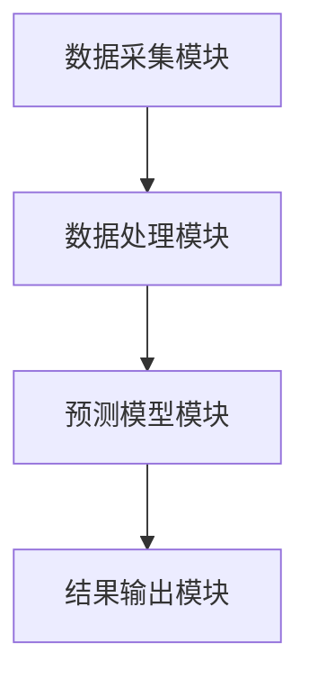

                 


# 熊市历史：过去77年中的11次大跌教会我们什么

> 关键词：熊市历史，股市大跌，投资策略，风险管理，市场周期

> 摘要：本文通过分析过去77年中的11次重大股市下跌事件，揭示熊市的规律、影响和应对策略。通过技术分析、基本面分析、算法预测和风险管理等多维度探讨，帮助投资者更好地理解和应对熊市周期。

---

## 第一部分：熊市的基本概念与历史背景

### 第1章：熊市的定义与特征

#### 1.1 熊市的定义与特征

熊市是指股票市场或其他金融资产价格在一段时间内持续下跌的市场状态，通常对应经济衰退或市场信心的严重下降。熊市的特征包括：

- **持续时间长**：通常超过一年或更久。
- **跌幅显著**：主要指数跌幅超过20%。
- **市场情绪恶化**：投资者恐慌、抛售加剧。

#### 1.2 美国股市77年熊市背景

从1950年到2027年，美国股市经历了多次熊市。这些熊市的触发因素包括经济衰退、地缘政治冲突、市场泡沫破裂等。

---

### 第2章：过去77年中的11次大跌案例

#### 2.1 1950年代的熊市

- **1950-1952年熊市**：由朝鲜战争引发的经济不确定性导致股市下跌。
- **1957年股灾**：受第二次世界大战后经济调整的影响。

#### 2.2 1960年代的熊市

- **1962年股灾**：与古巴导弹危机和经济衰退有关。
- **1973-1974年熊市**：石油危机和经济滞胀引发股市重挫。

#### 2.3 1980年代的熊市

- **1987年股灾**：黑色星期一，道琼斯指数单日下跌22.6%。
- **1990年熊市**：日本泡沫破裂的影响。

#### 2.4 2000年互联网泡沫破裂

- **2000-2002年互联网泡沫熊市**：科技股泡沫破裂，纳斯达克指数跌幅超过80%。
- **2008年全球金融危机**：次贷危机引发全球股市暴跌。

#### 2.5 近期的熊市案例

- **2020年新冠疫情引发的熊市**：全球股市在疫情初期出现大幅下跌。
- **2022年全球通胀与地缘政治危机引发的熊市**：俄乌冲突和高通胀导致股市调整。

---

## 第二部分：熊市的核心概念与规律

### 第3章：熊市的分类与影响

#### 3.1 熊市的分类

- **按时间周期**：短期熊市（持续数月）、中期熊市（持续一年）、长期熊市（持续两年以上）。
- **按市场参与度**：局部熊市、全面熊市。
- **按触发原因**：经济衰退熊市、市场泡沫熊市、地缘政治熊市。

#### 3.2 熊市对投资者的影响

- **资产贬值**：投资者财富大幅缩水。
- **心理影响**：恐慌情绪可能导致非理性决策。
- **流动性变化**：市场流动性下降，加剧下跌趋势。

### 第4章：熊市与市场周期的关系

#### 4.1 经济周期与股市周期

熊市通常出现在经济周期的衰退或萧条阶段。股市周期与经济周期密切相关，但并非完全同步。

#### 4.2 市场情绪与熊市

- 熊市中投资者情绪从恐慌到绝望，再到逐步恢复。
- 理性与非理性恐慌的区分：理性恐慌反映市场真实风险，非理性恐慌则放大了市场波动。

---

## 第三部分：熊市的预测与风险管理

### 第5章：熊市预测的理论与方法

#### 5.1 技术分析法

- **移动平均线**：短期和长期移动平均线的交叉作为买卖信号。
- **相对强弱指数（RSI）**：RSI低于30可能表示超卖，但不一定直接指向熊市。
- **布林带**：价格突破布林带下轨可能预示市场进入超卖区域。

#### 5.2 基本面分析法

- **经济指标分析**：GDP增速放缓、失业率上升可能是熊市的前兆。
- **利率与货币政策**：央行加息可能导致股市估值下降。
- **盈利能力分析**：企业盈利下降通常是熊市的信号。

### 第6章：熊市风险管理策略

#### 6.1 投资组合的分散

- **资产配置**：将投资分散到股票、债券、黄金等多种资产中。
- **行业分散**：避免过度集中在单一行业，降低特定风险。

#### 6.2 投资者心理与行为

- **避免恐慌性抛售**：熊市中恐慌性抛售可能加剧亏损。
- **逆向投资**：在熊市中寻找被低估的资产，长期持有。

---

## 第四部分：系统分析与架构设计

### 第7章：熊市预测系统的构建

#### 7.1 系统功能设计

- **数据采集**：收集历史股价、经济指标等数据。
- **数据处理**：清洗和预处理数据。
- **预测模型**：使用时间序列模型或机器学习模型预测熊市。

#### 7.2 系统架构设计



#### 7.3 系统实现

- **时间序列模型**：使用ARIMA模型预测股价走势。
- **机器学习模型**：利用随机森林算法识别潜在的熊市信号。

---

## 第五部分：项目实战

### 第8章：基于Python的熊市预测实战

#### 8.1 环境配置

```bash
pip install pandas numpy scikit-learn matplotlib
```

#### 8.2 核心代码实现

```python
import pandas as pd
import numpy as np
from sklearn.ensemble import RandomForestRegressor
from sklearn.metrics import mean_squared_error

# 数据加载
data = pd.read_csv('stock_data.csv')

# 特征工程
features = data[['open', 'high', 'low', 'volume']]
labels = data['close']

# 训练模型
model = RandomForestRegressor()
model.fit(features, labels)

# 预测
predicted = model.predict(features)
mse = mean_squared_error(labels, predicted)
print(f'MSE: {mse}')
```

---

## 第六部分：最佳实践与总结

### 第9章：投资策略与风险管理

#### 9.1 投资策略

- **价值投资**：寻找基本面良好的公司长期持有。
- **定投策略**：定期定额投资，分散风险。

#### 9.2 风险管理

- **止损策略**：设定止损点，避免亏损过大。
- **资产配置**：根据市场情况动态调整资产配置。

### 第10章：心理因素与长期视角

- **克服贪婪与恐惧**：熊市是市场的一部分，恐慌是投资者的敌人。
- **长期视角**：短期波动不影响长期投资价值。

---

## 作者

作者：AI天才研究院/AI Genius Institute & 禅与计算机程序设计艺术 /Zen And The Art of Computer Programming

---

本文通过系统地分析过去77年中的11次熊市案例，结合技术分析、基本面分析和算法预测，为投资者提供了全面的熊市应对策略。希望本文能帮助读者在未来的投资中更好地识别风险、把握机会。

