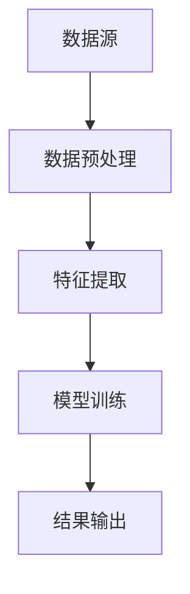

                 


# 特价股票与价值陷阱的区分方法

## 关键词：特价股票、价值陷阱、投资策略、风险评估、算法分析

## 摘要：  
在股票投资中，区分特价股票和价值陷阱至关重要。特价股票是价格被低估的优质股票，而价值陷阱是看似便宜实则存在问题的股票。本文通过背景介绍、核心概念分析、数学模型构建、系统设计和实战案例，详细讲解如何区分两者，帮助投资者做出明智决策。

---

# 第一部分: 特价股票与价值陷阱的背景与基础

## 第1章: 特价股票与价值陷阱的基本概念

### 1.1 特价股票的定义与特点

#### 1.1.1 什么是特价股票  
特价股票是指市场价格低于其内在价值的股票，通常因市场误解或短期因素被低估。  
- **内在价值**：基于公司基本面（如盈利能力、资产质量）计算的股票合理价格。  
- **市场价格**：市场交易中股票的实际价格，受情绪和外部因素影响。  

#### 1.1.2 特价股票的特点  
- **低估值**：市盈率（P/E）或市净率（P/B）低于行业平均水平。  
- **高分红率**：公司愿意将利润以股息形式返还给股东。  
- **稳定的盈利能力**：公司过去几年的收入和利润稳定增长。  

#### 1.1.3 特价股票的分类  
- **周期性特价股票**：受经济周期影响，价格波动大，但在底部具有投资价值。  
- **成长型特价股票**：公司未来增长潜力大，但当前估值被低估。  
- **价值型特价股票**：公司基本面稳定，估值长期低于内在价值。  

### 1.2 价值陷阱的定义与特征

#### 1.2.1 价值陷阱的定义  
价值陷阱是那些看似估值低，但实际存在严重问题（如财务困境、管理问题或行业衰退）的股票。投资者误判其价值，买入后可能遭受损失。  

#### 1.2.2 价值陷阱的常见特征  
- **高负债率**：公司资产负债表中负债比例过高，偿债压力大。  
- **盈利能力下降**：连续多个季度净利润率下滑或亏损。  
- **行业衰退**：所在行业需求萎缩，竞争激烈，难以扭亏为盈。  

#### 1.2.3 价值陷阱的常见类型  
- **财务造假公司**：通过虚假财务报表掩盖问题。  
- **管理不善企业**：内部腐败或战略失误导致公司业绩持续恶化。  
- **夕阳行业公司**：行业前景黯淡，缺乏增长动力。  

### 1.3 特价股票与价值陷阱的区别

#### 1.3.1 区分的重要性  
正确区分可以避免投资价值陷阱，抓住真正具有投资价值的特价股票，提升投资收益。  

#### 1.3.2 区分的基本原则  
- **基本面分析**：深入研究公司的财务报表、行业地位和竞争优势。  
- **市场情绪分析**：避免因市场恐慌或过度乐观导致误判。  
- **长期视角**：关注公司未来3-5年的增长潜力，而非短期价格波动。  

---

# 第二部分: 特价股票与价值陷阱的核心概念与联系

## 第2章: 特价股票与价值陷阱的核心概念

### 2.1 特价股票与价值陷阱的内在机制

#### 2.1.1 特价股票的内在机制  
- **低估原因**：市场对公司的误解或行业周期性低迷。  
- **反弹动力**：公司基本面改善或市场情绪回暖，股价回归内在价值。  

#### 2.1.2 价值陷阱的内在机制  
- **估值假象**：表面低估值，实则隐藏重大风险。  
- **持续亏损风险**：公司无法扭亏为盈，股价可能进一步下跌。  

### 2.2 特价股票与价值陷阱的联系与对比

#### 2.2.1 对比分析  
| 属性               | 特价股票                     | 价值陷阱                   |
|--------------------|------------------------------|-----------------------------|
| 市场估值           | 低于内在价值                 | 看似低于内在价值，实则有问题 |
| 公司基本面         | 稳定且具有竞争优势           | 不稳定或存在重大问题       |
| 投资风险           | 较低（短期波动，长期增值）    | 较高（潜在亏损，难以复苏）  |
| 投资策略           | 买入并持有，等待价值回归     | 避免买入，及时止损         |

---

# 第三部分: 特价股票与价值陷阱的分析方法

## 第3章: 特价股票与价值陷阱的分析方法

### 3.1 基于基本面的分析方法

#### 3.1.1 市盈率（P/E）分析  
公式：$$市盈率 = \frac{股价}{每股收益}$$  
- 如果市盈率远低于行业平均水平，可能是特价股票。  

#### 3.1.2 市净率（P/B）分析  
公式：$$市净率 = \frac{股价}{每股净资产}$$  
- 市净率低于1可能表明股票被低估，但需结合行业特性分析。  

#### 3.1.3 资产负债表分析  
- 关注公司负债比例（如流动负债与流动资产的比例）。  
- 通过偿债能力指标（如速动比率）评估公司财务健康状况。  

### 3.2 基于技术分析的策略

#### 3.2.1 K线图分析  
- 观察股价趋势：如果股价长期低于合理估值，可能是特价股票。  

#### 3.2.2 移动平均线分析  
- 短期移动平均线（如5日线）低于长期移动平均线（如20日线），可能表明股价处于低位。  

#### 3.2.3 成交量分析  
- 低价区出现放量，可能预示着股价即将反弹。  

### 3.3 综合分析法

#### 3.3.1 多指标综合分析  
- 结合市盈率、市净率、ROE（净资产收益率）等指标，评估公司估值和盈利能力。  

#### 3.3.2 行业对比分析  
- 将公司估值与行业平均值对比，判断是否为特价股票。  

---

# 第四部分: 特价股票与价值陷阱的系统设计与实现

## 第4章: 系统设计与实现

### 4.1 系统架构设计

#### 4.1.1 系统功能模块  
- 数据采集模块：获取股票的历史数据和财务报表。  
- 指标计算模块：计算市盈率、市净率等关键指标。  
- 模型分析模块：基于机器学习算法判断股票类型。  

#### 4.1.2 系统架构图  


### 4.2 算法实现

#### 4.2.1 决策树分类算法  
代码示例：  
```python
from sklearn.tree import DecisionTreeClassifier
from sklearn.model_selection import train_test_split
import pandas as pd

# 数据加载与预处理
data = pd.read_csv('stock_data.csv')
X = data[['PE', 'PB', 'ROE']]
y = data['label']  # 1表示特价股票，0表示价值陷阱

# 划分训练集与测试集
X_train, X_test, y_train, y_test = train_test_split(X, y, test_size=0.2)

# 模型训练
clf = DecisionTreeClassifier()
clf.fit(X_train, y_train)

# 预测与评估
score = clf.score(X_test, y_test)
print(f"准确率：{score}")
```

#### 4.2.2 聚类分析  
代码示例：  
```python
from sklearn.cluster import KMeans

# 数据标准化
from sklearn.preprocessing import StandardScaler
scaler = StandardScaler()
X_scaled = scaler.fit_transform(X)

# 聚类实现
kmeans = KMeans(n_clusters=2, random_state=0)
kmeans.fit(X_scaled)

# 预测结果
clusters = kmeans.predict(X_scaled)
print(clusters)
```

---

# 第五部分: 特价股票与价值陷阱的实战案例

## 第5章: 实战案例分析

### 5.1 特价股票的实战案例

#### 5.1.1 某公司案例分析  
- 公司A：市盈率10，行业平均市盈率20，ROE稳定在15%。  
- 分析结果：属于特价股票，建议买入。  

### 5.2 价值陷阱的实战案例

#### 5.2.1 某公司案例分析  
- 公司B：市盈率5，行业平均市盈率10，但负债率高达80%，连续亏损两年。  
- 分析结果：属于价值陷阱，建议避免买入。  

---

# 第六部分: 总结与展望

## 第6章: 总结与展望

### 6.1 总结  
区分特价股票和价值陷阱需要结合基本面分析、技术分析和机器学习算法。投资者应深入研究公司财务数据，避免仅依赖市场情绪做出决策。  

### 6.2 展望  
未来，随着人工智能技术的发展，可以利用更复杂的模型（如深度学习）来提高区分的准确性。同时，结合实时数据和市场新闻，构建动态评估系统，帮助投资者做出更明智的决策。  

---

## 作者：AI天才研究院 & 禅与计算机程序设计艺术

---

### 最佳实践 Tips  
- **长期视角**：投资特价股票需要耐心，等待其价值回归。  
- **风险管理**：设置止损点，避免价值陷阱带来的重大损失。  
- **持续学习**：关注行业动态和公司财报，及时调整投资策略。  

希望这篇文章能帮助读者更好地理解如何区分特价股票和价值陷阱，提升投资决策的准确性。

