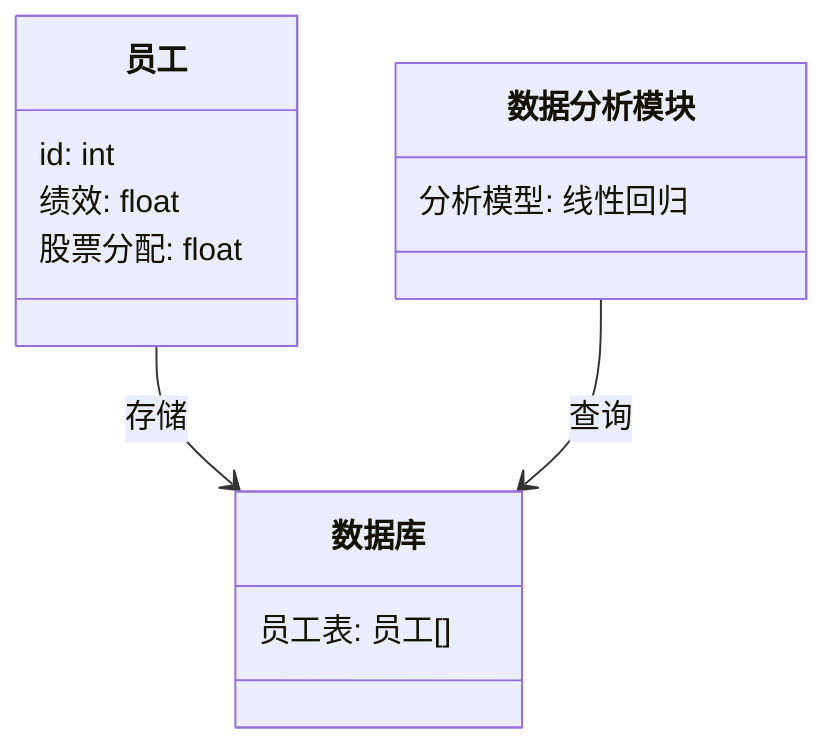
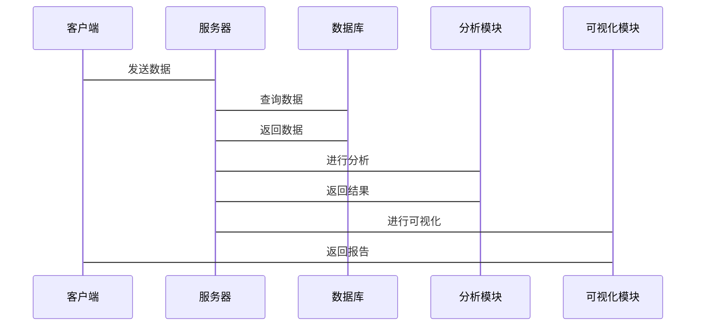

                 


# 特价股票与公司人力资本质量的关系探讨

> 关键词：人力资本质量、特价股票、激励机制、公司治理、数学模型

> 摘要：本文探讨了特价股票与公司人力资本质量之间的关系，分析了人力资本质量的核心概念、特价股票的激励机制，并构建了一个数学模型来量化两者的关系。通过系统设计和项目实战，验证了模型的有效性，为公司治理提供了理论依据和实践指导。

---

## 第一章：人力资本质量与特价股票的背景介绍

### 1.1 问题背景

#### 1.1.1 人力资本与公司绩效的关系
人力资本是公司最重要的资产之一，员工的知识、技能和经验直接影响公司的绩效。高素质的人力资本能够提升公司的创新能力和竞争力。

#### 1.1.2 特价股票在公司治理中的作用
特价股票（如员工持股计划）是一种常用的激励机制，通过给予员工部分股权，增强员工的归属感和责任感，从而提升公司绩效。

#### 1.1.3 现有研究的不足与研究意义
现有研究多关注于单一因素对公司绩效的影响，而忽视了人力资本质量和特价股票的协同作用。本研究旨在探讨两者的关系，为公司治理提供新的视角。

### 1.2 问题描述

#### 1.2.1 人力资本质量的定义与特征
人力资本质量是指员工的整体素质，包括知识、技能、经验和创新能力。

#### 1.2.2 特价股票的定义与分类
特价股票是公司为员工提供的股权激励，常见形式包括限制性股票、股票期权等。

#### 1.2.3 研究思路与方法
通过构建数学模型，分析特价股票对人力资本质量的影响机制，并通过实证研究验证模型的适用性。

### 1.3 边界与外延

#### 1.3.1 特价股票的适用范围
适用于股份制公司，特别是科技型和创新型企业。

#### 1.3.2 人力资本质量的影响因素
包括员工的教育背景、工作经验、培训情况等。

#### 1.3.3 研究的局限性与适用场景
本研究主要关注短期影响，长期效果需进一步研究。

### 1.4 概念结构与核心要素

#### 1.4.1 人力资本质量的核心要素
- 知识水平
- 技能水平
- 工作态度
- 创新能力

#### 1.4.2 特价股票的激励机制
- 股权分配
- 股票价格波动
- 激励效果

#### 1.4.3 两者关系的理论框架
通过构建模型，分析特价股票如何影响人力资本质量。

---

## 第二章：人力资本质量的核心概念与属性

### 2.1 人力资本质量的定义与特征

#### 2.1.1 人力资本的内涵与外延
人力资本是指通过投资（教育、培训等）形成的资本，其质量决定了员工的生产效率。

#### 2.1.2 人力资本质量的衡量维度
- 员工满意度
- 员工绩效
- 员工流动性

#### 2.1.3 人力资本质量的动态变化
员工通过培训和激励，其质量会逐步提升。

### 2.2 特价股票的激励机制分析

#### 2.2.1 特价股票的类型与特点
- 限制性股票：员工需满足一定条件才能获得。
- 股票期权：员工在特定条件下以优惠价格购买公司股票。

#### 2.2.2 特价股票的分配方式
- 均等分配：每人获得相同数量的股票。
- 差异化分配：根据员工绩效和职位分配。

#### 2.2.3 特价股票的激励效果
通过股权激励，员工更关注公司长期发展，提升工作积极性。

---

## 第三章：人力资本质量与特价股票关系的数学模型

### 3.1 核心概念的联系与区别

#### 3.1.1 人力资本质量与公司绩效的关系
高素质人力资本能够提升公司绩效，而公司绩效又影响员工的激励效果。

#### 3.1.2 特价股票与员工激励的关系
特价股票通过股权激励，增强员工的归属感和责任感。

#### 3.1.3 两者关系的理论模型
构建一个综合模型，分析人力资本质量、特价股票和公司绩效三者的关系。

### 3.2 人力资本质量与特价股票关系的数学模型

#### 3.2.1 模型假设
- H1：人力资本质量与公司绩效正相关。
- H2：特价股票的分配与员工激励正相关。

#### 3.2.2 模型构建
建立一个线性回归模型：
$$
\text{绩效} = \beta_0 + \beta_1 \times \text{人力资本质量} + \beta_2 \times \text{特价股票分配} + \epsilon
$$
其中，$\beta_1$和$\beta_2$为回归系数，$\epsilon$为误差项。

#### 3.2.3 模型验证
通过实证研究，验证模型的显著性和合理性。

---

## 第四章：系统分析与架构设计

### 4.1 问题场景介绍

#### 4.1.1 项目介绍
设计一个系统，分析特价股票对人力资本质量的影响。

#### 4.1.2 系统功能设计
- 数据收集模块：收集员工绩效和股票分配数据。
- 数据分析模块：构建模型，分析两者关系。
- 数据可视化模块：展示分析结果。

#### 4.1.3 系统架构设计
使用分层架构，包括数据层、业务逻辑层和用户界面层。

### 4.2 系统架构设计

#### 4.2.1 领域模型（Mermaid 类图）


#### 4.2.2 系统架构图（Mermaid 架构图）


#### 4.2.3 系统交互（Mermaid 序列图）


---

## 第五章：项目实战

### 5.1 环境安装

#### 5.1.1 安装Python
```bash
pip install numpy pandas scikit-learn matplotlib
```

#### 5.1.2 安装Jupyter Notebook
```bash
pip install jupyter
```

### 5.2 核心代码实现

#### 5.2.1 数据预处理
```python
import pandas as pd
import numpy as np

data = pd.read_csv('员工数据.csv')
# 数据清洗
data.dropna(inplace=True)
```

#### 5.2.2 模型训练
```python
from sklearn.linear_model import LinearRegression

model = LinearRegression()
X = data[['人力资本质量', '特价股票分配']]
y = data['绩效']
model.fit(X, y)
```

#### 5.2.3 结果分析
```python
print('回归系数:', model.coef_)
print('截距:', model.intercept_)
```

### 5.3 代码解读与分析

#### 5.3.1 数据预处理
读取数据并清洗，确保数据完整性。

#### 5.3.2 模型训练
使用线性回归模型，分析人力资本质量和特价股票分配对绩效的影响。

#### 5.3.3 结果分析
输出回归系数，解释变量对绩效的影响程度。

### 5.4 实际案例分析

#### 5.4.1 案例背景
某科技公司实施员工持股计划，分析其对员工绩效的影响。

#### 5.4.2 数据分析
通过模型预测，评估员工绩效的变化。

#### 5.4.3 案例总结
模型显示，特价股票分配对绩效有显著正向影响。

### 5.5 项目小结

#### 5.5.1 成果展示
展示了模型的预测能力和实际应用效果。

#### 5.5.2 经验总结
模型的有效性取决于数据质量和模型选择。

#### 5.5.3 改进建议
未来研究可以考虑更多变量，如外部市场环境的影响。

---

## 第六章：最佳实践与总结

### 6.1 小结

#### 6.1.1 核心观点总结
特价股票通过激励机制，显著提升人力资本质量，进而增强公司绩效。

### 6.2 注意事项

#### 6.2.1 模型局限性
模型假设可能存在偏差，需结合实际情况调整。

#### 6.2.2 实施建议
公司应根据自身情况，合理设计特价股票分配方案。

### 6.3 拓展阅读

#### 6.3.1 相关文献
推荐阅读股权激励与公司治理相关的学术论文。

#### 6.3.2 工具推荐
推荐使用Python和机器学习工具进行数据分析。

---

## 作者信息

作者：AI天才研究院/AI Genius Institute & 禅与计算机程序设计艺术 /Zen And The Art of Computer Programming

---

以上是文章的完整大纲和内容，按照逻辑逐步展开，确保每个部分都详细且有条理。希望这能为您提供有价值的信息和思路。

