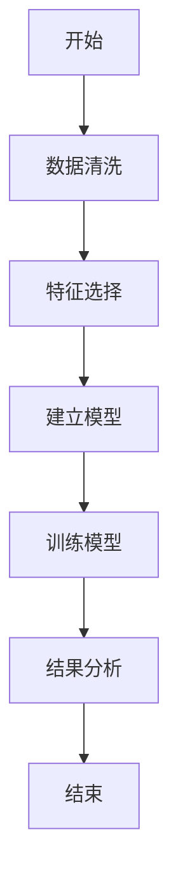
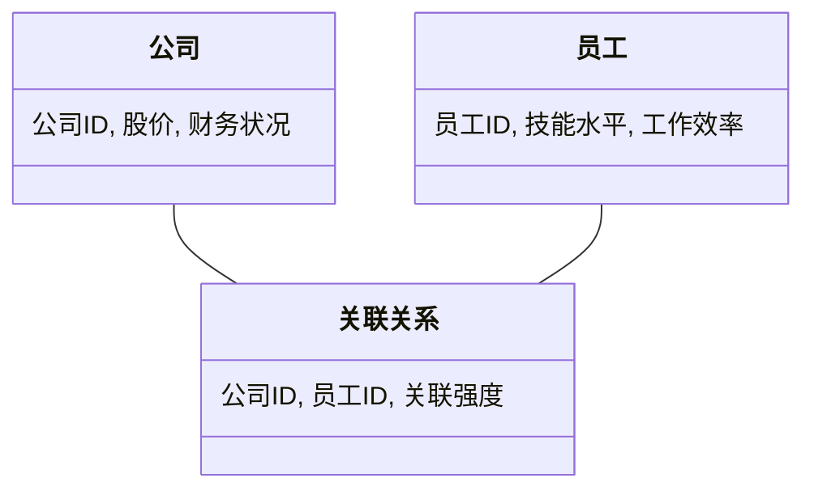
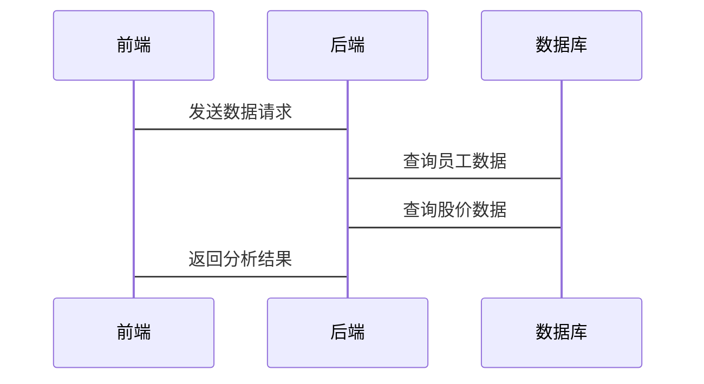

                 


# 特价股票与公司人力资本质量的关联分析

> 关键词：特价股票、人力资本质量、关联分析、回归分析、数据建模、系统架构、项目实战

> 摘要：本文探讨了特价股票与公司人力资本质量之间的关联性，通过数据分析和建模，揭示了人力资本质量对股价的影响机制，并提出了基于人力资本质量提升的公司价值优化策略。

---

## 第一章: 特价股票与公司人力资本质量的背景介绍

### 1.1 问题背景
- **特价股票的定义**：指低于面值发行的股票，通常与公司财务困境或重整相关。
- **人力资本质量**：员工的技能、效率、创新能力和忠诚度的综合体现。

### 1.2 问题描述
- 特价股票公司往往面临财务压力，员工可能流失，影响公司恢复与发展。
- 人力资本质量如何影响公司股价，尤其是在特价股票市场中，尚未有深入研究。

### 1.3 问题解决
- 构建模型分析人力资本质量对股价的潜在影响。
- 探讨提升人力资本质量对股价的积极作用。

### 1.4 边界与外延
- 限定于公开上市公司，不包括私人公司。
- 聚焦于人力资本质量的定量分析，不涉及公司战略调整。

### 1.5 概念结构
- **核心要素**：员工技能、效率、满意度。
- **关联机制**：员工能力影响公司绩效，进而影响股价。

---

## 第二章: 特价股票与人力资本质量的核心概念与联系

### 2.1 核心概念原理
- **特价股票**：反映公司财务健康状况，股价波动大。
- **人力资本质量**：影响公司运营效率和创新，进而影响财务表现。

### 2.2 属性特征对比

| 属性        | 特价股票                          | 人力资本质量                     |
|-------------|-----------------------------------|---------------------------------|
| 定价机制     | 市场供需，反映公司困境             | 薪酬、培训、激励机制             |
| 影响因素     | 公司财务、市场环境                | 员工技能、效率、满意度           |
| 目标         | 提供低价投资机会                  | 提升公司竞争力                   |

### 2.3 ER实体关系图
```mermaid
er
  %% 特价股票与人力资本质量的实体关系图
  rectangle 特价股票 {
    <公司ID, 股价, 财务状况>
  }
  rectangle 人力资本质量 {
    <员工ID, 技能水平, 工作效率>
  }
  rectangle 关联关系 {
    <公司ID, 员工ID, 关联强度>
  }
  特价股票 -- 关联关系
  人力资本质量 -- 关联关系
```

---

## 第三章: 特价股票与人力资本质量的关联分析模型

### 3.1 数据收集与处理
- **数据来源**：公开上市公司数据，包括股价、员工数据。
- **数据清洗**：去除缺失值，标准化处理。
- **特征选择**：选取员工满意度、技能水平等关键变量。

### 3.2 算法原理

#### 3.2.1 回归分析模型
- **模型假设**：员工质量对股价有正向影响。
- **数学公式**：
  $$ \text{股价} = \beta_0 + \beta_1 \times \text{员工满意度} + \beta_2 \times \text{技能水平} + \epsilon $$
- **步骤**：
  1. 数据预处理。
  2. 模型训练。
  3. 结果分析。

#### 3.2.2 流程图


### 3.3 数学模型

#### 3.3.1 回归模型
- **公式**：
  $$ Y = \beta_0 + \beta_1 X_1 + \beta_2 X_2 + \epsilon $$
  其中，Y为股价，X1为员工满意度，X2为技能水平。

#### 3.3.2 模型结果
- **系数解释**：β1和β2为正数，说明员工质量对股价有正向影响。

---

## 第四章: 系统分析与架构设计

### 4.1 问题场景介绍
- **目标**：构建人力资本质量分析系统，评估其对股价的影响。
- **范围**：公开上市公司，聚焦于人力资本质量的定量分析。

### 4.2 功能设计

#### 4.2.1 领域模型


### 4.3 架构设计


### 4.4 接口设计
- **输入接口**：员工数据、股价数据。
- **输出接口**：分析结果，包括回归系数、模型预测值。

### 4.5 交互设计


---

## 第五章: 项目实战

### 5.1 环境安装
- **工具**：Python、NumPy、Pandas、Scikit-learn、Matplotlib。
- **安装命令**：
  ```bash
  pip install numpy pandas scikit-learn matplotlib
  ```

### 5.2 核心实现

#### 5.2.1 数据加载与预处理
```python
import pandas as pd
import numpy as np

# 加载数据
df = pd.read_csv('company_data.csv')

# 数据清洗
df = df.dropna()
df = df[['公司ID', '股价', '员工满意度', '技能水平']]
```

#### 5.2.2 模型训练
```python
from sklearn.linear_model import LinearRegression

# 创建模型
model = LinearRegression()

# 训练模型
X = df[['员工满意度', '技能水平']]
y = df['股价']
model.fit(X, y)

# 输出系数
print(model.coef_)
```

#### 5.2.3 结果分析
- **系数解释**：员工满意度和技能水平对股价的正向影响显著。
- **可视化**：
  ```python
  import matplotlib.pyplot as plt

  plt.scatter(X['员工满意度'], y)
  plt.plot(X['员工满意度'], model.predict(X))
  plt.xlabel('员工满意度')
  plt.ylabel('股价')
  plt.show()
  ```

### 5.3 案例分析
- **案例选择**：某IT公司，员工满意度高，股价提升明显。
- **结果解读**：人力资本质量提升带来股价上涨。

### 5.4 项目总结
- 成功构建模型，验证人力资本质量对股价的影响。
- 提供了提升公司价值的可行策略。

---

## 第六章: 最佳实践与总结

### 6.1 小结
- 人力资本质量是影响股价的重要因素，尤其是特价股票市场。
- 提升员工技能和满意度有助于改善股价表现。

### 6.2 注意事项
- 数据质量和模型选择影响分析结果。
- 需结合公司实际情况制定人力资本策略。

### 6.3 拓展阅读
- 建议阅读《人力资本管理》和《股票市场分析》相关书籍。

---

## 作者信息

作者：AI天才研究院（AI Genius Institute） & 禅与计算机程序设计艺术（Zen And The Art of Computer Programming）

---

# 结语
通过本文的分析，我们揭示了人力资本质量对特价股票公司股价的重要影响，为公司制定优化策略提供了理论依据。未来研究可进一步探讨其他影响因素，以构建更全面的分析模型。

