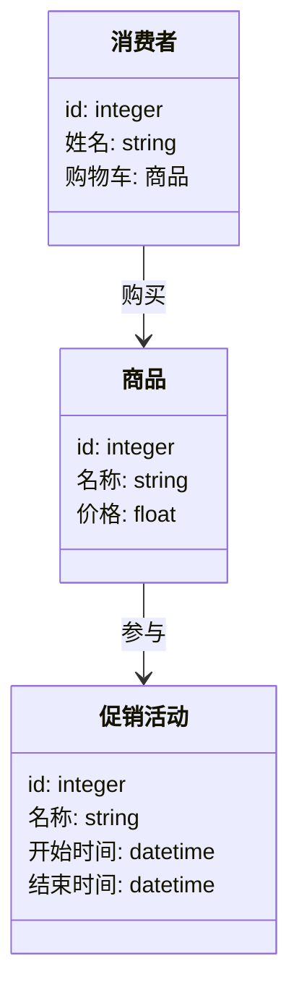
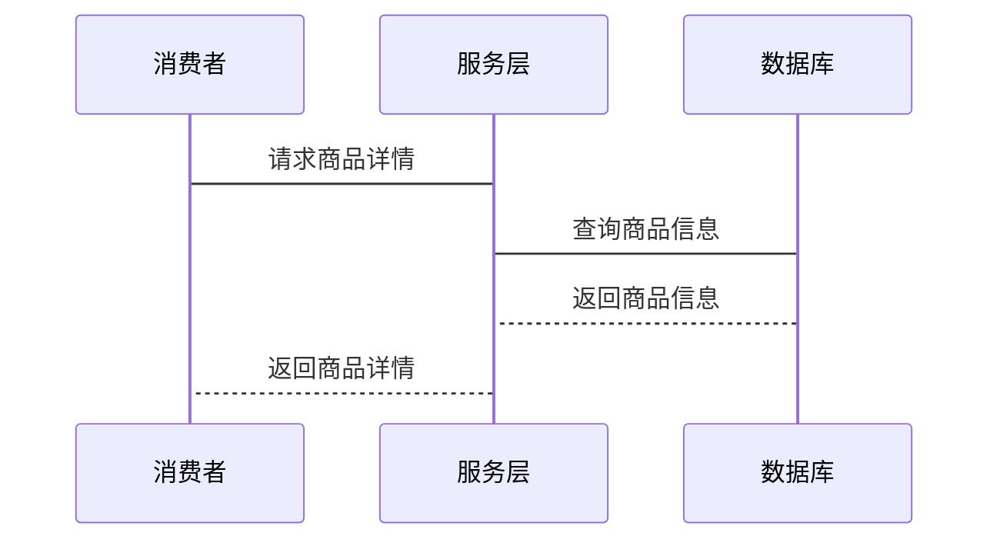

                 


# 特价股票与公司人工智能伦理决策能力的长期关系分析

> 关键词：特价股票，人工智能，伦理决策，公司决策，长期关系

> 摘要：本文探讨了特价股票与公司人工智能伦理决策能力之间的长期关系。通过分析特价股票的市场现象、公司决策机制以及人工智能在决策中的应用，本文揭示了伦理决策在公司长期战略中的重要性。结合实际案例，本文详细阐述了人工智能算法在伦理决策中的作用，并提出了构建伦理决策能力的具体方法。

---

## 第1章 特价股票与公司决策的背景介绍

### 1.1 特价股票的市场现状

#### 1.1.1 特价股票的定义与特点
特价股票是指在特定时间（如促销活动期间）以低于市场价出售的股票。其特点是价格波动大、交易量集中、市场关注度高。

#### 1.1.2 特价股票的市场现象分析
特价股票通常出现在电商平台的大促销活动（如“双十一”）中，吸引了大量消费者关注和购买。这种现象对公司的库存管理、销售策略和客户行为分析提出了更高要求。

#### 1.1.3 特价股票与公司决策的关系
特价股票不仅是公司促销活动的一部分，更是公司通过数据分析优化决策的重要工具。公司通过分析特价股票的销售数据，可以优化库存管理、调整定价策略，并提升客户体验。

### 1.2 公司决策机制的现状

#### 1.2.1 传统公司决策模式
传统决策模式依赖于人工分析和经验判断，存在效率低、主观性强的问题。例如，库存管理往往基于历史销售数据和人工判断，难以实时调整。

#### 1.2.2 人工智能在公司决策中的应用
人工智能技术（如机器学习、自然语言处理）被广泛应用于销售预测、库存优化、客户画像等领域。例如，通过机器学习模型预测特价股票的销售趋势，帮助公司制定更精准的促销策略。

#### 1.2.3 伦理决策在公司决策中的重要性
伦理决策是指在公司决策中兼顾经济效益和社会责任。例如，在制定促销策略时，公司需考虑避免误导消费者、保护消费者权益等问题。

### 1.3 特价股票与公司决策的互动关系

#### 1.3.1 特价股票对公司的短期影响
特价股票通常带来短期销量增长和品牌曝光，但也可能引发库存积压、利润下降等问题。例如，过度促销可能导致商品贬值，影响品牌形象。

#### 1.3.2 公司决策对特价股票的长期影响
公司通过优化库存管理和销售策略，可以实现特价股票的长期价值最大化。例如，通过智能库存管理系统，公司可以实时调整特价股票的供应量，避免库存过剩或短缺。

#### 1.3.3 两者关系的复杂性与动态性
特价股票与公司决策的互动关系受到市场环境、消费者行为和技术应用等多种因素的影响。例如，消费者对特价股票的依赖程度影响公司的促销策略，而公司对特价股票的管理能力又影响其市场竞争力。

## 第2章 人工智能在公司决策中的核心作用

### 2.1 人工智能在决策中的应用领域

#### 2.1.1 数据分析与预测
人工智能通过分析历史销售数据、市场趋势和消费者行为，帮助公司预测特价股票的销售情况。例如，通过时间序列分析模型预测特价股票的销售峰值。

#### 2.1.2 智能推荐系统
人工智能推荐系统可以根据消费者的购买历史和偏好，推荐合适的特价股票。例如，通过协同过滤算法向消费者推荐相关商品。

#### 2.1.3 自动化决策流程
人工智能可以实现决策流程的自动化，例如通过规则引擎自动调整特价股票的库存和价格。

### 2.2 人工智能决策的算法原理

#### 2.2.1 机器学习算法简介
机器学习算法（如支持向量机、随机森林）通过训练数据模型，预测特价股票的销售情况。例如，使用回归模型预测特价股票的销售量。

#### 2.2.2 神经网络在决策中的应用
深度学习模型（如卷积神经网络、循环神经网络）可以处理复杂的非结构化数据，例如图像识别和自然语言处理。例如，通过图像识别技术识别商品的瑕疵，优化库存管理。

#### 2.2.3 集成学习与决策优化
集成学习通过组合多个模型的结果，提高决策的准确性和鲁棒性。例如，通过集成多个回归模型预测特价股票的销售量。

### 2.3 人工智能决策的伦理挑战

#### 2.3.1 决策透明性问题
人工智能决策的“黑箱”特性可能导致决策过程缺乏透明性，例如消费者无法理解推荐系统为何推荐特定商品。

#### 2.3.2 决策偏差与公平性
人工智能算法可能存在数据偏差，导致不公平的决策。例如，推荐系统可能对特定群体的消费者存在偏好，影响市场公平性。

#### 2.3.3 伦理决策的实现路径
为了实现伦理决策，公司需要在算法设计中引入伦理约束，例如通过公平性指标优化推荐系统，确保所有消费者都能获得公平的推荐机会。

---

## 第3章 公司人工智能伦理决策能力的构建

### 3.1 伦理决策能力的核心要素

#### 3.1.1 决策的伦理框架
公司需要建立伦理决策框架，明确决策中的伦理准则和责任划分。例如，制定促销策略时，需确保不误导消费者。

#### 3.1.2 伦理决策的实现路径
公司可以通过以下步骤实现伦理决策：
1. 确定伦理目标：明确决策中的伦理目标，例如保护消费者权益。
2. 设计伦理规则：制定具体的伦理规则，例如禁止虚假宣传。
3. 实施伦理约束：在决策过程中引入伦理约束，例如通过算法优化推荐系统。

### 3.2 伦理决策能力的构建方法

#### 3.2.1 数据驱动的伦理决策
公司可以通过分析销售数据、消费者反馈等信息，优化伦理决策。例如，通过分析消费者投诉数据，识别促销活动中存在的不公平问题。

#### 3.2.2 技术驱动的伦理决策
公司可以通过引入先进技术（如区块链、隐私计算）提升伦理决策能力。例如，通过区块链技术确保促销活动的透明性，防止虚假宣传。

#### 3.2.3 伦理决策的评估与优化
公司需要定期评估伦理决策的效果，并根据评估结果优化决策策略。例如，通过A/B测试优化促销活动的伦理效果。

---

## 第4章 特价股票与公司人工智能伦理决策能力的长期关系

### 4.1 特价股票对公司的长期影响

#### 4.1.1 特价股票对库存管理的影响
公司通过人工智能优化库存管理，可以减少特价股票的积压和浪费，提升库存周转率。

#### 4.1.2 特价股票对品牌价值的影响
公司通过合理的促销策略和伦理决策，可以提升品牌形象，增强消费者信任。

### 4.2 人工智能伦理决策能力的提升

#### 4.2.1 数据分析能力的提升
公司通过引入更先进的数据分析技术，可以更精准地预测特价股票的销售情况，优化库存管理和促销策略。

#### 4.2.2 伦理决策能力的提升
公司通过构建伦理决策框架和优化算法，可以实现更公平、透明的决策，提升消费者满意度和品牌价值。

### 4.3 两者关系的长期演变

#### 4.3.1 技术进步推动的长期关系
人工智能技术的不断进步将推动特价股票与公司决策之间的关系更加紧密。例如，通过更先进的算法优化促销策略，实现更高效的销售和库存管理。

#### 4.3.2 市场环境变化的长期影响
市场环境的变化（如消费者行为的变化、政策法规的调整）将影响特价股票与公司决策之间的关系。例如，政策法规的变化可能要求公司调整促销策略，以符合新的伦理要求。

---

## 第5章 系统设计与实现

### 5.1 系统功能设计

#### 5.1.1 领域模型设计
通过Mermaid类图描述系统中的各个实体及其关系。例如，消费者、商品、促销活动等实体之间的关系。



#### 5.1.2 系统架构设计
通过Mermaid架构图描述系统的整体架构。例如，前端、后端、数据库等部分的结构。

```mermaid
containerDiagram

    container 系统边界 {
        前端: Web应用
        后端: 服务层
        数据库: MySQL
    }

    前端 --> 后端: 请求
    后端 --> 数据库: 查询/存储
```

#### 5.1.3 系统交互设计
通过Mermaid序列图描述系统中的交互流程。例如，消费者购买商品的流程。



### 5.2 系统实现

#### 5.2.1 环境安装
安装所需的开发环境和工具，例如Python、Flask框架、MySQL数据库等。

#### 5.2.2 核心代码实现
以下是实现特价股票推荐系统的核心代码示例：

```python
from flask import Flask, request, jsonify
import pymysql

app = Flask(__name__)

@app.route('/recommend', methods=['POST'])
def recommend():
    data = request.json
    user_id = data['user_id']
    
    # 连接数据库
    db = pymysql.connect(host='localhost', user='root', password='password', database='stock')
    cursor = db.cursor()
    
    # 查询用户偏好
    cursor.execute("SELECT preference FROM users WHERE id=%s", (user_id))
    preference = cursor.fetchone()[0]
    
    # 推荐特价股票
    cursor.execute("SELECT id, name, price FROM stocks WHERE category=%s", (preference))
    stocks = cursor.fetchall()
    
    db.close()
    
    return jsonify({'status': 'success', 'data': stocks})

if __name__ == '__main__':
    app.run(debug=True)
```

#### 5.2.3 案例分析
通过实际案例分析特价股票推荐系统的运行效果。例如，分析某电商平台在促销活动中的推荐效果，优化推荐算法。

---

## 第6章 项目实战

### 6.1 环境安装
安装所需的开发环境和工具，例如Python、机器学习库（scikit-learn、TensorFlow）等。

### 6.2 核心代码实现
以下是实现人工智能伦理决策系统的代码示例：

```python
import numpy as np
from sklearn.ensemble import RandomForestClassifier

# 数据预处理
X = np.array([[1, 2], [3, 4], [5, 6]])
y = np.array([0, 1, 0])

# 训练模型
model = RandomForestClassifier(n_estimators=100)
model.fit(X, y)

# 预测结果
new_data = np.array([[2, 3]])
print(model.predict(new_data))  # 输出预测结果
```

### 6.3 案例分析
通过实际案例分析系统的运行效果，例如分析某公司通过人工智能优化促销策略的效果。

---

## 第7章 最佳实践与总结

### 7.1 小结
本文通过分析特价股票与公司人工智能伦理决策能力的长期关系，揭示了伦理决策在公司长期战略中的重要性。通过实际案例分析和系统设计，提出了构建伦理决策能力的具体方法。

### 7.2 注意事项
在实际应用中，公司需注意以下几点：
1. 确保数据隐私和安全。
2. 定期评估和优化伦理决策框架。
3. 提高决策透明度，增强消费者信任。

### 7.3 拓展阅读
建议读者进一步阅读以下内容：
1. 《人工智能伦理学》
2. 《数据驱动的决策优化》
3. 《企业级人工智能系统设计》

---

## 作者信息

作者：AI天才研究院（AI Genius Institute） & 禅与计算机程序设计艺术（Zen And The Art of Computer Programming）

--- 

以上是《特价股票与公司人工智能伦理决策能力的长期关系分析》的完整目录和内容概要，希望对您有所帮助！

