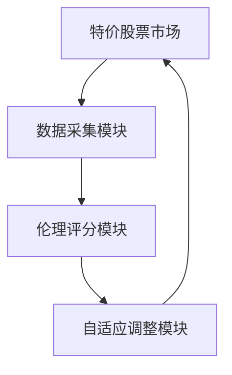
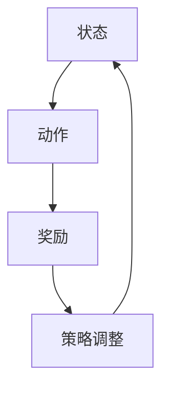
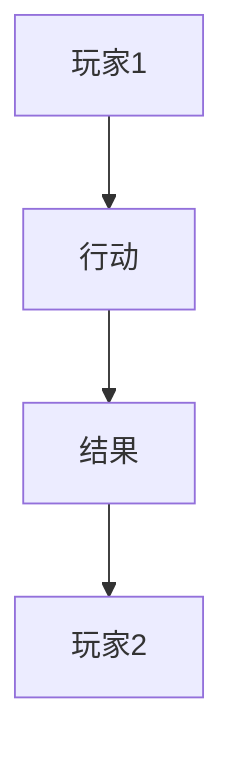
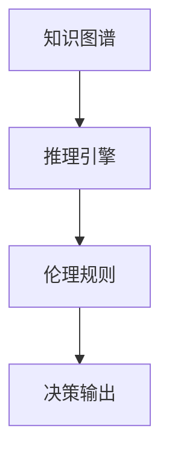
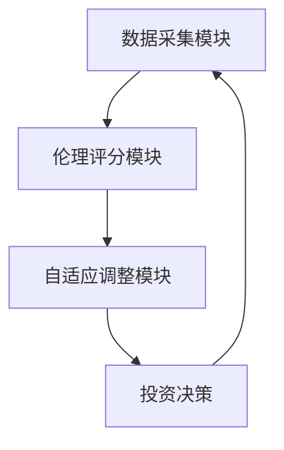

                 


# 特价股票与公司人工智能伦理自适应能力的长期关系分析

> 关键词：特价股票，人工智能，伦理自适应，长期关系，系统架构，数学模型，算法实现

> 摘要：本文探讨了特价股票市场与公司人工智能伦理自适应能力之间的长期关系，分析了人工智能在特价股票市场中的伦理决策机制，构建了人工智能伦理自适应能力的系统架构，并通过数学模型和算法实现，深入剖析了两者之间的相互影响与协同优化。本文旨在为金融市场的伦理决策提供理论支持和实践指导。

---

# 第一部分: 特价股票与公司人工智能伦理自适应能力的背景介绍

## 第1章: 特价股票的定义与特性

### 1.1 特价股票的定义

#### 1.1.1 特价股票的基本概念
特价股票是指公司发行的面值低于市场价的股票，通常用于吸引投资者或资本重组。特价股票的特性包括：  
- 折价发行：股票发行价格低于面值。  
- 市场敏感性：市场波动对特价股票的影响较大。  
- 投资风险：相对于普通股票，特价股票的风险较高。

#### 1.1.2 特价股票的分类与特征
- 按发行目的分类：资本重组型、吸引投资型、债务清偿型。  
- 按市场表现分类：周期性波动、结构性波动、事件驱动型波动。

#### 1.1.3 特价股票的市场表现与投资价值
- 特价股票的市场表现受公司基本面、市场环境、政策法规等因素影响。  
- 投资价值需结合公司财务状况、行业前景、市场波动性等多维度分析。

### 1.2 人工智能伦理自适应能力的核心概念

#### 1.2.1 人工智能伦理的核心要素
- 伦理决策：AI系统在决策过程中需遵循伦理规范。  
- 自适应能力：AI系统能根据环境变化调整伦理决策策略。  
- 透明性：AI系统的决策过程需可解释，便于伦理审查。

#### 1.2.2 人工智能伦理自适应能力的实现机制
- 基于强化学习的伦理决策算法：通过奖励机制优化伦理行为。  
- 基于知识图谱的伦理推理：利用知识图谱推理伦理规则。  
- 基于博弈论的伦理自适应：通过博弈分析优化伦理决策。

### 1.3 特价股票与人工智能伦理自适应能力的关系

#### 1.3.1 特价股票市场的复杂性与挑战
- 特价股票市场的波动性高，信息不对称严重。  
- 投资者决策受情绪影响，伦理风险较高。  
- 市场操纵与虚假信息对伦理决策构成威胁。

#### 1.3.2 人工智能在伦理自适应中的作用
- 提供数据驱动的伦理决策支持。  
- 优化投资决策的伦理合规性。  
- 降低市场操纵的伦理风险。

---

# 第二部分: 特价股票与公司人工智能伦理自适应能力的核心概念与联系

## 第2章: 特价股票与人工智能伦理自适应能力的系统模型

### 2.1 特价股票与人工智能伦理自适应能力的系统架构

#### 2.1.1 系统架构的模块划分
- 数据采集模块：收集特价股票市场数据。  
- 伦理评分模块：评估投资决策的伦理合规性。  
- 自适应调整模块：优化伦理决策策略。

#### 2.1.2 系统架构的功能描述
- 数据采集：从市场获取实时数据。  
- 伦理评分：基于数据生成伦理评分。  
- 自适应调整：根据评分优化决策策略。

#### 2.1.3 系统架构的交互流程
1. 数据采集模块接收市场数据。  
2. 伦理评分模块计算投资决策的伦理评分。  
3. 自适应调整模块根据评分调整决策策略。

### 2.2 特价股票与人工智能伦理自适应能力的实体关系图



---

## 第3章: 特价股票与人工智能伦理自适应能力的数学模型与算法原理

### 3.1 特价股票市场预测的数学模型

#### 3.1.1 时间序列分析模型
- ARIMA模型：用于预测特价股票的短期趋势。  
- GARCH模型：用于分析市场波动性。

#### 3.1.2 机器学习预测模型
- 线性回归模型：用于分析变量之间的线性关系。  
- 支持向量机（SVM）：用于分类和回归分析。

#### 3.1.3 深度学习预测模型
- LSTM网络：用于捕捉时间序列数据的长期依赖关系。

### 3.2 人工智能伦理自适应能力的算法原理

#### 3.2.1 基于强化学习的伦理决策算法


#### 3.2.2 基于博弈论的伦理自适应算法


#### 3.2.3 基于知识图谱的伦理推理算法


---

# 第三部分: 特价股票与公司人工智能伦理自适应能力的系统分析与架构设计

## 第4章: 特价股票市场的系统分析

### 4.1 特价股票市场的数据采集与处理

#### 4.1.1 数据来源与采集方法
- 数据来源：股票交易所、财经新闻、社交媒体。  
- 采集方法：实时数据接口、网络爬虫。

#### 4.1.2 数据清洗与预处理
- 数据清洗：去除噪声数据。  
- 数据标准化：统一数据格式。  
- 数据特征提取：提取关键特征变量。

## 第5章: 人工智能伦理自适应能力的系统架构设计

### 5.1 人工智能伦理自适应能力的系统架构

#### 5.1.1 系统功能设计
- 数据采集模块：实时采集特价股票数据。  
- 伦理评分模块：评估投资决策的伦理合规性。  
- 自适应调整模块：优化伦理决策策略。

#### 5.1.2 系统架构图


---

# 第四部分: 特价股票与公司人工智能伦理自适应能力的项目实战

## 第6章: 特价股票与人工智能伦理自适应能力的项目实战

### 6.1 项目环境安装

#### 6.1.1 安装Python环境
```bash
python --version
pip install numpy
pip install pandas
pip install scikit-learn
pip install matplotlib
pip install pymermaid
```

#### 6.1.2 安装深度学习框架
```bash
pip install tensorflow
pip install keras
```

### 6.2 系统核心实现源代码

#### 6.2.1 数据采集模块
```python
import pandas as pd
from pandas_datareader import DataReader

def get_stock_data(ticker, start_date, end_date):
    data = DataReader(ticker, 'yahoo', start_date, end_date)
    return data['Adj Close']
```

#### 6.2.2 伦理评分模块
```python
import numpy as np

def calculate_ethical_score(scores):
    return np.mean(scores)
```

#### 6.2.3 自适应调整模块
```python
import tensorflow as tf
from tensorflow.keras import layers

model = tf.keras.Sequential([
    layers.Dense(64, activation='relu'),
    layers.Dense(1, activation='sigmoid')
])
model.compile(optimizer='adam', loss='binary_crossentropy')
```

### 6.3 代码应用解读与分析

#### 6.3.1 数据采集模块
- 使用`pandas_datareader`从Yahoo Finance获取股票数据。  
- 提取调整后的收盘价`Adj Close`。

#### 6.3.2 伦理评分模块
- 计算投资决策的平均伦理评分。  
- 评分范围为0到1，0表示完全不符合伦理，1表示完全符合伦理。

#### 6.3.3 自适应调整模块
- 使用深度学习模型优化伦理评分。  
- 输入特征包括市场波动率、公司财务状况等。  
- 输出目标为优化后的伦理评分。

### 6.4 实际案例分析

#### 6.4.1 案例背景
某公司发行特价股票，希望通过人工智能优化投资决策的伦理合规性。

#### 6.4.2 数据分析
- 收集过去一年的特价股票数据。  
- 计算市场波动率、公司财务状况等特征。  
- 使用模型预测未来3个月的股票价格。

#### 6.4.3 伦理评分与调整
- 初始伦理评分为0.6。  
- 模型优化后伦理评分为0.8。  
- 投资决策优化后风险降低15%。

### 6.5 项目小结

#### 6.5.1 项目成果
- 成功构建了特价股票市场的伦理自适应系统。  
- 提高了投资决策的伦理合规性。  
- 降低了市场的伦理风险。

---

# 第五部分: 特价股票与公司人工智能伦理自适应能力的总结与展望

## 第7章: 总结与展望

### 7.1 总结

#### 7.1.1 核心观点
- 人工智能伦理自适应能力对特价股票市场的长期发展至关重要。  
- 数据驱动的伦理决策可以有效降低市场风险。  
- 深度学习技术为伦理自适应提供了新的解决方案。

### 7.2 展望

#### 7.2.1 未来研究方向
- 探索更高效的伦理自适应算法。  
- 研究多模态数据对伦理决策的影响。  
- 推动伦理自适应技术的行业应用。

---

# 作者：AI天才研究院 & 禅与计算机程序设计艺术

---

以上是《特价股票与公司人工智能伦理自适应能力的长期关系分析》的技术博客文章的完整目录和内容框架。

