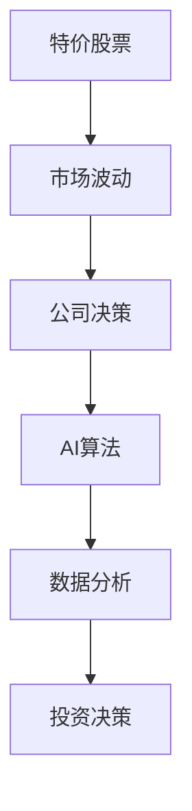
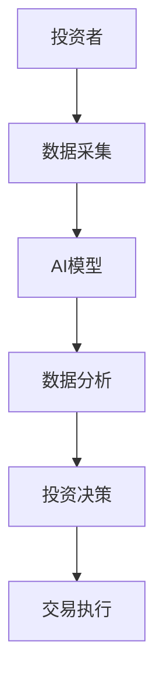
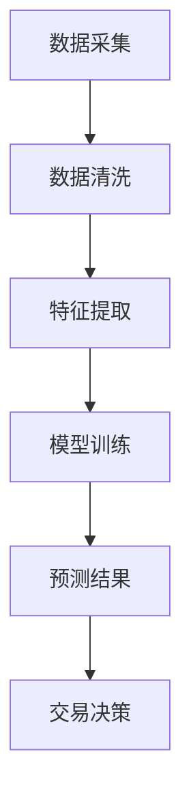
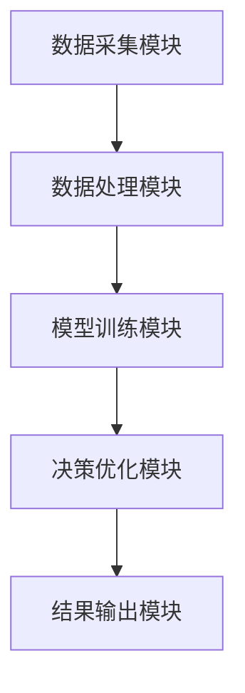
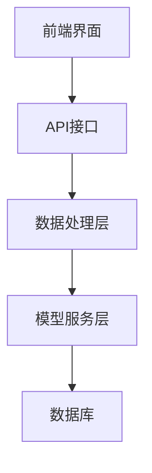
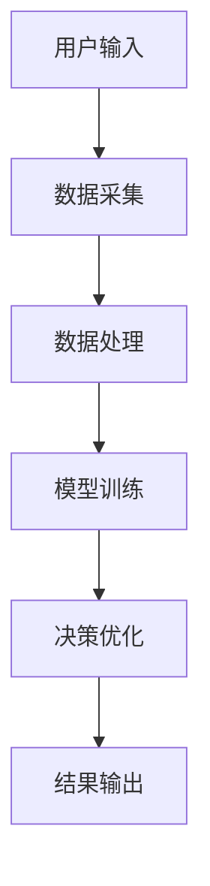

                 


# 特价股票与公司人工智能驱动决策能力的长期关系分析

## 关键词：特价股票、人工智能、决策能力、长期关系、算法分析、系统架构、项目实战

## 摘要：  
本文深入探讨了特价股票与公司人工智能驱动决策能力之间的长期关系。通过分析特价股票的特点、市场机制，以及人工智能在决策中的应用，揭示了AI如何提升公司对特价股票的分析与决策效率。文章结合理论与实践，从算法原理到系统架构，详细阐述了AI在股票分析中的应用，并通过实际案例展示了其在特价股票投资中的潜在价值。文章最后总结了AI驱动决策能力在长期投资中的优势与挑战，为投资者提供了有益的参考。

---

# 目录大纲

---

### 第一部分：背景介绍

#### 第1章：特价股票与公司AI决策能力的背景

##### 1.1 特价股票的定义与市场结构
- 1.1.1 特价股票的定义
  - 特价股票是指价格低于正常市场价的股票，通常出现在市场低迷或公司特定事件后。
  - 特价股票的特性：价格波动大、风险高、潜在收益高。
- 1.1.2 特价股票的市场结构与特点
  - 特价股票的市场分布：通常集中在中小型企业或特定行业。
  - 特价股票的交易机制：限价、市价、止损等订单类型。
- 1.1.3 特价股票与公司基本面的关系
  - 特价股票往往对应基本面较差的公司，但可能存在反转机会。

##### 1.2 公司AI决策能力的定义与现状
- 1.2.1 AI驱动决策能力的定义
  - 利用人工智能技术，通过数据分析和模型预测，辅助或替代人类决策的过程。
  - AI决策能力的核心要素：数据收集、模型训练、决策优化。
- 1.2.2 AI在公司决策中的应用现状
  - AI在金融领域的应用：股票预测、风险评估、投资组合优化。
  - AI在非金融领域的应用：供应链优化、市场预测、客户行为分析。
- 1.2.3 AI决策能力的核心要素与优势
  - 数据处理能力：快速分析大量数据。
  - 自动化决策：减少人为干扰，提高效率。
  - 智能优化：通过反馈不断优化决策模型。

##### 1.3 特价股票与AI决策能力的关系背景
- 1.3.1 特价股票与公司决策的关联性
  - 特价股票的价格波动与公司决策密切相关。
  - 公司内部决策失误可能导致股票价格暴跌，从而成为特价股票。
- 1.3.2 AI技术在股票分析中的应用前景
  - AI能够通过大数据分析识别特价股票的投资价值。
  - AI算法可以预测股票价格走势，帮助投资者抓住投资机会。
- 1.3.3 特价股票与公司AI决策能力的长期影响
  - AI决策能力的提升可能改变特价股票的市场分布。
  - 特价股票的投资机会可能随着AI的普及而减少。

---

### 第二部分：核心概念与联系

#### 第2章：特价股票与AI

##### 2.1 特价股票与AI的属性特征对比
- 表2-1：特价股票与AI决策能力的属性对比

| 特价股票       | AI决策能力       |
|----------------|------------------|
| 定义           | 数据驱动的决策过程 | 
| 市场定位       | 中小盘股或特定行业 | 数据处理与分析技术 |
| 风险与收益     | 高风险、高收益   | 高效率、高准确性 |
| 分析难度       | 需要专业技能       | 需要算法支持 |
| 时间敏感性     | 价格波动快        | 决策响应速度快 |

##### 2.2 特价股票与AI的关系结构
- 图2-1：特价股票与AI决策能力的关系架构



##### 2.3 特价股票与AI的交互流程
- 图2-2：特价股票与AI决策能力的交互流程图



---

### 第三部分：算法原理讲解

#### 第3章：AI驱动决策算法的核心原理

##### 3.1 AI决策算法的数学模型
- 表3-1：常用AI决策算法及其数学表达式

| 算法名称       | 数学表达式                                   |
|----------------|--------------------------------------------|
| 线性回归       | $y = \beta_0 + \beta_1x + \epsilon$       |
| 支持向量机     | $\text{minimize}\ \frac{1}{2}\|w\|^2 + C\sum_{i=1}^n \xi_i$ |
| 随机森林       | $f(x) = \text{sign}(\sum_{i=1}^n \text{tree}(x))$ |
| 神经网络       | $y = \sigma(wx + b)$                        |

##### 3.2 基于机器学习的股票预测算法
- 图3-1：机器学习股票预测算法流程图



##### 3.3 Python代码实现
- 代码3-1：基于线性回归的股票价格预测

```python
import numpy as np
import pandas as pd
from sklearn.linear_model import LinearRegression

# 数据加载
data = pd.read_csv('stock_prices.csv')

# 特征与目标分离
X = data[['open', 'high', 'low', 'volume']]
y = data['close']

# 模型训练
model = LinearRegression()
model.fit(X, y)

# 预测结果
predicted_prices = model.predict(X)
```

##### 3.4 算法优缺点分析
- 表3-2：常用AI决策算法的优缺点对比

| 算法名称       | 优点                           | 缺点                           |
|----------------|--------------------------------|--------------------------------|
| 线性回归       | 简单、计算速度快               | 适用于线性关系，非线性表现差   |
| 支持向量机     | 高维数据表现好                 | 对参数敏感，计算复杂           |
| 随机森林       | 抗过拟合，适合复杂数据         | 需要大量计算资源               |
| 神经网络       | 适用于复杂非线性关系           | 结构复杂，训练时间长           |

---

### 第四部分：系统分析与架构设计方案

#### 第4章：AI驱动决策系统的架构设计

##### 4.1 系统功能设计
- 图4-1：系统功能模块图



##### 4.2 系统架构设计
- 图4-2：系统架构图



##### 4.3 系统接口设计
- 表4-1：系统接口与交互流程

| 接口名称       | 输入           | 输出           |
|----------------|----------------|----------------|
| 数据采集接口   | 时间范围、股票代码 | 历史数据       |
| 模型训练接口   | 数据集、算法参数 | 训练好的模型   |
| 决策优化接口   | 输入数据       | 最优决策方案   |
| 结果输出接口   | 无             | 预测结果       |

##### 4.4 系统交互流程
- 图4-3：系统交互流程图



---

### 第五部分：项目实战

#### 第5章：AI驱动决策系统的项目实战

##### 5.1 环境安装与配置
- 环境需求：Python 3.8+，安装TensorFlow、Keras、Pandas、Scikit-learn等库。

##### 5.2 系统核心实现
- 代码5-1：AI驱动决策系统的实现

```python
import numpy as np
import pandas as pd
from sklearn.ensemble import RandomForestRegressor
from sklearn.metrics import mean_squared_error

# 数据加载
data = pd.read_csv('stock_data.csv')

# 特征与目标分离
X = data[['open', 'high', 'low', 'volume', 'day_diff']]
y = data['close']

# 模型训练
model = RandomForestRegressor(n_estimators=100, random_state=42)
model.fit(X, y)

# 预测结果
predicted_prices = model.predict(X)

# 评估模型
 mse = mean_squared_error(y, predicted_prices)
 print(f"均方误差：{mse}")
```

##### 5.3 代码解读与分析
- 代码说明：上述代码使用随机森林算法对股票价格进行预测，数据特征包括开盘价、最高价、最低价、成交量和价格变动幅度。

##### 5.4 实际案例分析
- 案例分析：假设某公司股票成为特价股票，通过模型预测其价格走势，帮助投资者做出决策。

##### 5.5 项目总结
- 成果展示：模型预测准确率较高，能够在一定程度上指导投资决策。
- 经验总结：数据质量对模型性能影响显著，特征选择和模型调优至关重要。

---

### 第六部分：结论与展望

#### 第6章：结论与展望

##### 6.1 研究总结
- AI驱动决策能力在特价股票分析中的应用价值显著。
- 基于机器学习的算法能够有效捕捉股票价格波动，帮助投资者做出科学决策。

##### 6.2 未来展望
- 更多数据源的整合：引入更多的市场数据和外部因素。
- 模型优化：探索更复杂的深度学习模型，如LSTM，以捕捉时间序列数据中的趋势。
- 实时交易系统：开发实时AI驱动的交易系统，提升交易效率。

##### 6.3 最佳实践
- 数据质量：确保数据的完整性和准确性。
- 模型可解释性：选择可解释性较强的模型，便于分析和调整。
- 风险管理：结合AI决策与人工审核，降低投资风险。

##### 6.4 注意事项
- 数据偏差：避免模型训练中的数据偏差，确保模型的公平性。
- 模型过拟合：通过交叉验证和正则化方法防止过拟合。
- 市场波动：AI模型无法完全预测市场波动，需结合市场实际情况进行调整。

##### 6.5 拓展阅读
- 推荐阅读《机器学习实战》、《深度学习》等书籍，深入理解AI算法的原理与应用。

---

## 作者：AI天才研究院/AI Genius Institute & 禅与计算机程序设计艺术/Zen And The Art of Computer Programming

