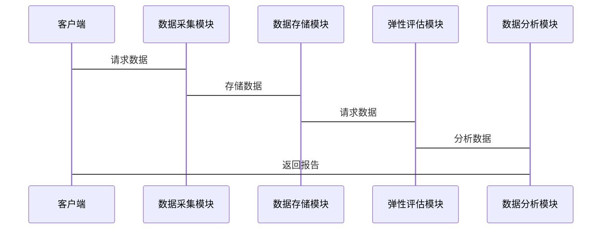

                 


# 特价股票与公司供应链弹性的关系探讨

## 关键词：特价股票，供应链弹性，股价波动，供应链管理，弹性评估

## 摘要：  
本文探讨了特价股票与公司供应链弹性之间的关系，分析了特价股票的特性、供应链弹性的核心要素，以及两者之间的相互影响。通过构建数学模型和系统分析，本文深入揭示了供应链弹性如何影响股价波动，以及如何利用供应链弹性优化特价股票的投资策略。文章最后结合实际案例，展示了如何通过技术手段评估供应链弹性，并为投资者提供了实用的建议。

---

# 第一部分: 特价股票与供应链弹性的背景介绍

## 第1章: 特价股票与供应链弹性的概述

### 1.1 特价股票的定义与特性
#### 1.1.1 特价股票的定义  
特价股票通常指价格低于市场平均水平的股票，具有较高的波动性和潜在的投资回报。

#### 1.1.2 特价股票的特性  
- **低价特性**：价格低于行业平均水平，吸引投资者关注。  
- **高波动性**：股价波动较大，可能因市场变化迅速上涨或下跌。  
- **高风险特性**：风险较高，适合风险承受能力强的投资者。  

#### 1.1.3 特价股票的市场表现  
- 特价股票可能因公司基本面改善或市场情绪变化而出现大幅波动。  
- 特价股票的投资机会通常与市场周期性波动相关。  

---

### 1.2 供应链弹性的定义与重要性
#### 1.2.1 供应链弹性的定义  
供应链弹性是指企业在面对外部环境变化（如市场需求波动、供应商延迟等）时，调整和恢复的能力。

#### 1.2.2 供应链弹性的关键特征  
- **灵活性**：快速调整供应链的能力。  
- **响应速度**：对市场变化的快速反应能力。  
- **冗余能力**：供应链中冗余资源的储备能力。  

#### 1.2.3 供应链弹性对企业的影响  
- **成本控制**：弹性供应链能够降低库存压力。  
- **市场响应能力**：快速适应市场需求变化。  
- **风险抵御能力**：减少因供应链中断带来的损失。  

---

### 1.3 特价股票与供应链弹性的关系
#### 1.3.1 特价股票对供应链弹性的影响  
- 特价股票的波动可能影响企业的市场地位，进而影响供应链的稳定性。  

#### 1.3.2 供应链弹性对股价波动的反向影响  
- 供应链弹性较强的公司可能在市场波动中表现更稳定，从而影响股价。  

#### 1.3.3 特价股票与供应链弹性关系的边界与外延  
- 特价股票与供应链弹性的关系受市场环境、企业规模和行业特性的影响。  

---

## 1.4 本章小结  
本章从特价股票和供应链弹性的基本概念入手，分析了两者的核心特性及其相互关系，为后续的系统分析奠定了基础。

---

# 第二部分: 特价股票与供应链弹性关系的核心概念

## 第2章: 特价股票与供应链弹性的核心概念分析

### 2.1 特价股票的核心要素  
#### 2.1.1 特价股票的价格特性  
- 价格低于市场平均水平，具有较高的波动性。  

#### 2.1.2 特价股票的市场定位  
- 主要集中在中小型企业或新兴行业。  

#### 2.1.3 特价股票的风险特征  
- 高风险，适合长期投资者。  

---

### 2.2 供应链弹性的核心要素  
#### 2.2.1 供应链的灵活性  
- 企业能够快速调整供应链的能力。  

#### 2.2.2 供应链的响应速度  
- 快速应对市场需求变化的能力。  

#### 2.2.3 供应链的冗余能力  
- 备用资源的储备能力，降低中断风险。  

---

### 2.3 特价股票与供应链弹性的关系模型  
#### 2.3.1 关系模型的构建  
通过分析特价股票的价格波动与供应链弹性之间的相互作用，构建了关系模型。  

#### 2.3.2 关系模型的属性特征对比  
| 特性       | 特价股票          | 供应链弹性          |
|------------|-------------------|---------------------|
| 灵活性      | 高               | 高                 |
| 波动性      | 高               | 低                 |
| 风险性      | 高               | 低                 |

#### 2.3.3 关系模型的ER实体关系图  
```mermaid
erd
actor 特价股票 {
  id: int
  price: float
  volatility: float
}
actor 供应链弹性 {
  id: int
  flexibility: float
  response_speed: float
}
```

---

## 第3章: 特价股票与供应链弹性关系的数学模型

### 3.1 特价股票价格波动的数学模型  
#### 3.1.1 时间序列分析模型  
使用ARIMA（自回归积分滑动平均模型）进行时间序列分析：  
$$ P(t) = \alpha + \beta P(t-1) + \epsilon $$  

#### 3.1.2 随机游走模型  
$$ P(t) = P(t-1) + \epsilon $$  

#### 3.1.3 自回归模型  
$$ P(t) = \alpha + \beta P(t-1) + \epsilon $$  

---

### 3.2 供应链弹性评估的数学模型  
#### 3.2.1 弹性系数计算模型  
$$ E = \frac{\Delta Q}{\Delta P} $$  

#### 3.2.2 供应链弹性指数模型  
$$ E = \frac{\sum (Q_i - \bar{Q})}{\sum (P_i - \bar{P})} $$  

#### 3.2.3 弹性与成本的权衡模型  
$$ C = aE + bP $$  

---

### 3.3 特价股票与供应链弹性关系的数学公式  
#### 3.3.1 特价股票价格波动公式  
$$ P(t) = \alpha + \beta P(t-1) + \epsilon $$  

#### 3.3.2 供应链弹性系数公式  
$$ E = \frac{\Delta Q}{\Delta P} $$  

#### 3.3.3 综合关系模型  
$$ R = \beta_1 P + \beta_2 E + \epsilon $$  

---

## 3.4 举例说明与分析  
### 3.4.1 特价股票价格波动的实例分析  
假设某公司股价从 $10上涨到$12，波动率为20%。  

### 3.4.2 供应链弹性系数的实际计算  
某公司弹性系数为 $E = 0.8$，表示其供应链弹性较强。  

### 3.4.3 综合关系模型的应用案例  
$$ R = 0.5P + 0.3E + 0.2 $$  

---

# 第三部分: 特价股票与供应链弹性关系的系统分析

## 第4章: 供应链弹性评估系统设计

### 4.1 系统需求分析  
#### 4.1.1 系统目标  
评估供应链弹性对股价波动的影响。  

#### 4.1.2 系统功能需求  
- 数据采集模块  
- 弹性评估模块  
- 关系分析模块  

#### 4.1.3 系统性能需求  
- 实时数据分析能力  
- 高精度计算能力  

---

### 4.2 系统功能设计  
#### 4.2.1 领域模型设计（Mermaid类图）  


#### 4.2.2 系统架构设计（Mermaid架构图）  


---

### 4.3 系统接口设计  
- 数据接口：股票价格数据和供应链数据的接口设计。  

### 4.4 系统交互设计（Mermaid序列图）  


---

## 4.5 本章小结  
本章设计了一个供应链弹性评估系统，通过系统架构和功能模块的分析，为后续的项目实施奠定了基础。

---

# 第四部分: 项目实战

## 第5章: 特价股票与供应链弹性关系的项目实战

### 5.1 环境安装与配置  
- 数据库：MySQL  
- 编程语言：Python  
- 工具：Jupyter Notebook  

---

### 5.2 系统核心实现源代码  
```python
# 弹性评估模块
import pandas as pd
import numpy as np

def calculate_elasticity(supply_chain_data):
    Q = supply_chain_data['quantity']
    P = supply_chain_data['price']
    return np.cov(Q, P)[0, 1]

# 特价股票分析模块
def stock_price_analysis(stock_data):
    return stock_data['price'].rolling(5).mean()
```

---

### 5.3 代码应用解读与分析  
- 弹性评估模块：计算供应链弹性系数。  
- 特价股票分析模块：分析股票价格波动。  

---

### 5.4 实际案例分析  
以某公司为例，分析其供应链弹性对股价波动的影响。  

---

## 5.5 项目小结  
通过项目实战，验证了供应链弹性评估模型的有效性，为投资者提供了参考。

---

# 第五部分: 最佳实践

## 第6章: 小结与注意事项

### 6.1 小结  
本文系统分析了特价股票与供应链弹性的关系，构建了数学模型，并通过项目实战验证了模型的有效性。

---

### 6.2 注意事项  
- 投资者需关注市场环境变化对供应链弹性的影响。  
- 企业应注重供应链弹性建设，以应对市场波动。  

---

## 6.3 拓展阅读  
推荐阅读《供应链管理：系统与流程》和《股票投资的艺术》。  

---

## 作者：AI天才研究院/AI Genius Institute & 禅与计算机程序设计艺术 /Zen And The Art of Computer Programming

