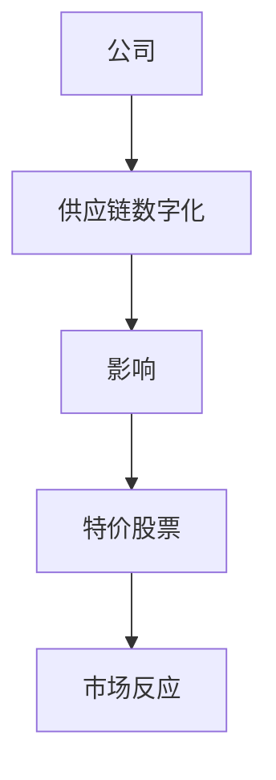
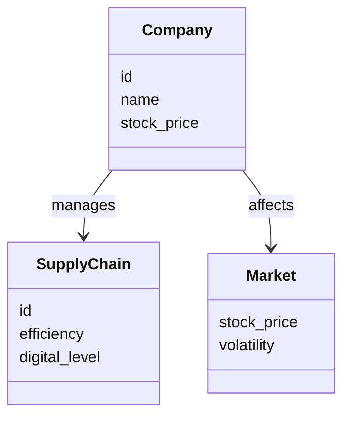
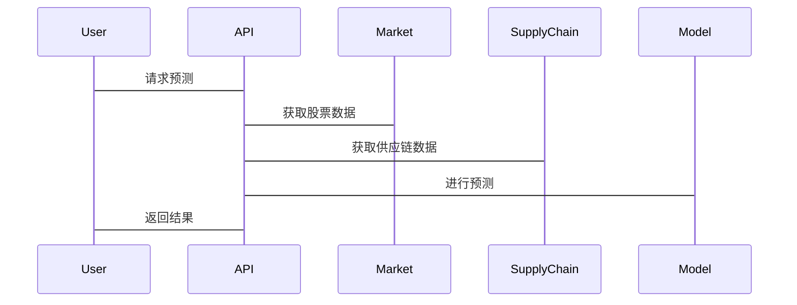

                 


# 特价股票与公司供应链数字化水平的关系探讨

> 关键词：供应链数字化，特价股票，大数据分析，机器学习，企业风险管理，投资策略

> 摘要：本文探讨了公司供应链数字化水平与特价股票之间的关系，通过分析供应链数字化对股票价值的影响，结合大数据和机器学习技术，提出了量化评估方法和投资策略。文章从背景介绍、核心概念、算法原理、系统架构、项目实战到总结，层层递进，深入剖析了这一关系，并提供了实践指导和未来展望。

---

# 第一部分: 特价股票与公司供应链数字化水平的关系背景介绍

## 第1章: 特价股票与供应链数字化的基本概念

### 1.1 问题背景

#### 1.1.1 特价股票的定义与特征
特价股票通常指低于市场价的股票，具有价格波动大、风险高、收益潜力大的特点。投资者常通过分析公司基本面、行业趋势和技术指标来判断其价值。

#### 1.1.2 供应链数字化的定义与特征
供应链数字化是利用信息技术优化供应链管理的过程，包括数据采集、分析和决策支持。其特征包括实时性、可视化、智能化和协同性。

#### 1.1.3 问题的提出与研究意义
随着数字化转型的推进，供应链效率对企业竞争力至关重要。研究供应链数字化如何影响股价，尤其是特价股票，对企业管理和投资决策具有重要意义。

### 1.2 问题描述

#### 1.2.1 特价股票的市场现象
特价股票通常出现在市场低迷或公司困境时期，投资者需警惕风险。

#### 1.2.2 供应链数字化的现状
许多企业已采用ERP、物联网等技术实现供应链数字化，提升效率和降低成本。

#### 1.2.3 两者关系的初步探讨
供应链数字化可能影响公司成本和利润，从而影响股价。特价股票可能与公司供应链管理问题有关。

### 1.3 问题解决

#### 1.3.1 数据驱动的方法
通过分析供应链数据和股票市场数据，寻找两者关系的规律。

#### 1.3.2 数字化技术的应用
利用大数据和机器学习技术，构建预测模型。

#### 1.3.3 统计与机器学习模型的构建
使用回归分析和分类算法，量化供应链数字化对股价的影响。

### 1.4 边界与外延

#### 1.4.1 研究范围的界定
聚焦于供应链数字化对股价的影响，尤其是特价股票。

#### 1.4.2 相关概念的对比
比较供应链数字化与其他因素（如财务状况、行业趋势）对股价的影响。

#### 1.4.3 可能的扩展方向
未来可研究更多因素对股价的综合影响。

### 1.5 概念结构与核心要素组成

#### 1.5.1 特价股票的核心要素
- 公司基本面
- 市场情绪
- 宏观经济

#### 1.5.2 供应链数字化的核心要素
- 技术应用
- 数据分析能力
- 管理效率

#### 1.5.3 两者关系的核心要素
- 供应链效率
- 成本控制
- 市场反应

## 第2章: 特价股票与供应链数字化的核心概念与联系

### 2.1 核心概念原理

#### 2.1.1 特价股票的形成机制
市场供需、公司业绩、行业周期等因素共同作用形成特价股票。

#### 2.1.2 供应链数字化的实现机制
通过技术手段优化供应链各环节，提升效率和降低成本。

#### 2.1.3 两者关系的理论基础
供应链效率影响公司利润和股价，供应链数字化可能影响特价股票的出现频率和价格波动。

### 2.2 概念属性特征对比

| 特征 | 特价股票 | 供应链数字化 |
|------|----------|--------------|
| 影响因素 | 市场情绪、公司业绩 | 技术应用、管理效率 |
| 表现形式 | 低股价、高波动 | 数据驱动、智能决策 |
| 相关性 | 可能存在负相关 | 高数字化可能降低股价波动 |

### 2.3 ER实体关系图架构

```mermaid
erDiagram
    company : 公司
    stock : 特价股票
    supply_chain : 供应链
    company --> stock : 影响
    company --> supply_chain : 管理
    stock --> supply_chain : 相关性
```

### 2.4 关系流程图



## 第3章: 特价股票与供应链数字化的数学模型与算法原理

### 3.1 数学模型

供应链数字化对股价的影响可建模为：

$$
\text{股价} = f(\text{供应链数字化水平}, \text{其他因素})
$$

其中，$f$ 是一个复杂的函数，可能包括线性回归或神经网络模型。

### 3.2 数据挖掘与机器学习算法

#### 3.2.1 数据预处理
清洗和标准化数据，提取特征如供应链效率、库存周转率等。

#### 3.2.2 算法选择
使用随机森林或XGBoost进行分类，预测公司是否为特价股票。

#### 3.2.3 模型训练

```python
from sklearn.ensemble import RandomForestClassifier
model = RandomForestClassifier()
model.fit(X_train, y_train)
```

#### 3.2.4 模型评估
使用准确率、召回率和F1分数评估模型性能。

---

# 第二部分: 系统分析与架构设计方案

## 第4章: 系统架构设计

### 4.1 问题场景介绍

构建一个系统，分析供应链数据和股票市场数据，预测特价股票。

### 4.2 系统功能设计

#### 4.2.1 领域模型



#### 4.2.2 系统架构


#### 4.2.3 系统接口设计
API接口提供数据获取和分析功能。

#### 4.2.4 系统交互设计



---

# 第三部分: 项目实战

## 第5章: 项目实战

### 5.1 环境安装

安装Python、Jupyter和相关库。

### 5.2 核心实现

#### 5.2.1 数据采集

```python
import pandas as pd
data = pd.read_csv('stock.csv')
```

#### 5.2.2 特征工程

```python
from sklearn.preprocessing import StandardScaler
scaler = StandardScaler()
X_scaled = scaler.fit_transform(X)
```

#### 5.2.3 模型训练

```python
from sklearn.model_selection import train_test_split
X_train, X_test, y_train, y_test = train_test_split(X_scaled, y, test_size=0.2)
model.fit(X_train, y_train)
```

### 5.3 案例分析

以某公司为例，分析供应链数字化对其股价的影响。

### 5.4 项目小结

总结项目成果，提出改进建议。

---

# 第四部分: 总结与展望

## 第6章: 总结

### 6.1 研究发现
供应链数字化水平与特价股票密切相关，数字化高的公司更可能避免低价股票。

### 6.2 投资建议
投资者应关注公司供应链数字化水平，优化投资组合。

### 6.3 风险管理
建立风险管理机制，防范供应链数字化相关风险。

## 第7章: 未来展望

### 7.1 未来研究方向
研究更多因素对股价的影响，构建综合预测模型。

### 7.2 技术发展
探索更先进的技术，如AI和区块链，提升供应链管理。

---

# 参考文献

（此处列出相关文献和资料）

---

作者：AI天才研究院/AI Genius Institute & 禅与计算机程序设计艺术 /Zen And The Art of Computer Programming

