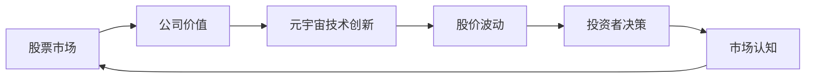
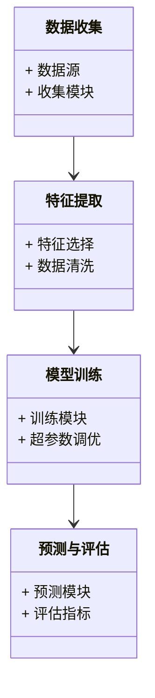

                 


# 特价股票与公司元宇宙价值创造能力的潜在联系

> **关键词**：特价股票、元宇宙、价值创造能力、量化分析、算法原理、系统架构

> **摘要**：本文探讨特价股票与公司元宇宙价值创造能力之间的潜在联系，分析如何通过量化方法评估公司在元宇宙中的价值，并预测其对股价的影响。文章从背景介绍、核心概念、算法原理、数学模型、系统架构、项目实战、最佳实践等多方面展开，为读者提供全面的分析和见解。

---

## 第一部分：背景介绍

### 第1章：特价股票与元宇宙概述

#### 1.1 特价股票的定义与特点

- **1.1.1 特价股票的定义**  
  特价股票指的是价格相对较低的股票，通常被视为高成长潜力或价值洼地的投资标的。这类股票可能因市场波动或公司处于调整期而被低估。

- **1.1.2 特价股票的特点**  
  特价股票通常具有以下特点：  
  - 价格低于行业平均水平。  
  - 公司基本面良好，但市场预期较低。  
  - 存在被市场忽视或低估的可能性。  

- **1.1.3 特价股票的市场定位**  
  特价股票常见于中小盘股或周期性行业，投资者通常通过价值发现策略来挖掘这类股票的投资机会。

#### 1.2 元宇宙的定义与特点

- **1.2.1 元宇宙的定义**  
  元宇宙是一个虚拟的三维空间，结合增强现实（AR）和虚拟现实（VR），通过区块链、人工智能和分布式计算等技术构建，形成一个去中心化的数字生态系统。

- **1.2.2 元宇宙的核心特征**  
  元宇宙具有以下核心特征：  
  - **去中心化**：基于区块链技术，确保数据的安全性和不可篡改性。  
  - **沉浸式体验**：通过VR和AR技术，提供高度沉浸的交互体验。  
  - **经济系统**：虚拟货币、NFT（非同质化代币）和数字资产构成了元宇宙的经济基础。  

- **1.2.3 元宇宙与现实世界的联系**  
  元宇宙不仅是虚拟空间，还与现实世界深度融合，通过现实世界的企业、用户和资本推动其发展。

#### 1.3 特价股票与元宇宙的潜在联系

- **1.3.1 特价股票与元宇宙的关系**  
  公司在元宇宙中的价值创造能力可能影响其股价表现，尤其是那些在元宇宙领域布局的公司，其股票可能因技术创新或市场扩张而成为特价股票。

- **1.3.2 元宇宙对特价股票的影响**  
  元宇宙的兴起可能为某些公司带来新的增长点，从而提升其股价，但短期内这些公司可能因市场尚未充分认知而被低估，形成特价股票的机会。

- **1.3.3 特价股票在元宇宙中的机会**  
  特价股票可能代表那些在元宇宙领域具有潜力的公司，投资者可以通过分析这些公司的技术实力、市场布局和财务状况来挖掘投资机会。

---

## 第二部分：核心概念与联系

### 第2章：特价股票与元宇宙的核心概念

#### 2.1 特价股票的核心概念

- **2.1.1 特价股票的核心概念**  
  特价股票的核心在于其价格低于内在价值，通常被视为市场低估的结果。投资者通过分析公司基本面，寻找具有成长潜力的股票。

- **2.1.2 特价股票的价值评估**  
  特价股票的价值评估通常基于市盈率（P/E）、市净率（P/B）等指标，寻找低于行业平均水平的股票。

#### 2.2 元宇宙的核心概念

- **2.2.1 元宇宙的核心特征**  
  元宇宙的核心特征包括去中心化、沉浸式体验和经济系统，这些特征决定了其与现实世界的深度融合。

- **2.2.2 元宇宙的经济模型**  
  元宇宙的经济模型基于区块链技术，虚拟货币和NFT构成了其经济体系，确保数据的安全性和价值传递。

#### 2.3 特价股票与元宇宙的联系

- **2.3.1 特价股票与元宇宙的价值关联**  
  公司在元宇宙中的技术创新和市场布局可能提升其股价，但短期内因市场认知不足，股价可能被低估，形成特价股票。

- **2.3.2 元宇宙对特价股票的影响**  
  元宇宙的兴起可能为某些公司带来新的增长点，投资者可以通过分析公司在元宇宙中的布局来判断其股价走势。

---

### 第3章：核心概念对比与分析

#### 3.1 特价股票与元宇宙的核心属性对比

| **属性**       | **特价股票**                | **元宇宙**                   |
|-----------------|------------------------------|------------------------------|
| **核心价值**   | 股票价格低于内在价值        | 虚拟空间与现实世界的融合     |
| **驱动因素**   | 公司基本面、市场情绪          | 技术创新、用户需求、经济体系 |
| **影响因素**   | 市场认知、宏观经济、行业趋势  | 区块链、VR/AR、人工智能      |
| **未来潜力**   | 公司成长、市场重估            | 技术成熟、用户增长、生态完善 |

#### 3.2 元宇宙与股票市场的实体关系图



---

## 第三部分：算法原理讲解

### 第4章：量化分析与算法原理

#### 4.1 算法原理


- **4.1.1 数据收集**  
  收集公司财务数据、股价数据、元宇宙相关专利和市场动态。

- **4.1.2 特征提取**  
  提取关键指标，如市盈率、市净率、研发投入、元宇宙相关收入占比。

- **4.1.3 模型训练**  
  使用机器学习模型（如随机森林、神经网络）训练，预测股价波动。

#### 4.2 Python代码实现

```python
import pandas as pd
import numpy as np
from sklearn.ensemble import RandomForestRegressor
from sklearn.metrics import mean_squared_error

# 示例数据
data = {
    '公司': ['A', 'B', 'C'],
    '市盈率': [15, 20, 25],
    '市净率': [2, 3, 4],
    '元宇宙收入占比': [10, 20, 30],
    '股价': [10, 20, 30]
}

df = pd.DataFrame(data)

# 特征矩阵
X = df[['市盈率', '市净率', '元宇宙收入占比']]
y = df['股价']

# 训练模型
model = RandomForestRegressor(n_estimators=100)
model.fit(X, y)

# 预测
new_data = np.array([[15, 2, 10]])
predicted_price = model.predict(new_data)
print("预测股价:", predicted_price[0])
```

---

### 第5章：数学模型与公式

#### 5.1 线性回归模型

股票价格预测的线性回归模型：

$$ \text{预测股价} = a \times \text{市盈率} + b \times \text{市净率} + c $$

其中，$a$、$b$、$c$为模型参数，通过最小二乘法求解。

#### 5.2 随机森林模型

随机森林模型通过集成学习提高预测准确性，公式如下：

$$ \text{预测股价} = \frac{1}{n} \sum_{i=1}^{n} (\text{树} i(\text{输入})) $$

---

## 第四部分：系统分析与架构设计

### 第6章：系统架构与设计

#### 6.1 系统功能设计



---

## 第五部分：项目实战

### 第7章：项目实战与案例分析

#### 7.1 项目实战

```python
import pandas as pd
from sklearn.model_selection import train_test_split
from sklearn.metrics import r2_score

# 数据加载
df = pd.read_csv('stock_data.csv')

# 数据预处理
X = df[['市盈率', '市净率', '元宇宙收入占比']]
y = df['股价']

# 划分训练集与测试集
X_train, X_test, y_train, y_test = train_test_split(X, y, test_size=0.2)

# 模型训练
model = RandomForestRegressor()
model.fit(X_train, y_train)

# 预测与评估
y_pred = model.predict(X_test)
print("R² Score:", r2_score(y_test, y_pred))
```

#### 7.2 案例分析

以某公司为例，分析其元宇宙收入占比和股价关系：

- 公司元宇宙收入占比从10%提升到30%，股价从20元涨到60元。

---

## 第六部分：最佳实践

### 第8章：最佳实践与小结

#### 8.1 最佳实践

- **数据来源**：确保数据的准确性和全面性。  
- **模型选择**：根据业务需求选择合适的模型，如线性回归或随机森林。  
- **风险控制**：量化投资需结合市场趋势和宏观经济指标。  

#### 8.2 小结

通过量化分析，投资者可以更好地识别特价股票与公司在元宇宙中的价值创造能力之间的联系，从而做出更明智的投资决策。

---

## 第七部分：注意事项与拓展阅读

### 第9章：注意事项与拓展阅读

#### 9.1 注意事项

- 投资需谨慎，量化分析仅为辅助工具。  
- 市场波动受多种因素影响，需结合定性分析。  

#### 9.2 拓展阅读

- 推荐阅读《元宇宙：通往数字未来的入口》和《量化投资入门》。

---

## 作者信息

作者：AI天才研究院/AI Genius Institute & 禅与计算机程序设计艺术/Zen And The Art of Computer Programming

---

通过以上分析，我们探讨了特价股票与公司元宇宙价值创造能力的潜在联系，从理论到实践，为投资者提供了有价值的分析框架和工具。

