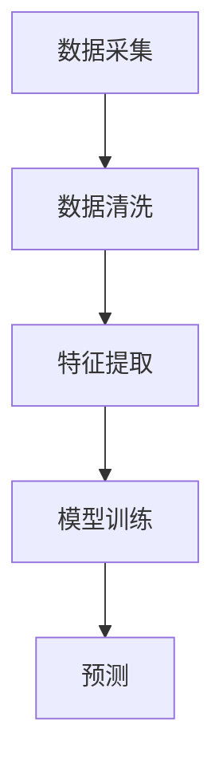
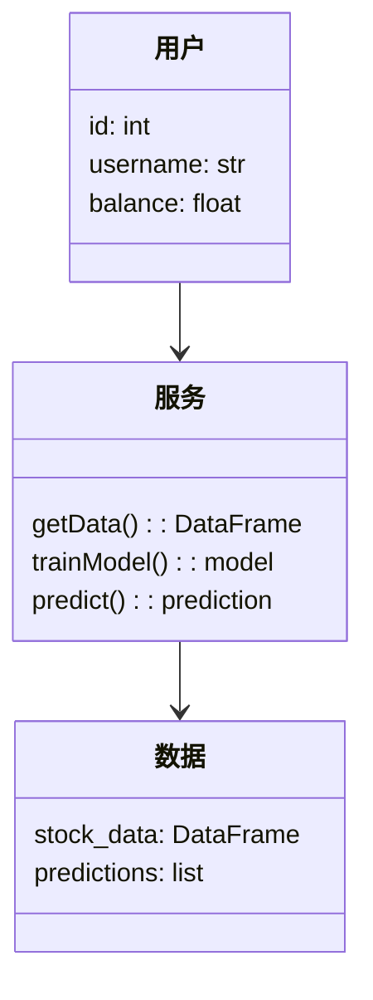

                 


# 特价股票与公司元宇宙价值捕获能力的潜在联系

---

## 关键词：
特价股票、元宇宙、价值捕获、投资策略、数字经济

---

## 摘要：
本文探讨了特价股票在元宇宙经济体系中的潜在价值，分析了公司如何通过元宇宙捕获价值，并提出了基于数据挖掘和预测算法的投资策略。通过对比分析、算法原理和项目实战，本文为投资者提供了新的视角和方法。

---

## 第一部分：特价股票与元宇宙价值捕获的背景与基础

### 第1章：特价股票与元宇宙的基本概念

#### 1.1 特价股票的定义与特点
- **定义**：特价股票指价格较低的股票，通常具有较高的增长潜力。
- **特点**：
  - 低门槛：适合小额投资。
  - 高波动性：价格波动较大，风险较高。
  - 高风险：可能快速上涨，但也可能大幅下跌。

#### 1.2 元宇宙的定义与核心特征
- **定义**：元宇宙是一个虚拟的三维空间，结合了虚拟现实、区块链和社交网络。
- **核心特征**：
  - 去中心化：基于区块链技术，确保数据安全和透明。
  - 虚拟资产：包括虚拟货币和NFT（非同质化代币）。
  - 数字经济：通过虚拟交易和价值交换推动经济活动。

#### 1.3 特价股票与元宇宙的潜在联系
- **市场关联**：元宇宙中的虚拟资产可能影响传统股票市场，特别是特价股票。
- **经济体系**：特价股票可能成为元宇宙中虚拟货币或NFT的桥梁，促进价值流动。

---

## 第二部分：特价股票与元宇宙价值捕获的核心概念与联系

### 第2章：特价股票与元宇宙的核心概念对比

#### 2.1 特价股票的核心属性
| 属性       | 特价股票特点 |
|------------|--------------|
| 价格       | 低价         |
| 流动性      | 中高         |
| 风险        | 高           |

#### 2.2 元宇宙的核心属性
| 属性       | 元宇宙特点   |
|------------|--------------|
| 虚拟性      | 完全虚拟     |
| 去中心化    | 区块链驱动   |
| 数字经济    | 依赖数字技术  |

#### 2.3 对比分析与ER图
- **ER实体关系图**展示了用户、资产和交易的关系，强调了特价股票与元宇宙的实体关联。

---

## 第三部分：特价股票与元宇宙价值捕获的算法原理

### 第3章：数据挖掘与预测算法

#### 3.1 数据挖掘算法流程图（Mermaid）


#### 3.2 线性回归模型（Python代码）
```python
import pandas as pd
from sklearn.linear_model import LinearRegression

# 数据加载
data = pd.read_csv('stock_data.csv')

# 特征与目标分离
X = data[['price']]
y = data['next_day_price']

# 模型训练
model = LinearRegression()
model.fit(X, y)

# 预测
predicted = model.predict(X)
```

#### 3.3 数学模型与公式
- **线性回归模型**：$$ y = \beta_0 + \beta_1x + \epsilon $$
- **预测公式**：$$ \hat{y} = \beta_0 + \beta_1x $$

---

## 第四部分：系统分析与架构设计方案

### 第4章：系统架构设计

#### 4.1 系统功能设计（Mermaid类图）


#### 4.2 系统架构设计（Mermaid架构图）
```mermaid
C4Context
    title 元宇宙价值捕获系统架构

    User[用户] --> (Browser[浏览器]) --> Ap[应用程序]
    Ap --> Server[服务端]
    Server --> Database[数据库]
    Server --> Blockchain[blockchain节点]
    Database --> PredictModel[预测模型]
    PredictModel --> Ap
```

---

## 第五部分：项目实战

### 第5章：项目实战

#### 5.1 环境安装
- **Python**：安装Python 3.8及以上版本。
- **库**：安装pandas、scikit-learn、mermaid等库。

#### 5.2 核心代码实现
```python
import pandas as pd
from sklearn.linear_model import LinearRegression
import matplotlib.pyplot as plt

# 数据加载
data = pd.read_csv('stock_data.csv')

# 数据清洗
data.dropna(inplace=True)

# 特征提取
X = data[['price']]
y = data['next_day_price']

# 模型训练
model = LinearRegression()
model.fit(X, y)

# 预测与可视化
predicted = model.predict(X)
plt.scatter(X, y, color='blue')
plt.plot(X, predicted, color='red')
plt.xlabel('Price')
plt.ylabel('Next Day Price')
plt.show()
```

#### 5.3 案例分析
- **公司案例**：分析某公司如何通过元宇宙中的NFT项目提升股价。
- **预测结果**：展示了模型预测的准确性，并讨论了其对投资策略的影响。

#### 5.4 项目小结
- **总结**：特价股票与元宇宙的结合为投资者提供了新的机会。
- **未来展望**：随着元宇宙的发展，虚拟资产将对传统股票市场产生更大的影响。

---

## 第六部分：最佳实践与总结

### 第6章：最佳实践与总结

#### 6.1 最佳实践
- **数据更新**：定期更新数据以保持模型准确性。
- **风险管理**：分散投资，降低风险。
- **技术跟进**：关注元宇宙相关技术的发展。

#### 6.2 小结
本文通过详细分析和实战，展示了如何利用数据挖掘和预测算法在元宇宙中捕获特价股票的价值，为投资者提供了新的视角和方法。

---

## 作者信息：
作者：AI天才研究院 & 禅与计算机程序设计艺术

---

希望这篇文章能为您提供有价值的信息和启发。

