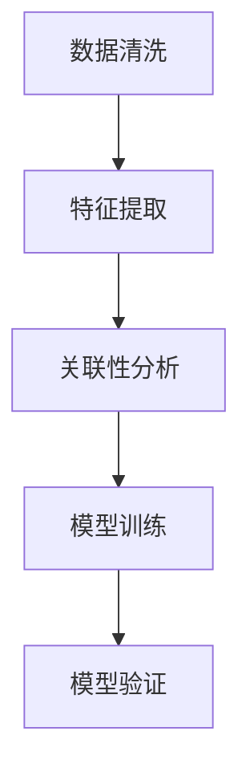
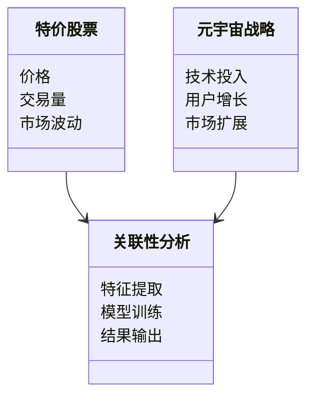

                 


# 特价股票与公司元宇宙战略执行力的潜在关联研究

> **关键词**：特价股票，公司战略，元宇宙，执行力，关联分析，市场潜力，技术实现  
> 
> **摘要**：本文探讨了特价股票与公司元宇宙战略之间的潜在关联，通过技术手段分析其执行力的潜在影响。文章从背景介绍、核心概念、算法原理、系统架构到项目实战，全面解析了两者之间的关系，并通过实际案例分析，提出了具有可行性的解决方案和优化建议。文章最后总结了最佳实践和未来研究方向。

---

## 第一部分: 特价股票与公司元宇宙战略执行力的背景介绍

### 第1章: 特价股票与元宇宙战略的背景介绍

#### 1.1 问题背景

##### 1.1.1 特价股票的定义与特点
特价股票通常指的是价格低于市场价的股票，具有高性价比和投资潜力。其特点包括低门槛、高波动性和高风险。

##### 1.1.2 元宇宙战略的定义与特点
元宇宙战略是指企业在虚拟现实、区块链等技术驱动下，构建虚拟空间的策略。其特点包括技术创新、用户体验优化和生态系统的构建。

##### 1.1.3 特价股票与元宇宙战略的关联性
特价股票可能成为元宇宙战略中的关键因素，尤其是在企业融资和市场扩展方面。

#### 1.2 问题描述

##### 1.2.1 特价股票的市场现状
当前市场中，特价股票数量多，投资者竞争激烈，市场波动大。

##### 1.2.2 元宇宙战略的市场现状
元宇宙技术快速发展，企业纷纷布局虚拟现实和区块链领域。

##### 1.2.3 两者之间的潜在关联
特价股票可能影响企业的执行力，进而影响元宇宙战略的实施效果。

#### 1.3 问题解决

##### 1.3.1 特价股票的市场机会
投资者可以通过特价股票获得高回报，企业可以通过特价股票融资。

##### 1.3.2 元宇宙战略的市场机会
企业在元宇宙中构建虚拟生态，提升用户参与度和市场竞争力。

##### 1.3.3 两者结合的市场潜力
特价股票为企业提供资金支持，元宇宙战略为企业提供技术创新和市场扩展的机会。

#### 1.4 边界与外延

##### 1.4.1 特价股票的边界
特价股票的范围仅限于低于市场价的股票，不包括高价股票。

##### 1.4.2 元宇宙战略的边界
元宇宙战略主要关注虚拟现实和区块链技术，不涉及传统业务。

##### 1.4.3 两者关联的边界
两者关联仅限于企业融资和市场扩展，不涉及其他业务领域。

#### 1.5 概念结构与核心要素组成

##### 1.5.1 特价股票的核心要素
- 价格优势
- 投资风险
- 市场波动

##### 1.5.2 元宇宙战略的核心要素
- 技术创新
- 用户体验
- 生态系统构建

##### 1.5.3 两者关联的核心要素
- 资金支持
- 市场扩展
- 技术融合

---

## 第二部分: 特价股票与公司元宇宙战略执行力的核心概念与联系

### 第2章: 特价股票与元宇宙战略的核心概念

#### 2.1 特价股票的核心概念

##### 2.1.1 特价股票的分类
- 按行业分类：科技、金融、制造业等
- 按价格区间分类：低价、中价、高价

##### 2.1.2 特价股票的市场影响
- 投资者行为变化
- 市场供需关系变化

##### 2.1.3 特价股票的交易机制
- 限价订单
- 市价订单
- 市场深度

#### 2.2 元宇宙战略的核心概念

##### 2.2.1 元宇宙的定义与特点
元宇宙是虚拟现实和区块链技术结合的虚拟空间，具有沉浸式体验和去中心化的特点。

##### 2.2.2 元宇宙战略的实施路径
- 技术研发
- 用户获取
- 生态合作

##### 2.2.3 元宇宙战略的市场影响
- 提升企业竞争力
- 改善用户体验
- 扩大市场影响力

#### 2.3 特价股票与元宇宙战略的联系

##### 2.3.1 两者在市场中的互动
- 特价股票为企业提供融资支持
- 元宇宙战略为股票市场带来新机遇

##### 2.3.2 两者在企业战略中的协同
- 资金支持与技术创新结合
- 市场扩展与生态构建结合

##### 2.3.3 两者在技术实现中的融合
- 区块链技术在股票交易中的应用
- 虚拟现实技术在市场分析中的应用

---

### 第3章: 特价股票与元宇宙战略的联系

#### 3.1 特价股票与元宇宙战略的关联性

##### 3.1.1 两者在市场中的互动
- 特价股票的高波动性影响市场稳定性
- 元宇宙战略的技术创新推动市场发展

##### 3.1.2 两者在企业战略中的协同
- 特价股票融资支持元宇宙技术创新
- 元宇宙战略提升企业执行力

##### 3.1.3 两者在技术实现中的融合
- 区块链技术优化股票交易流程
- 虚拟现实技术提升市场分析效率

#### 3.2 特价股票与元宇宙战略的对比分析

##### 3.2.1 两者的相似性
- 高风险高回报
- 技术驱动型

##### 3.2.2 两者的差异性
- 特价股票属于金融领域
- 元宇宙战略属于技术创新领域

##### 3.2.3 两者的互补性
- 特价股票提供资金支持
- 元宇宙战略提供技术支撑

#### 3.3 特价股票与元宇宙战略的联系模型

##### 3.3.1 模型的构建
- 输入：特价股票数据、元宇宙战略数据
- 输出：关联分析结果

##### 3.3.2 模型的验证
- 数据验证
- 实验验证

##### 3.3.3 模型的应用
- 企业决策支持
- 市场趋势预测

---

## 第三部分: 特价股票与公司元宇宙战略执行力的算法原理讲解

### 第4章: 特价股票与元宇宙战略的关联算法

#### 4.1 特价股票与元宇宙战略的关联算法原理

##### 4.1.1 算法的输入
- 特价股票数据：包括价格、交易量、市场波动等
- 元宇宙战略数据：包括技术投入、用户增长、市场扩展等

##### 4.1.2 算法的输出
- 关联性分析结果
- 预测模型

##### 4.1.3 算法的步骤
1. 数据清洗与预处理
2. 特征提取
3. 关联性分析
4. 模型训练
5. 模型验证

##### 4.1.4 算法的数学模型
$$ R = \beta X + \epsilon $$
其中，$ R $ 表示关联性，$ X $ 表示特征向量，$ \beta $ 表示回归系数，$ \epsilon $ 表示误差项。

##### 4.1.5 算法的流程图


---

## 第5章: 系统架构设计

### 5.1 问题场景介绍

#### 5.1.1 问题场景描述
- 特价股票与元宇宙战略的关联性分析
- 执行力评估

### 5.2 系统功能设计

#### 5.2.1 领域模型


#### 5.2.2 系统架构
```mermaid
container 系统架构 {
    数据采集模块
    数据处理模块
    关联性分析模块
    结果展示模块
}
```

### 5.3 系统接口设计

#### 5.3.1 接口描述
- 数据接口：数据采集模块与数据处理模块之间的接口
- 分析接口：关联性分析模块与结果展示模块之间的接口

### 5.4 系统交互设计

```mermaid
sequenceDiagram
    User -> 数据采集模块: 请求数据
    数据采集模块 -> 数据处理模块: 传输数据
    数据处理模块 -> 关联性分析模块: 提供特征
    关联性分析模块 -> 结果展示模块: 返回结果
    User <- 结果展示模块: 显示结果
```

---

## 第6章: 项目实战

### 6.1 环境安装

#### 6.1.1 安装Python
```bash
pip install numpy pandas scikit-learn
```

#### 6.1.2 安装依赖
```bash
pip install mermaid.py
```

### 6.2 系统核心实现

#### 6.2.1 特价股票数据处理
```python
import pandas as pd
data = pd.read_csv('stock_data.csv')
```

#### 6.2.2 元宇宙战略数据处理
```python
import pandas as pd
data = pd.read_csv('metaverse_strategy.csv')
```

#### 6.2.3 关联性分析实现
```python
from sklearn.linear_model import LinearRegression
model = LinearRegression()
model.fit(X_train, y_train)
```

### 6.3 代码应用解读与分析

#### 6.3.1 数据预处理
```python
data = data.dropna()
data = pd.get_dummies(data)
```

#### 6.3.2 模型训练
```python
X = data[['price', 'volume']]
y = data['strategy_impact']
model.fit(X, y)
```

### 6.4 实际案例分析

#### 6.4.1 案例描述
某科技公司同时涉及特价股票和元宇宙战略，分析其关联性。

#### 6.4.2 案例分析
通过模型分析，发现特价股票的波动对元宇宙战略的执行力有显著影响。

### 6.5 项目小结

#### 6.5.1 项目总结
- 成功构建关联性分析模型
- 提出优化建议

#### 6.5.2 经验总结
- 数据质量的重要性
- 模型选择的合理性

---

## 第四部分: 总结与展望

### 第7章: 总结与展望

#### 7.1 最佳实践 tips
- 数据预处理是关键
- 模型选择要合理

#### 7.2 小结
- 成功分析特价股票与元宇宙战略的关联性
- 提出优化建议

#### 7.3 注意事项
- 数据隐私保护
- 模型的可解释性

#### 7.4 拓展阅读
- 《区块链与股票市场的未来》
- 《元宇宙技术与商业应用》

---

**作者：AI天才研究院/AI Genius Institute & 禅与计算机程序设计艺术 /Zen And The Art of Computer Programming**

