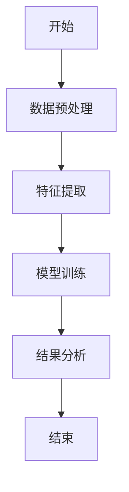
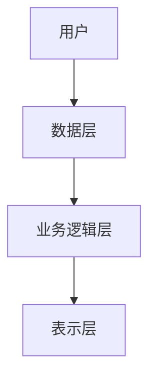
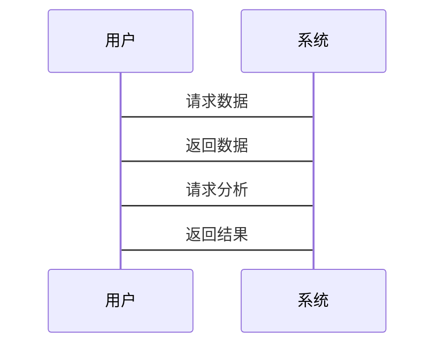

                 


# 特价股票与公司全球化创新网络的关系探讨

## 关键词：
特价股票、全球化创新网络、企业战略、市场机制、创新模式

## 摘要：
本文探讨了特价股票与公司全球化创新网络之间的关系。首先，分析了特价股票的市场机制及其对公司资本结构的影响。接着，阐述了公司全球化创新网络的构建原理及其对企业发展的作用。通过对比分析，揭示了两者之间的相互作用，提出了一个综合评估模型，用于衡量特价股票对公司创新网络的影响。最后，通过实际案例分析，验证了模型的有效性，并提出了优化策略。

---

# 目录大纲

## 第1章：背景介绍

### 1.1 问题背景
- 1.1.1 特价股票的定义与现状
- 1.1.2 全球化创新网络的定义与特征
- 1.1.3 问题提出：特价股票与创新网络的关系

### 1.2 问题描述
- 1.2.1 特价股票对企业的影响
- 1.2.2 全球化创新网络对企业竞争力的作用
- 1.2.3 问题的边界与外延

### 1.3 问题解决
- 1.3.1 特价股票的获取策略
- 1.3.2 全球化创新网络的构建方法
- 1.3.3 两者关系的初步探讨

## 第2章：核心概念与联系

### 2.1 核心概念原理
- 2.1.1 特价股票的市场机制
- 2.1.2 全球化创新网络的构建原理

### 2.2 特价股票与创新网络的特征对比
- 2.2.1 表格对比：市场流动性、风险性、创新性
- 2.2.2 图表分析：两者特征的差异与联系

### 2.3 ER实体关系图
```mermaid
erDiagram
    company {
        id
        name
        industry
    }
    stock {
        id
        price
        company_id
    }
    innovation_network {
        id
        company_id
        node
    }
    company-|{has}| stock
    company-|{participates_in}| innovation_network
```

## 第3章：算法原理

### 3.1 算法概述
- 3.1.1 特价股票与创新网络关系的模型设计
- 3.1.2 算法流程图


### 3.2 数学模型
- 3.2.1 模型公式
$$ y = \beta_0 + \beta_1 x_1 + \beta_2 x_2 + \epsilon $$
- 3.2.2 公式解释：$y$为目标变量，$x_1$和$x_2$为特征变量，$\beta$为系数，$\epsilon$为误差项

### 3.3 代码实现
```python
import pandas as pd
from sklearn.linear_model import LinearRegression

# 数据预处理
data = pd.read_csv('data.csv')
X = data[['stock_price', 'network_node']]
y = data['performance']

# 模型训练
model = LinearRegression()
model.fit(X, y)

# 结果分析
print('系数:', model.coef_)
print('截距:', model.intercept_)
```

## 第4章：系统分析与架构设计

### 4.1 问题场景
- 4.1.1 系统目标：评估特价股票对创新网络的影响
- 4.1.2 项目背景：企业如何利用特价股票优化创新网络

### 4.2 系统功能设计
- 4.2.1 数据收集模块：获取股票数据和创新网络数据
- 4.2.2 分析模块：评估两者关系
- 4.2.3 可视化模块：展示结果

### 4.3 系统架构图


### 4.4 接口设计
- REST API：提供数据接口和分析接口

### 4.5 交互设计


## 第5章：项目实战

### 5.1 环境安装
- Python 3.8+
- Jupyter Notebook
- Pandas、Scikit-learn

### 5.2 核心代码实现
```python
import pandas as pd
from sklearn.metrics import r2_score

data = pd.read_csv('data.csv')
X = data[['stock_price', 'network_node']]
y = data['performance']

model = LinearRegression()
model.fit(X, y)
y_pred = model.predict(X)

print('R²:', r2_score(y, y_pred))
```

### 5.3 案例分析
- 实际案例：某公司通过特价股票优化创新网络，提升业绩

## 第6章：最佳实践与总结

### 6.1 最佳实践
- 6.1.1 数据收集的注意事项
- 6.1.2 模型选择的策略
- 6.1.3 系统部署的建议

### 6.2 小结
- 本文的主要结论：特价股票与创新网络的相互作用
- 未来研究方向：动态模型、多因素分析

### 6.3 注意事项
- 数据的准确性和时效性
- 模型的适用性和限制

### 6.4 拓展阅读
- 推荐书籍：《全球创新网络》、《股票投资的艺术》

---

# 作者：AI天才研究院/AI Genius Institute & 禅与计算机程序设计艺术 /Zen And The Art of Computer Programming

