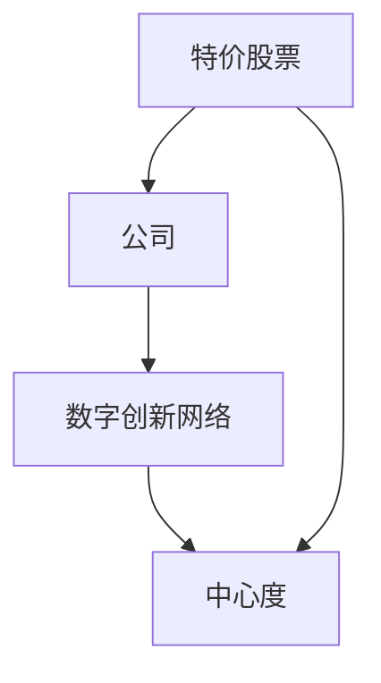
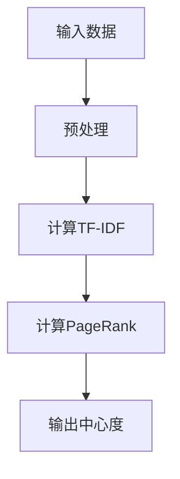
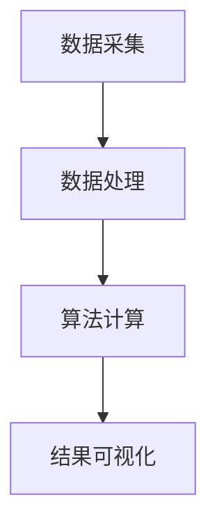

                 


```markdown
# 特价股票与公司全球数字创新网络中心度的关系探讨

> 关键词：特价股票、公司中心度、数字创新网络、PageRank算法、TF-IDF

> 摘要：本文探讨了特价股票与公司全球数字创新网络中心度之间的关系，通过分析数字创新网络的构建、中心度的衡量方法，以及如何利用算法量化公司影响力，提出了将数字创新网络中心度作为评估特价股票投资价值的重要指标。文章结合理论与实践，提出了构建量化分析系统的方案，并通过实际案例展示了如何利用该系统进行投资决策。

---

## 第一部分：特价股票与公司全球数字创新网络中心度的背景介绍

### 第1章：特价股票与公司全球数字创新网络中心度的基本概念

#### 1.1 特价股票的定义与特点
- **1.1.1 特价股票的定义**  
  特价股票指的是价格相对较低的股票，通常具有较高的波动性和潜在的成长性。  
- **1.1.2 特价股票的市场表现特征**  
  特价股票往往集中在小盘股或新兴行业，具有较高的风险和回报潜力。  
- **1.1.3 特价股票的投资价值分析**  
  特价股票可能因市场波动而被低估，投资者可以通过挖掘其潜在价值获利。

#### 1.2 公司全球数字创新网络的定义与特点
- **1.2.1 数字创新网络的定义**  
  数字创新网络是指由数字技术驱动的创新生态系统，包括企业、技术供应商、合作伙伴等。  
- **1.2.2 全球数字创新网络的构建要素**  
  包括技术、数据、人才、资本和政策等关键要素。  
- **1.2.3 公司在数字创新网络中的角色**  
  公司可以是技术创新者、技术应用者或生态系统整合者。

#### 1.3 公司全球数字创新网络中心度的定义与意义
- **1.3.1 中心度的定义**  
  中心度是指在网络中，某个节点在信息传递或资源分配中的影响力和控制力。  
- **1.3.2 全球数字创新网络中心度的衡量指标**  
  包括度数中心度、中间中心度和接近中心度等。  
- **1.3.3 中心度在数字创新网络中的应用价值**  
  中心度高的公司通常具有更强的资源整合能力和市场影响力。

---

### 第2章：特价股票与公司全球数字创新网络中心度的关系背景

#### 2.1 特价股票与数字创新网络的关联性分析
- **2.1.1 特价股票市场的波动性与数字创新的关系**  
  数字创新技术的推广可能引发相关股票的波动，尤其是那些在数字创新网络中占据重要地位的公司。  
- **2.1.2 数字创新对特价股票价值的影响**  
  数字创新技术的突破可能提升公司的市场地位，从而影响其股价。  
- **2.1.3 全球化视角下数字创新对股票市场的渗透**  
  数字创新网络的全球化使得特价股票的波动具有更广泛的市场影响。

#### 2.2 全球数字创新网络的形成与发展
- **2.2.1 数字技术创新的历史演变**  
  从互联网到人工智能，数字技术创新推动了全球化的数字创新网络。  
- **2.2.2 全球数字创新网络的构建过程**  
  通过技术合作、数据共享和资源整合，逐步形成复杂的数字创新网络。  
- **2.2.3 数字创新网络对全球经济的影响**  
  数字创新网络已成为推动全球经济增长的重要引擎。

#### 2.3 特价股票与数字创新网络中心度的互动
- **2.3.1 特价股票市场波动对数字创新网络的影响**  
  特价股票的波动可能反映数字创新网络中的技术变革。  
- **2.3.2 数字创新网络中心度对特价股票价值的影响**  
  中心度高的公司通常具有更强的抗风险能力和增长潜力，从而影响其股价表现。  
- **2.3.3 特价股票与数字创新网络中心度的双向互动关系**  
  特价股票的市场表现可以反向影响数字创新网络的结构和中心度分布。

---

## 第二部分：特价股票与公司全球数字创新网络中心度的核心概念与联系

### 第3章：核心概念与联系的深入分析

#### 3.1 特价股票与公司全球数字创新网络中心度的核心概念
- **3.1.1 特价股票的核心属性**  
  包括低估值、高波动性和潜在成长性。  
- **3.1.2 数字创新网络中心度的核心属性**  
  包括影响力、资源整合能力和市场地位。

#### 3.2 特价股票与公司全球数字创新网络中心度的属性对比
- **3.2.1 属性对比表格**

| 属性         | 特价股票                 | 公司全球数字创新网络中心度 |
|--------------|--------------------------|----------------------------|
| 定义         | 价格较低的股票           | 网络中节点的影响力和控制力   |
| 主要影响因素 | 市场供需、公司基本面      | 技术创新、资源整合、市场地位 |
| 应用场景     | 投资、投机               | 企业战略、市场分析           |

- **3.2.2 实体关系图（Mermaid）**



---

### 第4章：算法原理与实现

#### 4.1 特价股票与公司全球数字创新网络中心度的算法原理
- **4.1.1 PageRank算法原理**
  - **4.1.1.1 算法描述**  
    PageRank算法通过计算节点的入链数量和权重，评估其在网络中的重要性。  
  - **4.1.1.2 算法公式**  
    $$ PR(i) = \sum_{j} \frac{PR(j)}{OutDegree(j)} \times \alpha $$
    其中，$$PR(i)$$ 是节点 $$i$$ 的 PageRank 值，$$OutDegree(j)$$ 是节点 $$j$$ 的出度，$$\alpha$$ 是阻尼因子，通常取 0.85。

- **4.1.2 TF-IDF 算法原理**
  - **4.1.2.1 算法描述**  
    TF-IDF 算法用于评估词袋模型中词项的重要性，常用于文本挖掘和关键词提取。  
  - **4.1.2.2 算法公式**  
    $$ TF-IDF(i,j) = TF(i,j) \times \log\left(\frac{N}{DF(i)}\right) $$
    其中，$$TF(i,j)$$ 是词项 $$i$$ 在文档 $$j$$ 中的词频，$$DF(i)$$ 是词项 $$i$$ 的文档频率，$$N$$ 是文档总数。

- **4.1.3 算法流程图（Mermaid）**



---

#### 4.2 算法实现与代码解读

- **4.2.1 PageRank算法实现**
  ```python
  def pagerank(matrix, alpha=0.85, epsilon=1e-6):
      n = len(matrix)
      rank = [1.0/n for _ in range(n)]
      while True:
          new_rank = [0.0]*n
          for i in range(n):
              for j in range(n):
                  new_rank[i] += matrix[j][i] * rank[j]
              new_rank[i] *= alpha
              new_rank[i] += (1-alpha)
          if max(abs(new_rank[i] - rank[i]) for i in range(n)) < epsilon:
              break
          rank = new_rank
      return rank
  ```

- **4.2.2 TF-IDF算法实现**
  ```python
  from collections import defaultdict

  def compute_tf_idf(documents):
      tf = defaultdict(lambda: defaultdict(int))
      df = defaultdict(int)
      for doc in documents:
          words = doc.split()
          for word in words:
              tf[doc][word] += 1
              df[word] += 1
      tfidf = defaultdict(lambda: defaultdict(float))
      for doc in documents:
          for word in tf[doc]:
              tfidf[doc][word] = (tf[doc][word] / len(doc)) * math.log(len(documents) / df[word])
      return tfidf
  ```

---

## 第三部分：系统分析与架构设计

### 第5章：系统分析与架构设计方案

#### 5.1 系统功能设计
- **5.1.1 系统功能模块**
  - 数据采集模块：收集股票数据和数字创新网络数据。
  - 数据处理模块：清洗和预处理数据。
  - 算法计算模块：计算公司中心度。
  - 结果可视化模块：展示分析结果。

#### 5.2 系统架构设计
- **5.2.1 系统架构图（Mermaid）**



---

## 第四部分：项目实战与案例分析

### 第6章：项目实战与案例分析

#### 6.1 环境安装与配置
- **6.1.1 安装Python和相关库**  
  使用 `pip install` 安装 `networkx`、`numpy` 和 `pandas` 等库。

#### 6.2 核心代码实现
- **6.2.1 数据处理代码**
  ```python
  import pandas as pd
  import networkx as nx

  # 读取数据
  df = pd.read_csv('stock_data.csv')
  G = nx.from_pandas_edgelist(df, 'source', 'target')
  ```

- **6.2.2 算法实现代码**
  ```python
  # 计算PageRank
  pr = nx.pagerank(G)
  ```

#### 6.3 案例分析与解读
- **6.3.1 案例分析**
  以某科技公司为例，分析其在数字创新网络中的中心度，并评估其股价走势。

#### 6.4 项目小结
- **6.4.1 项目总结**  
  通过构建量化分析系统，可以有效评估公司在数字创新网络中的影响力，并指导特价股票的投资决策。

---

## 第五部分：最佳实践与拓展阅读

### 第7章：最佳实践与注意事项

#### 7.1 投资策略建议
- **7.1.1 短期投资建议**  
  短期内关注市场波动和数字创新网络的热点。  
- **7.1.2 长期投资建议**  
  长期关注数字创新网络中具有高中心度的公司。

#### 7.2 小结与总结
- **7.2.1 小结**  
  通过分析数字创新网络中心度，投资者可以更好地理解特价股票的潜在价值。  
- **7.2.2 总结**  
  特价股票与公司全球数字创新网络中心度的关系是复杂而深刻的，需要结合技术与市场分析进行综合判断。

#### 7.3 注意事项
- **7.3.1 投资风险提示**  
  特价股票具有高波动性和高风险，投资者需谨慎操作。  
- **7.3.2 数据质量提示**  
  数据的准确性和完整性对分析结果至关重要。

#### 7.4 拓展阅读
- **7.4.1 推荐书籍**  
  - 《网络科学导论》  
  - 《股票投资策略与技术分析》  
- **7.4.2 推荐博客与资源**  
  - 维基百科：数字创新网络、PageRank算法、TF-IDF算法  
  - 技术博客：量化投资、网络分析

---

## 第六部分：作者信息

作者：AI天才研究院/AI Genius Institute & 禅与计算机程序设计艺术/Zen And The Art of Computer Programming
```

