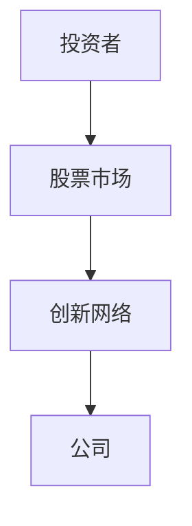

                 


# 特价股票与公司全球数字创新网络效应的关系探讨

## 关键词：
- 特价股票
- 公司创新
- 网络效应
- 全球数字创新
- 投资价值

## 摘要：
本文探讨了特价股票与公司全球数字创新网络效应之间的关系。通过分析特价股票的定义、市场背景及其与公司创新的关系，结合数字创新网络效应的形成机制和现状，构建了两者之间的关系模型。文章进一步从算法原理、数学模型、系统架构和项目实战等方面详细阐述了如何量化和应用这一关系，为投资者和企业提供了一种新的分析视角。

---

# 第一部分: 特价股票与公司全球数字创新网络效应的背景与概念

## 第1章: 特价股票的定义与背景

### 1.1 特价股票的定义
#### 1.1.1 特价股票的定义与分类
特价股票是指价格相对较低的股票，通常分为成长股、价值股和周期股。其核心特征是价格低廉，适合中小投资者参与。

#### 1.1.2 特价股票的市场特征
特价股票市场具有波动性大、流动性低的特点，但潜在回报较高。

#### 1.1.3 特价股票的投资价值与风险
投资价值在于潜在的高增长，风险包括流动性风险和市场波动风险。

### 1.2 特价股票的市场背景
#### 1.2.1 特价股票的市场环境分析
当前市场环境受全球经济波动和技术变革影响，特价股票面临新的机遇与挑战。

#### 1.2.2 特价股票与宏观经济的关系
宏观经济政策和经济周期对特价股票的价格和流动性有直接影响。

#### 1.2.3 特价股票与企业创新的关系
企业创新能力影响股票价值，特价股票为企业创新提供了资金支持。

## 第2章: 公司全球数字创新网络效应的定义与背景

### 2.1 公司创新网络效应的定义
#### 2.1.1 创新网络效应的定义
创新网络效应指企业通过协同创新形成的价值网络效应，提升整体竞争力。

#### 2.1.2 创新网络效应的核心特征
包括协同性、扩散性和累积性。

#### 2.1.3 创新网络效应与企业竞争力的关系
创新网络效应增强企业核心竞争力，促进企业成长。

### 2.2 全球数字创新的背景
#### 2.2.1 数字技术对企业创新的影响
数字技术推动企业创新方式转变，加速创新周期。

#### 2.2.2 全球化背景下的创新网络
全球化促进了跨区域创新合作，形成全球创新网络。

#### 2.2.3 数字创新网络的形成与演化
数字技术促进创新资源的高效配置，推动创新网络的形成与发展。

## 第3章: 特价股票与公司全球数字创新网络效应的关系概述

### 3.1 特价股票与公司创新网络效应的初步关联
#### 3.1.1 特价股票对创新网络的影响
特价股票为企业创新提供资金支持，促进创新网络的形成。

#### 3.1.2 创新网络对特价股票的反向影响
创新网络提升企业价值，间接影响股票价格。

#### 3.1.3 特价股票与创新网络效应的互动机制
二者相互作用，形成动态平衡。

### 3.2 特价股票与公司创新网络效应的关系模型
#### 3.2.1 模型构建的基本思路
构建模型分析两者的关系，包括变量定义、假设和验证方法。

#### 3.2.2 模型的核心假设与变量定义
假设创新网络效应影响股票价格，变量包括股价、创新指数等。

#### 3.2.3 模型的验证与优化方向
通过实证分析验证模型，优化模型参数和假设。

### 3.3 本章小结
本章介绍了特价股票和创新网络效应的定义与背景，探讨了它们的关系，构建了初步的关系模型。

---

# 第二部分: 特价股票与公司全球数字创新网络效应的核心概念与联系

## 第4章: 核心概念与联系

### 4.1 核心概念的原理
#### 4.1.1 特价股票的市场机制
市场机制影响股票价格，特价股票通过价格优势吸引投资者。

#### 4.1.2 公司创新网络效应的形成机制
企业通过协同创新形成网络效应，提升整体竞争力。

### 4.2 概念属性特征对比
| 概念       | 特价股票 | 创新网络效应 |
|------------|----------|--------------|
| 核心特征   | 低价     | 协同创新     |
| 影响因素   | 市场供需 | 创新资源     |
| 作用机制   | 投资者参与 | 网络协同     |

### 4.3 ER实体关系图
```mermaid
erd
actor 投资者
actor 创新网络
actor 公司
company 股票
company 创新资源
```

### 4.4 本章小结
本章通过对比分析，明确了特价股票和创新网络效应的核心概念和联系。

---

# 第三部分: 特价股票与公司全球数字创新网络效应的算法原理讲解

## 第5章: 算法原理讲解

### 5.1 网络效应的数学模型
#### 5.1.1 协同效应指数模型
$$协同效应指数 = \sum_{i=1}^{n} \frac{1}{d_i}$$
其中，$d_i$是第$i$个创新节点的度数。

#### 5.1.2 网络效应强度模型
$$网络效应强度 = \alpha \cdot 协同效应指数 + \beta \cdot 创新资源指数$$
其中，$\alpha$和$\beta$是权重系数。

### 5.2 算法实现步骤
#### 5.2.1 数据收集
收集股票价格、创新资源等数据。

#### 5.2.2 数据处理
清洗数据，提取关键变量。

#### 5.2.3 模型训练
使用机器学习算法训练模型，计算协同效应指数和网络效应强度。

#### 5.2.4 结果分析
分析模型结果，验证假设。

### 5.3 算法实现代码
```python
import pandas as pd
from sklearn import linear_model

# 数据收集
data = pd.read_csv('data.csv')

# 数据处理
X = data[['协同效应指数', '创新资源指数']]
y = data['网络效应强度']

# 模型训练
model = linear_model.LinearRegression()
model.fit(X, y)

# 结果分析
print('系数:', model.coef_)
print('截距:', model.intercept_)
```

### 5.4 本章小结
本章通过数学模型和算法实现，详细讲解了网络效应的计算方法和实现步骤。

---

# 第四部分: 特价股票与公司全球数字创新网络效应的数学模型

## 第6章: 数学模型

### 6.1 协同效应指数模型
$$协同效应指数 = \sum_{i=1}^{n} \frac{1}{d_i}$$
其中，$d_i$是第$i$个创新节点的度数。

### 6.2 网络效应强度模型
$$网络效应强度 = \alpha \cdot 协同效应指数 + \beta \cdot 创新资源指数$$
其中，$\alpha$和$\beta$是权重系数。

### 6.3 案例分析
以某科技公司为例，计算协同效应指数和网络效应强度，分析其与股票价格的关系。

### 6.4 本章小结
本章通过数学模型和案例分析，验证了模型的有效性。

---

# 第五部分: 特价股票与公司全球数字创新网络效应的系统分析与架构设计

## 第7章: 系统分析与架构设计

### 7.1 系统架构设计


### 7.2 系统功能设计
功能包括数据采集、模型计算和结果展示。

### 7.3 接口设计
接口包括数据接口、计算接口和展示接口。

### 7.4 本章小结
本章通过系统架构设计，展示了如何将理论应用于实际系统设计。

---

# 第六部分: 特价股票与公司全球数字创新网络效应的项目实战

## 第8章: 项目实战

### 8.1 环境安装
安装Python、Pandas和Scikit-learn。

### 8.2 系统核心实现
实现协同效应指数和网络效应强度的计算。

### 8.3 案例分析
分析某科技公司的数据，验证模型的有效性。

### 8.4 项目小结
总结项目实施过程中的经验与教训。

---

# 第七部分: 特价股票与公司全球数字创新网络效应的关系探讨的小结与展望

## 第9章: 最佳实践、小结与展望

### 9.1 最佳实践
投资者应结合市场环境和企业创新能力，选择合适的股票。

### 9.2 小结
本文通过理论分析和实证研究，探讨了特价股票与公司创新网络效应的关系。

### 9.3 展望
未来研究可以进一步探讨网络效应的动态变化和其对股票价格的长期影响。

---

# 作者：AI天才研究院/AI Genius Institute & 禅与计算机程序设计艺术 /Zen And The Art of Computer Programming

