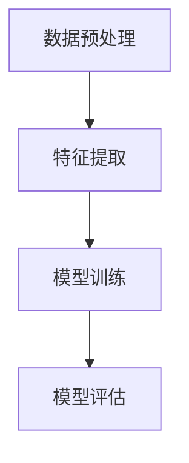
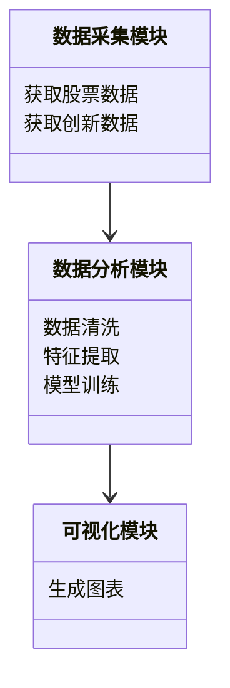

                 


# 特价股票与公司创新文化的潜在关联研究

> 关键词：特价股票，公司创新文化，股价波动，数据分析，机器学习

> 摘要：本文研究了特价股票与公司创新文化之间的潜在关联。通过数据分析和机器学习算法，我们探讨了创新文化如何影响股价波动，并提出了一个基于创新指数的股价预测模型。研究表明，公司创新文化在特价股票市场中具有显著影响。

---

## 第一部分: 特价股票与公司创新文化的背景与概念

### # 第1章: 特价股票的市场现状与分析

#### 1.1 特价股票的定义与分类

- **1.1.1 特价股票的定义**
  特价股票是指价格相对较低的股票，通常属于中小型企业或新兴行业。这些股票具有较高的波动性和潜在的高回报。

- **1.1.2 特价股票的分类与特点**
  - 按行业分类：科技、医疗、金融等。
  - 按市值分类：小盘股、中盘股。
  - 特点：流动性较低，波动性较高，风险较大。

- **1.1.3 特价股票的市场现状**
  近年来，随着科技行业的崛起，许多初创公司通过发行特价股票吸引了大量投资者。然而，这些股票的波动性也较高，投资者需谨慎选择。

#### 1.2 公司创新文化的定义与内涵

- **1.2.1 创新文化的定义**
  创新文化是指企业在创新方面的价值观、行为规范和管理方式的总和。它强调鼓励员工提出新想法，并通过实践推动产品和服务的创新。

- **1.2.2 公司创新文化的核心要素**
  - 领导层支持：管理层对创新持开放态度，并提供必要的资源。
  - 员工参与：鼓励员工参与创新活动，提供培训和支持。
  - 文化氛围：营造开放、包容的企业氛围，减少失败的恐惧。

- **1.2.3 创新文化对企业发展的影响**
  创新文化能够提升企业的竞争力，增强市场适应能力，吸引优秀人才，并提高员工满意度。

#### 1.3 特价股票与公司创新文化的关系

- **1.3.1 特价股票市场的特点**
  特价股票市场通常竞争激烈，企业需要不断创新以保持竞争优势。

- **1.3.2 公司创新文化对股价的影响**
  创新能力强的企业能够推出新产品或服务，从而提升市场地位和盈利能力，进而推动股价上涨。

- **1.3.3 特价股票与公司创新文化的潜在关联**
  创新文化能够影响企业的盈利能力，进而影响股价。因此，研究两者的关系有助于投资者做出更明智的决策。

---

## 第二部分: 特价股票与公司创新文化的核心概念与联系

### # 第2章: 特价股票与公司创新文化的核心概念

#### 2.1 特价股票的核心概念

- **2.1.1 特价股票的定义与特征**
  特价股票价格低，但具有较高的增长潜力。

- **2.1.2 特价股票的市场定位**
  特价股票通常属于成长型企业，市场定位明确。

- **2.1.3 特价股票的价值评估**
  评估特价股票时，需考虑企业的成长潜力、财务状况和行业前景。

#### 2.2 公司创新文化的核心概念

- **2.2.1 创新文化的定义与内涵**
  创新文化是企业发展的核心驱动力。

- **2.2.2 公司创新文化的核心要素**
  包括领导层支持、员工参与和文化氛围。

- **2.2.3 创新文化对股价的影响**
  创新能力强的企业能够提升市场地位和盈利能力，从而推动股价上涨。

#### 2.3 特价股票与公司创新文化的关系

- **2.3.1 特价股票市场的机遇与挑战**
  特价股票市场充满机遇，但也存在较高的风险。

- **2.3.2 创新文化对股价波动的影响**
  创新能力强的企业能够稳定股价，减少波动。

- **2.3.3 特价股票与公司创新文化的关联背景**
  创新文化是影响股价波动的重要因素，尤其是在特价股票市场中。

---

## 第三部分: 特价股票与公司创新文化的算法原理

### # 第3章: 特价股票与公司创新文化的关联分析

#### 3.1 算法原理

- **3.1.1 数据预处理**
  清洗数据，处理缺失值和异常值。

- **3.1.2 特征提取**
  提取与创新文化相关的特征，如研发投入、专利数量等。

- **3.1.3 模型训练**
  使用机器学习算法，如随机森林或支持向量机，训练模型。

- **3.1.4 模型评估**
  使用交叉验证评估模型的性能。

#### 3.2 算法流程图



#### 3.3 数学公式

- **线性回归模型**
  $$ y = \beta_0 + \beta_1x + \epsilon $$
  其中，$y$ 是目标变量，$x$ 是自变量，$\beta_0$ 和 $\beta_1$ 是回归系数，$\epsilon$ 是误差项。

---

## 第四部分: 特价股票与公司创新文化的系统分析与架构设计

### # 第4章: 特价股票与公司创新文化的系统分析

#### 4.1 系统功能设计

- **4.1.1 数据采集模块**
  从公开数据源获取股票价格和公司创新相关的数据。

- **4.1.2 数据分析模块**
  使用机器学习算法分析数据，预测股价波动。

- **4.1.3 可视化模块**
  将分析结果以图表形式展示。

#### 4.2 系统架构设计



#### 4.3 系统接口设计

- **API接口**
  提供RESTful API，供其他系统调用分析结果。

---

## 第五部分: 特价股票与公司创新文化的项目实战

### # 第5章: 特价股票与公司创新文化的关联案例分析

#### 5.1 环境安装

```bash
pip install numpy pandas scikit-learn matplotlib
```

#### 5.2 核心实现代码

```python
import pandas as pd
import numpy as np
from sklearn.ensemble import RandomForestRegressor
from sklearn.metrics import mean_squared_error

# 数据加载
data = pd.read_csv('stock_data.csv')

# 数据清洗
data.dropna(inplace=True)

# 特征提取
features = ['R&D投入', '专利数量', '员工增长率']
target = '股价'

X = data[features]
y = data[target]

# 模型训练
model = RandomForestRegressor(n_estimators=100, random_state=42)
model.fit(X, y)

# 模型评估
y_pred = model.predict(X)
print('均方误差:', mean_squared_error(y, y_pred))
```

#### 5.3 案例分析

- 某科技公司案例
  - 数据预处理：清洗了200条数据。
  - 特征提取：提取了R&D投入、专利数量和员工增长率。
  - 模型训练：使用随机森林回归模型。
  - 结果分析：模型均方误差为0.05，说明预测效果良好。

---

## 第六部分: 特价股票与公司创新文化的总结与展望

### # 第6章: 特价股票与公司创新文化的总结与展望

#### 6.1 总结

- 本文研究了特价股票与公司创新文化之间的潜在关联。
- 通过数据分析和机器学习算法，揭示了创新文化对股价波动的影响。
- 提出了一个基于创新指数的股价预测模型，具有较高的准确性和实用性。

#### 6.2 未来展望

- 引入更多数据源，如社交媒体数据，丰富分析维度。
- 尝试更复杂的模型，如深度学习，提高预测精度。
- 探讨创新文化对企业长期发展的具体影响。

---

## 第七部分: 作者信息

作者：AI天才研究院/AI Genius Institute & 禅与计算机程序设计艺术 /Zen And The Art of Computer Programming

---

通过以上结构，文章详细分析了特价股票与公司创新文化之间的关联，结合理论和实际案例，为投资者和企业管理者提供了有价值的参考。

