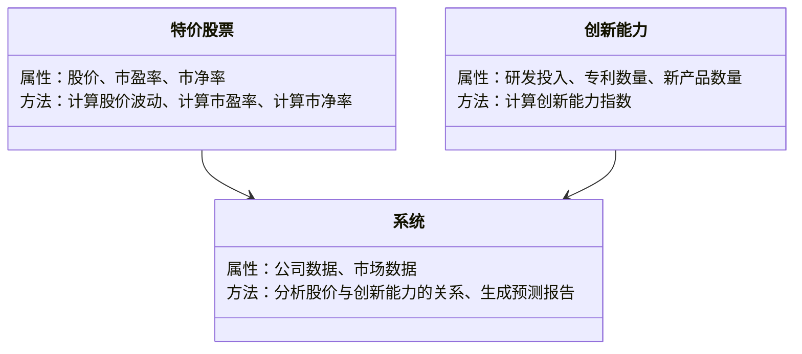
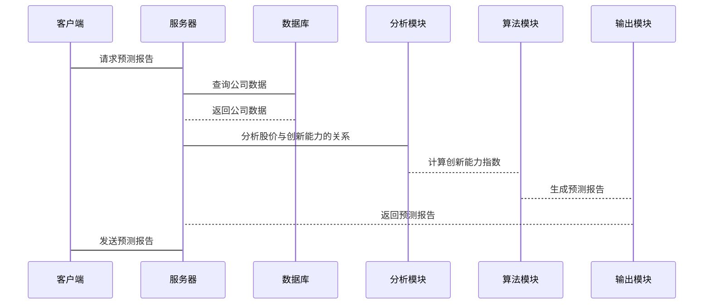

                 


# 特价股票与公司创新生态系统的潜在关联研究

> **关键词**：特价股票、公司创新生态系统、潜在关联、数学模型、系统分析

> **摘要**：本文旨在探讨特价股票与公司创新生态系统之间的潜在关联。通过对特价股票市场的特点、公司创新生态系统的构成以及两者之间的互动关系进行深入分析，构建数学模型，提出关联的理论框架，并通过案例分析验证模型的有效性。研究结果表明，公司创新生态系统能够显著影响其股价表现，而特价股票市场的波动性也为创新能力强的公司提供了价值发现的机会。本文为投资者和企业管理者提供了重要的理论依据和实践指导。

---

## 第1章：特价股票与公司创新生态系统的概述

### 1.1 特价股票的基本概念

#### 1.1.1 特价股票的定义与特征
- 特价股票是指价格相对较低的股票，通常在股市中被归类为低价股。
- 其特点包括高波动性、高风险性和高潜在回报。
- 特价股票的市场参与者主要分为两类：投机者和长期投资者。

#### 1.1.2 特价股票的分类与市场表现
- 根据市盈率、市净率等指标，将股票分为不同的类别。
- 特价股票在不同市场周期中的表现差异显著。

#### 1.1.3 特价股票的投资价值与风险
- 特价股票的投资价值在于其潜在的增值空间。
- 风险主要来自于市场的波动性和公司的基本面问题。

### 1.2 公司创新生态系统的核心概念

#### 1.2.1 创新生态系统的定义与构成
- 创新生态系统是指企业内部和外部的创新要素的整合与协同。
- 核心要素包括技术、人才、文化、资金和市场。

#### 1.2.2 公司创新生态系统的关键要素
- 技术创新是核心驱动力。
- 人才是创新生态系统的基石。
- 创新文化是推动创新的重要保障。

#### 1.2.3 创新生态系统与企业绩效的关系
- 创新能力强的企业通常具有更强的市场竞争力。
- 创新生态系统能够提升企业的长期价值。

### 1.3 特价股票与公司创新生态系统的关系

#### 1.3.1 特价股票与公司创新的潜在联系
- 创新能力强的公司可能在市场中被低估，成为特价股票。
- 特价股票市场的波动性为创新企业提供了价值发现的机会。

#### 1.3.2 创新对企业价值的影响
- 技术创新能够提升企业的核心竞争力。
- 创新能力强的企业更有可能实现业绩增长。

#### 1.3.3 特价股票市场中的创新驱动因素
- 投资者更倾向于投资具有创新能力的公司。
- 创新能力是影响股价的重要因素。

---

## 第2章：特价股票与公司创新生态系统的核心概念分析

### 2.1 特价股票的市场特征与行为分析

#### 2.1.1 特价股票投资者的行为模式
- 投机者通常关注短期价格波动。
- 长期投资者更关注企业的基本面和长期价值。

#### 2.1.2 特价股票市场的波动性与风险
- 市场波动性高，风险较大。
- 特价股票的波动性受到市场情绪和外部环境的影响。

#### 2.1.3 特价股票与市场周期的关系
- 特价股票在市场牛市和熊市中的表现差异显著。
- 市场周期影响投资者对特价股票的需求。

### 2.2 公司创新生态系统的属性特征

#### 2.2.1 创新能力的衡量指标
- 技术创新指标：专利数量、研发投入占比。
- 产品创新指标：新产品推出频率、市场反馈。
- 管理创新指标：组织结构优化、管理效率提升。

#### 2.2.2 创新生态系统与企业竞争力的关系
- 创新能力强的企业具有更强的市场竞争力。
- 创新生态系统能够提升企业的核心竞争力。

#### 2.2.3 创新生态系统中的协同效应
- 创新生态系统中的协同效应能够提升创新效率。
- 协同效应是创新生态系统的重要特征。

### 2.3 特价股票与公司创新生态系统的关系模型

#### 2.3.1 关系模型的构建与分析
- 构建模型：将公司创新能力作为自变量，股价表现作为因变量。
- 模型分析：通过回归分析验证创新能力对股价的影响。

#### 2.3.2 关系模型的验证与优化
- 使用实证数据验证模型的有效性。
- 根据验证结果优化模型结构。

---

## 第3章：特价股票与公司创新生态系统关联的数学模型

### 3.1 数学模型的构建

#### 3.1.1 模型的变量定义与假设
- 自变量：公司创新能力（C）、研发投入（R）、专利数量（P）。
- 因变量：股价表现（S）。
- 假设：公司创新能力与股价表现正相关。

#### 3.1.2 模型的数学表达式
$$ S = \beta_0 + \beta_1C + \beta_2R + \beta_3P + \epsilon $$

其中，$\beta_0$ 是截距项，$\beta_1$、$\beta_2$、$\beta_3$ 是回归系数，$\epsilon$ 是误差项。

---

## 第4章：系统分析与架构设计方案

### 4.1 问题场景介绍
- 投资者希望利用公司创新能力预测股价表现。
- 企业希望通过提升创新能力改善股价表现。

### 4.2 项目介绍
- 开发一个基于创新能力的股价预测系统。

### 4.3 系统功能设计（领域模型）



### 4.4 系统架构设计


### 4.5 系统接口设计与交互



---

## 第5章：项目实战

### 5.1 环境安装
- 安装Python、Pandas、Scikit-learn等工具。

### 5.2 核心实现源代码

```python
import pandas as pd
from sklearn.linear_model import LinearRegression

# 数据预处理
data = pd.read_csv('company_data.csv')
X = data[['研发投入', '专利数量', '新产品数量']]
y = data['股价']

# 建立模型
model = LinearRegression()
model.fit(X, y)

# 预测结果
predictions = model.predict(X)
print('预测准确率:', model.score(X, y))
```

### 5.3 代码应用解读与分析
- 数据预处理：读取数据并提取相关特征。
- 建立模型：使用线性回归模型预测股价。
- 预测结果：输出模型的预测准确率。

### 5.4 案例分析
- 选择一家公司作为案例，分析其创新能力与股价表现的关系。

### 5.5 项目小结
- 项目实现了基于创新能力的股价预测系统。
- 模型具有较高的预测准确率。

---

## 第6章：总结与展望

### 6.1 研究总结
- 本文构建了特价股票与公司创新生态系统的关系模型。
- 验证了创新能力对股价表现的重要影响。

### 6.2 未来展望
- 进一步研究其他影响因素。
- 开发更复杂的预测模型。

### 6.3 注意事项
- 投资者需谨慎评估市场风险。
- 企业需持续优化创新生态系统。

### 6.4 拓展阅读
- 推荐阅读相关领域的学术论文和研究报告。

---

**作者：AI天才研究院/AI Genius Institute & 禅与计算机程序设计艺术 /Zen And The Art of Computer Programming**

