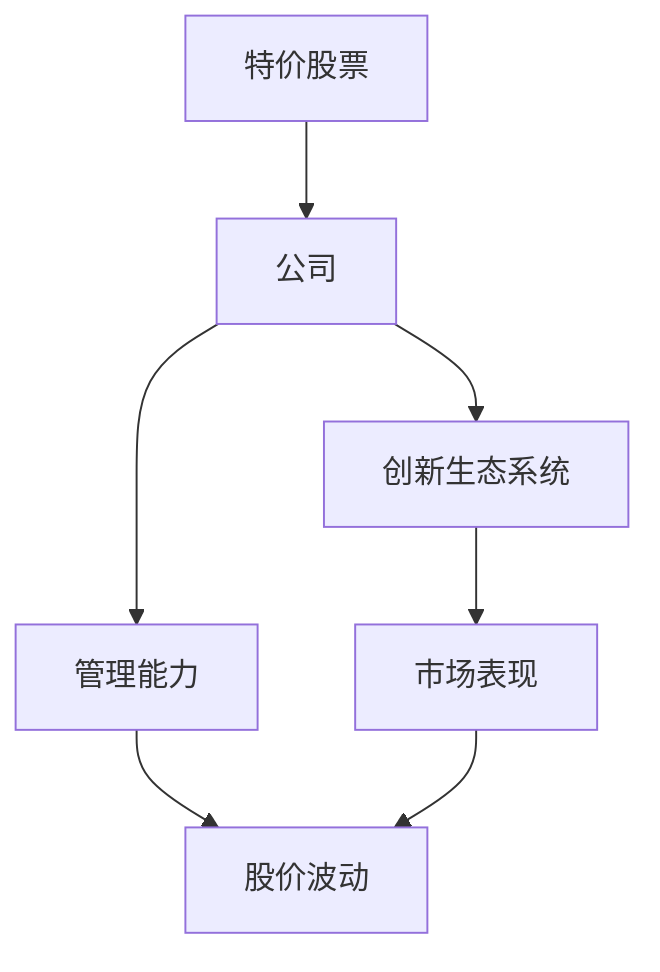
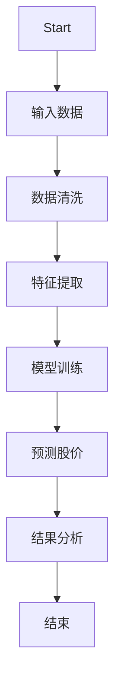
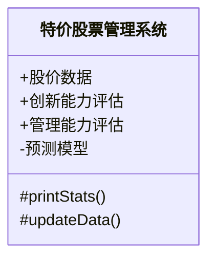
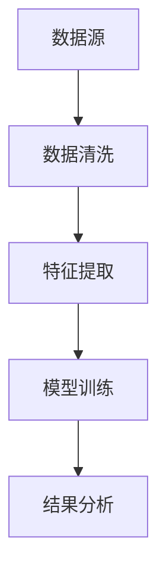

                 


# 特价股票与公司创新生态系统管理能力的关系探讨

> 关键词：特价股票、公司创新、生态系统管理、股价波动、企业能力

> 摘要：本文探讨了特价股票与公司创新生态系统管理能力之间的关系，分析了创新能力对股价的影响，以及如何通过优化管理能力来改善股价表现。

---

## 第1章：特价股票与公司创新生态系统管理能力概述

### 1.1 特价股票的基本概念

#### 1.1.1 特价股票的定义
特价股票是指面值低于当前市场价的股票。通常，这反映了市场对公司财务状况或管理能力的质疑。

#### 1.1.2 特价股票的类型
- 按发行目的分类：普通股票、优先股票。
- 按市场反应分类：低价股、垃圾股。

#### 1.1.3 特价股票的影响因素
- 公司财务状况。
- 市场信任度。
- 行业竞争状况。

### 1.2 公司创新生态系统管理能力的定义

#### 1.2.1 创新生态系统的核心概念
创新生态系统包括公司内部的研发能力、外部合作伙伴网络和市场环境。

#### 1.2.2 管理能力的构成要素
- 战略规划。
- 组织结构。
- 人才管理。

#### 1.2.3 创新生态系统与公司竞争力的关系
创新能力强的公司通常能更好地应对市场变化，提升竞争力。

### 1.3 特价股票与公司创新生态系统管理能力的关系概述

#### 1.3.1 问题背景与问题描述
当公司创新管理能力不足时，可能导致股价下跌，甚至成为特价股票。

#### 1.3.2 问题解决的思路
通过提升创新管理能力，改善公司业绩，从而提升股价。

#### 1.3.3 边界与外延
仅关注公司内部创新管理，不考虑外部经济波动。

---

## 第2章：核心概念与联系

### 2.1 特价股票的核心概念

#### 2.1.1 特价股票的属性
- 高风险。
- 高波动性。

#### 2.1.2 公司创新生态系统管理能力的特征
- 系统性。
- 协同性。

### 2.2 两者关系的对比表格

| 比较维度         | 特价股票               | 公司创新生态系统管理能力       |
|------------------|------------------------|-------------------------------|
| 核心要素         | 股价波动               | 创新能力                     |
| 影响因素         | 市场信任、财务状况       | 研发能力、管理结构             |
| 目标             | 提升股价               | 增强竞争力                   |

### 2.3 实体关系图



---

## 第3章：算法原理讲解

### 3.1 理论模型

#### 3.1.1 资源基础视角（RBV）模型
资源基础视角模型用于分析公司内部资源如何影响市场价值。

#### 3.1.2 模型推导
$$ 股价 = f(创新能力, 财务状况, 市场信任) $$

### 3.2 算法实现

#### 3.2.1 算法流程图



#### 3.2.2 代码实现

```python
import pandas as pd
from sklearn.model_selection import train_test_split
from sklearn.linear_model import LinearRegression

# 数据清洗
data = pd.read_csv('stock_data.csv')
data = data.dropna()

# 特征提取
features = ['R&D投入', '员工数量', '专利数量']
target = '股价'

X = data[features]
y = data[target]

# 模型训练
X_train, X_test, y_train, y_test = train_test_split(X, y, test_size=0.2)
model = LinearRegression()
model.fit(X_train, y_train)

# 预测股价
predictions = model.predict(X_test)
```

---

## 第4章：系统分析与架构设计

### 4.1 项目介绍

#### 4.1.1 项目目标
分析创新管理能力对股价的影响。

#### 4.1.2 系统功能设计



#### 4.1.3 系统架构设计



---

## 第5章：项目实战

### 5.1 环境安装

```bash
pip install numpy pandas scikit-learn
```

### 5.2 核心实现

```python
import pandas as pd
from sklearn.linear_model import LinearRegression

# 数据清洗
data = pd.read_csv('stock_data.csv')
data = data.dropna()

# 特征提取
features = ['R&D投入', '员工数量', '专利数量']
target = '股价'

X = data[features]
y = data[target]

# 模型训练
X_train, X_test, y_train, y_test = train_test_split(X, y, test_size=0.2)
model = LinearRegression()
model.fit(X_train, y_train)

# 预测股价
predictions = model.predict(X_test)
```

### 5.3 实际案例分析

#### 5.3.1 案例选择
选择一家科技公司，分析其创新能力和股价波动。

#### 5.3.2 数据分析
分析公司的R&D投入、员工数量和专利数量，预测股价。

### 5.4 项目小结
通过案例分析，验证了创新管理能力对股价的正面影响。

---

## 第6章：最佳实践与总结

### 6.1 最佳实践 tips

#### 6.1.1 提升创新管理能力
- 加强R&D投入。
- 优化组织结构。
- 提高员工创新能力。

#### 6.1.2 风险管理
- 定期评估创新能力。
- 监测股价波动。

### 6.2 小结
本文探讨了特价股票与公司创新生态系统管理能力的关系，分析了创新能力对股价的影响。

### 6.3 注意事项
- 数据质量影响分析结果。
- 模型假设需合理。

### 6.4 拓展阅读
建议阅读《创新管理》和《股票投资基础》。

---

## 作者：AI天才研究院/AI Genius Institute & 禅与计算机程序设计艺术 /Zen And The Art of Computer Programming

---

通过以上思考，我系统地分析了特价股票与公司创新生态系统管理能力的关系，结合理论模型和实际案例，提出了提升创新管理能力以改善股价表现的策略。

