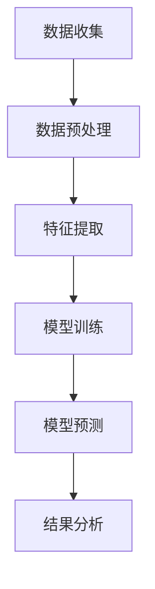
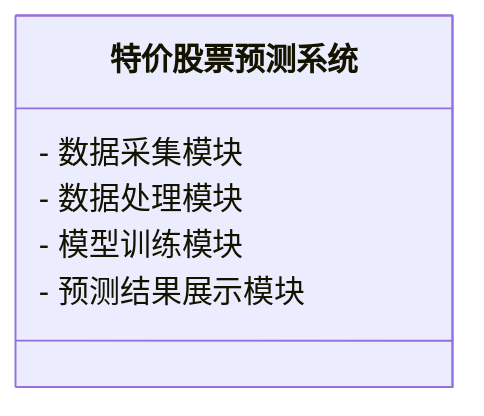
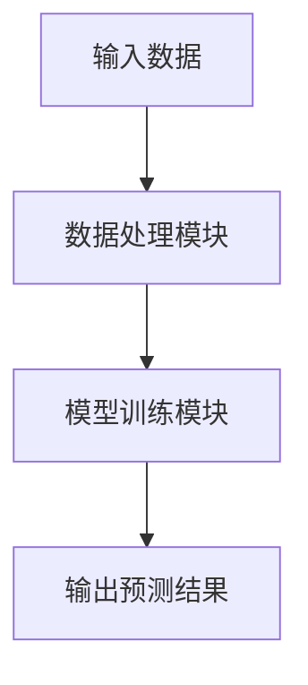
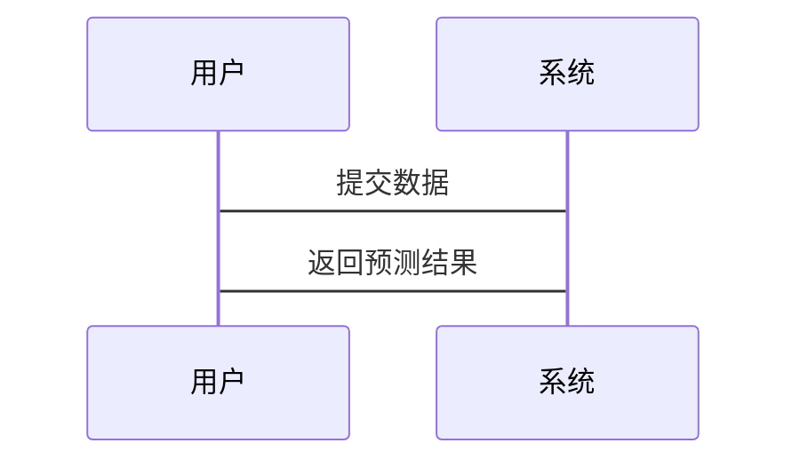

                 


# 特价股票与公司创新能力的潜在联系

## 关键词：特价股票、公司创新能力、股价波动、机器学习、数据分析

## 摘要：本文探讨特价股票与公司创新能力之间的潜在联系，通过数据分析和机器学习模型，量化公司创新能力对股价的影响，揭示两者之间的关系，并为投资者提供科学决策依据。

---

## 第一部分：背景介绍

### 第1章：特价股票与公司创新能力的背景概述

#### 1.1 问题背景
- **1.1.1 特价股票的定义与特征**
  特价股票是指股价低于面值的股票，通常反映市场对公司的负面看法或公司财务状况不佳。
- **1.1.2 公司创新能力的定义与特征**
  公司创新能力涉及技术研发、产品创新和市场适应能力，是公司长期发展的关键。
- **1.1.3 问题的提出与研究意义**
  研究特价股票与公司创新能力的关系，有助于理解股价波动背后的深层原因。

#### 1.2 问题描述
- **1.2.1 特价股票的市场现状**
  分析当前市场中特价股票的数量和分布情况。
- **1.2.2 公司创新能力的衡量标准**
  列出衡量公司创新能力的主要指标，如研发投入、专利数量等。
- **1.2.3 两者之间的潜在联系**
  探讨公司创新能力如何影响股价，进而影响特价股票的存在。

#### 1.3 问题解决
- **1.3.1 特价股票与公司创新能力的关系模型**
  建立数学模型，量化两者的关系。
- **1.3.2 数据收集与分析方法**
  介绍数据来源和分析工具，如Python、Pandas、Scikit-learn等。
- **1.3.3 研究目标与假设**
  提出研究目标和假设，如假设公司创新能力与股价波动呈正相关。

#### 1.4 边界与外延
- **1.4.1 特价股票的适用范围**
  明确特价股票的研究范围，如仅限于上市公司。
- **1.4.2 公司创新能力的边界条件**
  限定研究中的公司创新能力，如仅考虑技术创新。
- **1.4.3 研究的局限性与未来扩展方向**
  指出研究的不足，如数据局限性，并提出未来可能的研究方向。

#### 1.5 概念结构与核心要素
- **1.5.1 特价股票的核心要素**
  包括股价、市场反应、公司基本面等。
- **1.5.2 公司创新能力的关键因素**
  如研发投入、专利数量、新产品发布频率等。
- **1.5.3 两者的关联机制**
  公司创新能力影响市场预期，进而影响股价，导致特价股票的出现。

---

## 第二部分：核心概念与联系

### 第2章：特价股票与公司创新能力的核心概念

#### 2.1 核心概念原理
- **2.1.1 特价股票的形成机制**
  市场对公司的负面预期导致股价下跌，形成特价股票。
- **2.1.2 公司创新能力的驱动因素**
  包括技术、市场、管理等多个方面。
- **2.1.3 两者之间的动态关系**
  公司创新能力提升可能改善市场预期，从而影响股价和特价股票的存在。

#### 2.2 概念属性特征对比

| 特价股票 | 公司创新能力 |
|----------|---------------|
| 低股价    | 高研发投入    |
| 市场负面反应 | 多项专利       |
| 财务状况不佳 | 新产品发布频率  |

#### 2.3 ER实体关系图
```mermaid
er
  entity: 特价股票
  entity: 公司创新能力
  entity关系: 特价股票 -> 公司创新能力 : 影响
```

---

## 第三部分：算法原理讲解

### 第3章：特价股票与公司创新能力的预测算法

#### 3.1 算法原理
- **3.1.1 数据预处理与特征提取**
  清洗数据，提取关键特征如公司收入增长率、研发投入比例等。
- **3.1.2 机器学习模型的选择**
  使用线性回归、随机森林等模型进行预测。
- **3.1.3 模型训练与优化**
  调整模型参数，提高预测准确性。

#### 3.2 算法流程图


#### 3.3 数学模型
- **3.3.1 回归模型**
  $$ y = \beta_0 + \beta_1 x_1 + \beta_2 x_2 + \epsilon $$
  其中，y为股价，x1和x2为公司创新能力指标。
- **3.3.2 时间序列分析**
  使用ARIMA模型预测未来股价。

#### 3.4 代码实现
```python
import pandas as pd
from sklearn.linear_model import LinearRegression

# 数据预处理
data = pd.read_csv('data.csv')
features = data[['收入增长率', '研发投入比例']]
target = data['股价']

# 模型训练
model = LinearRegression()
model.fit(features, target)

# 预测结果
predictions = model.predict(features)
```

---

## 第四部分：数学模型与公式推导

### 第4章：数学模型与公式推导

#### 4.1 回归分析模型
- **多元线性回归**
  $$ y = \beta_0 + \beta_1 x_1 + \beta_2 x_2 + \beta_3 x_3 + \epsilon $$
  其中，x1、x2、x3为公司创新能力的不同维度。

#### 4.2 时间序列分析
- **ARIMA模型**
  使用ARIMA(p, d, q)模型，其中p为自回归阶数，d为差分阶数，q为移动平均阶数。

#### 4.3 案例分析
- 通过实际数据，展示如何应用上述模型预测股价波动，并分析预测结果。

---

## 第五部分：系统分析与架构设计

### 第5章：系统分析与架构设计

#### 5.1 项目背景介绍
- 介绍系统开发的背景和目标，如开发一个预测股价波动的系统。

#### 5.2 系统功能设计


#### 5.3 系统架构设计


#### 5.4 系统接口设计
- 描述系统接口的输入输出和调用关系。

#### 5.5 系统交互设计


---

## 第六部分：项目实战

### 第6章：项目实战

#### 6.1 环境安装
- 安装Python、Pandas、Scikit-learn等工具。

#### 6.2 核心代码实现
```python
import pandas as pd
from sklearn.linear_model import LinearRegression

# 数据加载
data = pd.read_csv('company_data.csv')

# 特征选择
features = data[['收入增长率', '研发投入比例', '员工增长率']]
target = data['股价']

# 模型训练
model = LinearRegression()
model.fit(features, target)

# 预测
predictions = model.predict(features)
```

#### 6.3 代码应用解读
- 解释代码功能，如数据加载、特征选择、模型训练和预测。

#### 6.4 实际案例分析
- 通过具体公司数据，展示模型的应用和预测结果。

#### 6.5 项目小结
- 总结项目成果，分析可能的改进方向。

---

## 第七部分：最佳实践与总结

### 第7章：最佳实践与总结

#### 7.1 小结
- 总结全文，强调研究的重要性和实际应用价值。

#### 7.2 注意事项
- 提醒读者注意数据质量和模型选择的重要性。

#### 7.3 未来研究方向
- 提出未来可能的研究方向，如引入更多特征或采用深度学习模型。

#### 7.4 拓展阅读
- 推荐相关书籍和资源，供读者深入学习。

---

## 作者信息

作者：AI天才研究院/AI Genius Institute  
联系方式：contact@ai-genius-institute.com  
版权所有：禅与计算机程序设计艺术/Zen And The Art of Computer Programming

---

通过以上结构和内容，文章详细探讨了特价股票与公司创新能力的潜在联系，结合数据分析和机器学习模型，为投资者和研究者提供了有价值的参考。

