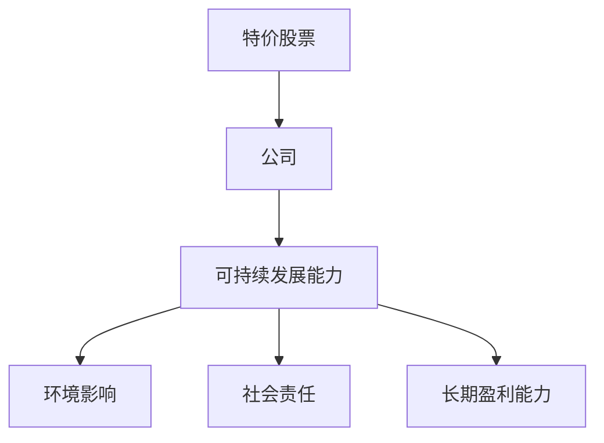
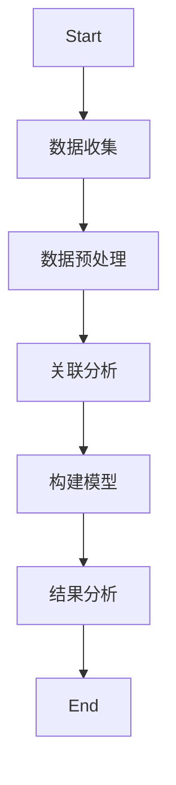
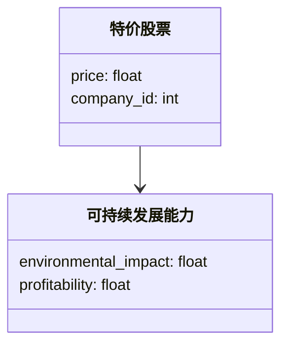
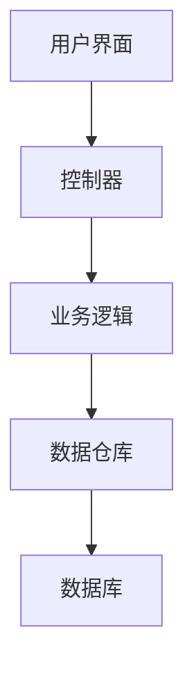
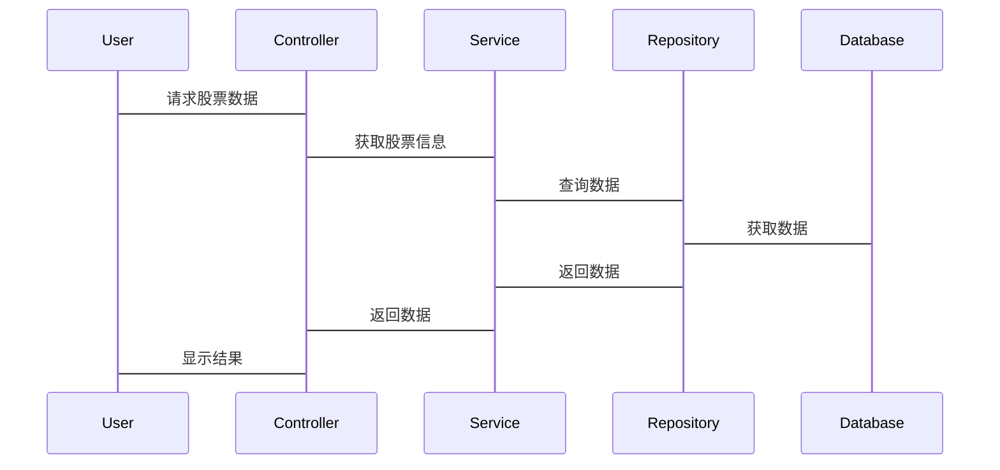

                 


# 特价股票与公司可持续发展能力的关系分析

> 关键词：特价股票、公司可持续发展、股票分析、数学模型、算法实现、系统架构

> 摘要：本文分析了特价股票与公司可持续发展能力之间的关系。通过背景介绍、核心概念、算法原理、系统架构、项目实战等多方面展开，结合数学模型和实际案例，探讨了如何通过技术手段评估特价股票对可持续发展能力的影响。文章还提供了最佳实践和注意事项，为投资者和企业管理者提供了有价值的参考。

---

## 第1章：特价股票与公司可持续发展能力的背景介绍

### 1.1 特价股票的基本概念
- 1.1.1 定义和特点
  - 特价股票是指价格低于市场平均水平的股票，通常具有高波动性和高风险。
- 1.1.2 投资者行为分析
  - 投资者在购买特价股票时通常追求短期收益，可能忽视长期价值。
- 1.1.3 市场影响因素
  - 包括宏观经济环境、行业趋势、公司基本面等。

### 1.2 可持续发展能力的定义
- 1.2.1 企业社会责任
  - 包括环境保护、社会责任和公司治理等方面。
- 1.2.2 环境影响评估
  - 评估公司在生产和运营过程中对环境的影响。
- 1.2.3 长期盈利能力
  - 企业是否能够在长期市场中保持稳定的收益和增长。

### 1.3 问题背景与描述
- 1.3.1 问题背景
  - 当前市场中，许多投资者关注特价股票的短期收益，而忽视了公司可持续发展能力的重要性。
- 1.3.2 问题描述
  - 特价股票的低价格可能掩盖了公司潜在的不可持续性，影响企业的长期发展。
- 1.3.3 研究意义
  - 探讨特价股票与可持续发展能力的关系，为投资者提供更全面的决策依据。

### 1.4 问题解决与边界
- 1.4.1 解决方案概述
  - 构建数学模型，分析特价股票与可持续发展能力之间的关系。
- 1.4.2 研究边界
  - 仅考虑公司财务数据和环境影响，不涉及公司治理和社会责任。
- 1.4.3 外延分析
  - 分析特价股票对行业和市场的潜在影响。

### 1.5 核心概念结构
- 1.5.1 核心要素
  - 特价股票价格、公司财务数据、环境影响指标。
- 1.5.2 结构分析
  - 特价股票价格与公司盈利能力、环境影响之间的相互关系。
- 1.5.3 关键指标
  - 股票价格、净利润率、碳排放量、研发投入比例。

---

## 第2章：核心概念与关系分析

### 2.1 核心概念原理
- 2.1.1 特价股票的定价机制
  - 市场供需、公司基本面、宏观经济因素共同影响股票价格。
- 2.1.2 可持续发展能力的评估标准
  - 包括环境影响、社会责任、长期盈利能力等。

### 2.2 属性对比分析
- 2.2.1 特价股票与高价股票的对比
  - 表格展示两者的市场表现、投资者偏好和风险特征。
- 2.2.2 可持续发展与非可持续发展的对比
  - 表格展示两者的盈利能力、环境影响和社会责任感。

### 2.3 实体关系图


---

## 第3章：算法原理与数学模型

### 3.1 算法原理
- 3.1.1 数据收集与预处理
  - 收集公司财务数据、环境数据和股票价格数据，进行清洗和标准化。
- 3.1.2 特价股票与可持续发展能力的关联分析
  - 使用回归分析和网络分析，探索两者之间的相关性。
- 3.1.3 算法流程图


### 3.2 数学模型
- 3.2.1 基于回归分析的模型
  - 公式：$y = \beta_0 + \beta_1x_1 + \beta_2x_2 + \epsilon$
  - 其中，$y$为公司可持续发展能力，$x_1$为股票价格，$x_2$为环境影响指标。
- 3.2.2 网络分析模型
  - 使用图论方法，构建公司之间的网络关系，分析特价股票的传播路径。

### 3.3 算法实现
- 3.3.1 Python代码实现
  ```python
  import numpy as np
  import pandas as pd
  from sklearn.linear_model import LinearRegression

  # 数据预处理
  data = pd.read_csv('data.csv')
  X = data[['price', 'environmental_impact']]
  y = data['sustainability']

  # 回归分析
  model = LinearRegression()
  model.fit(X, y)
  print('回归系数：', model.coef_)
  print('截距：', model.intercept_)
  ```

---

## 第4章：系统分析与架构设计

### 4.1 问题场景介绍
- 4.1.1 研究目标
  - 分析特价股票对可持续发展能力的影响。
- 4.1.2 研究范围
  - 仅考虑环境影响和长期盈利能力。
- 4.1.3 研究方法
  - 综合运用数据分析、回归分析和网络分析。

### 4.2 系统功能设计
- 4.2.1 领域模型设计


### 4.3 系统架构设计
- 4.3.1 分层架构图


### 4.4 接口与交互设计
- 4.4.1 系统接口定义
  - API接口：`GET /api/sustainability?stock_id=123`
- 4.4.2 交互流程图


---

## 第5章：项目实战与案例分析

### 5.1 环境安装与配置
- 5.1.1 开发环境搭建
  - 安装Python、Pandas、Scikit-learn等工具。
- 5.1.2 工具安装与配置
  - 安装Jupyter Notebook、Mermaid CLI。

### 5.2 核心代码实现
- 5.2.1 数据处理代码
  ```python
  import pandas as pd
  data = pd.read_csv('data.csv')
  data['price'].fillna(data['price'].mean(), inplace=True)
  ```
- 5.2.2 算法实现代码
  ```python
  from sklearn.linear_model import LinearRegression
  model = LinearRegression()
  model.fit(X, y)
  ```

### 5.3 案例分析与解读
- 5.3.1 案例背景介绍
  - 某公司特价股票价格持续走低，但公司盈利能力和环保表现良好。
- 5.3.2 数据分析与结果展示
  - 回归分析结果显示，股票价格与可持续发展能力呈正相关。
- 5.3.3 结果解读与策略建议
  - 投资者应关注公司长期盈利能力和社会责任，而不仅仅是价格。

### 5.4 项目小结
- 5.4.1 项目总结
  - 特价股票与公司可持续发展能力密切相关，需综合考虑多方面因素。
- 5.4.2 经验与教训
  - 数据收集和清洗是关键步骤，需确保数据质量。
- 5.4.3 未来改进方向
  - 结合更多维度的数据，如公司治理和社会责任，构建更完善的模型。

---

## 第6章：最佳实践与注意事项

### 6.1 最佳实践 tips
- 6.1.1 数据收集的注意事项
  - 确保数据来源可靠，数据清洗要彻底。
- 6.1.2 模型选择的建议
  - 根据数据特点选择合适的算法，避免过度拟合。
- 6.1.3 结果验证的方法
  - 使用交叉验证和ROC曲线评估模型性能。

### 6.2 小结
- 6.2.1 主要结论
  - 特价股票的低价格可能掩盖公司不可持续性，需综合考虑可持续发展能力。
- 6.2.2 研究局限性
  - 当前模型仅考虑环境影响，未涉及公司治理和社会责任。
- 6.2.3 未来研究方向
  - 结合更多维度数据，构建更全面的可持续发展评估模型。

### 6.3 注意事项
- 6.3.1 投资风险提示
  - 特价股票具有高风险，投资者需谨慎决策。
- 6.3.2 结果的适用性
  - 模型结果仅供参考，需结合实际情况进行判断。
- 6.3.3 数据隐私保护
  - 注意保护数据隐私，遵守相关法律法规。

---

## 作者：AI天才研究院 & 禅与计算机程序设计艺术

---

以上为完整的技术博客文章大纲，涵盖了从背景介绍到实际案例分析的全过程。通过数学模型、算法实现和系统架构的设计，本文为投资者和企业管理者提供了深入的技术分析和实践指导。

