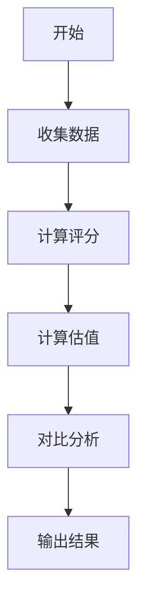
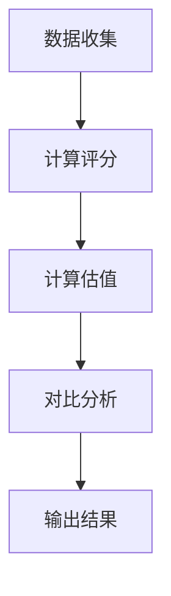

                 


# 特价股票与公司可持续发展能力的关联

> **关键词**: 特价股票, 可持续发展能力, 股票评估, 公司价值, 投资策略

> **摘要**: 本文探讨了特价股票与公司可持续发展能力之间的关联，通过分析特价股票的定义、特征以及公司可持续发展能力的核心要素，揭示了两者之间的内在联系。文章从背景介绍、核心概念、算法原理、数学模型、系统分析、项目实战到最佳实践，全面阐述了如何通过技术手段评估特价股票的可持续发展潜力，为投资者提供科学的决策依据。

---

# 第一部分: 特价股票与公司可持续发展能力的背景介绍

## 第1章: 特价股票与公司可持续发展能力的概述

### 1.1 特价股票的定义与特征

#### 1.1.1 特价股票的定义
特价股票是指市场价格低于其内在价值的股票。通常，这些股票可能因市场波动、公司短期问题或市场情绪而被低估，但其长期价值依然存在。投资者可以通过识别这些股票，捕捉市场低估的机会。

#### 1.1.2 特价股票的核心特征
- **低估值**：市场价格低于行业平均水平或历史平均水平。
- **高分红**：部分公司可能通过高分红回报股东。
- **行业龙头**：往往来自行业内的优质公司，但由于市场原因暂时被低估。

#### 1.1.3 特价股票的分类与边界
- **周期性股票**：受经济周期影响较大的行业，如能源、材料等。
- **成长型股票**：虽然当前估值低，但未来增长潜力大。
- **价值型股票**：基本面稳定，但市场未充分反映其价值。

### 1.2 可持续发展能力的定义与特征

#### 1.2.1 可持续发展能力的定义
可持续发展能力是指公司在长期经营过程中，在经济、社会和环境三个维度上实现平衡发展的能力。具备这种能力的公司能够适应市场变化，持续创造价值。

#### 1.2.2 可持续发展能力的核心要素
- **盈利能力**：ROE（净资产收益率）和ROA（资产回报率）等指标。
- **成长能力**：收入和利润的持续增长。
- **抗风险能力**：在经济波动中的表现。
- **创新与技术**：研发投入和技术储备。

#### 1.2.3 可持续发展能力的评估维度
- **财务健康**：现金流、负债率等。
- **管理能力**：团队稳定性与战略规划。
- **行业地位**：市场占有率和竞争能力。

### 1.3 特价股票与公司可持续发展能力的关联

#### 1.3.1 问题背景与问题描述
- 投资者如何识别具备可持续发展能力的特价股票？
- 如何通过技术手段量化这种关联？

#### 1.3.2 问题解决的思路与方法
- 通过财务指标评估公司可持续发展能力。
- 结合市场估值指标，识别低估的股票。
- 构建数学模型，量化两者的关联。

#### 1.3.3 关联的边界与外延
- 公司自身因素：管理、技术。
- 宏观因素：经济周期、政策变化。
- 行业因素：行业竞争格局。

---

# 第二部分: 特价股票与公司可持续发展能力的核心概念与联系

## 第2章: 核心概念的原理与对比分析

### 2.1 特价股票的核心原理

#### 2.1.1 特价股票的形成机制
- 市场情绪影响：投资者恐慌导致股价下跌。
- 信息不对称：部分投资者未及时捕捉公司价值。
- 周期性波动：行业周期性导致股价低估。

#### 2.1.2 特价股票的市场特征
- 低PE（市盈率）、低PB（市净率）。
- 高股息率。
- 市场流动性较低。

#### 2.1.3 特价股票的投资者行为分析
- 价值投资者：寻找低估机会。
- 投机者：短期波动获利。
- 长期投资者：关注公司长期价值。

### 2.2 可持续发展能力的核心原理

#### 2.2.1 可持续发展能力的驱动因素
- 财务健康：现金流稳定。
- 创新能力：研发投入高。
- 社会责任：环保、员工福利。
- 管理团队：战略清晰。

#### 2.2.2 可持续发展能力的评估模型
- **指标体系**：ROE、ROA、研发投入占比、员工满意度。
- **动态评估**：定期更新数据，评估公司变化。

#### 2.2.3 可持续发展能力的动态变化
- 长期投资：公司价值稳步提升。
- 短期波动：受市场因素影响。

### 2.3 特价股票与可持续发展能力的联系

#### 2.3.1 关联的内在逻辑
- 可持续发展能力强的公司，长期价值高。
- 特价股票的低估值，为长期投资提供安全边际。

#### 2.3.2 关联的数学模型
- **评估模型**：将公司可持续发展能力评分与股票估值进行对比。
- **公式**：$S = \alpha \times C + \beta \times V$，其中$S$为综合评分，$C$为可持续发展能力评分，$V$为估值指标。

#### 2.3.3 关联的案例分析
- 某公司案例：低估值但高ROE，长期表现优异。

### 2.4 核心概念对比分析

#### 2.4.1 特价股票与非特价股票的对比
- **表格对比**：
  | 指标 | 特价股票 | 非特价股票 |
  |------|----------|------------|
  | PE   | 低于行业 | 高于行业   |
  | ROE  | 较高     | 较低       |

#### 2.4.2 可持续发展能力强弱的公司对比
- **强公司**：高ROE、高研发投入。
- **弱公司**：低ROE、低研发投入。

#### 2.4.3 特价股票与公司可持续发展能力的对比
- 特价股票可能隐藏高可持续发展能力的公司。
- 非特价股票可能隐藏低可持续发展能力的公司。

### 2.5 本章小结
本章通过对比分析，揭示了特价股票与公司可持续发展能力之间的关联，为后续分析奠定了基础。

---

# 第三部分: 特价股票与公司可持续发展能力的算法原理

## 第3章: 算法原理与数学模型

### 3.1 特价股票评估算法

#### 3.1.1 算法流程
1. 收集公司财务数据。
2. 计算可持续发展能力评分。
3. 计算股票估值指标。
4. 对比分析，识别特价股票。

#### 3.1.2 算法流程图（Mermaid）


#### 3.1.3 代码实现
```python
def calculate_sustainability_score(company_data):
    # 计算可持续发展能力评分
    roe = company_data['ROE']
    roa = company_data['ROA']
    rrdi = company_data['研发支出占比']
    score = 0.4 * roe + 0.3 * roa + 0.3 * rrdi
    return score

def calculate_stock_valuation(stock_price, pe_ratio, pb_ratio):
    # 计算股票估值
    valuation_score = (1 / (pe_ratio + pb_ratio)) * 100
    return valuation_score

# 示例数据
company_data = {
    'ROE': 20,
    'ROA': 15,
    '研发支出占比': 8
}
stock_price = 10
pe_ratio = 12
pb_ratio = 2

# 计算评分
s_score = calculate_sustainability_score(company_data)
s_valuation = calculate_stock_valuation(stock_price, pe_ratio, pb_ratio)

print(f"可持续发展能力评分: {s_score}")
print(f"股票估值评分: {s_valuation}")
```

### 3.2 可持续发展能力评估模型

#### 3.2.1 数学模型
$$ S = 0.4 \times ROE + 0.3 \times ROA + 0.3 \times R\_RDI $$

其中，$ROE$是净资产收益率，$ROA$是资产回报率，$R\_RDI$是研发支出占收入的比例。

#### 3.2.2 模型验证
通过历史数据验证模型的有效性，确保评分与实际表现一致。

---

# 第四部分: 特价股票与公司可持续发展能力的系统分析

## 第4章: 系统设计与架构

### 4.1 系统功能设计

#### 4.1.1 功能模块
- 数据收集模块：爬取公司财务数据。
- 评分计算模块：评估可持续发展能力。
- 估值计算模块：评估股票价值。
- 对比分析模块：识别特价股票。

#### 4.1.2 功能流程图（Mermaid）


### 4.2 系统架构设计

#### 4.2.1 架构图（Mermaid）
```mermaid
graph LR
    Client --> API Gateway
    API Gateway --> DataCollector
    DataCollector --> DataBase
    DataBase --> Processor
    Processor --> Analyzer
    Analyzer --> Result
```

### 4.3 系统接口设计

#### 4.3.1 接口定义
- `/api/company_data`：获取公司数据。
- `/api/valuation`：获取股票估值。

---

# 第五部分: 特价股票与公司可持续发展能力的项目实战

## 第5章: 项目实现与案例分析

### 5.1 环境配置

#### 5.1.1 安装依赖
```bash
pip install requests pandas numpy matplotlib
```

### 5.2 核心代码实现

#### 5.2.1 数据收集模块
```python
import requests
import pandas as pd

def get_company_data(symbol):
    url = f"https://api.example.com/stock/{symbol}/data"
    response = requests.get(url)
    return pd.DataFrame(response.json())
```

#### 5.2.2 评分计算模块
```python
def calculate_sustainability_score(data):
    roe = data['ROE'].mean()
    roa = data['ROA'].mean()
    rrdi = data['研发支出占比'].mean()
    score = 0.4 * roe + 0.3 * roa + 0.3 * rrdi
    return score
```

### 5.3 案例分析

#### 5.3.1 案例背景
某公司股价为10元，PE=12，PB=2，ROE=20%，ROA=15%，研发支出占比8%。

#### 5.3.2 计算结果
- 可持续发展能力评分：$0.4 \times 20 + 0.3 \times 15 + 0.3 \times 8 = 14.3$
- 股票估值评分：$\frac{1}{(12+2)} \times 100 \approx 7.69%$

#### 5.3.3 结论
该股票为特价股票，具备较高的可持续发展能力，适合长期投资。

---

# 第六部分: 特价股票与公司可持续发展能力的最佳实践

## 第6章: 投资策略与注意事项

### 6.1 最佳实践

#### 6.1.1 投资策略
- **价值投资**：选择低估但基本面好的股票。
- **分散投资**：降低风险。
- **长期持有**：关注公司长期价值。

#### 6.1.2 风险提示
- 市场波动风险。
- 公司基本面变化。
- 政策风险。

### 6.2 小结

---

# 结语

本文通过系统化的分析，揭示了特价股票与公司可持续发展能力之间的关联，并通过技术手段提供了一套完整的评估方法。投资者可以利用这些方法，识别具备长期价值的特价股票，实现稳健投资。

---

# 作者

作者：AI天才研究院/AI Genius Institute & 禅与计算机程序设计艺术 /Zen And The Art of Computer Programming

