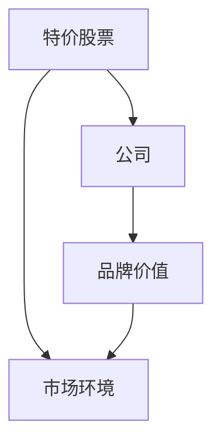
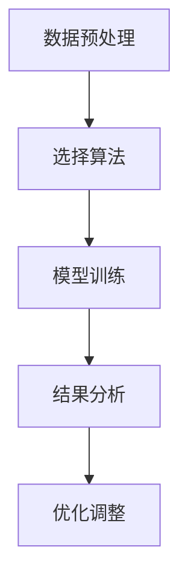

                 


# 特价股票与公司品牌价值的长期关系

> **关键词**：特价股票、品牌价值、长期关系、数学模型、系统架构、实战案例

> **摘要**：本文探讨特价股票与公司品牌价值之间的长期关系，通过背景介绍、核心概念分析、算法原理讲解、系统架构设计、项目实战案例和最佳实践总结，深入剖析两者之间的动态关联。文章结合技术语言与实际案例，为读者提供清晰的逻辑框架和实用的分析工具。

---

## 第一部分：背景介绍

### 第1章：特价股票与公司品牌价值的概述

#### 1.1 问题背景
- **1.1.1 特价股票的定义与分类**
  - 特价股票指价格低于市场平均值的股票，通常分为低价股和折价股。
  - 特价股票的分类依据：市盈率（P/E）、市净率（P/B）、股息率等。
- **1.1.2 公司品牌价值的定义与衡量标准**
  - 品牌价值是公司无形资产的重要组成部分，衡量标准包括品牌知名度、客户忠诚度、市场影响力等。
  - 品牌价值的评估方法：品牌资产评估模型（如BrandZ模型）。
- **1.1.3 研究特价股票与品牌价值关系的重要性**
  - 投资者需要理解特价股票的长期价值。
  - 品牌价值影响企业的长期盈利能力。

#### 1.2 问题描述
- **1.2.1 特价股票市场的现状与挑战**
  - 特价股票市场的波动性大，风险高。
  - 特价股票与企业基本面的关系复杂。
- **1.2.2 品牌价值对企业长期发展的意义**
  - 品牌价值是企业核心竞争力的重要组成部分。
  - 品牌价值与企业市场表现的相关性。
- **1.2.3 两者关系的复杂性与研究必要性**
  - 特价股票与品牌价值的关系受多种因素影响。
  - 研究两者关系有助于投资者制定更科学的投资策略。

#### 1.3 问题解决
- **1.3.1 研究目标与方法论**
  - 目标：建立特价股票与品牌价值之间的量化关系模型。
  - 方法：定性分析与定量分析相结合。
- **1.3.2 数据来源与处理方法**
  - 数据来源：股票市场数据、品牌价值评估数据。
  - 数据处理：数据清洗、特征提取、标准化处理。
- **1.3.3 研究框架与逻辑结构**
  - 理论框架：品牌价值与企业市场表现的关系。
  - 分析框架：回归分析、聚类分析。

#### 1.4 边界与外延
- **1.4.1 研究范围的界定**
  - 限定研究对象：特定行业的特价股票。
  - 研究时间跨度：长期（5年以上）。
- **1.4.2 相关概念的区分与联系**
  - 区分：特价股票与普通股票。
  - 联系：品牌价值与企业市场表现的关系。
- **1.4.3 研究局限性与未来展望**
  - 局限性：数据获取难度、市场环境变化。
  - 未来展望：动态模型的构建。

#### 1.5 概念结构与核心要素
- **1.5.1 特价股票的核心要素分析**
  - 特价股票的价格特征。
  - 特价股票的市场表现。
- **1.5.2 品牌价值的核心要素分析**
  - 品牌知名度、客户忠诚度、品牌认知度。
- **1.5.3 两者关系的系统分析**
  - 品牌价值对特价股票价格的影响。
  - 特价股票价格对品牌价值的反作用。

---

## 第二部分：核心概念与联系

### 第2章：核心概念原理与对比

#### 2.1 特价股票的原理
- **2.1.1 特价股票的发行机制**
  - 特价股票的发行条件：企业盈利能力下降、市场环境恶化。
  - 特价股票的发行方式：公开招股、配股、增发。
- **2.1.2 市场供需对特价股票的影响**
  - 市场供需关系：供大于求导致股价下跌。
  - 投资者行为：理性与非理性投资者的博弈。
- **2.1.3 投资者行为分析**
  - 投资者对特价股票的预期。
  - 投资者对品牌价值的感知。

#### 2.2 品牌价值的原理
- **2.2.1 品牌价值的构成要素**
  - 品牌知名度、品牌忠诚度、品牌认知度。
  - 品牌形象与市场地位。
- **2.2.2 品牌认知与忠诚度的影响**
  - 品牌认知度高的企业更容易获得溢价。
  - 品牌忠诚度高的客户有助于企业长期发展。
- **2.2.3 品牌形象与市场地位的关系**
  - 品牌形象是市场地位的外在表现。
  - 市场地位影响品牌价值的实现。

#### 2.3 概念属性特征对比
- **2.3.1 特价股票与普通股票的对比分析**
  - 定价机制：特价股票的价格受市场供需影响更大。
  - 投资风险：特价股票的风险更高。
- **2.3.2 品牌价值与企业财务表现的对比**
  - 品牌价值是企业无形资产的重要组成部分。
  - 企业财务表现反映品牌价值的实现情况。
- **2.3.3 两者关系的动态变化**
  - 品牌价值的提升有助于提升股价。
  - 股价的波动影响品牌价值的市场认知。

#### 2.4 ER实体关系图


---

## 第三部分：算法原理讲解

### 第3章：数学模型与公式

#### 3.1 回归分析模型
- **3.1.1 线性回归模型**
  - 公式：$$ y = \beta_0 + \beta_1x + \epsilon $$
  - 解释：$y$为品牌价值，$x$为特价股票价格，$\beta_0$为截距，$\beta_1$为回归系数，$\epsilon$为误差项。
- **3.1.2 多元回归模型**
  - 公式：$$ y = \beta_0 + \beta_1x_1 + \beta_2x_2 + \dots + \beta_nx_n + \epsilon $$
  - 解释：加入更多变量（如公司利润、行业地位）以提高模型准确性。

#### 3.2 聚类分析模型
- **3.2.1 K-means算法**
  - 步骤：
    1. 初始化质心。
    2. 计算每个数据点到质心的距离。
    3. 重新计算质心，直到收敛。
- **3.2.2 层次聚类分析**
  - 步骤：
    1. 构建距离矩阵。
    2. 绘制树状图。
    3. 合并相似的簇。

#### 3.3 算法流程图


---

## 第四部分：系统分析与架构设计

### 第4章：系统功能设计

#### 4.1 数据收集模块
- **4.1.1 数据来源**
  - 股票市场数据：Yahoo Finance API。
  - 品牌价值评估数据：BrandZ数据库。
- **4.1.2 数据清洗与预处理**
  - 删除缺失值。
  - 标准化处理。
- **4.1.3 数据存储与管理**
  - 使用Python的Pandas库进行数据处理。
  - 使用MySQL进行数据存储。

#### 4.2 模型构建模块
- **4.2.1 特价股票与品牌价值的关系建模**
  - 使用回归分析和聚类分析构建模型。
  - 验证模型的准确性。
- **4.2.2 算法选择与实现**
  - 选择线性回归和K-means算法。
  - 使用Python的Scikit-learn库实现。
- **4.2.3 模型验证与评估**
  - 使用交叉验证评估模型性能。
  - 计算R²值和均方误差（MSE）。

#### 4.3 结果展示模块
- **4.3.1 数据可视化**
  - 使用Matplotlib绘制股价与品牌价值的对比图。
  - 使用Seaborn绘制分布图。
- **4.3.2 模型结果展示**
  - 显示回归系数和聚类结果。
  - 提供可视化报告。

#### 4.4 系统架构设计
- **4.4.1 功能模块设计**
  - 数据采集模块：实时获取股票数据。
  - 数据处理模块：清洗和预处理数据。
  - 模型构建模块：建立回归和聚类模型。
  - 结果展示模块：可视化分析结果。
- **4.4.2 系统架构图**
  ```mermaid
  graph TD
      A[数据采集模块] --> B[数据处理模块]
      B --> C[模型构建模块]
      C --> D[结果展示模块]
  ```

---

## 第五部分：项目实战

### 第5章：系统核心实现

#### 5.1 环境安装
- **5.1.1 安装Python**
  - 安装Python 3.8或更高版本。
- **5.1.2 安装相关库**
  - pip install numpy
  - pip install pandas
  - pip install matplotlib
  - pip install scikit-learn
- **5.1.3 安装Jupyter Notebook**
  - pip install jupyter

#### 5.2 核心代码实现
```python
import pandas as pd
import numpy as np
from sklearn.linear_model import LinearRegression
from sklearn.metrics import mean_squared_error
import matplotlib.pyplot as plt

# 数据加载
data = pd.read_csv('stock_brand.csv')

# 数据预处理
X = data[['stock_price', 'profit_margin']]
y = data['brand_value']

# 模型训练
model = LinearRegression()
model.fit(X, y)

# 模型预测
y_pred = model.predict(X)

# 模型评估
mse = mean_squared_error(y, y_pred)
r_squared = model.score(X, y)

print(f"均方误差：{mse}")
print(f"R²值：{r_squared}")

# 可视化
plt.scatter(y, y_pred)
plt.xlabel('真实品牌价值')
plt.ylabel('预测品牌价值')
plt.title('回归分析结果')
plt.show()
```

#### 5.3 代码应用解读
- **数据加载**：读取股票和品牌价值数据。
- **数据预处理**：提取特征变量和目标变量。
- **模型训练**：使用线性回归模型训练数据。
- **模型预测**：预测品牌价值。
- **模型评估**：计算均方误差和R²值。
- **可视化**：绘制真实值与预测值的散点图。

#### 5.4 实际案例分析
- **案例背景**：某公司发行特价股票，品牌价值下降。
- **分析步骤**：
  1. 数据清洗与预处理。
  2. 建立回归模型。
  3. 分析品牌价值与股价的关系。
- **结果解读**：品牌价值的提升有助于股价的回升。

#### 5.5 项目小结
- **项目目标**：建立特价股票与品牌价值的关系模型。
- **项目成果**：实现回归分析和可视化展示。
- **经验总结**：数据质量影响模型性能。

---

## 第六部分：最佳实践与总结

### 第6章：总结与展望

#### 6.1 最佳实践 tips
- **数据质量**：确保数据的完整性和准确性。
- **模型选择**：根据数据特点选择合适的算法。
- **结果验证**：通过交叉验证评估模型性能。
- **持续优化**：定期更新模型，适应市场变化。

#### 6.2 小结
- 本文通过背景介绍、核心概念分析、算法原理讲解、系统架构设计和项目实战案例，深入探讨了特价股票与公司品牌价值的长期关系。
- 建立了回归分析模型，并通过案例验证了模型的可行性。

#### 6.3 注意事项
- 特价股票市场的波动性较大，投资者需谨慎决策。
- 品牌价值的评估需结合企业基本面分析。
- 模型的局限性：数据获取难度、市场环境变化。

#### 6.4 拓展阅读
- 推荐书籍：《股票投资实战策略》、《品牌管理与评估》。
- 推荐文章：品牌价值与企业绩效的关系研究。

---

**作者：AI天才研究院/AI Genius Institute & 禅与计算机程序设计艺术 /Zen And The Art of Computer Programming**

