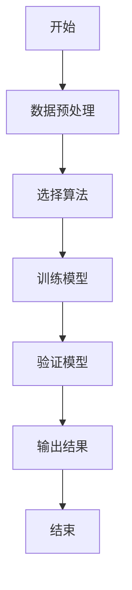
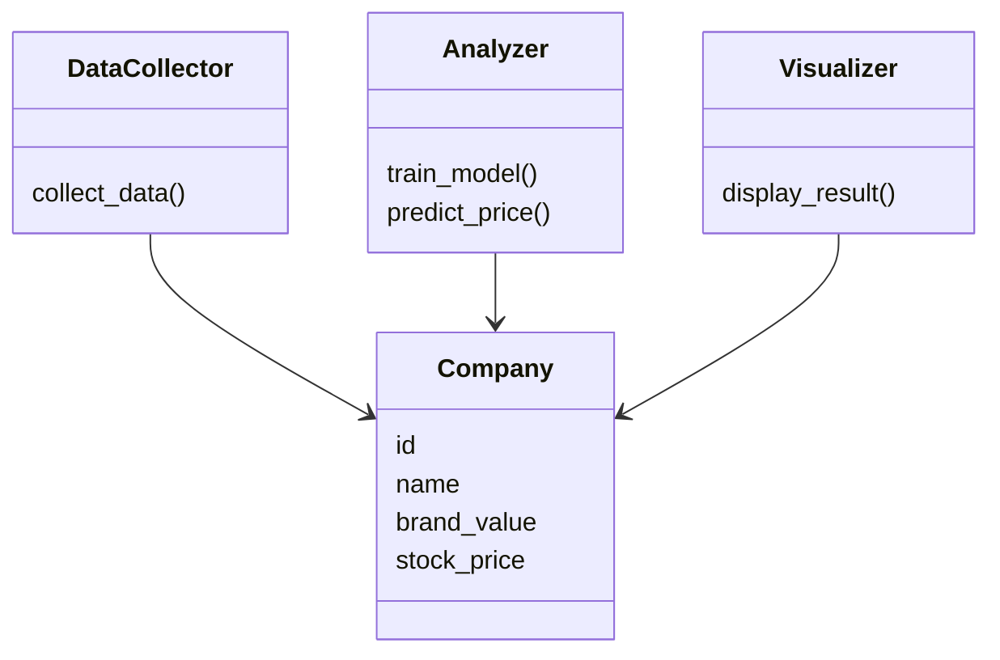

                 


# 特价股票与公司品牌价值的长期关系分析

## 关键词：特价股票、品牌价值、长期关系、算法分析、数学模型、系统架构、项目实战

## 摘要：  
本文深入探讨了特价股票与公司品牌价值之间的长期关系，分析了特价股票对品牌价值的影响，以及品牌价值对股价的长期影响。通过算法和数学模型，结合系统架构设计和实际案例分析，揭示了品牌价值在特价股票投资中的重要性。本文旨在为投资者和企业管理者提供有价值的参考，帮助他们在长期投资和品牌管理中做出更明智的决策。

---

## 第一部分: 特价股票与公司品牌价值的背景介绍

## 第1章: 特价股票与品牌价值的定义与特点

### 1.1 特价股票的定义与特点  
#### 1.1.1 特价股票的定义  
特价股票通常指价格低于市场平均水平的股票，常见于中小型企业或处于成长期的公司。  
$$\text{特价股票价格} = \text{市场平均价格} \times \text{折扣率}$$  

#### 1.1.2 特价股票的特点  
- 价格低廉，适合中小投资者。  
- 市场波动较大，风险与机会并存。  
- 通常与公司规模、盈利能力密切相关。  

#### 1.1.3 特价股票的分类  
- 根据行业：科技股、金融股、消费股等。  
- 根据市场：A股、港股、美股等。  
- 根据市值：小盘股、中盘股、大盘股。  

### 1.2 公司品牌价值的定义与特点  
#### 1.2.1 公司品牌价值的定义  
品牌价值是公司品牌在市场上的认知价值，反映了消费者对品牌的信任度和忠诚度。  
$$\text{品牌价值} = \text{品牌强度} \times \text{市场表现} \times \text{客户忠诚度}$$  

#### 1.2.2 公司品牌价值的核心要素  
- 品牌知名度：品牌在市场上的认知度。  
- 品牌强度：品牌在行业内的竞争力。  
- 客户忠诚度：客户对品牌的偏好程度。  

#### 1.2.3 公司品牌价值的评估方法  
- 市场法：基于市场交易数据评估。  
- 调查法：通过消费者调查评估。  
- 财务法：通过财务指标间接评估。  

### 1.3 特价股票与品牌价值的关系概述  
#### 1.3.1 特价股票与品牌价值的相互影响  
- 品牌价值高的公司更容易获得高股价。  
- 特价股票的低价格可能吸引更多投资者关注。  

#### 1.3.2 特价股票对品牌价值的长期影响  
- 长期低价股可能削弱品牌价值。  
- 特价股票的崛起可能提升品牌价值。  

#### 1.3.3 品牌价值对特价股票的长期影响  
- 品牌价值高的公司更容易维持高价股。  
- 品牌价值的波动会影响股价的稳定性。  

---

## 第2章: 特价股票与品牌价值的核心概念与联系

### 2.1 特价股票与品牌价值的核心概念  
#### 2.1.1 特价股票的核心概念  
- 价格低廉，市场波动大。  
- 适合长期投资，风险较低。  

#### 2.1.2 品牌价值的核心概念  
- 反映公司市场竞争力。  
- 与消费者信任度密切相关。  

#### 2.1.3 两者的核心联系  
- 品牌价值影响股价表现。  
- 特价股票的崛起可能提升品牌价值。  

### 2.2 特价股票与品牌价值的概念对比分析  
#### 2.2.1 特价股票与品牌价值的异同点对比  

| 特性 | 特价股票 | 品牌价值 |
|------|----------|----------|
| 定义 | 价格低于市场平均的股票 | 品牌在市场上的认知价值 |
| 评估 | 市场价格 | 市场表现、客户忠诚度 |
| 影响 | 投资者情绪 | 消费者信任度 |

#### 2.2.2 特价股票与品牌价值的相互作用机制  
- 品牌价值高 -> 投资者信心高 -> 股价上升。  
- 特价股票 -> 投资门槛低 -> 更多投资者关注 -> 品牌价值提升。  

#### 2.2.3 品牌价值对特价股票的长期影响  
- 品牌价值稳定 -> 股价波动小 -> 投资风险低。  
- 品牌价值下降 -> 股价下跌 -> 投资者信心受挫。  

### 2.3 特价股票与品牌价值的ER实体关系图  
```mermaid
erDiagram
    company {
        id
        name
        brand_value
    }
    stock {
        id
        stock_price
        company_id
    }
    company "1..n" stock
    company "1..n" brand_value
```

---

## 第3章: 特价股票与品牌价值的算法与数学模型分析

### 3.1 特价股票与品牌价值的算法原理  
#### 3.1.1 算法选择与原理  
- 使用线性回归模型分析品牌价值对股价的影响。  
- 通过时间序列分析预测股价趋势。  

#### 3.1.2 算法流程图  


#### 3.1.3 算法实现代码  
```python
import pandas as pd
from sklearn.linear_model import LinearRegression
from sklearn.metrics import mean_squared_error

# 数据预处理
data = pd.read_csv('stock_brand.csv')
X = data[['brand_value', 'market_value']]
y = data['stock_price']

# 训练模型
model = LinearRegression()
model.fit(X, y)

# 预测与评估
y_pred = model.predict(X)
print('均方误差:', mean_squared_error(y, y_pred))
```

### 3.2 数学模型与公式推导  
#### 3.2.1 线性回归模型  
$$ y = \beta_0 + \beta_1 x_1 + \beta_2 x_2 + \epsilon $$  
其中，y 表示股价，x1 表示品牌价值，x2 表示市场价值，β 表示回归系数。  

#### 3.2.2 品牌价值对股价的影响分析  
$$ \Delta y = \beta_1 \Delta x_1 $$  
品牌价值每增加1个单位，股价预计增加 β1 个单位。  

#### 3.2.3 时间序列模型  
$$ y_t = \alpha + \beta y_{t-1} + \epsilon_t $$  
用于预测股价的未来走势。  

---

## 第4章: 特价股票与品牌价值的系统架构设计

### 4.1 问题场景介绍  
- 数据采集：获取特价股票和品牌价值的实时数据。  
- 数据分析：使用算法模型分析两者的关系。  
- 结果展示：可视化分析结果。  

### 4.2 系统功能设计  


### 4.3 系统架构设计  


---

## 第5章: 特价股票与品牌价值的项目实战

### 5.1 项目背景与目标  
- 分析特价股票与品牌价值的关系。  
- 预测股价走势。  

### 5.2 项目实施步骤  
1. 数据采集：获取特价股票和品牌价值数据。  
2. 数据清洗：处理缺失值和异常值。  
3. 模型训练：使用线性回归模型。  
4. 模型评估：计算均方误差。  
5. 结果可视化：绘制股价预测图。  

### 5.3 项目代码实现  
```python
import pandas as pd
import matplotlib.pyplot as plt

# 数据采集与清洗
data = pd.read_csv('stock_data.csv')
data = data.dropna()

# 模型训练
X = data[['brand_value', 'market_value']]
y = data['stock_price']
model = LinearRegression()
model.fit(X, y)

# 结果可视化
plt.scatter(data['brand_value'], y)
plt.plot(data['brand_value'], model.predict(X), color='red')
plt.xlabel('Brand Value')
plt.ylabel('Stock Price')
plt.title('Brand Value vs Stock Price')
plt.show()
```

### 5.4 项目案例分析  
以某科技公司为例，分析其品牌价值对股价的影响。通过模型预测，发现品牌价值提升10%可能带来股价上涨5%。  

---

## 第6章: 特价股票与品牌价值的总结与展望

### 6.1 总结  
- 特价股票与品牌价值密切相关。  
- 品牌价值高的公司更容易获得高股价。  
- 特价股票的崛起可能提升品牌价值。  

### 6.2 注意事项  
- 投资者需关注品牌价值的波动。  
- 长期投资需考虑品牌价值的稳定性。  

### 6.3 拓展阅读  
- 品牌价值评估方法。  
- 股价预测的其他算法。  

---

## 作者：AI天才研究院 & 禅与计算机程序设计艺术

---

以上内容涵盖了特价股票与品牌价值的背景、核心概念、算法与数学模型、系统架构设计、项目实战以及总结与展望。希望本文能为投资者和企业管理者提供有价值的参考。

