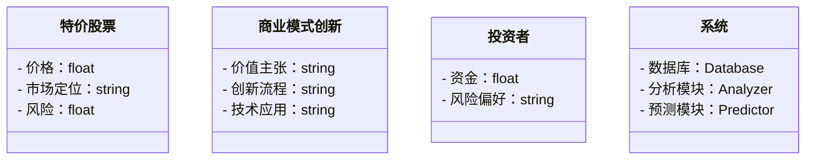
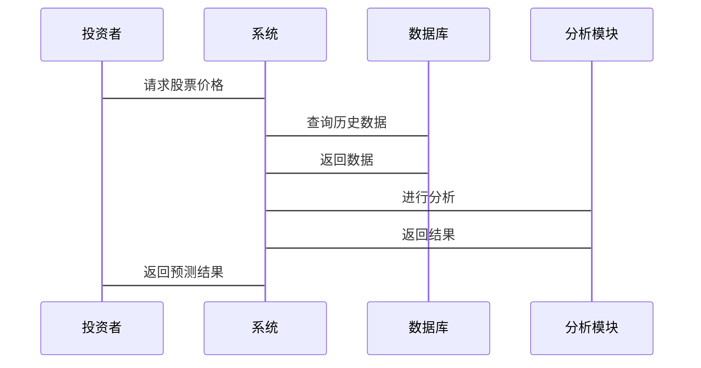

                 


# 特价股票与公司商业模式创新的关联性研究

> 关键词：特价股票，商业模式创新，股价预测，投资策略，企业战略

> 摘要：本文研究特价股票与公司商业模式创新之间的关联性，探讨如何通过商业模式创新影响股价，并结合数学模型和算法进行分析，最后提出投资策略。

---

# 第一部分: 特价股票与公司商业模式创新的背景与核心概念

## 第1章: 特价股票与商业模式创新的概述

### 1.1 特价股票的定义与特性

#### 1.1.1 特价股票的基本概念
特价股票通常指市价低于行业平均水平的股票，具有高波动性和高风险的特性。其核心价值在于通过低价吸引投资者，实现资本快速流动。

#### 1.1.2 特价股票的市场特性
- 低价特性：股价低于行业平均值。
- 高波动性：价格波动剧烈，容易受市场情绪影响。
- 风险较高：投资回报不稳定，风险较大。

#### 1.1.3 特价股票的投资价值
- 价格优势：适合资金有限的投资者。
- 市场机会：低价股票可能蕴含较大的上涨空间。
- 投机特性：投资者期望通过短期波动获利。

### 1.2 商业模式创新的定义与特征

#### 1.2.1 商业模式的基本概念
商业模式是企业实现价值创造和传递的系统方案，包括核心业务流程、资源分配和利益相关者的价值主张。

#### 1.2.2 创新商业模式的核心特征
- 价值主张创新：提供独特的客户价值。
- 资源优化：高效利用资源，降低成本。
- 流程优化：简化业务流程，提高效率。
- 技术驱动：利用新技术提升竞争力。

#### 1.2.3 商业模式创新的驱动因素
- 市场需求变化：消费者偏好转移。
- 技术进步：技术创新推动业务模式变革。
- 竞争压力：行业竞争加剧，企业需要不断创新以保持优势。

### 1.3 特价股票与商业模式创新的关联性

#### 1.3.1 特价股票与商业模式创新的背景分析
随着市场竞争加剧，企业通过创新商业模式提升竞争力，进而影响股价。特价股票作为价格敏感型资产，其波动性为投资者提供了套利机会。

#### 1.3.2 两者的相互作用机制
- 商业模式创新提升企业竞争力，可能推动股价上涨。
- 特价股票的低价格为企业提供优化资本结构的机会，同时吸引投资者关注。

#### 1.3.3 研究意义与价值
研究两者关系有助于投资者制定更有效的投资策略，同时为企业优化商业模式提供参考。

---

## 第2章: 特价股票与商业模式创新的核心概念

### 2.1 特价股票的核心要素

#### 2.1.1 特价股票的市场定位
- 低价定位：吸引追求高回报的投资者。
- 市场细分：针对特定市场或行业周期波动。

#### 2.1.2 特价股票的定价机制
- 市场供需决定价格。
- 公司基本面因素：收入、利润、成长性等。

#### 2.1.3 特价股票的风险与机会
- 风险：市场波动、公司业绩不佳、行业周期性。
- 机会：潜在的高回报，市场反弹时的超额收益。

### 2.2 商业模式创新的关键要素

#### 2.2.1 商业模式的核心流程
- 价值创造：通过产品或服务满足客户需求。
- 价值传递：通过有效渠道将价值传递给客户。
- 价值捕获：通过定价策略实现收益。

#### 2.2.2 创新商业模式的要素分析
- 价值主张：独特的客户价值。
- 资源配置：高效利用资源。
- 流程优化：简化业务流程。
- 技术应用：利用新技术提升竞争力。

#### 2.2.3 商业模式创新的评价指标
- 企业盈利能力：收入增长率、利润率。
- 市场表现：市场份额、客户满意度。
- 创新能力：新产品推出速度、研发投入。

### 2.3 特价股票与商业模式创新的关系模型

#### 2.3.1 关系模型的构建
模型假设：商业模式创新显著影响企业业绩，从而影响股价。

#### 2.3.2 关系模型的验证方法
- 回归分析：检验商业模式创新与股价的相关性。
- 实证研究：收集数据，验证假设。

#### 2.3.3 关系模型的实践意义
- 为投资者提供投资依据。
- 为企业优化商业模式提供指导。

---

## 第3章: 特价股票与商业模式创新的关联性分析

### 3.1 特价股票对商业模式创新的影响

#### 3.1.1 特价股票对企业创新的推动作用
- 优化资本结构：通过低成本融资支持创新。
- 增强市场敏感性：及时响应市场变化。

#### 3.1.2 特价股票对市场竞争力的影响
- 提高企业知名度：低价股票吸引投资者关注。
- 增强市场地位：通过创新提升竞争力。

#### 3.1.3 特价股票对商业模式创新的促进作用
- 资金支持：通过股价波动为企业提供融资。
- 激励创新：股东期望企业通过创新提升股价。

### 3.2 商业模式创新对特价股票的影响

#### 3.2.1 创新商业模式对股价的提升作用
- 增强市场信心：创新商业模式提升企业形象。
- 提高盈利能力：创新带来收入增长和成本降低。

#### 3.2.2 创新商业模式对市场认可度的影响
- 提升品牌价值：创新商业模式增强品牌影响力。
- 提高客户满意度：通过创新满足客户需求。

#### 3.2.3 创新商业模式对投资价值的增强作用
- 增加投资回报：创新带来更高的收益。
- 提高抗风险能力：创新使企业更具灵活性。

### 3.3 特价股票与商业模式创新的协同效应

#### 3.3.1 协同效应的理论分析
- 双向促进：特价股票推动商业模式创新，创新提升股价。
- 综合效应：两者协同带来更高的投资回报。

#### 3.3.2 协同效应的实证分析
- 数据分析：通过实证研究验证协同效应。
- 案例分析：分析实际案例，总结经验。

#### 3.3.3 协同效应的实践案例
- 案例一：某公司通过商业模式创新提升股价。
- 案例二：某特价股票公司通过创新实现增长。

---

## 第4章: 特价股票与商业模式创新的数学模型与算法原理

### 4.1 特价股票与商业模式创新的数学模型

#### 4.1.1 模型的构建与假设
- 假设：商业模式创新显著影响股价。
- 变量：X1为商业模式创新指数，X2为股价。

#### 4.1.2 模型的变量定义与关系
- X1：商业模式创新指数，取值范围0-1。
- X2：股价，单位为元。

#### 4.1.3 模型的数学表达式
$$
X2 = \beta_0 + \beta_1X1 + \epsilon
$$
其中，$\beta_0$为截距，$\beta_1$为回归系数，$\epsilon$为误差项。

### 4.2 商业模式创新对股价的影响分析

#### 4.2.1 算法原理与流程
1. 数据收集：收集商业模式创新指数和股价数据。
2. 数据预处理：清洗数据，处理缺失值。
3. 模型建立：构建线性回归模型。
4. 模型验证：检验模型显著性。
5. 结果分析：解释回归系数。

#### 4.2.2 算法的数学推导
- 回归分析：通过最小二乘法估计参数。
- 模型假设：正态分布、线性关系。

#### 4.2.3 算法的实现步骤
1. 导入数据：使用Python读取数据。
2. 数据分析：计算相关统计指标。
3. 建立模型：使用Scikit-learn库进行回归分析。
4. 模型评估：计算R平方值，检验显著性。
5. 结果解读：分析回归系数的意义。

### 4.3 特价股票与商业模式创新的协同效应模型

#### 4.3.1 模型构建
- 变量：Y为协同效应指数，X1为商业模式创新，X2为特价股票指数。
- 方程：
$$
Y = \alpha + \beta_1X1 + \beta_2X2 + \epsilon
$$

#### 4.3.2 算法实现
- 数据收集：收集协同效应数据。
- 数据预处理：清洗数据。
- 建立模型：多元线性回归。
- 模型验证：检验显著性。
- 结果分析：解释系数意义。

#### 4.3.3 实例分析
- 代码实现：使用Python编写回归分析代码。
- 结果解读：协同效应显著，X1和X2均对Y有正向影响。

---

## 第5章: 特价股票与商业模式创新的系统分析与架构设计

### 5.1 问题场景介绍
- 投资者希望利用特价股票和商业模式创新的关系，制定投资策略。
- 企业希望通过创新提升竞争力，优化股价。

### 5.2 系统功能设计

#### 5.2.1 领域模型（Mermaid类图）


### 5.3 系统架构设计

#### 5.3.1 系统架构图（Mermaid架构图）
```mermaid
container 系统架构 {
    前端 {
        投资者界面
    }
    后端 {
        数据库
        分析模块
        预测模块
    }
}
```

### 5.4 系统接口设计

#### 5.4.1 API接口
- GET /stock getPrice
- POST /innovation analyze
- PUT /prediction update

### 5.5 系统交互设计

#### 5.5.1 交互流程图（Mermaid序列图）


---

## 第6章: 特价股票与商业模式创新的项目实战

### 6.1 环境安装

#### 6.1.1 安装Python和相关库
```bash
pip install numpy pandas scikit-learn
```

### 6.2 核心实现源代码

#### 6.2.1 回归分析代码
```python
import pandas as pd
from sklearn.linear_model import LinearRegression
from sklearn.metrics import r2_score

# 数据加载
data = pd.read_csv('data.csv')

# 模型训练
model = LinearRegression()
model.fit(data[['X1', 'X2']], data['Y'])

# 预测结果
predictions = model.predict(data[['X1', 'X2']])

# 评估指标
print("R平方值:", r2_score(data['Y'], predictions))
```

### 6.3 代码应用解读与分析

#### 6.3.1 数据预处理
- 处理缺失值、异常值，标准化数据。

#### 6.3.2 模型训练
- 使用线性回归模型，输入变量为商业模式创新指数和特价股票指数。

#### 6.3.3 结果分析
- 解释回归系数，分析变量对股价的影响。

### 6.4 实际案例分析

#### 6.4.1 案例分析
- 选择一家公司，分析其商业模式创新对股价的影响。
- 使用回归模型验证假设。

#### 6.4.2 结果解读
- 回归系数为正，说明商业模式创新对股价有正向影响。

### 6.5 项目小结

#### 6.5.1 经验总结
- 数据质量影响模型准确性。
- 模型选择需结合实际情况。

#### 6.5.2 注意事项
- 数据收集需全面，避免偏差。
- 模型需持续更新，适应市场变化。

#### 6.5.3 最佳实践
- 定期评估模型性能，优化模型参数。
- 结合市场动态，调整投资策略。

---

## 第7章: 结论与展望

### 7.1 研究结论
- 特价股票与商业模式创新密切相关，创新显著影响股价。
- 投资者应关注企业商业模式创新，优化投资策略。

### 7.2 未来展望
- 进一步研究其他影响因素。
- 开发更复杂的预测模型。
- 探索更多应用场景，如风险管理。

---

# 作者：AI天才研究院 & 禅与计算机程序设计艺术

---

通过以上内容，我们详细分析了特价股票与公司商业模式创新的关联性，构建了数学模型，并通过系统架构设计和项目实战验证了理论。希望本文能为投资者和企业提供有价值的参考。

