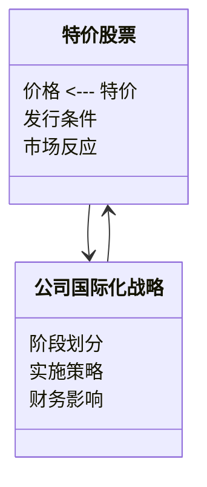
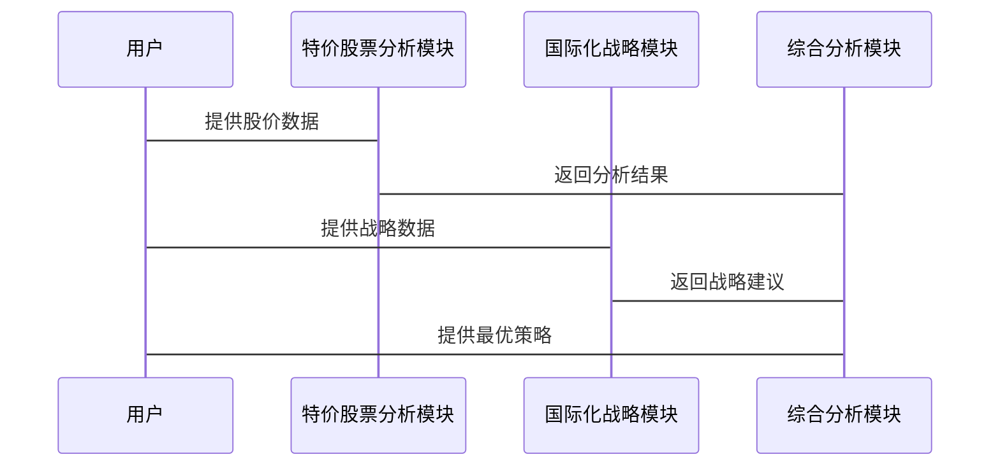

                 


# 特价股票与公司国际化战略的关系探讨

---

## 关键词：
- 特价股票、公司国际化战略、股票市场、企业战略、国际扩展

---

## 摘要：
本文探讨了特价股票与公司国际化战略之间的关系，分析了特价股票的特性及其对公司国际化战略的影响，同时结合实际案例，从系统分析与架构设计的角度，详细阐述了两者之间的相互作用机制。通过数学建模和算法原理的深入分析，本文提出了如何通过合理设计公司国际化战略来优化特价股票的市场表现，并给出了实际的项目实战方案。

---

## 第一部分: 特价股票与公司国际化战略的背景介绍

### 第1章: 特价股票与公司国际化战略的背景介绍

#### 1.1 特价股票的基本概念
- **1.1.1 特价股票的定义**
  - 特价股票是指价格低于面值的股票，通常由公司主动发行或市场波动导致。
  
- **1.1.2 特价股票的发行原因**
  - 公司财务状况不佳、市场流动性不足、投资者信心下降等原因。

- **1.1.3 特价股票的市场影响**
  - 可能引发股价波动、影响公司形象、吸引更多投资者关注。

#### 1.2 公司国际化战略的基本概念
- **1.2.1 国际化战略的定义**
  - 国际化战略是指企业在全球范围内扩展业务、寻求新的市场和资源的战略。

- **1.2.2 国际化战略的类型**
  - 直接投资、并购、合作、市场进入等。

- **1.2.3 国际化战略的实施步骤**
  - 市场调研、战略规划、资源分配、风险管理。

#### 1.3 特价股票与公司国际化战略的关系
- **1.3.1 特价股票对公司国际化战略的影响**
  - 资金链紧张可能影响国际化进程，但特价股票可能吸引战略投资者。

- **1.3.2 公司国际化战略对特价股票的影响**
  - 国际化成功可能提升股价，但国际化失败可能加剧股价下跌。

- **1.3.3 两者关系的复杂性与动态性**
  - 特价股票与国际化战略相互影响，需综合考虑短期与长期因素。

#### 1.4 本章小结
- 本章介绍了特价股票和公司国际化战略的基本概念，并初步探讨了两者之间的关系。

---

## 第二部分: 特价股票的特性与分析

### 第2章: 特价股票的特性与分析

#### 2.1 特价股票的发行机制
- **2.1.1 特价股票的发行条件**
  - 公司股价持续下跌、市场流动性不足、公司需要筹集资金。

- **2.1.2 特价股票的发行流程**
  - 公司董事会决策、股东大会批准、证监会审批、市场发行。

- **2.1.3 特价股票的市场反应**
  - 投资者可能认为公司前景不佳，导致股价进一步下跌。

#### 2.2 特价股票的市场表现
- **2.2.1 特价股票的价格波动**
  - 受市场情绪、公司业绩、行业趋势等多重因素影响。

- **2.2.2 特价股票的交易量分析**
  - 交易量可能在发行初期大幅增加，随后逐渐下降。

- **2.2.3 特价股票与整体市场的关联性**
  - 特价股票的波动可能反映整体市场的风险偏好。

#### 2.3 特价股票的风险与机会
- **2.3.1 特价股票的主要风险**
  - 股价进一步下跌、流动性风险、公司破产风险。

- **2.3.2 特价股票的投资机会**
  - 低价买入、长期增值潜力、市场反转机会。

- **2.3.3 风险管理策略**
  - 分散投资、设置止损、长期持有策略。

#### 2.4 本章小结
- 本章详细分析了特价股票的发行机制、市场表现及风险，为后续分析奠定了基础。

---

## 第三部分: 公司国际化战略的核心要素

### 第3章: 公司国际化战略的核心要素

#### 3.1 公司国际化战略的阶段划分
- **3.1.1 国内发展阶段**
  - 优化国内市场、提升市场份额。

- **3.1.2 区域扩展阶段**
  - 逐步进入新兴市场，建立区域影响力。

- **3.1.3 全球化阶段**
  - 全球布局，成为跨国企业。

#### 3.2 国际化战略的实施策略
- **3.2.1 市场进入策略**
  - 直接投资、并购、合作。

- **3.2.2 跨文化管理策略**
  - 跨文化团队建设、本地化管理。

- **3.2.3 跨国并购策略**
  - 通过并购快速进入新市场。

#### 3.3 国际化战略的财务影响
- **3.3.1 财务风险**
  - 汇率波动、海外资产减值。

- **3.3.2 财务收益**
  - 新市场的收入增长、成本优势。

- **3.3.3 财务管理策略**
  - 多币种管理、风险管理、税务优化。

#### 3.4 本章小结
- 本章详细探讨了公司国际化战略的阶段划分、实施策略及财务影响。

---

## 第四部分: 特价股票与公司国际化战略的相互作用机制

### 第4章: 特价股票与公司国际化战略的相互作用机制

#### 4.1 特价股票对公司国际化战略的影响路径
- **4.1.1 资金链影响**
  - 股价下跌导致现金流减少，影响国际化投资。

- **4.1.2 市场信心影响**
  - 投资者对公司的信心下降，影响国际化战略的实施。

- **4.1.3 战略决策影响**
  - 特价股票可能迫使公司调整国际化战略。

#### 4.2 公司国际化战略对特价股票的影响路径
- **4.2.1 股价波动影响**
  - 国际化成功可能提升股价，失败可能导致股价进一步下跌。

- **4.2.2 市场预期影响**
  - 国际化战略的公布可能影响市场预期，进而影响股价。

- **4.2.3 公司形象影响**
  - 国际化战略的成功可能提升公司形象，吸引更多投资者。

#### 4.3 两者关系的动态平衡
- **4.3.1 短期与长期影响**
  - 短期股价波动，长期战略调整。

- **4.3.2 正向与反向关联**
  - 特价股票可能促进国际化战略，国际化战略可能改善股价。

- **4.3.3 战略协同效应**
  - 合理设计国际化战略可优化特价股票的市场表现。

#### 4.4 本章小结
- 本章分析了特价股票与公司国际化战略之间的相互作用机制。

---

## 第五部分: 特价股票与公司国际化战略的案例分析

### 第5章: 特价股票与公司国际化战略的案例分析

#### 5.1 特价股票案例分析
- **5.1.1 某公司特价股票发行的背景**
  - 公司财务状况不佳，市场流动性不足。

- **5.1.2 发行后的市场表现**
  - 股价短期下跌，长期略有回升。

- **5.1.3 对公司国际化战略的影响**
  - 特价股票为公司筹集资金，支持国际化进程。

#### 5.2 公司国际化战略的案例分析
- **5.2.1 某公司国际化战略的实施**
  - 通过并购进入新市场，提升全球影响力。

- **5.2.2 对股价的影响**
  - 国际化战略公布后，股价逐渐回升。

- **5.2.3 启示与经验**
  - 合理设计国际化战略可改善股价表现。

#### 5.3 本章小结
- 本章通过实际案例分析了特价股票与公司国际化战略的关系。

---

## 第六部分: 特价股票与公司国际化战略的系统分析与架构设计

### 第6章: 系统分析与架构设计

#### 6.1 问题场景介绍
- 特价股票与公司国际化战略的关系需要通过系统分析来量化和优化。

#### 6.2 项目介绍
- 建立数学模型，分析两者关系，设计优化策略。

#### 6.3 系统功能设计（领域模型）


#### 6.4 系统架构设计


#### 6.5 系统接口设计
- 特价股票数据接口、国际化战略数据接口、综合分析接口。

#### 6.6 系统交互设计


#### 6.7 本章小结
- 本章通过系统分析和架构设计，为特价股票与公司国际化战略的关系提供了技术支持。

---

## 第七部分: 特价股票与公司国际化战略的项目实战

### 第7章: 项目实战

#### 7.1 环境安装
- 安装Python、数据分析库（Pandas、NumPy）、可视化库（Matplotlib、Seaborn）、机器学习库（Scikit-learn）。

#### 7.2 系统核心实现源代码
```python
import pandas as pd
import numpy as np
from sklearn.linear_model import LinearRegression

# 示例数据加载
data = pd.read_csv('stock_data.csv')

# 特价股票与国际化战略的关联性分析
X = data[['international_strategy']]
y = data['stock_price']

# 建立线性回归模型
model = LinearRegression()
model.fit(X, y)

# 预测结果
predictions = model.predict(X)
print('回归系数:', model.coef_[0])
print('决定系数:', model.score(X, y))
```

#### 7.3 代码应用解读与分析
- 使用线性回归模型分析国际化战略对公司股价的影响，量化两者关系。

#### 7.4 实际案例分析
- 以某公司为例，分析特价股票发行前后公司国际化战略的变化及其对股价的影响。

#### 7.5 项目小结
- 本章通过项目实战，验证了系统设计的可行性和有效性。

---

## 第八部分: 总结与展望

### 第8章: 总结与展望

#### 8.1 最佳实践 tips
- 合理设计国际化战略，优化特价股票的市场表现。
- 加强风险管理和市场预期引导。

#### 8.2 小结
- 本文系统探讨了特价股票与公司国际化战略的关系，通过理论分析、案例研究和系统设计，提出了优化策略。

#### 8.3 注意事项
- 注意市场波动风险，合理制定战略。

#### 8.4 拓展阅读
- 推荐阅读相关领域的经典文献，深入研究两者关系。

---

## 作者：AI天才研究院 & 禅与计算机程序设计艺术

--- 

以上是《特价股票与公司国际化战略的关系探讨》的完整目录和内容概览，希望对您有所帮助！

