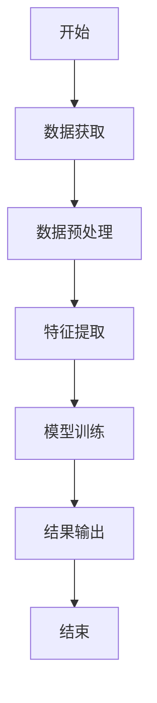

                 


# 特价股票与公司基本面分析的结合

## 关键词：特价股票，公司基本面分析，股票投资，财务报表分析，多因素模型

## 摘要：  
本文探讨了如何将特价股票与公司基本面分析相结合，帮助投资者做出更明智的投资决策。通过分析公司基本面的核心要素、多因素模型的应用，以及实际案例的分析，本文提供了详细的指导和见解。

---

## 第一部分: 特价股票与公司基本面分析的背景介绍

### 第1章: 特价股票的定义与特点

#### 1.1 特价股票的定义
特价股票是指价格远低于其内在价值的股票，通常由于市场波动或公司短期问题导致价格被低估。

#### 1.2 特价股票的特点
- **低估值**：市盈率、市净率等指标低于行业平均水平。
- **高波动性**：价格波动较大，短期内可能大幅波动。
- **潜在价值**：存在恢复到合理价值的潜力。

#### 1.3 特价股票的投资价值
- **高回报潜力**：低估的股票可能在价值回归时带来丰厚收益。
- **风险与机会并存**：需要结合公司基本面分析以降低风险。

### 第2章: 公司基本面分析的必要性

#### 2.1 公司基本面分析的定义
公司基本面分析是通过研究公司的财务状况、行业地位和经营能力，评估其内在价值的过程。

#### 2.2 公司基本面分析的核心要素
- **财务报表分析**：评估公司盈利能力、资产负债状况和现金流情况。
- **估值指标分析**：如市盈率、市净率、股息率等。
- **行业分析与竞争地位**：了解公司所处行业的竞争格局和市场地位。

#### 2.3 公司基本面分析的重要性
- **降低投资风险**：通过分析公司财务状况，识别潜在问题。
- **提高投资决策的准确性**：结合市场估值，判断股票是否被低估。

### 第3章: 特价股票与公司基本面分析的结合意义

#### 3.1 结合的意义
- **优化投资决策**：通过基本面分析筛选出真正低估的股票。
- **提高投资回报率**：结合市场估值和公司财务状况，找到具有高增长潜力的股票。

#### 3.2 结合的优势
- **双重筛选**：结合价格优势和基本面优势，提高投资安全性。
- **长期与短期结合**：既考虑短期价格波动，又关注长期价值增长。

---

## 第二部分: 公司基本面分析的核心概念与联系

### 第4章: 公司基本面分析的核心要素

#### 4.1 财务报表分析
- **利润表**：评估公司盈利能力。
- **资产负债表**：评估公司资产和负债状况。
- **现金流量表**：评估公司现金流健康状况。

#### 4.2 估值指标分析
- **市盈率（P/E）**：股价与每股收益的比率。
- **市净率（P/B）**：股价与每股净资产的比率。
- **股息率**：股息与股价的比率。

#### 4.3 行业分析与竞争地位
- **行业分析**：了解行业发展趋势和竞争格局。
- **市场地位**：评估公司在行业中的地位和竞争优势。

### 第5章: 公司基本面分析的核心原理

#### 5.1 财务报表分析原理
- **利润表分析**：评估公司的收入、成本和利润情况。
- **资产负债表分析**：评估公司的资产、负债和所有者权益情况。
- **现金流量表分析**：评估公司的现金流健康状况。

#### 5.2 估值指标分析原理
- **市盈率分析**：比较公司股价与行业平均市盈率，判断是否低估。
- **市净率分析**：比较公司股价与行业平均市净率，判断是否低估。
- **股息率分析**：比较公司股息率与行业平均股息率，判断分红能力。

#### 5.3 行业分析与竞争地位分析原理
- **行业趋势**：分析行业未来发展趋势。
- **竞争格局**：评估公司在行业中的竞争力和市场份额。

### 第6章: 公司基本面分析的核心概念对比

#### 6.1 财务指标对比表格
| 指标       | 公司A | 公司B | 行业平均 | 说明               |
|------------|--------|--------|----------|--------------------|
| 净利润（万元） | 1000   | 1500   | 1200      | 公司B更高           |
| 市盈率      | 15     | 18     | 16        | 公司B被高估         |
| 市净率      | 2.0    | 2.5    | 2.2       | 公司A被低估         |

#### 6.2 估值指标对比表格
| 指标       | 公司A | 公司B | 行业平均 | 说明               |
|------------|--------|--------|----------|--------------------|
| 股息率 (%)  | 5      | 4      | 4.5       | 公司A分红能力更强     |
| 市盈率      | 15     | 18     | 16        | 公司B可能被高估       |

#### 6.3 行业地位对比表格
| 指标       | 公司A | 公司B | 行业平均 | 说明               |
|------------|--------|--------|----------|--------------------|
| 市场份额 (%) | 20     | 25     | 22        | 公司B更具竞争力       |
| 竞争优势   | 一般   | 明显   | 一般      | 公司B更具优势       |

---

## 第三部分: 特价股票与公司基本面分析的算法原理讲解

### 第7章: 基于公司基本面的股票筛选算法

#### 7.1 算法原理
基于多因素模型，结合公司基本面指标和市场估值指标，筛选出被低估的股票。

#### 7.2 算法流程图（Mermaid）


#### 7.3 多因素模型在股票筛选中的应用

##### 7.3.1 算法实现步骤
1. **数据获取**：收集公司财务数据和市场数据。
2. **数据预处理**：清洗数据，处理缺失值。
3. **特征提取**：提取关键基本面指标（如市盈率、市净率等）。
4. **模型训练**：使用多因素模型筛选低估股票。
5. **结果输出**：输出筛选结果。

##### 7.3.2 Python代码示例
```python
import pandas as pd
import numpy as np

# 示例数据
data = {
    '公司': ['A', 'B', 'C'],
    '市盈率': [15, 18, 16],
    '市净率': [2.0, 2.5, 2.2],
    '净利润': [1000, 1500, 1200]
}

df = pd.DataFrame(data)

# 计算多因素得分
df['多因素得分'] = (df['市盈率'] < 16).astype(int) + (df['市净率'] < 2.2).astype(int) + (df['净利润'] > 1200).astype(int)

print(df)
```

##### 7.3.3 数学模型和公式
- **多因素模型**：综合考虑多个因素，如市盈率、市净率和净利润。
- **数学公式**：  
  $$ \text{得分} = \sum (\text{指标是否满足条件}) $$

---

## 第四部分: 系统分析与架构设计方案

### 第8章: 系统功能设计

#### 8.1 系统功能模块
- **数据获取模块**：从数据库获取公司基本面数据。
- **数据处理模块**：清洗和预处理数据。
- **模型训练模块**：基于多因素模型筛选股票。
- **结果展示模块**：输出筛选结果。

#### 8.2 系统架构设计（Mermaid）


#### 8.3 系统交互流程图（Mermaid）


---

## 第五部分: 项目实战

### 第9章: 项目实战

#### 9.1 环境搭建
- **工具安装**：安装Python、Pandas、NumPy等库。
- **数据源**：使用公开的财务数据和市场数据。

#### 9.2 系统核心实现源代码
```python
import pandas as pd
import numpy as np

# 数据获取
data = {
    '公司': ['A', 'B', 'C'],
    '市盈率': [15, 18, 16],
    '市净率': [2.0, 2.5, 2.2],
    '净利润': [1000, 1500, 1200]
}

df = pd.DataFrame(data)

# 特价股票筛选逻辑
df['市盈率是否低估'] = df['市盈率'] < 16
df['市净率是否低估'] = df['市净率'] < 2.2
df['净利润是否高增长'] = df['净利润'] > 1200

df['综合得分'] = (df['市盈率是否低估'].astype(int) + 
                   df['市净率是否低估'].astype(int) + 
                   df['净利润是否高增长'].astype(int))

# 筛选结果
under_valued_stocks = df[df['综合得分'] >= 2]

print(under_valued_stocks)
```

#### 9.3 案例分析
以公司A为例，假设市盈率为15，市净率为2.0，净利润为1000万元，行业平均市盈率为16，市净率为2.2。根据模型计算，公司A的综合得分为3，符合低估条件。

---

## 第六部分: 总结与扩展

### 第10章: 总结与扩展阅读

#### 10.1 最佳实践 tips
- **持续学习**：关注市场动态和公司基本面变化。
- **风险管理**：合理配置资产，分散投资风险。
- **长期投资**：避免短期波动，关注长期价值。

#### 10.2 小结
通过结合特价股票与公司基本面分析，投资者可以更有效地筛选出具有潜力的低估股票，提高投资回报率。

#### 10.3 注意事项
- **数据准确性**：确保数据来源可靠。
- **模型局限性**：多因素模型可能存在局限性，需结合其他分析方法。

#### 10.4 拓展阅读
- **书籍推荐**：《投资学基础》、《股票投资策略》。
- **工具推荐**：学习使用Python进行数据分析，掌握Pandas和NumPy库。

---

## 作者：AI天才研究院 & 禅与计算机程序设计艺术

通过本文的详细分析和步骤讲解，希望能帮助读者更好地理解特价股票与公司基本面分析的结合，并在实际投资中灵活运用这些方法。

