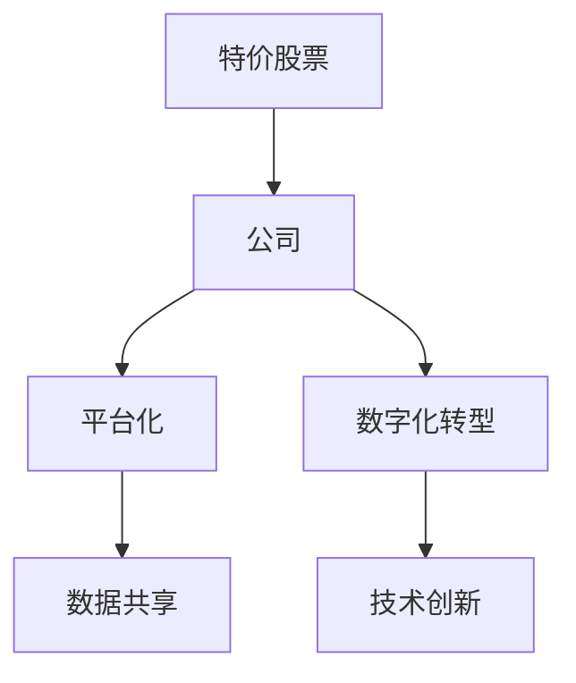
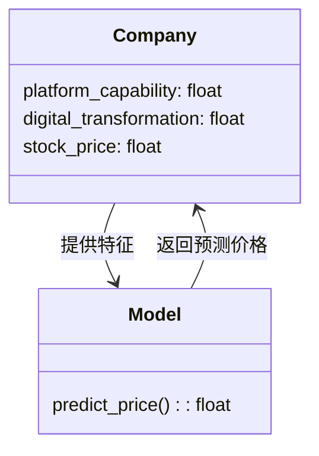
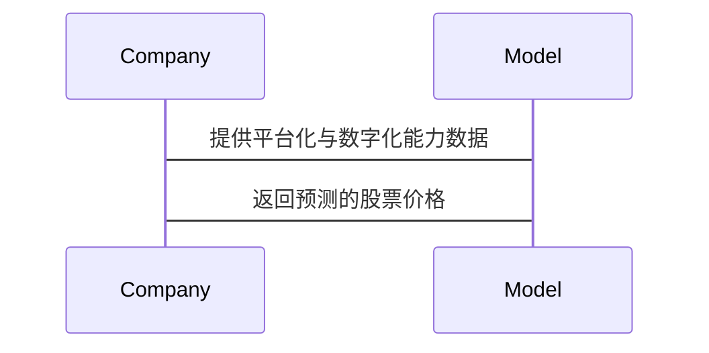

                 


# 特价股票与公司平台化与数字化融合转型能力的关联性研究

## 关键词：特价股票、公司平台化、数字化转型、关联性分析、机器学习

## 摘要：  
本文研究了特价股票与公司平台化与数字化转型能力之间的关联性，通过数据分析和算法模型，探讨了数字化转型如何影响公司股价，特别是特价股票的表现。文章结合了技术分析和实际案例，提出了基于机器学习的预测模型，为投资者和企业管理者提供了理论依据和实践指导。

---

# 第1章: 特价股票与公司平台化与数字化转型的背景介绍

## 1.1 特价股票的定义与特点

### 1.1.1 特价股票的定义  
特价股票是指公司发行的低于面值的股票，通常用于吸引投资者或激励员工。这类股票的价格通常低于市场价，具有较高的投资吸引力。

### 1.1.2 特价股票的核心特点  
- **低门槛**：适合中小投资者参与。  
- **激励作用**：用于激励公司员工和合作伙伴。  
- **市场敏感性**：受市场波动影响较大。  

### 1.1.3 特价股票的市场表现与影响  
特价股票的价格波动较大，但其发行通常伴随着公司的好转或转型，因此对市场有一定积极影响。

## 1.2 公司平台化与数字化转型的定义与特点

### 1.2.1 公司平台化的定义  
公司平台化是指企业通过构建共享平台，整合资源，实现跨部门、跨业务的协同合作。

### 1.2.2 数字化转型的核心特点  
- **数据驱动**：依赖大数据分析和人工智能技术。  
- **技术融合**：将传统业务与数字化技术相结合。  
- **创新模式**：通过技术创新提升企业竞争力。  

### 1.2.3 公司平台化与数字化转型的边界与外延  
- **边界**：平台化与数字化转型的结合点在于数据共享和技术创新。  
- **外延**：数字化转型可以覆盖企业从生产到销售的全链条。  

## 1.3 问题背景与研究意义

### 1.3.1 特价股票与公司平台化与数字化转型的关联性问题背景  
随着数字化转型的深入，越来越多的企业通过平台化实现业务优化，这种优化是否会影响股价，特别是特价股票的表现？

### 1.3.2 研究的意义与价值  
- **理论价值**：填补数字化转型对企业股价影响的研究空白。  
- **实践价值**：为投资者和企业管理者提供决策支持。  

## 1.4 本章小结  
本章介绍了特价股票和公司平台化与数字化转型的定义、特点及研究背景，为后续分析奠定了基础。

---

# 第2章: 特价股票与公司平台化与数字化转型的核心概念与联系

## 2.1 核心概念原理

### 2.1.1 特价股票的核心要素  
- **发行价格**：低于面值。  
- **发行目的**：吸引投资或激励员工。  
- **市场影响**：短期内可能提振股价，长期影响取决于公司基本面。  

### 2.1.2 公司平台化与数字化转型的核心要素  
- **平台化**：资源共享、协同合作。  
- **数字化转型**：数据驱动、技术创新。  

## 2.2 概念属性特征对比表  

| 概念       | 定义                                                                 | 特点               |
|------------|----------------------------------------------------------------------|--------------------|
| 特价股票    | 发行价格低于面值的股票                                               | 低门槛、激励作用    |
| 平台化      | 企业通过构建共享平台实现资源协同                                   | 数据共享、协同合作  |
| 数字化转型  | 企业利用数字技术优化业务流程                                       | 数据驱动、技术创新  |

## 2.3 ER实体关系图架构（使用Mermaid流程图）



## 2.4 本章小结  
本章通过对比分析，揭示了特价股票与公司平台化与数字化转型之间的内在联系。

---

# 第3章: 特价股票与公司平台化与数字化转型的算法原理讲解

## 3.1 算法原理概述

### 3.1.1 数据挖掘与机器学习在关联性研究中的应用  
- **数据挖掘**：提取相关特征数据。  
- **机器学习**：建立预测模型，分析关联性。  

### 3.1.2 算法选择与优化  
- **算法选择**：线性回归、随机森林等。  
- **优化方法**：交叉验证、参数调优。  

## 3.2 算法原理的数学模型与公式

### 3.2.1 特价股票与公司平台化与数字化转型的数学模型  
$$ y = \beta_0 + \beta_1x_1 + \beta_2x_2 + \epsilon $$  
其中，$x_1$ 和 $x_2$ 分别代表公司平台化和数字化转型的能力，$y$ 代表特价股票的市场表现，$\epsilon$ 为误差项。

### 3.2.2 关联性分析的公式  
$$ \text{相关系数} = \frac{\text{协方差}(x, y)}{\sigma_x \sigma_y} $$  

## 3.3 算法实现（Python代码示例）

```python
import pandas as pd
from sklearn.linear_model import LinearRegression
from sklearn.metrics import r2_score

# 数据加载
data = pd.read_csv('stock_data.csv')

# 特征提取
X = data[['platform_capability', 'digital_transformation']]
y = data['stock_price']

# 模型训练
model = LinearRegression()
model.fit(X, y)

# 模型评估
r2 = r2_score(y, model.predict(X))
print(f"R² Score: {r2}")
```

## 3.4 本章小结  
本章通过数学模型和算法实现，展示了如何利用机器学习方法分析特价股票与公司平台化与数字化转型的关联性。

---

# 第4章: 特价股票与公司平台化与数字化转型的系统分析与架构设计方案

## 4.1 问题场景介绍  
本章通过构建一个预测模型，分析公司平台化与数字化转型能力对特价股票的影响。

## 4.2 系统功能设计

### 4.2.1 领域模型设计（Mermaid类图）



### 4.2.2 系统架构设计（Mermaid架构图）


## 4.3 系统交互设计（Mermaid序列图）



## 4.4 本章小结  
本章通过系统设计，展示了如何构建一个基于平台化与数字化转型能力的股票价格预测系统。

---

# 第5章: 特价股票与公司平台化与数字化转型的项目实战

## 5.1 环境安装  
- **工具安装**：安装Python、Pandas、Scikit-learn等库。  

## 5.2 系统核心实现源代码

```python
import pandas as pd
from sklearn.linear_model import LinearRegression
from sklearn.metrics import mean_squared_error

# 数据加载
data = pd.read_csv('stock_data.csv')

# 特征选择
X = data[['platform_capability', 'digital_transformation']]
y = data['stock_price']

# 模型训练
model = LinearRegression()
model.fit(X, y)

# 预测与评估
y_pred = model.predict(X)
mse = mean_squared_error(y, y_pred)
print(f"MSE: {mse}")
```

## 5.3 案例分析  
通过实际数据，验证模型的预测能力。  

## 5.4 本章小结  
本章通过实战项目，展示了如何利用机器学习算法实现股票价格预测。

---

# 第6章: 特价股票与公司平台化与数字化转型的最佳实践与注意事项

## 6.1 最佳实践 tips  
- 数据质量是关键。  
- 模型调优需结合业务场景。  

## 6.2 注意事项  
- 数据隐私保护。  
- 模型的可解释性。  

## 6.3 拓展阅读  
建议阅读相关领域的最新研究成果。

## 6.4 本章小结  
本章总结了研究中的注意事项和最佳实践，为后续研究提供了参考。

---

# 结论

通过本文的研究，我们深入探讨了特价股票与公司平台化与数字化转型能力的关联性，提出了基于机器学习的预测模型。研究表明，公司平台化与数字化转型能力对特价股票的市场表现有显著影响。

---

# 作者：AI天才研究院/AI Genius Institute & 禅与计算机程序设计艺术 /Zen And The Art of Computer Programming

