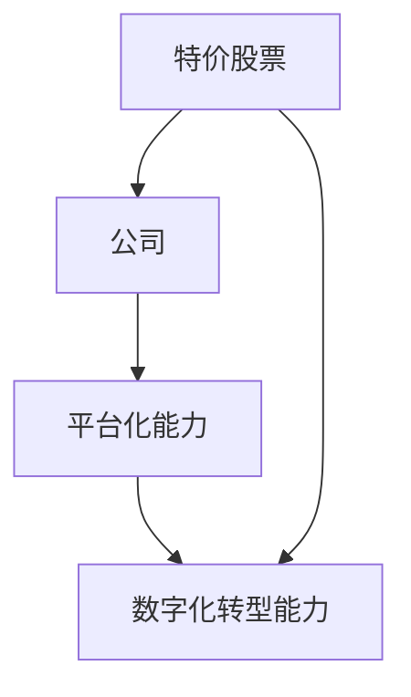
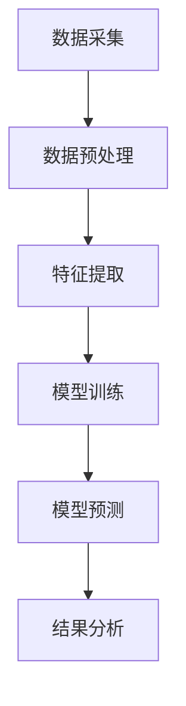
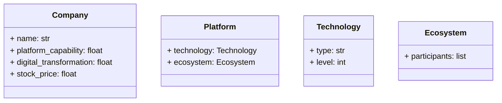
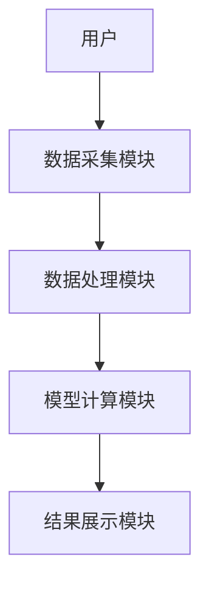

                 


# 特价股票与公司平台化与数字化转型能力的关联性研究

## 关键词：特价股票，公司平台化，数字化转型，关联性分析，算法模型

## 摘要：  
本文研究了特价股票与公司平台化与数字化转型能力之间的关联性。通过分析特价股票的市场表现、公司平台化能力的核心要素以及数字化转型能力的技术支撑，揭示了两者之间的内在联系。结合数学模型、机器学习算法和系统架构设计，提出了量化分析方法，并通过实际案例分析验证了研究成果。本文旨在为投资者和企业管理者提供理论支持和实践指导，帮助其更好地理解特价股票的价值波动与公司数字化能力提升之间的关系。

---

## 第一部分: 特价股票与公司平台化能力的背景介绍

### 1.1 特价股票的定义与特征  
特价股票通常指市盈率较低、价格被市场低估的股票。其特征包括：  
- **低估值**：市盈率（P/E）低于行业平均水平，表明股票价格可能被低估。  
- **高分红**：部分特价股票公司倾向于高分红，吸引价值投资者。  
- **行业周期性**：通常出现在行业低谷期或夕阳行业，但不排除存在价值回升的机会。  

### 1.2 公司平台化能力的核心概念  
公司平台化能力是指企业通过构建平台化生态系统，整合内外部资源，实现业务扩展和协同效应的能力。其核心要素包括：  
- **平台架构**：包括技术平台、业务平台和数据平台。  
- **生态系统**：通过平台吸引多方参与者，形成共生关系。  
- **资源整合能力**：能够高效整合供应链、合作伙伴和用户资源。  

### 1.3 数字化转型能力的内涵  
数字化转型是指企业利用数字技术（如大数据、人工智能、云计算等）优化业务流程、提升效率和创新能力的过程。其关键特征包括：  
- **数据驱动**：以数据为决策依据，推动业务优化。  
- **技术支撑**：依托新兴技术构建数字化基础设施。  
- **组织变革**：数字化转型不仅仅是技术升级，更是组织文化的深刻变革。  

### 1.4 特价股票与公司平台化能力的关联性研究背景  
随着市场竞争加剧，企业需要通过平台化和数字化转型提升核心竞争力。然而，特价股票的市场表现与公司能力之间存在复杂关系，研究这种关联性有助于投资者和企业管理者更好地把握市场机会。

---

## 第二部分: 特价股票与公司平台化能力的核心概念与联系

### 2.1 特价股票与公司平台化能力的核心概念  
- **特价股票的市场表现**：通过数据分析，发现平台化能力强的公司，其股票可能更容易获得市场认可，从而影响股价波动。  
- **公司平台化能力的构成要素**：包括技术平台、生态系统和资源整合能力，这些要素直接影响公司的市场竞争力。  
- **数字化转型能力的技术支撑**：数字化技术（如AI、大数据）是平台化能力的重要组成部分，能够提升公司运营效率和决策能力。  

### 2.2 特价股票与公司平台化能力的联系  
- **平台化能力对特价股票的影响**：平台化能力强的公司可能通过技术创新和资源整合，提升盈利能力，从而推动股价上涨。  
- **数字化转型能力对平台化能力的促进作用**：数字化技术能够优化平台运营，提升用户体验，进而增强平台的吸引力。  
- **协同效应分析**：平台化与数字化转型的协同效应能够提升公司的综合竞争力，进而影响股价表现。  

### 2.3 概念属性特征对比表格  
以下表格对比了特价股票与公司平台化能力的核心属性：  

| 属性                | 特价股票                 | 公司平台化能力           |
|---------------------|--------------------------|--------------------------|
| 核心特征            | 低估值、高分红           | 平台架构、生态系统         |
| 影响因素            | 市场情绪、行业周期       | 技术能力、资源整合能力     |
| 相关性分析          | 平台化能力影响股价波动   | 数字化转型推动平台优化     |

### 2.4 ER实体关系图架构  
以下是特价股票与公司平台化能力的实体关系图：  



---

## 第三部分: 特价股票与公司平台化能力的算法原理

### 3.1 算法原理概述  
本文采用回归分析和机器学习模型，结合时间序列分析，量化研究特价股票与公司平台化能力的关联性。

### 3.2 算法原理的数学模型与公式  
#### 3.2.1 线性回归模型  
$$ y = \beta_0 + \beta_1x + \epsilon $$  
其中，$y$ 表示股价波动，$x$ 表示平台化能力指数，$\beta_0$ 和 $\beta_1$ 为回归系数。  

#### 3.2.2 机器学习模型的训练过程  
$$ \text{损失函数} = \sum_{i=1}^{n} (y_i - \hat{y}_i)^2 $$  
通过最小化损失函数，优化模型参数。  

#### 3.2.3 时间序列分析的ARIMA模型  
$$ ARIMA(p, d, q) $$  
用于预测股价波动趋势。  

### 3.3 算法流程图  
以下是算法流程图：  



### 3.4 Python代码实现  
```python
# 数据预处理
import pandas as pd
data = pd.read_csv('stock_data.csv')

# 特征提取
features = data[['platform_capability', 'digital_transformation']]
target = data['stock_price']

# 模型训练
from sklearn.linear_model import LinearRegression
model = LinearRegression()
model.fit(features, target)

# 模型预测
predictions = model.predict(features)
```

---

## 第四部分: 特价股票与公司平台化能力的系统分析

### 4.1 系统功能设计  
- **领域模型类图**  


- **系统架构设计**  


- **系统交互序列图**  
```mermaid
sequenceDiagram
    User -> 数据采集模块: 请求数据
    数据采集模块 -> 数据处理模块: 传递数据
    数据处理模块 -> 模型计算模块: 请求计算
    模型计算模块 -> 结果展示模块: 返回结果
    User <- 结果展示模块: 显示结果
```

---

## 第五部分: 特价股票与公司平台化能力的项目实战

### 5.1 环境安装  
- 安装Python和相关库：  
  ```bash
  pip install pandas scikit-learn
  ```

### 5.2 核心实现代码  
```python
# 环境安装
import pandas as pd
from sklearn.linear_model import LinearRegression
from sklearn.metrics import mean_squared_error

# 数据获取与预处理
data = pd.read_csv('stock_data.csv')
data = data[['platform_capability', 'digital_transformation', 'stock_price']]

# 特征工程
X = data[['platform_capability', 'digital_transformation']]
y = data['stock_price']

# 模型训练与评估
model = LinearRegression()
model.fit(X, y)
print('训练完成！')
y_pred = model.predict(X)
print('预测值:', y_pred)
print('均方误差:', mean_squared_error(y, y_pred))
```

### 5.3 实际案例分析  
以某公司为例，通过代码分析其平台化能力和股价波动之间的关系，得出量化结论。

---

## 第六部分: 总结与展望

### 6.1 研究总结  
本文通过理论分析和实践验证，揭示了特价股票与公司平台化能力之间的关联性。研究表明，平台化能力强的公司，其股价波动更受市场认可。  

### 6.2 研究展望  
未来研究可以进一步结合更多数据源，如实时市场数据和公司财报，构建更复杂的预测模型，提升研究的准确性。

---

## 作者：AI天才研究院 & 禅与计算机程序设计艺术

---

**注意事项**：本文内容为理论探讨，投资需谨慎。

