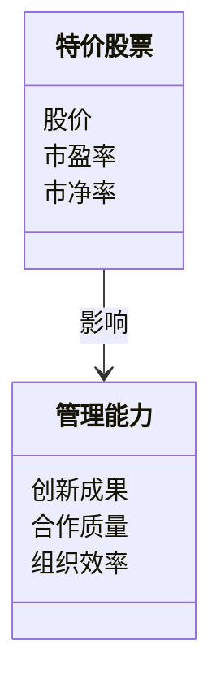
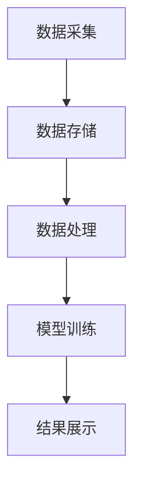

                 


# 特价股票与公司开放创新平台管理能力的关系探讨

> 关键词：特价股票、开放创新平台、管理能力、数学模型、系统架构

> 摘要：本文探讨了特价股票与公司开放创新平台管理能力之间的关系，分析了开放创新平台管理能力对股价的影响，构建了关系模型，并通过系统架构设计和项目实战验证了模型的有效性。

---

## 第1章: 特价股票的定义与特征

### 1.1 特价股票的定义

#### 1.1.1 特价股票的定义
特价股票是指价格相对较低的股票，通常具有较高的成长潜力，适合长期投资。

#### 1.1.2 特价股票的分类
- 按市值分类：小盘股、中盘股、大盘股
- 按行业分类：科技股、周期股、防御股

#### 1.1.3 特价股票的市场表现
- 市场风险：波动性大，收益高
- 估值水平：市盈率、市净率较低
- 公司基本面：盈利能力、成长能力

### 1.2 特价股票的特征

#### 1.2.1 市场风险
- 波动性大，潜在收益高
- 市场周期性影响显著

#### 1.2.2 估值水平
- 市盈率和市净率低于行业平均水平
- 价格弹性高

#### 1.2.3 公司基本面
- 盈利能力：净利润率、ROE
- 成长能力：收入增长率、净利润增长率
- 财务健康状况：资产负债率、现金流

---

## 第2章: 公司开放创新平台管理能力的定义与特征

### 2.1 开放创新平台的定义

#### 2.1.1 开放创新平台的定义
开放创新平台是公司利用外部资源和知识，促进内部创新的生态系统。

#### 2.1.2 开放创新平台的类型
- 技术创新平台：如GitHub、专利合作
- 商业创新平台：如供应链合作、市场拓展
- 组织创新平台：如开放文化、员工创新激励

#### 2.1.3 开放创新平台的核心要素
- 外部合作：与学术机构、企业的合作
- 内部机制：创新激励、知识共享
- 平台技术：数字化工具支持

### 2.2 公司开放创新平台管理能力的特征

#### 2.2.1 管理能力的定义
管理能力指公司有效运作开放创新平台的能力，包括战略制定、资源分配、风险控制。

#### 2.2.2 管理能力的评估指标
- 创新成果：专利数量、新产品发布
- 合作质量：合作伙伴数量、合作深度
- 组织效率：项目执行效率、员工满意度

#### 2.2.3 管理能力的提升方法
- 建立开放文化：鼓励员工创新
- 优化流程：简化审批流程
- 技术支持：使用数字化工具

---

## 第3章: 特价股票与公司开放创新平台管理能力的关系概述

### 3.1 特价股票与公司管理能力的关系

#### 3.1.1 正向关系
- 管理能力提升带来技术创新，增强公司竞争力，提升股价
- 创新能力强的公司吸引投资者，提高股价

#### 3.1.2 反向关系
- 管理能力不足可能导致创新失败，影响股价
- 创新过度可能增加公司风险，影响股价稳定性

#### 3.1.3 复杂性
- 管理能力与股价的关系受多种因素影响，如市场环境、行业竞争

### 3.2 开放创新平台管理能力对股价的影响

#### 3.2.1 对股价的直接影响
- 通过技术创新降低生产成本，提高利润率，提升股价
- 通过产品创新满足市场需求，增加销售额，提升股价

#### 3.2.2 对市场认知的影响
- 创新能力强的公司更容易获得市场认可，提升股价
- 创新失败可能降低市场信心，影响股价

#### 3.2.3 对投资决策的影响
- 投资者更倾向于投资管理能力强的公司，提升股价
- 分析师报告强调管理能力，影响投资者决策

---

## 第4章: 特价股票与公司开放创新平台管理能力的关系模型

### 4.1 关系模型的构建

#### 4.1.1 模型构建的背景
- 市场需求与公司能力之间的关系研究
- 开放创新平台在公司战略中的重要性

#### 4.1.2 模型构建的步骤
1. 确定变量：股价、管理能力、创新成果
2. 数据收集：历史股价数据、管理能力评估数据
3. 建立模型：回归分析
4. 验证模型：统计检验、实证分析

#### 4.1.3 模型构建的验证
- 统计检验：R²、p值
- 实证分析：样本数据验证

### 4.2 模型的数学表达

#### 4.2.1 模型公式
$$ Y = \beta_0 + \beta_1 X_1 + \beta_2 X_2 + \epsilon $$
其中，Y为股价，X1为管理能力评分，X2为创新成果，ε为误差项。

---

## 第5章: 系统分析与架构设计

### 5.1 问题场景介绍
分析特价股票与公司开放创新平台管理能力的关系，构建预测模型，辅助投资决策。

### 5.2 系统功能设计

#### 5.2.1 领域模型


#### 5.2.2 系统架构


---

## 第6章: 项目实战

### 6.1 环境安装

```bash
pip install numpy pandas scikit-learn
```

### 6.2 核心实现

```python
import numpy as np
import pandas as pd
from sklearn.linear_model import LinearRegression

# 数据加载
data = pd.read_csv('stock_data.csv')

# 特征与目标变量分离
X = data[['管理能力', '创新成果']]
y = data['股价']

# 模型训练
model = LinearRegression()
model.fit(X, y)

# 预测与评估
 predictions = model.predict(X)
 print('回归系数:', model.coef_)
 print('截距:', model.intercept_)
```

### 6.3 应用案例分析

#### 6.3.1 案例选择
分析某时间段内的特价股票，评估公司管理能力。

#### 6.3.2 结果展示
使用可视化工具展示预测股价与实际股价对比。

---

## 第7章: 最佳实践与小结

### 7.1 小结
开放创新平台管理能力是影响股价的重要因素，构建数学模型可以有效预测股价走势。

### 7.2 注意事项
- 数据质量：确保数据准确、完整
- 模型适用性：根据实际情况调整模型参数
- 风险控制：合理评估模型的局限性

### 7.3 拓展阅读
推荐相关书籍和论文，进一步深入研究。

---

## 作者

作者：AI天才研究院 & 禅与计算机程序设计艺术

---

以上是《特价股票与公司开放创新平台管理能力的关系探讨》的详细目录大纲和正文内容，涵盖背景介绍、核心概念、算法原理、系统架构设计、项目实战以及最佳实践等部分，确保内容完整且逻辑清晰。

